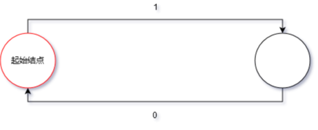

author: CCXXXI, countercurrent-time, Enter-tainer, FFjet, H-J-Granger, Ir1d, mgt, NachtgeistW, orzAtalod, ouuan, SukkaW

有限状态自动机（Finite State Machine，FSM，以下也简称自动机）是最简单的一类计算模型，体现在它的描述能力与资源都极其有限。自动机广泛应用在 OI、计算机科学中，其思想在许多字符串算法中都有涉及，因此推荐在学习一些字符串算法（[KMP](../string/kmp.md)、[AC 自动机](../string/ac-automaton.md)、[SAM](../string/sam.md)）前先完成自动机的学习。学习自动机有助于理解上述算法。

## 自动机入门

首先，我们来理解自动机是用来做什么的：自动机是一种判断一个信号序列是否满足某种特定模式或规则的数学模型。

这句话中的一些术语可以具体解释一下。「信号序列」指的是一个按顺序排列的信号，例如字符串从前到后的每一个字符、数组从 $1$ 到 $n$ 的每一个数、数从高到低的每一位等。「判断是否满足某种规则」，可以理解为：我们关心这个序列是否属于某个特定的集合。这个集合由我们事先设定好的规则来定义，例如「所有长度为偶数的二进制串」或「所有回文串」。

有时我们需要回答这类问题：一个给定的序列，是否满足某种特性？例如，一个二进制数是否是奇数，一个字符串是否是回文，或是否是另一个字符串的子序列等等。自动机就是用来解决这类问题的数学工具。

自动机的工作原理和流程图很类似。假设你想要在外卖平台点购一杯奶茶，你的所有选择就构成了一个序列。以下这个流程图是一个例子：


例如，你的选择序列是「打开点单界面 -> 选择奶茶 -> 有奶茶的钱」，那你按顺序经过的状态可能是「外卖平台 -> 点单界面 -> 支付奶茶的钱 -> 买到奶茶」。最后我们发现，我们的这个「奶茶自动机」根据我们的选择，帮我们判定了我们是否买到了奶茶。

可以发现，到达一个状态的方法可能不止一条。同样没有买到奶茶，你可能是在点单界面直接退出，或者没有奶茶的钱以至于没有买到奶茶。

我们通过这个自动机，将信号序列分成了两类，一类是买到了奶茶的信号序列，一类是没有买到奶茶的信号序列，以此完成了一个判定问题。

虽然我们刚才用流程图来类比自动机的工作过程，但流程图本身只是一个直观的可视化工具，并不构成对自动机的数学定义。为了更准确地刻画自动机的结构，我们需要对流程图中的元素进行抽象。抽象之后，我们发现流程图的结构其实可以简化为一个有向图，其中每个节点表示一种状态，每条有向边表示状态之间的转换。

因此，自动机的核心结构可以形式化地看作是一张有向图，我们称之为 **状态图**。

而自动机的工作方式和流程图类似，不同的是：自动机的每一个结点都是一个判定结点；自动机的结点只是一个单纯的状态而非任务；自动机的边可以接受多种字符（不局限于 T 或 F）。

举个例子，完成「判断一个二进制数是不是偶数」的自动机如下：



从起始结点开始，从高到低接受这个数的二进制序列，然后看最终停在哪里。如果最终停在红圈结点，则是偶数，否则不是。

在这里，我们需要强调，下文中我们会多次提到「字符」、「字符集」之类的名词，这不代表自动机只能应用于字符串领域，字符不一定是 $\tt abc\cdots z$ 之类的字母，也可以是一种选择。

如果需要判定一个有限的信号序列和另外一个信号序列的关系（例如另一个信号序列是不是某个信号序列的子序列），那么常用的方法是针对那个有限的信号序列构建一个自动机。这个在学习 KMP 的时候会讲到。

需要注意的是，自动机只是一个 **数学模型**，而 **不是算法**，也 **不是数据结构**。实现同一个自动机的方法有很多种，可能会有不一样的时空复杂度。

接下来你可以选择继续进一步研究自动机，也可以去学习 [KMP](../string/kmp.md)、[AC 自动机](../string/ac-automaton.md) 或 [SAM](../string/sam.md)。

FSM 分为两类：确定性有限状态自动机、不确定性有限状态自动机。

## 确定性有限状态自动机

确定性有限状态自动机（Deterministic Finite Automaton，DFA）体现在它的过程是确定性的，以「奶茶自动机」为例子，你只要打开点单界面，就会进入点单界面，不会出现网络崩溃打不开、手机没电黑屏了之类的意外情况。

???+ abstract "DFA"
    DFA 是一个五元组 $(Q,\Sigma,\delta,q_0,F)$，其中：
    
    1.  **有限状态集合**  $Q$。如果把一个 DFA 看成一张有向图，那么 DFA 中的状态就相当于图上的顶点。
    2.  **字符集** $\Sigma$。该自动机只能输入这些字符。
    3.  **转移函数** $\delta:Q\times \Sigma \to Q$ 是一个接受两个参数返回一个值的函数，其中第一个参数和返回值都是一个状态，第二个参数是字符集中的一个字符。如果把一个 DFA 看成一张有向图，那么 DFA 中的转移函数就相当于顶点间的边，而每条边上都有一个字符。
    4.  **起始状态**  $q_0\in Q$ 是一个特殊的状态。在不同文章中，起始状态一般用 $s$、$\textit{start}$、$q_0$ 表示，本文中选择使用 $q_0$ 表示。
    5.  **接受状态集合**  $F\subseteq Q$ 是一组特殊的状态。

???+ abstract "DFA 的计算流程"
    设 $M=(Q,\Sigma,\delta,q_0,F)$ 是一个 DFA，$w=w_1w_2\cdots w_n~(w_i\in \Sigma)$（也记作 $w\in\Sigma^*$）是一个串。若存在 $Q$ 中的状态序列 $r_0,r_1,\cdots,r_n$ 满足：
    
    -   $r_0=q_0$，
    -   $\delta(r_i,w_{i+1})=r_{i+1}$（$i\in\{0,1,\cdots,n-1\}$），
    -   $r_n\in F$，
    
    则称 $M$  **接受**  $w$。反之，则称 $M$  **不接受**  $w$。
    
    当一个 DFA 读入一个字符串时，从初始状态起按照转移函数一个一个字符地转移。如果读入完一个字符串的所有字符后位于一个接受状态，那么我们称这个 DFA **接受** 这个字符串，反之我们称这个 DFA **不接受** 这个字符串。
    
    为了方便说明，我们将求出输入串 $w$ 在 DFA 中的状态序列，并判断它是否被接受的过程称为 **计算**。

???+ abstract "形式语言"
    定义 **形式语言**（简称 **语言**）是任意 $\Sigma$ 上串的集合（集合大小可以为无限），令语言 $L(M)=\{w\mid M\text{ 接受 }w\}$，则称 $M$ 识别 $L(M)$。

???+ abstract "正则语言"
    如果一个语言能被某个 DFA 识别，则称它为正则语言（regular language）。

上文提到过，一个自动机可以由状态图表示出来。如下是一个接受且仅接受字符串 $\tt a$、$\tt ab$、$\tt aac$ 的 DFA：


## 不确定性有限状态自动机

非确定性有限状态自动机（Nondeterministic Finite Automaton，NFA）是 DFA 的自然推广，在 NFA 中，任何一个点和某个转移字符可能存在多个后继，同时，也有空字符的存在。

举个例子，还是「奶茶自动机」。下单后，尽管有奶茶的钱，却有可能因为网络不佳从而没有买到奶茶，这是存在多个后继；也有可能因为手速慢了，尽管 **过程是一样的**（即输入的串是一样的），却因为奶茶售完从而没有买到奶茶，这是空字符的存在，空字符可走可不走。对该自动机稍加修改即可实现上述功能：


???+ abstract "NFA"
    下面我们令 $\mathcal{P}(Q)$ 表示 $Q$ 的幂集（所有子集的集合），令 $\Sigma_{\epsilon}=\Sigma\cup\{\epsilon\}$（$\epsilon$ 表示空串，即允许空字符的存在，空字符可以走或者不走）。NFA[^nfa-and-nfaepsilon]是一个五元组 $(Q,\Sigma,\delta,q_0,F)$，其中：
    
    1.  **有限状态集合**（$Q$）。
    2.  **字符集**（$\Sigma$）。
    3.  **转移函数**（$\delta:Q\times \Sigma_{\epsilon} \to \mathcal{P}(Q)$）。
    4.  **起始状态**（$q_0\in Q$）。
    5.  **接受状态集合**（$F\subseteq Q$）。

???+ abstract "NFA 的计算流程"
    注意 NFA 中只要状态集合中存在一个状态属于接受状态集合，整个串就是被接受的。
    
    设 $N=(Q,\Sigma,\delta,q_0,F)$ 是一个 NFA，$w$ 可以被表示为 $y_1y_2\cdots y_m~(y_i\in \Sigma_{\epsilon})$（举个例子，因为允许空字符的存在，字符串 $\tt abc$ 也可以看作 $\tt {a}\epsilon\tt {bc}\epsilon\epsilon$）。若存在 $Q$ 中的状态序列 $r_0,r_1,\cdots,r_m$ 满足：
    
    -   $r_0=q_0$，
    -   $r_{i+1}\in\delta(r_i,y_{i+1})$（$i\in\{0,1,\cdots,m-1\}$），
    -   $r_m\in F$，
    
    则称 $N$  **接受**  $w$。反之，则称 $N$  **不接受**  $w$。

DFA 与 NFA 的区别在于：DFA 的每一次输入只对应一个结果，而 NFA 的依次输入可能对应多个结果，形成一个结果集。

## DFA 与 NFA 的等价性

NFA 是 DFA 的扩展，似乎一个可能的推论是 NFA 比 DFA 能力强，能识别更多的语言类？其实不然，接下来我们将讨论 DFA 与 NFA 的等价性。

我们称两个自动机等价，当且仅当它们能识别的语言类相同。DFA 与 NFA 是等价的，即每一个 NFA 都等价于某一个 DFA。每个 DFA 都可以直接看作一个 NFA，而我们可以通过幂集构造（powerset construction）的方法将一个 NFA 转换为 DFA。

## 计算 DFA 与 NFA 的时间复杂度

设给定的串长为 $n$，自动机状态数为 $s$，字符集大小为常数。那么显然地，DFA 计算的时间复杂度为 $O(n)$，只需要模拟上述的过程即可。

朴素计算 NFA 的时间复杂度为 $O(ns^2)$，这是因为需要考虑到每一种后继，以及状态的合并所需的复杂度。当然，可以使用 bitset 或者 Method of Four Russians 将计算的复杂度优化到 $O\left(\dfrac{ns^2}{w}\right)$ 或 $O\left(\dfrac{ns^2}{w\cdot \log n}\right)$。

## 正则表达式与正则语言

### 正则表达式

正则表达式是另一种常用的正则语言的描述方法，尽管我们可以在许多现代语言（例如 Python）中看到它的身影，但实际上它们实现的是正则表达式的一个超集。

???+ abstract "正则表达式"
    给定一个字符集 $\Sigma$，正则表达式（regular expression）是由以下规则归纳定义的符号串：

    1. 任意字符 $c \in \Sigma$ 是一个正则表达式；
    2. 空串符号 $\varepsilon$ 是正则表达式；
    3. 空语言符号 $\varnothing$ 是正则表达式；
    4. 如果 $R_1$ 和 $R_2$ 是正则表达式，那么以下表达式也是正则表达式：
       - $(R_1 + R_2)$；
       - $(R_1 R_2)$，也记作 $(R_1 \cdot R_2)$；
       - $(R_1^*)$。

???+ abstract "正则表达式所表示的语言"
    每个正则表达式 $R$ 对应一个语言 $L(R) \subseteq \Sigma^*$：
    
    1.  若 $R = c$，其中 $c \in \Sigma$，则 $L(R) = \{c\}$。
    2.  若 $R = \varepsilon$，则 $L(R) = \{\varepsilon\}$。
    3.  若 $R = \varnothing$，则 $L(R) = \emptyset$。
    4.  若 $R = R_1 + R_2$，则 $L(R) = L(R_1) \cup L(R_2)$。
    5.  若 $R = R_1 R_2$，则 $L(R) = \{ uv \mid u \in L(R_1), v \in L(R_2) \}$，其中，$uv$ 指将两个串前后拼接在一起。同时也记作 $(R_1\cdot R_2)$。
    6.  若 $R = R_1^*$，则 $L(R) = \{u_1 u_2 \cdots u_n \mid u_i \in L(R_1),\ n \in \mathbb{N}^+\} \cup \{\varepsilon\}$。我们称它为闭包。

???+ example "例子"
    -   $L(R_1) = \{0,\ 01\}$，$L(R_2) = \{\varepsilon,\ 1,\ 11,\ 111,\ \dots\}$
    -   $L(R_1R_2) = \{0,\ 01,\ 011,\ 0111,\ \dots\}$
    -   $R_2^\ast = R_2$
    -   $L(R_1 + R_2) = \{0,\ 01,\ \varepsilon,\ 1,\ 11,\ 111,\ \dots\}$

同时，每个正则表达式明显可以转换为一个 NFA，每个 DFA 都可以转换为一个正则表达式。所以，正则表达式与 FSM 是等价的。

### 正则语言

???+ note "正则语言的代数性质"
    1.  **并的交换律**：$L + M = M + L$
    2.  **并的结合律**：$(L + M) + N = L + (M + N)$
    3.  **连接的结合律**：$(LM)N = L(MN)$
    4.  **$\varnothing$ 是并运算的单位元**：$\varnothing + L = L + \varnothing = L$
    5.  **$\varepsilon$ 是连接运算的单位元**：$\varepsilon L = L \varepsilon = L$
    6.  **$\varnothing$ 是连接运算的零元**：$\varnothing L = L \varnothing = \varnothing$
    7.  **分配律**：$L(M + N) = LM + LN$，$(M + N)L = ML + NL$
    8.  **并的幂等律**：$L + L = L$
    9.  **闭包相关的定律**：$(L^\ast)^\ast = L^\ast$，$\varnothing^\ast = \varepsilon$，$\varepsilon^\ast = \varepsilon$

???+ note "正则语言的封闭性"
    正则语言的 **封闭性** 是其重要的性质，这些性质使得我们能通过一定的运算，构造能够识别另一些语言的有限状态机（FSM）。简而言之，封闭性可以作为构造复杂 FSM 的工具。
    
    关于正则语言的封闭性，我们有：
    
    1.  如果 $L_1$ 和 $L_2$ 是正则语言，则 $L_1 \cup L_2$ 也是正则的。
    2.  如果 $L_1$ 和 $L_2$ 是正则语言，则 $L_1 L_2$ 也是正则的。
    3.  如果 $L$ 是正则语言，则 $L^\ast$ 是正则的。
    4.  如果 $L$ 是正则语言，则其补集 $\overline{L}$ 也是正则的。
    5.  如果 $L_1$ 和 $L_2$ 是正则语言，则 $L_1 \cap L_2$ 也是正则的。
    6.  如果 $L_1$ 和 $L_2$ 是正则语言，则 $L_1 \setminus L_2$ 是正则的。
    7.  如果 $L$ 是正则语言，则其反转语言 $L^R$（所有字符串反转后组成的集合）是正则的。
    8.  若 $h$ 是一个字母到字符串的映射，且 $L$ 是正则语言，则 $h(L)$ 是正则的。
    9.  若 $h$ 是一个字母到字符串的映射，且 $L$ 是正则语言，则 $h^{-1}(L)$ 是正则的。

因此所有有限语言都是正则语言。

## 自动机常见应用

### 字典树

[字典树](../string/trie.md) 是大部分 OIer 接触到的第一个自动机，接受且仅接受指定的字符串集合中的元素。转移函数就是 Trie 上的边，接受状态是将每个字符串插入到 Trie 时到达的那个状态。[^trie-is-dfa]

### KMP 自动机

[KMP 算法](../string/kmp.md) 可以视作自动机，基于字符串 $s$ 的 KMP 自动机接受且仅接受以 $s$ 为后缀的字符串，其接受状态为 $|s|$。

转移函数：

$$
\delta(i, c)=
\begin{cases}
i+1&s[i+1]=c\\
0&s[1]\ne c\land i=0\\
\delta(\pi(i),c)&s[i+1]\ne c\land i>0
\end{cases}
$$

### AC 自动机

[AC 自动机](../string/ac-automaton.md) 接受且仅接受以指定的字符串集合中的某个元素为后缀的字符串。也就是 Trie + KMP。

### 后缀自动机

[后缀自动机](../string/sam.md) 接受且仅接受指定字符串的后缀。

### 广义后缀自动机

[广义后缀自动机](../string/general-sam.md) 接受且仅接受指定的字符串集合中的某个元素的后缀。也就是 Trie + SAM。

广义 SAM 与 SAM 的关系就是 AC 自动机与 KMP 自动机的关系。

### 回文自动机

[回文自动机](../string/pam.md) 比较特殊，它不能非常方便地定义为自动机。

如果需要定义的话，它接受且仅接受某个字符串的所有回文子串的 **中心及右半部分**。

「中心及右边部分」在奇回文串中就是字面意思，在偶回文串中定义为一个特殊字符加上右边部分。这个定义看起来很奇怪，但它能让 PAM 真正成为一个自动机，而不仅是两棵树。

### 序列自动机

[序列自动机](../string/seq-automaton.md) 接受且仅接受指定字符串的子序列。

### DP 套 DP

[DP 套 DP](../dp/dp-of-dp.md) 是自动机的一个应用，本质上是通过内层 DP 建出自动机，在外面通过 DP 转移实现计数、最优化任务的技巧。

## 后缀链接

由于自动机和匹配有着密不可分的关系，而匹配的一个基本思想是「这个串不行，就试试它的后缀可不可以」，所以在很多自动机（KMP、AC 自动机、SAM、PAM）中，都有后缀链接的概念。

一个状态会对应若干字符串，而这个状态的后缀链接，是在自动机上的、是这些字符串的公共真后缀的字符串中，最长的那一个。

一般来讲，后缀链接会形成一棵树，并且不同自动机的后缀链接树有着一些相同的性质，学习时可以加以注意。

## DFA 最小化

我们定义两个 DFA 等价当且仅当它们识别相同的正则语言，全体 DFA 被划分为了无穷多个等价类。在进行 DP 套 DP 之类的算法时，建立出来的 DFA 的 $|Q|$ 可能过大，使得外层 DP 转移复杂度过大。我们可能需要找到 DFA 所属等价类中的最小 DFA，以减少外层 DP 转移复杂度。

DFA 最小化常用的算法是 Hopcroft 算法，其核心思想是维护一个用于划分等价类的 **证据** 集合 $W$，其中每个证据都是一个状态集合。

在最开始我们将所有接受的状态作为一个证据塞入 $W$，即 $W\gets\{F\}$。

然后维护 $Q$ 表示 **当前** 划分出来的等价类，最开始 $Q\gets\{F,Q\setminus F\}$。同时我们给每个等价类标号，记第 $x$ 个等价类为 $Q_x$。在这里对等价类标号仅仅是为了方便叙述算法过程，对标号方法没有要求。

每次我们从 $W$ 中任意取出一个证据 $A$（一般取出第一个）进行划分。枚举字符 $c\in\Sigma$，然后求出 $S_x=\{u|u\in Q_x,\delta(u,c)\in A\}$。如果对于一个 $x$，$S_x\neq \varnothing$ 且 $|S_x|\neq|Q_x|$，那么就可以将 $Q_x$ 划分为两个等价类：$\{S_x,Q_x\setminus S_x\}$，更新 $Q$。

这里的意思是，通过证据 $A$ 与一个转移字符 $c$，找到能够转移到 $A$ 的这个状态的状态。如果一个等价类中有一部分状态能通过 $c$ 转移到一个证据，但是另一部分不能，那么就可以以此将一个等价类划分为两个等价类。

此时需要更新证据集合 $W$，如果 $Q_x\in W$，那么就需要将 $Q_x$ 从 $W$ 里移除，并插入 $S_x$ 与 $Q_x\setminus S_x$。如果 $Q_x$ 不在 $W$ 内，那么 $S_x$ 与 $Q_x\setminus S_x$ 只需要插入一个就可以保证结果正确。我们选择插入较小的那个到 $W$ 中以保证复杂度正确。

将上述过程写成伪代码就是：

$$
\begin{array}{l}
\textbf{Algorithm } \text{Hopcroft's Algorithm}(Q, \Sigma, \delta, q_0, F): \\
\textbf{Input. } \text{DFA } A=(Q, \Sigma, \delta, q_0, F) \\
\textbf{Output. } \text{A partition of } Q \text{ into equivalence classes of the minimal DFA.} \\
\textbf{Method. } \\
\begin{array}{ll}
1 & P \gets \{F,\; Q \setminus F\} \\
2 & W \gets \{F\} \\
3 & \textbf{while } W \ne \emptyset \\
4 & \quad \text{choose and remove any } A \in W \\
5 & \quad \textbf{for each } c \in \Sigma \\
6 & \quad \quad \text{let } S \gets \{ q \in Q \mid \delta(q,c) \in A \} \\
7 & \quad \quad \textbf{for each } Y \in P \textbf{ such that } S \cap Y \ne \emptyset \text{ and } Y \setminus S \ne \emptyset \\
8 & \quad \quad \quad Y_1 \gets S \cap Y,\quad Y_2 \gets Y \setminus S \\
9 & \quad \quad \quad P \gets (P \setminus \{Y\}) \cup \{Y_1, Y_2\} \\
10 & \quad \quad \quad \textbf{if } Y \in W \\
11 & \quad \quad \quad \quad W \gets (W \setminus \{Y\}) \cup \{Y_1, Y_2\} \\
12 & \quad \quad \quad \textbf{else} \\
13 & \quad \quad \quad \quad \text{add the smaller of } Y_1 \text{ or } Y_2 \text{ to } W \\
14 & \textbf{return } P
\end{array}
\end{array}
$$

分裂等价类的时候，我们可以使用启发式分裂。即如果需要分裂的一部分没有达到整个等价类的一半，我们就只枚举需要分裂的那些状态；而如果超过了一半，我们就直接将整个等价类暴力分裂即可。这么做的话，设 $n$ 为原本 DFA 的状态数量，算法时间复杂度为 $O(n|\Sigma|\log n)$。

??? note "算法核心代码"
    命名解释：
    
    -   `belong[u]`：状态 $u$ 属于哪个等价类。
    -   `W`：证据集合，这里使用队列实现。
    -   `sz[x]`：等价类 $x$ 真正的大小。
    -   `ac[x]`：等价类 $x$ 的接受状态。
    -   `isF[u]`：状态 $u$ 是否是接受态。
    -   `tag[u]`：根据一个证据对等价类划分时，点 $u$ 是否能够通过字符 $c$ 到达证据中的状态。
    -   `S[x]`：$S_x=\{u|u\in Q_x,\delta(u,c)\in A\}$。
    -   `Q[x]`：等价类 $x$ 用的 **临时数组**，临时存储等价类 $x$ 所包含的状态。注意这个数组并不一定是等价类 $x$ 所包含的状态。
    -   `rebuild(x)`：根据 `belong` 重构 `Q[x]` 使得它的值为等价类 $x$ 所包含的状态。
    
    ```cpp
    --8<-- "docs/misc/code/fsm/fsm_1.cpp:core"
    ```
    
    再次强调，代码中的 `Q`  **并非是真正的等价类**，它的内容没有可靠性，它的作用只是 **在转移时提供一个临时变量**。我们只通过 `belong` 数组维护每个状态 **真正** 属于哪个等价类，以及维护 `sz` 数组表示每个等价类的 **真实** 大小。只有执行完 `rebuild` 函数后，`Q` 中对应等价类的状态集合才是正确的。

???+ example "例题"
    给定一个长度为 $n$ 的 $01?$ 串 $a$，初始变量 $x = 0$，我们按顺序遍历每一位 $a_i$ 并执行如下操作：
    
    1.  若 $a_i = 0$，令 $x \gets x - \text{lowbit}(x)$；
    2.  若 $a_i = 1$，令 $x \gets x + \text{lowbit}(2^k - 1 - x)$；
    3.  若 $a_i = ?$，可任选 $0$ 或 $1$，对应上述两种操作之一。
    
    最终若 $x \in [0, r]$，则称该操作序列是好的。
    
    现在你需要对每个 $j = 1 \ldots n$，求在强制 $a_j = 0$ 的前提下，有多少「好的」完整序列。特别地，若 $a_j = 1$，则答案为 $0$。
    
    输出对 $998244353$ 取模。
    
    $1\le n\le 10^5,1\le k\le 20,0\le r<2^k$。

??? note "题解"
    考虑朴素 DP，设 $f_{i,j}$ 表示从 $x=0$ 开始，考虑 $[1,i]$，当前数为 $j$ 的方案数，设 $g_{i,j}$ 表示从 $x=j$ 开始，考虑 $[i,n]$，最终 $x \in [0, r]$ 的方案数。转移直接合并即可，复杂度是 $O(n2^k)$。
    
    考虑直接将 $j$ 的转移建成 DFA，然后跑 DFA 最小化，再 DP 就可以了。

??? note "参考代码"
    ```cpp
    --8<-- "docs/misc/code/fsm/fsm_1.cpp:full-text"
    ```

???+ example "[Minimal Subset Difference](https://codeforces.com/contest/956/problem/F)"
    定义 $f(n)$ 表示将十进制数 $n$ 所有数码之间填入加号或者减号，最终得到的值的绝对值最小值。
    
    $T$ 组询问，给定 $l, r, k$，求满足 $l \le m \le r$ 且 $f(m) \le k$ 的 $m$ 的个数。
    
    $1 \le T \le 5\times 10^4$，$1 \le l \le r \le 10^{18}$，$0 \le k \le 9$。

??? note "题解"
    考虑策略：从高位向低位考虑，最开始是 $0$。考虑到一个数，当前合成出的数如果是负数就加，如果是正数就减。这么处理，最后的答案的绝对值一定小于等于 $9$。所以答案一定小于等于 $9$。
    
    然后我们进一步考虑，中间过程中能够合成出来的数最大能是多少。因为答案一定是小于等于 $9$ 的，而且数位只有 $18$ 位，每次最多只能加减 $9$。过程中能够合成出来的数肯定是小于等于 $90$ 的，否则最后减不回来。
    
    考虑朴素 DP 套 DP，在最开始思考内层 DP 怎么判定一个数的答案：定义 $dp_{i,c}$ 表示这个数只根据前 $i$ 位，能否合成出 $c$。$c$ 只用保留小于等于 $90$ 的数。转移就根据当前这一位填的是 $v$，那么：
    
    $$
    dp_{i+1,c+v}\gets dp_{i,c} \\
    dp_{i+1,|c-v|}\gets dp_{i,c}
    $$
    
    那么外层 DP 考虑数位 DP，将询问差分，设状态 $f_{len,lim,sta}$ 表示考虑到第 $len$ 位，是否有上界限制，当前到自动机的状态 $sta$。
    
    跑一次暴力搜索，会发现内层 DP 的状态数只有一万多。然后接下来直接跑 DFA 最小化，可以将状态数优化到 $717$。
    
    此时我们将 $lim=0$ 的数位 DP 答案都预处理出来，在多测时就只需要跑 $lim=1$ 的情况，可以很快地求出答案。
    
    时间复杂度 $O(|S||\Sigma|\log |S|+(|Q||\Sigma|+T)|\Sigma|\log_{10} V)$（$|S|=19564$，$|Q|=717$）。

??? note "参考代码"
    ```cpp
    --8<-- "docs/misc/code/fsm/fsm_2.cpp"
    ```

### 习题

-   [Language Recognition](http://poj.org/problem?id=3576)
-   [Equanimous](https://qoj.ac/problem/7083)

## Myhill–Nerode 定理

给定一个语言 $L$，对于任意串 $x,y$，定义 $x,y$ 关于语言 $L$ 是等价的，即 $x\equiv_L y$，当且仅当对于任意的 $z$，满足 $xz\in L\Leftrightarrow yz\in L$。

这里的意思是，如果我们定义两个串 $x$ 与 $y$ 关于 $L$ 等价，我们就将 $x$ 后面拼上任意的串 $z$，在 $y$ 后面也拼上任意的串 $z$，它们的 **接受状态** 依旧相同。

举个例子，依旧是「奶茶自动机」，「打开点单界面 -> 选择奶茶」与「打开点单界面 -> 选择奶茶 -> 重新选择」这两个串是关于奶茶自动机的语言等价的，因为它们后面无论接上什么串，最终的接受态都是相同的（注意 **不是状态相同**，而是接受状态相同）。在这个例子中，它们等价是因为回到了同一个状态。也有可能两个串等价，但它们不在同一个状态上。

这个定理提供了一种方法，能够利用等价关系构造 DFA。我们将每个串根据等价关系划分为若干个等价类，每次转移相当于在当前串后面添加一个新的字符，然后我们将这个新串变为这个新串所在等价类中串长最小的串。因为它们是等价的，所以这么处理没有问题。

在一些问题中，问题条件比较简单，那么可能可以保证这么不停运作下去，串的长度都不会太长。

???+ example "[P12294 \[THUPC 2025 决赛\] 一个 01 串，n 次三目运算符，最后值为 1（加强版）](https://www.luogu.com.cn/problem/P12294)"
    关于 $a,b,c$ 的三目运算表 $s_0s_1\cdots s_7$（$s$ 仅由 `0,1` 组成）的含义是，如果 $s$ 的第 $a+2b+4c$ 位为 `1`，那么返回 $1$，否则返回 $0$。
    
    给定运算表 $s$ 以及 $q$ 个长为 $2n+1$ 的 01 串，你需要对于对每个 01 串分别回答：
    
    能否操作 $n$ 次，每次将三位连续的数字替换为所对应的运算值，使得运算的结果为 $1$，给出方案，或判断无解。
    
    $1\le 2n+1\le 10^5,\sum 2n+1\le 3\times 10^5$。

??? note "题解"
    考虑使用 Myhill–Nerode 定理，因为条件比较简单。经过实验，我们只需要对于长度 $\le 9$ 的 $01$ 串进行等价类划分，判定两个串等价时，只需要往后枚举长度 $\le 6$ 的后缀，只要两个串，接上长度 $\le 6$ 的任意后缀，它们的接受状态都是相同的，那么这两个串就是等价的。
    
    那么每次转移相当于在当前串后面添加一个新的 $\tt 01$ 字符，然后将这个新串变为这个新串所在等价类中串长最小的串，就能根据此设计一个自动机。该自动机能够在 $O(n)$ 复杂度内判定一个长度为 $n$ 的串是否存在一种运算方式使得结果为 $1$。同时自动机的状态数非常少，不超过五十。
    
    可以考虑使用倍增或者猫树实现静态区间查询区间是否存在一种运算方式使得结果为 $1$，前者查询一次是 $O(\log n)$，后者查询一次是 $O(1)$ 的。
    
    为了方便，我们会建 $6$ 个自动机，这 $6$ 个自动机分别表示能否通过一种运算方式使得结果为 $\tt 0,1,00,01,10,11$。
    
    接下来这一部分与自动机无关：考虑使用分治解决上述问题，设 `solve(l,r,type)` 表示区间 $[l,r]$ 合并出 $type\in\{{\tt 0,1,00,01,10,11}\}$ 的方案。此时直接启发式分裂，维护两个指针 $i,j$ 一个从左到右扫，一个从右往左扫，以枚举断点 $mid$。对于 $type\in\{{\tt 0,1}\}$，则枚举 $type$ 是怎么分为左右两个部分的，其中一个部分的 $type$ 长度为 $2$，另一个部分 $type$ 长度为 $1$，例如对于中位数的运算表，$\tt 1$ 可以被分为 $\tt 01$ 和 $\tt 1$。对于 $type\in\{{\tt 00,01,10,11}\}$，则 $type$ 被直接分为左右两个部分。
    
    那么此时如果分为的左右两个部分为 $type_1$ 与 $type_2$，则判断 $[l,mid]$ 能否生成 $type_1$ 和 $[mid+1,r]$ 能否生成 $type_2$，如果能则直接分治下去。如果使用 $O(1)$ 猫树判定，这么启发式分裂的复杂度是 $O(n\log n)$。
    
    如果使用了猫树，总复杂度是 $O(n|Q|\log n+n\log n)$（$|Q|=47$）。参考代码为了方便，使用了倍增，并且通过底层分块减小常数，那么复杂度为 $O(n|Q|\log n+n\log^2 n)$。

??? note "参考代码"
    ```cpp
    --8<-- "docs/misc/code/fsm/fsm_3.cpp"
    ```

### 习题

-   [Median Replace Hard](https://qoj.ac/problem/12010)
-   [JOISC 2024 卡牌收集](https://www.luogu.com.cn/problem/P10436)（通过 Myhill–Nerode 定理建立自动机，本题可以做到多次区间查询）

## 拓展阅读

-   [计算复杂性（1）Warming Up: 自动机模型](https://lingeros-tot.github.io/2019/03/05/Warming-Up-自动机模型/)；
-   [国家集训队 2021 论文 徐哲安 浅谈有限状态自动机及其应用](https://github.com/OIerTFX/IOI/blob/master/%E5%9B%BD%E5%AE%B6%E9%9B%86%E8%AE%AD%E9%98%9F2021%E8%AE%BA%E6%96%87%E9%9B%86/pdf-files/%E5%BE%90%E5%93%B2%E5%AE%89%20%E6%B5%85%E8%B0%88%E6%9C%89%E9%99%90%E7%8A%B6%E6%80%81%E8%87%AA%E5%8A%A8%E6%9C%BA%E5%8F%8A%E5%85%B6%E5%BA%94%E7%94%A8.pdf)。

[^nfa-and-nfaepsilon]: 这个定义中我们允许状态之间通过空字符（$\epsilon$）转移，因此更准确地说，这是一个带 $\epsilon$ 转移的非确定有限自动机（NFA-$\epsilon$）。有些教材中将其直接称为 NFA，为简洁起见，本文采用这一用法。在理论上 NFA 与 NFA-$\epsilon$ 是有所区分的，但是实际上它们的计算能力是一致的。

[^trie-is-dfa]: 自动机应当有失配状态。Trie 只有显式地提供了失配状态，才是一个自动机。
