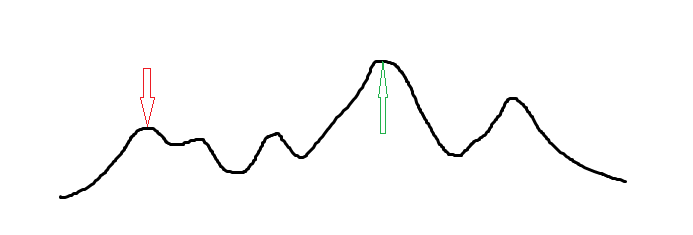

## 简介

爬山算法是一种局部择优的方法，采用启发式方法，是对深度优先搜索的一种改进，它利用反馈信息帮助生成解的决策。

* * *

## 实现

爬山算法每次在当前找到的最优方案 $x$ 附近寻找一个新方案（一般随机差值）。如果这个新的解 $x'$ 更优，那么转移到 $x'$ 否则不变。

这种算法对于单峰函数显然可行（你都知道是单峰函数了为什么不三分呢）。

但是对于多数需要求解的函数中，爬山算法很容易进入一个局部最优解，如下图（最优解为 $\color{green}{\Uparrow}$ ，而爬山算法可能找到的最优解为 $\color{red}{\Downarrow}$ ）。



* * *

## 代码

此处代码以[「BZOJ 3680」吊打 XXX](https://www.lydsy.com/JudgeOnline/problem.php?id=3680)（求 $n$ 个点的带权类费马点）为例。

```cpp
#include <cmath>
#include <cstdio>
const int N = 10005;
int n, x[N], y[N], w[N];
double ansx, ansy;
void hillclimb() {
  double t = 1000;
  while (t > 1e-8) {
    double nowx = 0, nowy = 0;
    for (int i = 1; i <= n; ++i) {
      double dx = x[i] - ansx, dy = y[i] - ansy;
      double dis = sqrt(dx * dx + dy * dy);
      nowx += (x[i] - ansx) * w[i] / dis;
      nowy += (y[i] - ansy) * w[i] / dis;
    }
    ansx += nowx * t, ansy += nowy * t;
    if (t > 0.5)
      t *= 0.5;
    else
      t *= 0.97;
  }
}
int main() {
  scanf("%d", &n);
  for (int i = 1; i <= n; ++i) {
    scanf("%d%d%d", &x[i], &y[i], &w[i]);
    ansx += x[i], ansy += y[i];
  }
  ansx /= n, ansy /= n;
  hillclimb();
  printf("%.3lf %.3lf\n", ansx, ansy);
  return 0;
}
```

* * *

## 劣势

其实爬山算法的劣势上文已经提及：它容易陷入一个局部最优解。当目标函数不是单峰函数时，这个劣势是致命的。因此我们要引进[ **模拟退火** ](/misc/simulated-annealing/)。
