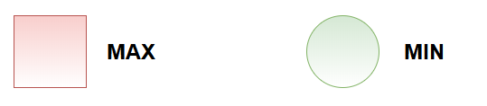
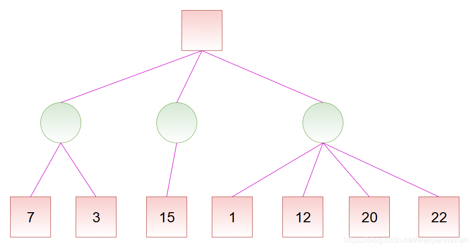
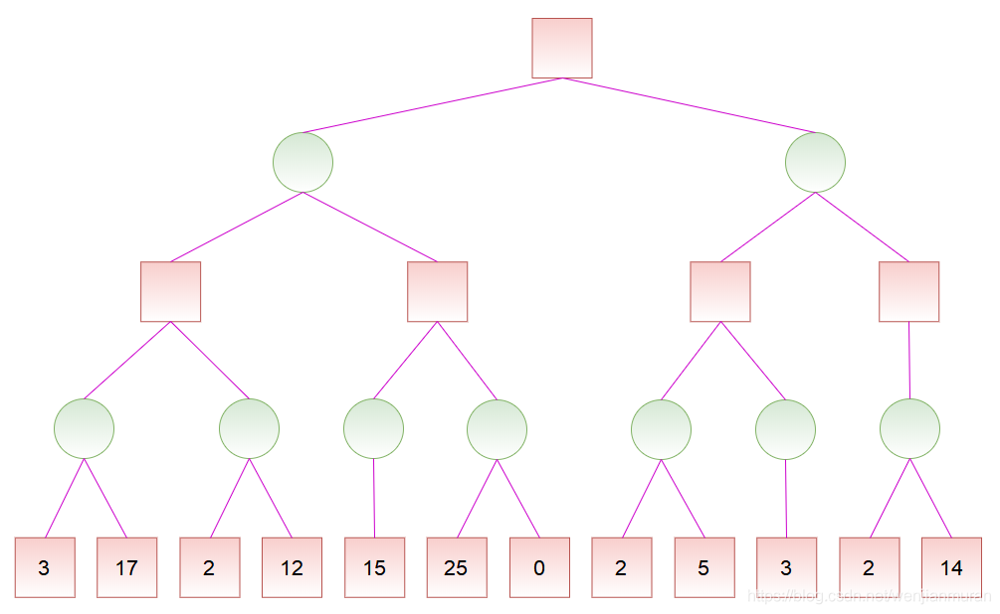
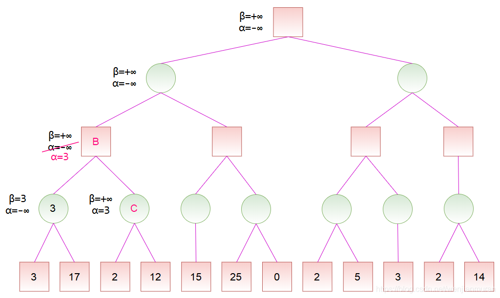
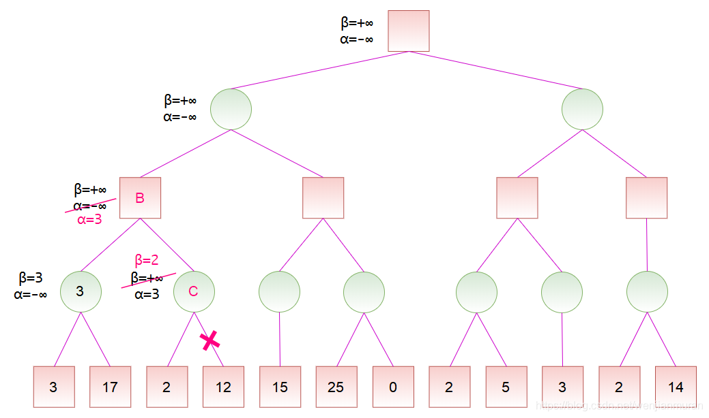
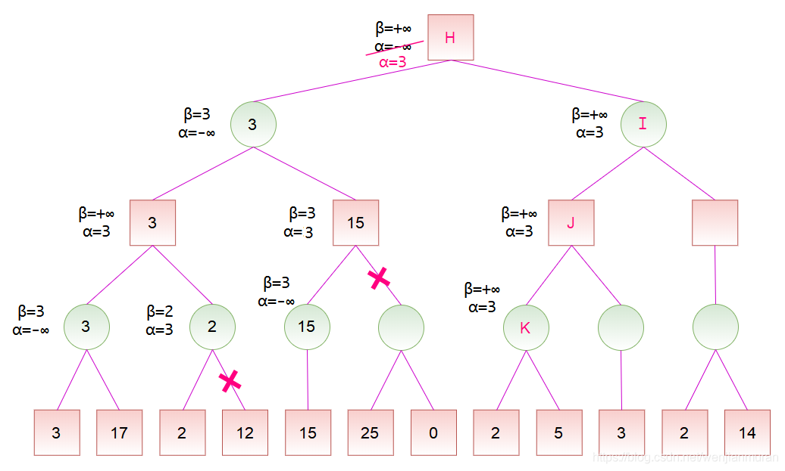
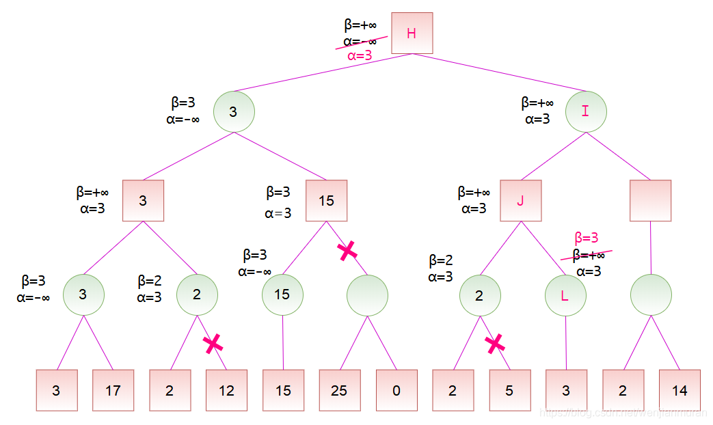

此页面将简要介绍 minimax 算法和 $\alpha-\beta$ 剪枝。

## Minimax 算法

### 定义

Minimax 算法又叫极小化极大算法，是一种找出失败的最大可能性中的最小值的算法。[^ref1]

在局面确定的双人对弈里，常进行对抗搜索，构建一棵每个节点都为一个确定状态的搜索树。奇数层为己方先手，偶数层为对方先手。搜索树上每个叶子节点都会被赋予一个估值，估值越大代表我方赢面越大。我方追求更大的赢面，而对方会设法降低我方的赢面，体现在搜索树上就是，奇数层节点（我方节点）总是会选择赢面最大的子节点状态，而偶数层（对方节点）总是会选择我方赢面最小的的子节点状态。

### 过程

Minimax 算法的整个过程，会从上到下遍历搜索树，回溯时利用子树信息更新答案，最后得到根节点的值，意义就是我方在双方都采取最优策略下能获得的最大分数。

### 解释

来看一个简单的例子。

称我方为 MAX，对方为 MIN，图示如下：



例如，对于如下的局势，假设从左往右搜索，根节点的数值为我方赢面：



我方应选择中间的路线。因为，如果选择左边的路线，最差的赢面是 3；如果选择中间的路线，最差的赢面是 15；如果选择右边的路线，最差的赢面是 1。虽然选择右边的路线可能有 22 的赢面，但对方也可能使我方只有 1 的赢面，假设对方会选择使得我方赢面最小的方向走，那么经过权衡，显然选择中间的路线更为稳妥。


实际上，在看右边的路线时，当发现赢面可能为 1 就不必再去看赢面为 12、20、22 的分支了，因为已经可以确定右边的路线不是最好的。

朴素的 Minimax 算法常常需要构建一棵庞大的搜索树，时间和空间复杂度都将不能承受。而 $\alpha-\beta$ 剪枝就是利用搜索树每个节点取值的上下界来对 Minimax 进行剪枝优化的一种方法。

需要注意的是，对于不同的问题，搜索树每个节点上的值有着不同的含义，它可以是估值、分数、赢的概率等等，为方便起见，我们下面统一用分数来称呼。

## alpha-beta 剪枝

### 过程

对于如下的局势，假设从左往右搜索：

若已知某节点的所有子节点的分数，则可以算出该节点的分数：对于 MAX 节点，取最大分数；对于 MIN 节点，取最小分数。

若已知某节点的部分子节点的分数，虽然不能算出该节点的分数，但可以算出该节点的分数的取值范围。同时，利用该节点的分数的取值范围，在搜素其子节点时，如果已经确定没有更好的走法，就不必再搜索剩余的子节点了。

记 $\mathit{v}$ 为节点的分数，且 $\alpha \leq v \leq \beta$，即 $\alpha$ 为最大下界，$\beta$ 为最小上界。当 $\alpha \geq \beta$ 时，该节点剩余的分支就不必继续搜索了（也就是可以进行剪枝了）。注意，当 $\alpha = \beta$ 时，也可以剪枝，这是因为不会有更好的结果了，但可能有更差的结果。


初始化时，令 $\alpha = -\infty, \beta = +\infty$，也就是 $-\infty \leq v \leq +\infty$。到节点 A 时，由于左子节点的分数为 3，而节点 A 是 MIN 节点，试图找分数小的走法，于是将 $\beta$ 值修改为 3，这是因为 3 小于当前的 $\beta$ 值（$\beta = +\infty$）。然后节点 A 的右子节点的分数为 17，此时不修改节点 A 的 $\beta$ 值，这是因为 17 大于当前的 $\beta$ 值（$\beta = 3$）。之后，节点 A 的所有子节点搜索完毕，即可计算出节点 A 的分数为 3。



节点 A 是节点 B 的子节点，计算出节点 A 的分数后，可以更新节点 B 的分数范围。由于节点 B 是 MAX 节点，试图找分数大的走法，于是将 $\alpha$ 值修改为 3，这是因为 3 大于当前的 $\alpha$ 值（$\alpha = -\infty$）。之后搜索节点 B 的右子节点 C，并将节点 B 的 $\alpha$ 和 $\beta$ 值传递给节点 C。



对于节点 C，由于左子节点的分数为 2，而节点 C 是 MIN 节点，于是将 $\beta$ 值修改为 2。此时 $\alpha \geq \beta$，故节点 C 的剩余子节点就不必搜索了，因为可以确定，通过节点 C 并没有更好的走法。然后，节点 C 是 MIN 节点，将节点 C 的分数设为 $\beta$，也就是 2。由于节点 B 的所有子节点搜索完毕，即可计算出节点 B 的分数为 3。


计算出节点 B 的分数后，节点 B 是节点 D 的一个子节点，故可以更新节点 D 的分数范围。由于节点 D 是 MIN 节点，于是将 $\beta$ 值修改为 3。然后节点 D 将 $\alpha$ 和 $\beta$ 值传递给节点 E，节点 E 又传递给节点 F。对于节点 F，它只有一个分数为 15 的子节点，由于 15 大于当前的 $\beta$ 值，而节点 F 为 MIN 节点，所以不更新其 $\beta$ 值，然后可以计算出节点 F 的分数为 15。


计算出节点 F 的分数后，节点 F 是节点 E 的一个子节点，故可以更新节点 E 的分数范围。节点 E 是 MAX 节点，更新 $\alpha$，此时 $\alpha \geq \beta$，故可以剪去节点 E 的余下分支。然后，节点 E 是 MAX 节点，将节点 E 的分数设为 $\alpha$，也就是 15。此时，节点 D 的所有子节点搜索完毕，即可计算出节点 D 的分数为 3。



计算出节点 D 的分数后，节点 D 是节点 H 的一个子节点，故可以更新节点 H 的分数范围。节点 H 是 MAX 节点，更新 $\alpha$。然后，按搜索顺序，将节点 H 的 $\alpha$ 和 $\beta$ 值依次传递给节点 I、J、K。对于节点 K，其左子节点的分数为 2，而节点 K 是 MIN 节点，更新 $\beta$，此时 $\alpha \geq \beta$，故可以剪去节点 K 的余下分支。然后，将节点 K 的分数设为 2。



计算出节点 K 的分数后，节点 K 是节点 J 的一个子节点，故可以更新节点 J 的分数范围。节点 J 是 MAX 节点，更新 $\alpha$，但是，由于节点 K 的分数小于 $\alpha$，所以节点 J 的 $\alpha$ 值维持 3 保持不变。然后，将节点 J 的 $\alpha$ 和 $\beta$ 值传递给节点 L。由于节点 L 是 MIN 节点，更新 $\beta = 3$，此时 $\alpha \geq \beta$，故可以剪去节点 L 的余下分支，由于节点 L 没有余下分支，所以此处并没有实际剪枝。然后，将节点 L 的分数设为 3。


### 实现

???+ note "参考代码"
    ```cpp
    int alpha_beta(int u, int alph, int beta, bool is_max) {
      if (!son_num[u]) return val[u];
      if (is_max) {
        for (int i = 0; i < son_num[u]; ++i) {
          int d = son[u][i];
          alph = max(alph, alpha_beta(d, alph, beta, is_max ^ 1));
          if (alph >= beta) break;
        }
        return alph;
      } else {
        for (int i = 0; i < son_num[u]; ++i) {
          int d = son[u][i];
          beta = min(beta, alpha_beta(d, alph, beta, is_max ^ 1));
          if (alph >= beta) break;
        }
        return beta;
      }
    }
    ```

## 参考资料与注释

本文部分引用自博文 [详解 Minimax 算法与α-β剪枝\_文剑木然](https://blog.csdn.net/wenjianmuran/article/details/90633418)，遵循 CC 4.0 BY-SA 版权协议。

[^ref1]: [极小化极大算法 - 维基百科，自由的百科全书](https://zh.wikipedia.org/wiki/%E6%9E%81%E5%B0%8F%E5%8C%96%E6%9E%81%E5%A4%A7%E7%AE%97%E6%B3%95)
