本页面将简要介绍 Minimax 算法和 Alpha–Beta 剪枝。

## Minimax 算法

Minimax 算法又叫极小化极大算法，是一种最小化最差（即最大损失）情境下的潜在损失的算法。

### 过程

在局面确定的双人零和对弈中，常需要进行对抗搜索，构建一棵每个结点都为一个确定状态的搜索树。奇数层为己方先手，偶数层为对方先手。搜索树上每个叶子结点都会被赋予一个估值，估值越大代表我方赢面越大。我方追求更大的赢面，而对方会设法降低我方的赢面；体现在搜索树上就是，奇数层结点（我方结点）总是会选择赢面最大的子结点状态，而偶数层（对方结点）总是会选择（我方）赢面最小的子结点状态。

Minimax 算法中，会从上到下遍历搜索树，回溯时利用子树信息更新答案，最后得到根结点的值——这就是我方在双方都采取最优策略下能获得的最大分数。

### 示例

来看一个简单的例子。

称我方为 MAX，对方为 MIN，图示如下：


例如，对于如下的局势，假设从左往右搜索，根结点的数值为我方赢面：

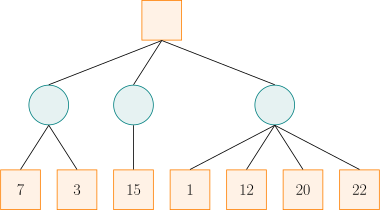

我方应选择中间的路线。因为，如果选择左边的路线，最差的赢面是 $3$；如果选择中间的路线，最差的赢面是 $15$；如果选择右边的路线，最差的赢面是 $1$。虽然选择右边的路线可能有 $22$ 的赢面，但足够理性的对方将会使我方只有 $1$ 的赢面。那么，经过权衡，显然选择中间的路线更优。

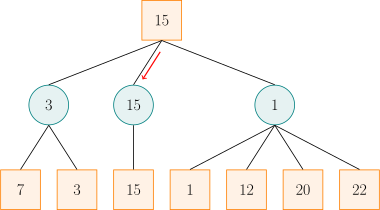

实际上，在看右边的路线时，当发现赢面可能为 $1$ 后就不必再去看赢面为 $12$、$20$、$22$ 的分支了。因为相较于左侧两条路线的赢面，已经可以确定右边的路线不是最好的。

朴素的 Minimax 算法常常需要构建一棵庞大的搜索树，时间和空间复杂度都将不能承受。而 Alpha–Beta 剪枝就是利用搜索树每个结点双方分数的上下界来对 Minimax 进行剪枝优化的一种方法。

需要注意的是，对于不同的问题，搜索树每个结点上的值有着不同的含义，它可以是估值、分数、赢的概率等等。为方便起见，下文统一用分数来称呼。

## Alpha–Beta 剪枝

Alpha–Beta 剪枝是针对 Minimax 算法的搜索剪枝。

### 过程

Minimax 算法中，若已知某结点的所有子结点的分数，则可以算出该结点的分数：对于 MAX 结点，取最大分数；对于 MIN 结点，取最小分数。

在搜索进行到某结点但尚未完成时，虽然不能算出该结点的分数，但是可以算出 **目前已经搜索过的结点中**，双方分数的取值范围。搜索时，维护两个变量 $\alpha$ 和 $\beta$，分别表示局面进行到该结点时，**考虑所有已经搜索过的结点**，Alpha 玩家（即寻求最大分数的一方）和 Beta 玩家（即寻求最小分数的一方）能够保证取得的分数的下界和上界。

Alpha–Beta 剪枝的剪枝策略依赖于搜索当前结点时 $\alpha$ 和 $\beta$ 的取值。如果当前结点是 MAX 结点，那么，Alpha 可以继续搜索它的子结点来提高分数下界 $\alpha$。但是，如果某次搜索后已经有 $\alpha\ge\beta$ 了，那么这个结点就不可能出现在一次对弈中：只要到达该结点处，Alpha 玩家就能够保证分数至少是 $\alpha$；可是 Beta 玩家已经知道存在一种（偏离当前路径的）策略，能够保证分数不超过 $\beta\le\alpha$，那么，Beta 玩家自然不会任由局面发展到 **当前结点** 处。同理，如果当前结点是 MIN 结点，且搜索它的某个子结点后已经发现该结点处有 $\beta\le\alpha$ 成立，那么，同样无需继续搜索其他子结点，因为 Alpha 玩家不会让局面进入 **当前结点**。总结两种情形可以发现：当 $\alpha \geq \beta$ 时，该结点剩余的分支就不必继续搜索了（也就是可以进行剪枝了）。注意，当 $\alpha = \beta$ 时，也需要剪枝，这是因为不会有更好的结果了，但可能有更差的结果。

搜索过程中，无需维护结点分数，只需要维护 $\alpha$ 和 $\beta$ 即可。初始时，令 $\alpha=-\infty,~\beta=+\infty$。向下搜索时，需要一并下传 $\alpha$ 和 $\beta$ 的信息，以记录两名玩家的备选方案。

搜索完子结点时，需要更新当前结点处的信息。不妨假设当前结点 $X$ 是 MAX 结点，且刚刚搜索完它的子结点 $Y$。那么，结点 $X$ 处的 $\beta$ 值不会改变，只有 $\alpha$ 值需要与子结点 $Y$ 的分数取最大值。如果子结点 $Y$ 是叶子结点，直接用子结点 $Y$ 的分数更新当前结点 $X$ 处的 $\alpha$ 值；否则，只需要用子结点 $Y$ 的 $\beta$ 值更新当前结点 $X$ 的 $\alpha$ 值。此时，有三种可能性：

1.  子结点 $Y$ 的 $\beta$ 值严格位于结点 $X$ 的 $\alpha$ 值和 $\beta$ 值之间。因为子结点 $Y$ 继承了结点 $X$ 的 $\alpha$ 值且不会更新它，所以，搜索子结点 $Y$ 完后仍然有 $\beta > \alpha$，就说明搜索子结点 $Y$ 时没有发生剪枝。子结点 $Y$ 最终的 $\beta$ 值，就等于它继承的结点 $X$ 的 $\beta$ 值和它（指子结点 $Y$）的所有子结点的分数中，最小的那个。既然这个最小值严格小于结点 $X$ 的 $\beta$ 值，就说明它一定是子结点 $Y$ 的所有子结点的分数最小值。因此，作为 MIN 结点，子结点 $Y$ 的分数就是这个 $\beta$ 值。用它更新结点 $X$ 的 $\alpha$ 值是合理的。
2.  子结点 $Y$ 的 $\beta$ 值就等于结点 $X$ 的 $\beta$ 值。如上文所述，这说明子结点 $Y$ 的所有子结点的分数均不小于结点 $X$ 的 $\beta$ 值。这进一步说明 Beta 玩家不会任由局面进入结点 $X$：因为 Alpha 玩家只要选择了子结点 $Y$，Beta 玩家就不能取得比 $\beta$ 更低的分数。因此，此时使用子结点 $Y$ 的 $\beta$ 值更新结点 $X$ 的 $\alpha$ 值，是为了使得结点 $X$ 处 $\alpha=\beta$，以触发剪枝条件。它的效果与使用 $Y$ 处实际分数——一个大于等于结点 $X$ 处 $\beta$ 值的数字——更新结点 $X$ 的 $\alpha$ 值的效果是一样的。
3.  子结点 $Y$ 的 $\beta$ 值小于等于结点 $X$ 的 $\alpha$ 值。此时，子结点 $Y$ 触发了剪枝条件，它的实际分数不会超过子结点 $Y$ 的 $\beta$ 值，更不会超过结点 $X$ 的 $\alpha$ 值。用子结点 $Y$ 的实际分数更新结点 $X$ 的 $\alpha$ 值不会改变 $\alpha$ 值。这与使用子结点 $Y$ 的 $\beta$ 值更新结点 $X$ 的 $\alpha$ 值的效果是一样的。

这一分析说明，当某个子结点搜索完成后，只有它的分数处于第一种情形时，$\alpha$（或 $\beta$）才准确记录了这个子结点作为一个 MAX 结点（或 MIN 结点）的实际分数。对于其他情形，虽然它未必是准确的分数，但是它提供的信息足以保证剪枝的正确进行，从而不影响根结点处的分数记录。

### 示例

本节通过分析一个例子，来展示如何在搜索过程中更新各个结点处的 $\alpha$ 和 $\beta$ 值。过程中，也一并计算了所涉及的结点处的分数。由此，就可以观察每个结点处的实际分数与所记录的 $\alpha$ 和 $\beta$ 值的关系。但应注意，实现这一算法时，并不会计算这些结点的实际分数。

对于如下的局势，假设从左往右搜索：

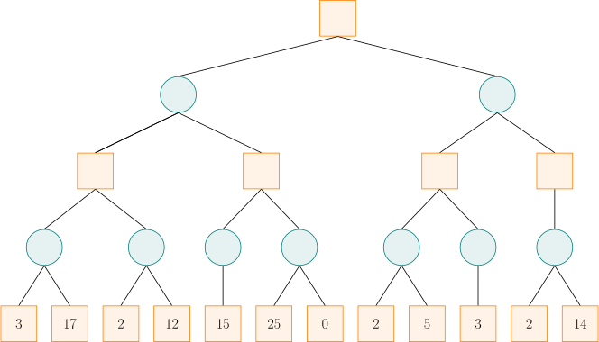

初始化时，令 $\alpha = -\infty,~\beta = +\infty$，并将这一信息沿着搜索路径下传。

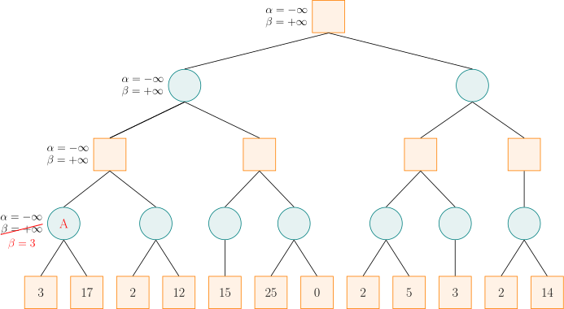

搜索到结点 A 时，由于左子结点的分数为 $3$，而结点 A 是 MIN 结点，试图找分数小的走法，于是将 $\beta$ 值修改为 $3$，这是因为 $3$ 小于当前的 $\beta$ 值（$\beta = +\infty$）。然后结点 A 的右子结点的分数为 $17$，此时不修改结点 A 的 $\beta$ 值，这是因为 $17$ 大于当前的 $\beta$ 值（$\beta = 3$）。此时，结点 A 的所有子结点已搜索完毕，即可计算出结点 A 的分数为 $3$，这与该结点处记录的 $\beta$ 值一致（前文的情形 1）。

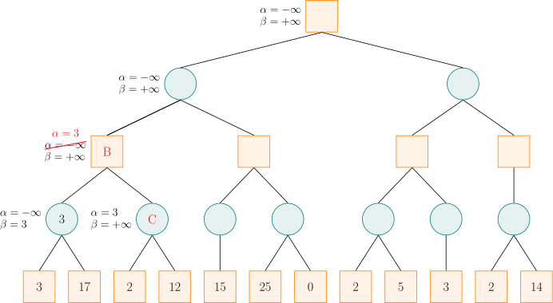

结点 A 是结点 B 的子结点，计算出结点 A 的分数后，可以更新结点 B 的 $\alpha$ 和 $\beta$ 值。由于结点 B 是 MAX 结点，试图找分数大的走法，于是将 $\alpha$ 值修改为 $3$，这是因为子结点 A 处的 $\beta$ 值（$\beta=3$）大于当前的 $\alpha$ 值（$\alpha = -\infty$）。之后，搜索结点 B 的右子结点 C，并将结点 B 的 $\alpha$ 和 $\beta$ 值传递给结点 C。

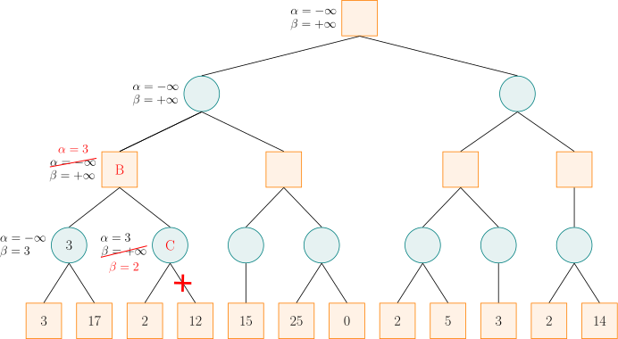

对于结点 C，由于左子结点的分数为 $2$，而结点 C 是 MIN 结点，于是将 $\beta$ 值修改为 $2$。此时 $\alpha \geq \beta$，故结点 C 的剩余子结点就不必搜索了，因为可以确定，Alpha 玩家不会允许局面发展到结点 C。此时，结点 C 是 MIN 结点，它的分数就是 $2$，不超过记录的 $\beta$ 值（前文的情形 3）。由于结点 B 的所有子结点搜索完毕，即可计算出结点 B 的分数为 $3$，与记录的 $\alpha$ 值相同（前文的情形 1）。

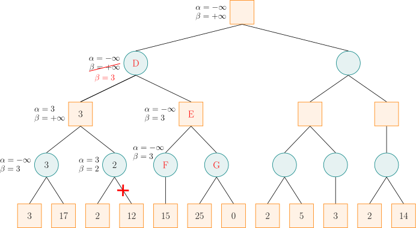

计算出结点 B 的分数后，结点 B 是结点 D 的一个子结点，故可以更新结点 D 的 $\alpha$ 和 $\beta$ 值。由于结点 D 是 MIN 结点，于是将 $\beta$ 值修改为 $3$。然后结点 D 将 $\alpha$ 和 $\beta$ 值传递给结点 E，结点 E 又传递给结点 F。对于结点 F，它只有一个分数为 $15$ 的子结点，由于 $15$ 大于当前的 $\beta$ 值，而结点 F 为 MIN 结点，所以不更新其 $\beta$ 值，然后可以计算出结点 F 的分数为 $15$，大于记录的 $\beta$ 值（前文的情形 2）。

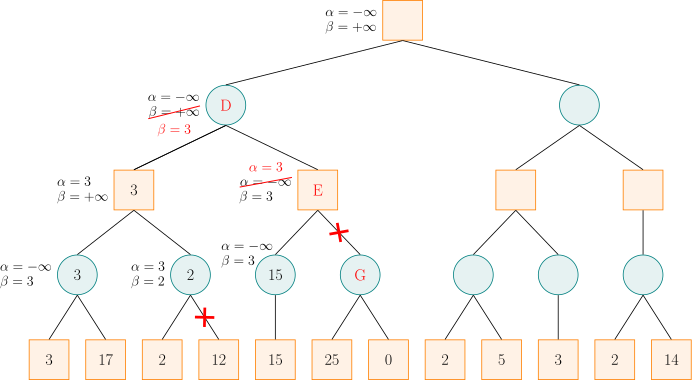

计算出结点 F 的分数后，结点 F 是结点 E 的一个子结点，故可以更新结点 E 的 $\alpha$ 和 $\beta$ 值。结点 E 是 MAX 结点，更新 $\alpha$ 值，此时 $\alpha \geq \beta$，故可以剪去结点 E 的余下分支（即结点 G）。然后，结点 E 是 MAX 结点，将结点 E 的分数设为 $15$，严格大于记录的 $\alpha$ 值（前文的情形 3）。利用结点 E 的 $\alpha$ 值更新结点 D 的 $\beta$ 值，仍然是 $3$。此时，结点 D 的所有子结点搜索完毕，即可计算出结点 D 的分数为 $3$，等于记录的 $\beta$ 值（前文的情形 1）。

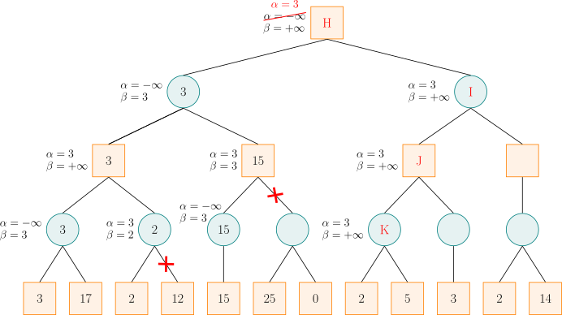

计算出结点 D 的分数后，结点 D 是结点 H 的一个子结点，故可以更新结点 H 的 $\alpha$ 和 $\beta$ 值。结点 H 是 MAX 结点，更新 $\alpha$。然后，按搜索顺序，将结点 H 的 $\alpha$ 和 $\beta$ 值依次传递给结点 I、J、K。对于结点 K，其左子结点的分数为 $2$，而结点 K 是 MIN 结点，更新 $\beta$，此时 $\alpha \geq \beta$，故可以剪去结点 K 的余下分支。然后，将结点 K 的分数设为 $2$，小于等于记录的 $\beta$ 值（前文的情形 3）。

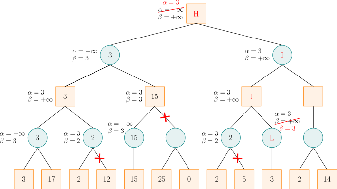

计算出结点 K 的分数后，结点 K 是结点 J 的一个子结点，故可以更新结点 J 的 $\alpha$ 和 $\beta$ 值。结点 J 是 MAX 结点，更新 $\alpha$，但是，由于结点 K 的分数小于 $\alpha$，所以结点 J 的 $\alpha$ 值维持 $3$ 不变。然后，将结点 J 的 $\alpha$ 和 $\beta$ 值传递给结点 L。由于结点 L 是 MIN 结点，更新 $\beta = 3$，此时 $\alpha \geq \beta$，故可以剪去结点 L 的余下分支。由于结点 L 没有余下分支，所以此处并没有实际剪枝。然后，将结点 L 的分数设为 $3$，它小于等于记录的 $\beta$ 值（前文的情形 3）。

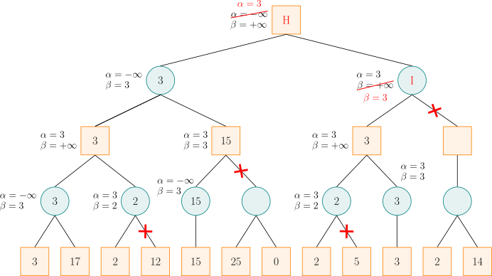

计算出结点 L 的分数后，结点 L 是结点 J 的一个子结点，故可以更新结点 J 的 $\alpha$ 和 $\beta$ 值。结点 J 是 MAX 结点，更新 $\alpha$，但是，由于结点 L 的分数小于等于 $\alpha$，所以结点 J 的 $\alpha$ 值维持 $3$ 不变。此时，结点 J 的所有子结点搜索完毕，即可计算出结点 J 的分数为 $3$，它等于记录的 $\alpha$ 值（前文的情形 2）。

计算出结点 J 的分数后，结点 J 是结点 I 的一个子结点，故可以更新结点 I 的 $\alpha$ 和 $\beta$ 值。结点 I 是 MIN 结点，更新 $\beta$，此时 $\alpha \geq \beta$，故可以剪去结点 I 的余下分支。值得注意的是，由于右子结点的存在，结点 I 的实际分数是 $2$，小于记录的 $\beta$ 值（前文的情形 3）。

计算出结点 I 的分数后，结点 I 是结点 H 的一个子结点，故可以更新结点 H 的 $\alpha$ 和 $\beta$ 值。结点 H 是 MAX 结点，更新 $\alpha$，但是，由于结点 I 的分数小于等于 $\alpha$，所以结点 H 的 $\alpha$ 值维持 $3$ 不变。此时，结点 H 的所有子结点搜索完毕，即可计算出结点 H 的分数为 $3$，它等于记录的 $\alpha$ 值（前文的情形 1）。

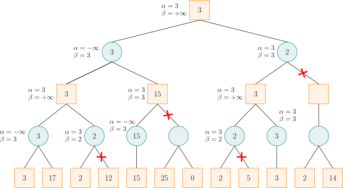

这就是最终结果。

### 实现

???+ example "参考代码"
    ```cpp
    int alpha_beta(int u, int alph, int beta, bool is_max) {
      if (!son_num[u]) return val[u];
      if (is_max) {
        for (int i = 0; i < son_num[u]; ++i) {
          int d = son[u][i];
          alph = max(alph, alpha_beta(d, alph, beta, !is_max));
          if (alph >= beta) break;
        }
        return alph;
      } else {
        for (int i = 0; i < son_num[u]; ++i) {
          int d = son[u][i];
          beta = min(beta, alpha_beta(d, alph, beta, !is_max));
          if (alph >= beta) break;
        }
        return beta;
      }
    }
    ```

## 参考资料与注释

-   [Minimax Algorithm - Wikipedia](https://en.wikipedia.org/wiki/Minimax#Minimax_algorithm_with_alternate_moves)
-   [Alpha–beta pruning - Wikipedia](https://en.wikipedia.org/wiki/Alpha%E2%80%93beta_pruning)

**本文部分引用自博文 [详解 Minimax 算法与α-β剪枝\_文剑木然](https://blog.csdn.net/wenjianmuran/article/details/90633418)，遵循 CC 4.0 BY-SA 版权协议。内容有改动。**
