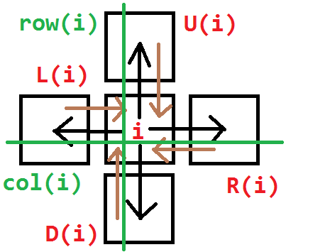
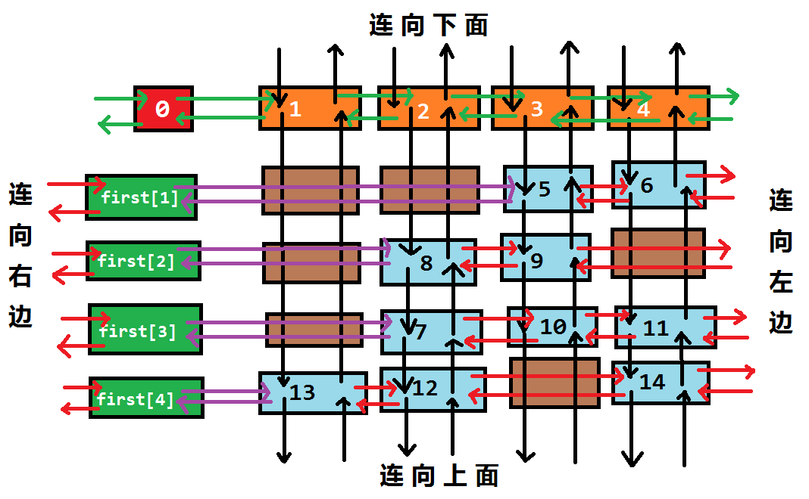
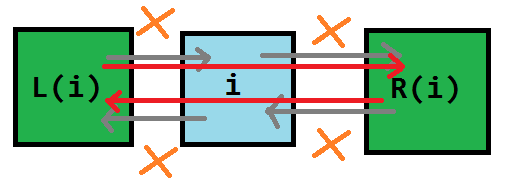
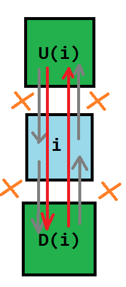
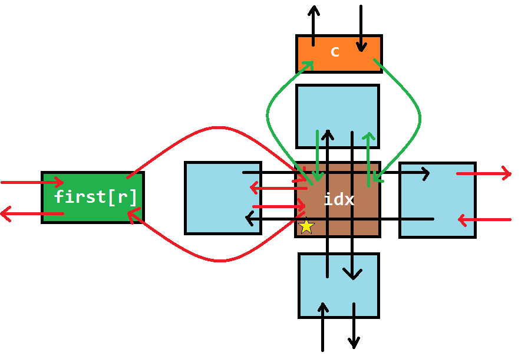

author: LeverImmy

## 精确覆盖问题

### 定义

精确覆盖问题 (Exact Cover Problem) 是指给定许多集合 $S_i (1 \le i \le n)$ 以及一个集合 $X$，求满足以下条件的无序多元组 $(T_1, T_2, \cdots , T_m)$：

1. $\forall i, j \in [1, m],T_i\bigcap T_j = \varnothing (i \neq j)$
2. $X = \bigcup\limits_{i = 1}^{m}T_i$
3. $\forall i \in[1, m], T_i \in \{S_1, S_2, \cdots, S_n\}$

例如，若给出

$$
\begin{aligned}
  & S_1 = \{5, 9, 17\} \\
  & S_2 = \{1, 8, 119\} \\
  & S_3 = \{3, 5, 17\} \\
  & S_4 = \{1, 8\} \\
  & S_5 = \{3, 119\} \\
  & S_6 = \{8, 9, 119\} \\
  & X = \{1, 3, 5, 8, 9, 17, 119\}
\end{aligned}
$$

则 $(S_1, S_4, S_5)$ 为一组合法解。

### 问题转化

我们将 $\bigcup\limits_{i = 1}^{n}S_i$ 中的所有数离散化，那么可以得到这么一个模型：

> 给定一个 01 矩阵，你可以选择一些行，使得最终每列都恰好有一个 1。
> 举个例子，我们对上文中的例子进行建模，可以得到这么一个矩阵：

$$
\begin{pmatrix}
  0 & 0 & 1 & 0 & 1 & 1 & 0 \\
  1 & 0 & 0 & 1 & 0 & 0 & 1 \\
  0 & 1 & 1 & 0 & 0 & 1 & 0 \\
  1 & 0 & 0 & 1 & 0 & 0 & 0 \\
  0 & 1 & 0 & 0 & 0 & 0 & 1 \\
  0 & 0 & 0 & 1 & 1 & 0 & 1
\end{pmatrix}
$$

其中第 $i$ 行表示着 $S_i$，而这一行的每个数依次表示 $[1 \in S_i],[3 \in S_i],[5 \in S_i],\cdots,[119 \in S_i]$。

### 暴力 1

我们可以枚举选择哪些行，最后检查这个方案是否合法。

因为每一行都有选或者不选两种状态，所以枚举行的时间复杂度是 $O(2^n)$ 的；

而每次检查都需要 $O(nm)$ 的时间复杂度。所以总的复杂度是 $O(nm\cdot2^n)$。

??? note "代码实现"
    ```cpp
    int ok = 0;
    for (int state = 0; state < 1 << n; ++state) {  // 枚举每行是否被选
      for (int i = 1; i <= n; ++i)
        if ((1 << i - 1) & state)
          for (int j = 1; j <= m; ++j) a[i][j] = 1;
      int flag = 1;
      for (int j = 1; j <= m; ++j)
        for (int i = 1, bo = 0; i <= n; ++i)
          if (a[i][j]) {
            if (bo)
              flag = 0;
            else
              bo = 1;
          }
      if (!flag)
        continue;
      else {
        ok = 1;
        for (int i = 1; i <= n; ++i)
          if ((1 << i - 1) & state) printf("%d ", i);
        puts("");
      }
      memset(a, 0, sizeof(a));
    }
    if (!ok) puts("No solution.");
    ```

### 暴力 2

考虑到 01 矩阵的特殊性质，我们可以把每一行都看做成一个 $m$ 位二进制数。

因此被转化为了

> 给你 $n$ 个 $m$ 位二进制数，要求选择一些数，使得任意两个数的与都为 0，且所有数的或为 $2^m - 1$。`tmp` 表示的是截至目前的所有被选择了的 $m$ 位二进制数的或。

因为每一行都有选或者不选两种状态，所以枚举行的时间复杂度为 $O(2^n)$；

而每次计算 `tmp` 都需要 $O(n)$ 的时间复杂度。所以总的复杂度为 $O(n\cdot2^n)$。

??? note "代码实现"
    ```cpp
    int ok = 0;
    for (int i = 1; i <= n; ++i)
      for (int j = m; j >= 1; --j) num[i] = num[i] << 1 | a[i][j];
    for (int state = 0; state < 1 << n; ++state) {
      int tmp = 0;
      for (int i = 1; i <= n; ++i)
        if ((1 << i - 1) & state) {
          if (tmp & num[i]) break;
          tmp |= num[i];
        }
      if (tmp == (1 << m) - 1) {
        ok = 1;
        for (int i = 1; i <= n; ++i)
          if ((1 << i - 1) & state) printf("%d ", i);
        puts("");
      }
    }
    if (!ok) puts("No solution.");
    ```

## X 算法

Donald E. Knuth 提出了 X 算法 (Algorithm X)，其思想与刚才的暴力差不多，但是方便优化。

继续以上文中中提到的例子为载体，我们得到的是一个这样的 01 矩阵：

$$
\begin{pmatrix}
  0 & 0 & 1 & 0 & 1 & 1 & 0 \\
  1 & 0 & 0 & 1 & 0 & 0 & 1 \\
  0 & 1 & 1 & 0 & 0 & 1 & 0 \\
  1 & 0 & 0 & 1 & 0 & 0 & 0 \\
  0 & 1 & 0 & 0 & 0 & 0 & 1 \\
  0 & 0 & 0 & 1 & 1 & 0 & 1
\end{pmatrix}
$$

1.  此时第一行有 $3$ 个 $1$，第二行有 $3$ 个 $1$，第三行有 $3$ 个 $1$，第四行有 $2$ 个 $1$，第五行有 $2$ 个 $1$，第六行有 $3$ 个 $1$。选择第一行，将它删除，并将所有 $1$ 所在的列打上标记；

    $$
    \begin{pmatrix}
      \color{Blue}0 & \color{Blue}0 & \color{Blue}1 & \color{Blue}0 & \color{Blue}1 & \color{Blue}1 & \color{Blue}0 \\
      1 & 0 & \color{Red}0 & 1 & \color{Red}0 & \color{Red}0 & 1 \\
      0 & 1 & \color{Red}1 & 0 & \color{Red}0 & \color{Red}1 & 0 \\
      1 & 0 & \color{Red}0 & 1 & \color{Red}0 & \color{Red}0 & 0 \\
      0 & 1 & \color{Red}0 & 0 & \color{Red}0 & \color{Red}0 & 1 \\
      0 & 0 & \color{Red}0 & 1 & \color{Red}1 & \color{Red}0 & 1
      \end{pmatrix}
    $$

2.  选择所有被标记的列，将它们删除，并将这些列中含 $1$ 的行打上标记；

    $$
    \begin{pmatrix}
      \color{Blue}0 & \color{Blue}0 & \color{Blue}1 & \color{Blue}0 & \color{Blue}1 & \color{Blue}1 & \color{Blue}0 \\
      1 & 0 & \color{Blue}0 & 1 & \color{Blue}0 & \color{Blue}0 & 1 \\
      \color{Red}0 & \color{Red}1 & \color{Blue}1 & \color{Red}0 & \color{Blue}0 & \color{Blue}1 & \color{Red}0 \\
      1 & 0 & \color{Blue}0 & 1 & \color{Blue}0 & \color{Blue}0 & 0 \\
      0 & 1 & \color{Blue}0 & 0 & \color{Blue}0 & \color{Blue}0 & 1 \\
      \color{Red}0 & \color{Red}0 & \color{Blue}0 & \color{Red}1 & \color{Blue}1 & \color{Blue}0 & \color{Red}1
    \end{pmatrix}
    $$

3.  选择所有被标记的行，将它们删除；

    $$
    \begin{pmatrix}
      \color{Blue}0 & \color{Blue}0 & \color{Blue}1 & \color{Blue}0 & \color{Blue}1 & \color{Blue}1 & \color{Blue}0 \\
      1 & 0 & \color{Blue}0 & 1 & \color{Blue}0 & \color{Blue}0 & 1 \\
      \color{Blue}0 & \color{Blue}1 & \color{Blue}1 & \color{Blue}0 & \color{Blue}0 & \color{Blue}1 & \color{Blue}0 \\
      1 & 0 & \color{Blue}0 & 1 & \color{Blue}0 & \color{Blue}0 & 0 \\
      0 & 1 & \color{Blue}0 & 0 & \color{Blue}0 & \color{Blue}0 & 1 \\
      \color{Blue}0 & \color{Blue}0 & \color{Blue}0 & \color{Blue}1 & \color{Blue}1 & \color{Blue}0 & \color{Blue}1
    \end{pmatrix}
    $$

    **这表示表示我们选择了一行，且这一行的所有 $1$ 所在的列不能有其他 $1$ 了**。

    于是我们得到了这样的一个新的小 01 矩阵：

    $$
    \begin{pmatrix}
      1 & 0 & 1 & 1 \\
      1 & 0 & 1 & 0 \\
      0 & 1 & 0 & 1
    \end{pmatrix}
    $$

4.  此时第一行（原来的第二行）有 $3$ 个 $1$，第二行（原来的第四行）有 $2$ 个 $1$，第三行（原来的第五行）有 $2$ 个 $1$。选择第一行（原来的第二行），将它删除，并将所有 $1$ 所在的列打上标记；

    $$
    \begin{pmatrix}
      \color{Blue}1 & \color{Blue}0 & \color{Blue}1 & \color{Blue}1 \\
      \color{Red}1 & 0 & \color{Red}1 & \color{Red}0 \\
      \color{Red}0 & 1 & \color{Red}0 & \color{Red}1
    \end{pmatrix}
    $$

5.  选择所有被标记的列，将它们删除，并将这些列中含 $1$ 的行打上标记；

    $$
    \begin{pmatrix}
      \color{Blue}1 & \color{Blue}0 & \color{Blue}1 & \color{Blue}1 \\
      \color{Blue}1 & \color{Red}0 & \color{Blue}1 & \color{Blue}0 \\
      \color{Blue}0 & \color{Red}1 & \color{Blue}0 & \color{Blue}1
    \end{pmatrix}
    $$

6.  选择所有被标记的行，将它们删除；

    $$
    \begin{pmatrix}
      \color{Blue}1 & \color{Blue}0 & \color{Blue}1 & \color{Blue}1 \\
      \color{Blue}1 & \color{Blue}0 & \color{Blue}1 & \color{Blue}0 \\
      \color{Blue}0 & \color{Blue}1 & \color{Blue}0 & \color{Blue}1
    \end{pmatrix}
    $$

    于是我们得到了一个空矩阵。但是上次删除的行 "1 0 1 1" 不是全 $1$ 的，说明选择有误；

    $$
    \begin{pmatrix}
    \end{pmatrix}
    $$

7.  回溯到步骤 $4$，我们考虑选择第二行（原来的第四行），将它删除，并将所有 $1$ 所在的列打上标记；

    $$
    \begin{pmatrix}
      \color{Red}1 & 0 & \color{Red}1 & 1 \\
      \color{Blue}1 & \color{Blue}0 & \color{Blue}1 & \color{Blue}0 \\
      \color{Red}0 & 1 & \color{Red}0 & 1
    \end{pmatrix}
    $$

8.  选择所有被标记的列，将它们删除，并将这些列中含 $1$ 的行打上标记；

    $$
    \begin{pmatrix}
      \color{Blue}1 & \color{Red}0 & \color{Blue}1 & \color{Red}1 \\
      \color{Blue}1 & \color{Blue}0 & \color{Blue}1 & \color{Blue}0 \\
      \color{Blue}0 & 1 & \color{Blue}0 & 1
    \end{pmatrix}
    $$

9.  选择所有被标记的行，将它们删除；

    $$
    \begin{pmatrix}
      \color{Blue}1 & \color{Blue}0 & \color{Blue}1 & \color{Blue}1 \\
      \color{Blue}1 & \color{Blue}0 & \color{Blue}1 & \color{Blue}0 \\
      \color{Blue}0 & 1 & \color{Blue}0 & 1
      \end{pmatrix}
    $$

    于是我们得到了这样的一个矩阵：

    $$
    \begin{pmatrix}
      1 & 1
    \end{pmatrix}
    $$

10. 此时第一行（原来的第五行）有 $2$ 个 $1$，将它们全部删除，我们得到了一个空矩阵：

    $$
    \begin{pmatrix}
    \end{pmatrix}
    $$

11. 上一次删除的时候，删除的是全 $1$ 的行，因此成功，算法结束。

    答案即为我们删除的三行：$1, 4, 5$。

- **强烈建议自己模拟一遍矩阵删除、还原与回溯的过程后再接着阅读下文。**

我们可以概括出 X 算法的过程：

1. 对于现在的矩阵 $M$，选择并标记一列 $r$，将 $r$ 添加至 $S$ 中；
2. 如果尝试了所有的 $r$ 却无解，则算法结束，输出无解。
3. 标记与 $r$ 相关的行 $r_i$ 和 $c_i$；
4. 删除所有标记的行和列，得到新矩阵 $M'$；
5.  如果 $M'$ 为空，且 $r$ 为全 $1$ 的，则算法结束，输出被删除的行组成的集合 $S$；

    如果 $M'$ 为空，且 $r$ 不为全 $1$ 的，则恢复与 $r$ 相关的行 $r_i$ 以及列 $c_i$，跳转至步骤 $1$；

    如果 $M'$ 不为空，则跳转至步骤 $1$。

不难看出，X 算法需要大量的“删除行”、“删除列”和“恢复行”、“恢复列”的操作。

Donald E. Knuth 想到了用双向十字链表来维护这些操作。

而在双向十字链表上不断跳跃的过程被形象地比喻成“跳跃”，因此被用来优化 X 算法的双向十字链表也被称为“Dancing Links”。

## Dancing Links 优化的 X 算法

### 预编译命令

```cpp
#define IT(i, A, x) for (i = A[x]; i != x; i = A[i])
```

### 定义

既然是双向十字链表，那么一定是有四个指针域的：一个指上方的元素，一个指下方的元素，一个指左边的元素，一个指右边的元素。而每个元素 $i$ 在整个双向十字链表系中都对应着一个格子，因此还要表示 $i$ 所在的列和所在的这样：



是不是非常简单？

而其实大型双向链表其实是长这样的：



每一行都有一个行首指示，每一列都有一个列指示。

行首指示为 `first[]`，列指示是我们虚拟出的 $c + 1$ 个结点。

同时，每一列都有一个 `siz[]` 表示这一列的元素个数。

特殊地，$0$ 号结点无右结点等价于这个 Dancing Links 为空。

```cpp
static const int MS = 1e5 + 5;
int n, m, idx, first[MS], siz[MS];
int L[MS], R[MS], U[MS], D[MS];
int col[MS], row[MS];
```

### remove 操作

$\text{remove(c)}$ 表示在 Dancing Links 中删除第 $c$ 列以及与其相关的行和列。

我们先将 $c$ 删除，此时：

1. $c$ 左侧的结点的右结点应为 $c$ 的右结点；
2. $c$ 右侧的结点的左结点应为 $c$ 的左结点。

即 `L[R[c]] = L[c], R[L[c]] = R[c];`。



然后我们要顺着这一列往下走，把走过的每一行都删掉。

如何删掉每一行呢？枚举当前行的指针 $j$，此时：

1. $j$ 上方的结点的下结点应为 $j$ 的下结点；
2. $j$ 下方的结点的上结点应为 $j$ 的上结点。

注意要修改每一列的元素个数。

即 `U[D[j]] = U[j], D[U[j]] = D[j], --siz[col[j]];`。



因此 $\text{remove(c)}$ 的代码实现就非常简单了：

其中第一个 `IT(i, D, c)` 等价于 `for(i = D[c]; i != c; i = D[i])`，即在顺着这一列从上往下遍历；

第二个 `IT(j, R, i)` 等价于 `for(j = R[i]; j != i; j = R[j])`，即在顺着这一行从左往右遍历。

```cpp
void remove(const int &c) {
  int i, j;
  L[R[c]] = L[c], R[L[c]] = R[c];
  IT(i, D, c) IT(j, R, i) U[D[j]] = U[j], D[U[j]] = D[j], --siz[col[j]];
}
```

### recover 操作

$\text{recover(c)}$ 表示在 Dancing Links 中还原第 $c$ 列以及与其相关的行和列。

$\text{recover(c)}$ 即 $\text{remove(c)}$ 的逆操作，在这里就不多赘述了。

**值得注意的是，**$\text{recover(c)}$ **的所有操作的顺序与** $\text{remove(c)}$ **的操作恰好相反。**

在这里给出 $\text{recover(c)}$ 的代码实现：

```cpp
void recover(const int &c) {
  int i, j;
  IT(i, U, c) IT(j, L, i) U[D[j]] = D[U[j]] = j, ++siz[col[j]];
  L[R[c]] = R[L[c]] = c;
}
```

### build 操作

$\text{build(r, c)}$ 表示新建一个大小为 $r \times c$，即有 $r$ 行，$c$ 列的 Dancing Links。

我们新建 $c + 1$ 个结点，为列指示。

第 $i$ 个点的左结点为 $i - 1$，右结点为 $i + 1$，上结点为 $i$，下结点为 $i$。

特殊地，$0$ 结点的左结点为 $c$，$c$ 结点的右结点为 $0$。

于是我们得到了一条链：


```cpp
void build(const int &r, const int &c) {
  n = r, m = c;
  for (int i = 0; i <= c; ++i) {
    L[i] = i - 1, R[i] = i + 1;
    U[i] = D[i] = i;
  }
  L[0] = c, R[c] = 0, idx = c;
  memset(first, 0, sizeof(first));
  memset(siz, 0, sizeof(siz));
}
```

这样就初始化了一个 Dancing Links。

### insert 操作

$\text{insert(r, c)}$ 表示在第 $r$ 行，第 $c$ 列插入一个结点。

我们分两种情况来操作：

1. 如果第 $r$ 行没有元素，那么直接插入一个元素，并使 $first(r)$ 指向这个元素；
2. 如果第 $r$ 行有元素，那么将这个新元素 **用一种奇异的方式** 与 $c$ 和 $first(r)$ 连接起来。

对于情况 1，我们可以通过 `first[r] = L[idx] = R[idx] = idx;` 来实现；

对于情况 2，（我们称这个新元素为 $idx$）：

-   我们把 $idx$ 插入到 $c$ 的正下方，此时：

    1. $idx$ 下方的结点为原来 $c$ 的下结点；
    2. $idx$ 下方的结点（即原来 $c$ 的下结点）的上结点为 $idx$;
    3. $idx$ 的上结点为 $c$；
    4. $c$ 的下结点为 $idx$。

    注意记录 $idx$ 的所在列和所在行，以及更新这一列的元素个数。

    ```cpp
    col[++idx] = c, row[idx] = r, ++siz[c];
    U[idx] = c, D[idx] = D[c], U[D[c]] = idx, D[c] = idx;
    ```

    **强烈建议读者完全掌握这几步的顺序后再继续阅读本文。**

-   我们把 $idx$ 插入到 $first(r)$ 的正右方，此时：

    1. $idx$ 右侧的结点为原来 $first(r)$ 的右结点；
    2. 原来 $first(r)$ 右侧的结点的左结点为 $idx$；
    3. $idx$ 的左结点为 $first(r)$；
    4. $first(r)$ 的右结点为 $idx$。

    ```cpp
    L[idx] = first[r], R[idx] = R[first[r]];
    R[first[r]] = idx, L[R[first[r]]] = idx;
    ```

    **强烈建议读者完全掌握这几步的顺序后再继续阅读本文。**

对于 $\text{insert(r, c)}$ 这个操作，我们可以画图来辅助理解：



留心曲线箭头的方向。

在这里给出 $\text{insert(r, c)}$ 的代码：

```cpp
void insert(const int &r, const int &c) {
  row[++idx] = r, col[idx] = c, ++siz[c];
  U[idx] = c, D[idx] = D[c], U[D[c]] = idx, D[c] = idx;
  if (!first[r])
    first[r] = L[idx] = R[idx] = idx;
  else {
    L[idx] = first[r], R[idx] = R[first[r]];
    L[R[first[r]]] = idx, R[first[r]] = idx;
  }
}
```

### dance 操作

$\text{dance()}$ 即为递归地删除以及还原各个行列的过程。

1. 如果 $0$ 号结点没有右结点，那么矩阵为空，记录答案并返回；
2. 选择列元素个数最少的一列，并删掉这一列；
3. 遍历这一列所有有 $1$ 的行，枚举它是否被选择；
4. 递归调用 $\text{dance()}$，如果可行，则返回；如果不可行，则恢复被选择的行；
5. 如果无解，则返回；

在这里给出 $\text{dance()}$ 的代码实现：

```cpp
bool dance(int dep) {
  int i, j, c = R[0];
  if (!R[0]) {
    ans = dep;
    return 1;
  }
  IT(i, R, 0) if (siz[i] < siz[c]) c = i;
  remove(c);
  IT(i, D, c) {
    stk[dep] = row[i];
    IT(j, R, i) remove(col[j]);
    if (dance(dep + 1)) return 1;
    IT(j, L, i) recover(col[j]);
  }
  recover(c);
  return 0;
}
```

其中 `stk[]` 用来记录答案。

注意我们每次优先选择列元素个数最少的一列进行删除，这样能保证程序具有一定的启发性，使搜索树分支最少。

## 模板

[【模板】舞蹈链（DLX）](https://www.luogu.com.cn/problem/P4929)

??? note "模板代码"
    ```cpp
    #include <bits/stdc++.h>
    #define ll long long
    #define rgi register int
    #define rgl register ll
    #define il inline
    const int N = 500 + 10;
    int n, m, idx, ans;
    int first[N], siz[N], stk[N];
    struct DLXNODE {
      int lc, rc, up, dn, r, c;
    };
    il int read() {
      rgi x = 0, f = 0, ch;
      while (!isdigit(ch = getchar())) f |= ch == '-';
      while (isdigit(ch)) x = (x << 1) + (x << 3) + (ch ^ 48), ch = getchar();
      return f ? -x : x;
    }
    struct DLX {
      static const int MAXSIZE = 1e5 + 10;
    #define IT(i, A, x) for (i = A[x]; i != x; i = A[i])
      int n, m, tot, first[MAXSIZE + 10], siz[MAXSIZE + 10];
      int L[MAXSIZE + 10], R[MAXSIZE + 10], U[MAXSIZE + 10], D[MAXSIZE + 10];
      int col[MAXSIZE + 10], row[MAXSIZE + 10];
      void build(const int &r, const int &c) {
        n = r, m = c;
        for (rgi i = 0; i <= c; ++i) {
          L[i] = i - 1, R[i] = i + 1;
          U[i] = D[i] = i;
        }
        L[0] = c, R[c] = 0, tot = c;
        memset(first, 0, sizeof(first));
        memset(siz, 0, sizeof(siz));
      }
      void insert(const int &r, const int &c) {
        col[++tot] = c, row[tot] = r, ++siz[c];
        D[tot] = D[c], U[D[c]] = tot, U[tot] = c, D[c] = tot;
        if (!first[r])
          first[r] = L[tot] = R[tot] = tot;
        else {
          R[tot] = R[first[r]], L[R[first[r]]] = tot;
          L[tot] = first[r], R[first[r]] = tot;
        }
      }
      void remove(const int &c) {
        rgi i, j;
        L[R[c]] = L[c], R[L[c]] = R[c];
        IT(i, D, c) IT(j, R, i) U[D[j]] = U[j], D[U[j]] = D[j], --siz[col[j]];
      }
      void recover(const int &c) {
        rgi i, j;
        IT(i, U, c) IT(j, L, i) U[D[j]] = D[U[j]] = j, ++siz[col[j]];
        L[R[c]] = R[L[c]] = c;
      }
      bool dance(int dep) {
        if (!R[0]) {
          ans = dep;
          return 1;
        }
        rgi i, j, c = R[0];
        IT(i, R, 0) if (siz[i] < siz[c]) c = i;
        remove(c);
        IT(i, D, c) {
          stk[dep] = row[i];
          IT(j, R, i) remove(col[j]);
          if (dance(dep + 1)) return 1;
          IT(j, L, i) recover(col[j]);
        }
        recover(c);
        return 0;
      }
    #undef IT
    } solver;
    int main() {
      n = read(), m = read();
      solver.build(n, m);
      for (rgi i = 1; i <= n; ++i)
        for (rgi j = 1; j <= m; ++j) {
          int x = read();
          if (x) solver.insert(i, j);
        }
      solver.dance(1);
      if (ans)
        for (rgi i = 1; i < ans; ++i) printf("%d ", stk[i]);
      else
        puts("No Solution!");
      return 0;
    }
    ```

## 时间复杂度分析

DLX 的时间复杂度是 **指数级** 的，它递归及回溯的次数与矩阵中 $1$ 的个数有关，与矩阵的 $r, c$ 等参数无关。

因此理论复杂度大概在 $O(c^n)$ 左右，其中 $c$ 为某个非常接近于 $1$ 的常数，$n$ 为矩阵中 $1$ 的个数。

但实际情况下 DLX 表现良好，一般能解决大部分的问题。

## 如何建模

DLX 的难点，不全在于链表的建立，而在于建模。

**请确保已经完全掌握 DLX 模板后再继续阅读本文。**

我们每拿到一个题，应该考虑行和列所表示的意义：

- 行表示*决策*，因为每行对应着一个集合，也就对应着选/不选；

- 列表示*状态*，因为第 $i$ 列对应着某个条件 $P_i$。

对于某一行而言，由于不同的列的值不尽相同，我们 **由不同的状态，定义了一个决策**。

### 例题一 [数独](https://www.luogu.com.cn/problem/P1784)

??? note "解题思路"
    先考虑决策是什么。
    
    在这一题中，每一个决策可以用形如 $(r, c, w)$ 的有序三元组表示。
    
    注意到“宫”并不是决策的参数，因为它 **可以被每个确定的 $(r, c)$ 表示**。
    
    因此有 $9 \times 9 \times 9 = 729$ 行。
    
    再考虑状态是什么。
    
    我们思考一下 $(r, c, w)$ 这个决将会造成什么影响。记 $(r, c)$ 所在的宫为 $b$。
    
    1. 第 $r$ 行用了一个 $w$（用 $9 \times 9 = 81$ 列表示）；
    2. 第 $c$ 列用了一个 $w$（用 $9 \times 9 = 81$ 列表示）；
    3. 第 $b$ 宫用了一个 $w$（用 $9 \times 9 = 81$ 列表示）；
    4. $(r, c)$ 中填入了一个数（用 $9 \times 9 = 81$ 列表示）。
    
    因此有 $81 \times 4 = 324$ 列，共 $729 \times 4 = 2916$ 个 $1$。
    
    至此，我们成功地将 $9 \times 9$ 的数独问题转化成了一个 **有 $729$ 行，$324$ 列，共 $2916$ 个 $1$** 的精确覆盖问题。

??? note "参考代码"
    ```cpp
    #include <bits/stdc++.h>
    #define LL long long
    #define rgi register int
    #define il inline
    const int N = 1e6 + 10;
    #define JUDGE 0
    #define DEBUG 0
    int ans[10][10], stk[N];
    il int read() {
      rgi x = 0, f = 0, ch;
      while (!isdigit(ch = getchar())) f |= ch == '-';
      while (isdigit(ch)) x = (x << 1) + (x << 3) + (ch ^ 48), ch = getchar();
      return f ? -x : x;
    }
    struct DLX {
      static const int MAXSIZE = 1e5 + 10;
    #define IT(i, A, x) for (i = A[x]; i != x; i = A[i])
      int n, m, tot, first[MAXSIZE + 10], siz[MAXSIZE + 10];
      int L[MAXSIZE + 10], R[MAXSIZE + 10], U[MAXSIZE + 10], D[MAXSIZE + 10];
      int col[MAXSIZE + 10], row[MAXSIZE + 10];
      void build(const int &r, const int &c) {
        n = r, m = c;
        for (rgi i = 0; i <= c; ++i) {
          L[i] = i - 1, R[i] = i + 1;
          U[i] = D[i] = i;
        }
        L[0] = c, R[c] = 0, tot = c;
        memset(first, 0, sizeof(first));
        memset(siz, 0, sizeof(siz));
      }
      void insert(const int &r, const int &c) {
        col[++tot] = c, row[tot] = r, ++siz[c];
        D[tot] = D[c], U[D[c]] = tot, U[tot] = c, D[c] = tot;
        if (!first[r])
          first[r] = L[tot] = R[tot] = tot;
        else {
          R[tot] = R[first[r]], L[R[first[r]]] = tot;
          L[tot] = first[r], R[first[r]] = tot;
        }
      }
      void remove(const int &c) {
        rgi i, j;
        L[R[c]] = L[c], R[L[c]] = R[c];
        IT(i, D, c) IT(j, R, i) U[D[j]] = U[j], D[U[j]] = D[j], --siz[col[j]];
      }
      void recover(const int &c) {
        rgi i, j;
        IT(i, U, c) IT(j, L, i) U[D[j]] = D[U[j]] = j, ++siz[col[j]];
        L[R[c]] = R[L[c]] = c;
      }
      bool dance(int dep) {
        rgi i, j, c = R[0];
        if (!R[0]) {
          for (i = 1; i < dep; ++i) {
            int x = (stk[i] - 1) / 9 / 9 + 1;
            int y = (stk[i] - 1) / 9 % 9 + 1;
            int v = (stk[i] - 1) % 9 + 1;
            ans[x][y] = v;
          }
          return 1;
        }
        IT(i, R, 0) if (siz[i] < siz[c]) c = i;
        remove(c);
        IT(i, D, c) {
          stk[dep] = row[i];
          IT(j, R, i) remove(col[j]);
          if (dance(dep + 1)) return 1;
          IT(j, L, i) recover(col[j]);
        }
        recover(c);
        return 0;
      }
    } solver;
    int GetId(int row, int col, int num) {
      return (row - 1) * 9 * 9 + (col - 1) * 9 + num;
    }
    void Insert(int row, int col, int num) {
      int dx = (row - 1) / 3 + 1;
      int dy = (col - 1) / 3 + 1;
      int room = (dx - 1) * 3 + dy;
      int id = GetId(row, col, num);
      int f1 = (row - 1) * 9 + num;            // task 1
      int f2 = 81 + (col - 1) * 9 + num;       // task 2
      int f3 = 81 * 2 + (room - 1) * 9 + num;  // task 3
      int f4 = 81 * 3 + (row - 1) * 9 + col;   // task 4
      solver.insert(id, f1);
      solver.insert(id, f2);
      solver.insert(id, f3);
      solver.insert(id, f4);
    }
    int main() {
    #if JUDGE
      freopen(".in", "r", stdin);
      freopen(".out", "w", stdout);
    #endif
      solver.build(729, 324);
      for (rgi i = 1; i <= 9; ++i)
        for (rgi j = 1; j <= 9; ++j) {
          ans[i][j] = read();
          for (rgi v = 1; v <= 9; ++v) {
            if (ans[i][j] && ans[i][j] != v) continue;
            Insert(i, j, v);
          }
        }
      solver.dance(1);
      for (rgi i = 1; i <= 9; ++i, putchar('\n'))
        for (rgi j = 1; j <= 9; ++j, putchar(' ')) printf("%d", ans[i][j]);
      return 0;
    }
    ```

### 例题二 [靶形数独](https://www.luogu.com.cn/problem/P1074)

??? note "解题思路"
    这一题与 [数独](https://www.luogu.com.cn/problem/P1784) 的模型构建 **一模一样**，主要区别在于答案的更新。
    
    这一题可以开一个权值数组，每次找到一组数独的解时，
    
    每个位置上的数乘上对应的权值计入答案即可。

??? note "参考代码"
    ```cpp
    #include <bits/stdc++.h>
    #define LL long long
    #define il inline
    const int oo = 0x3f3f3f3f;
    const int N = 1e5 + 10;
    const int e[] = {6, 6, 6, 6, 6, 6, 6, 6, 6, 6, 7, 7, 7, 7, 7, 7, 7, 6, 6, 7,  8,
                     8, 8, 8, 8, 7, 6, 6, 7, 8, 9, 9, 9, 8, 7, 6, 6, 7, 8, 9, 10, 9,
                     8, 7, 6, 6, 7, 8, 9, 9, 9, 8, 7, 6, 6, 7, 8, 8, 8, 8, 8, 7,  6,
                     6, 7, 7, 7, 7, 7, 7, 7, 6, 6, 6, 6, 6, 6, 6, 6, 6, 6};
    int ans = -oo, a[10][10], stk[N];
    il int read() {
      int x = 0, f = 0, ch;
      while (!isdigit(ch = getchar())) f |= ch == '-';
      while (isdigit(ch)) x = (x << 1) + (x << 3) + (ch ^ 48), ch = getchar();
      return f ? -x : x;
    }
    int GetWeight(int row, int col, int num) {
      return num * e[(row - 1) * 9 + (col - 1)];
    }
    struct DLX {
      static const int MAXSIZE = 1e5 + 10;
    #define IT(i, A, x) for (i = A[x]; i != x; i = A[i])
      int n, m, tot, first[MAXSIZE + 10], siz[MAXSIZE + 10];
      int L[MAXSIZE + 10], R[MAXSIZE + 10], U[MAXSIZE + 10], D[MAXSIZE + 10];
      int col[MAXSIZE + 10], row[MAXSIZE + 10];
      void build(const int &r, const int &c) {
        n = r, m = c;
        for (int i = 0; i <= c; ++i) {
          L[i] = i - 1, R[i] = i + 1;
          U[i] = D[i] = i;
        }
        L[0] = c, R[c] = 0, tot = c;
        memset(first, 0, sizeof(first));
        memset(siz, 0, sizeof(siz));
      }
      void insert(const int &r, const int &c) {
        col[++tot] = c, row[tot] = r, ++siz[c];
        D[tot] = D[c], U[D[c]] = tot, U[tot] = c, D[c] = tot;
        if (!first[r])
          first[r] = L[tot] = R[tot] = tot;
        else {
          R[tot] = R[first[r]], L[R[first[r]]] = tot;
          L[tot] = first[r], R[first[r]] = tot;
        }
      }
      void remove(const int &c) {
        int i, j;
        L[R[c]] = L[c], R[L[c]] = R[c];
        IT(i, D, c) IT(j, R, i) U[D[j]] = U[j], D[U[j]] = D[j], --siz[col[j]];
      }
      void recover(const int &c) {
        int i, j;
        IT(i, U, c) IT(j, L, i) U[D[j]] = D[U[j]] = j, ++siz[col[j]];
        L[R[c]] = R[L[c]] = c;
      }
      void dance(int dep) {
        int i, j, c = R[0];
        if (!R[0]) {
          int cur_ans = 0;
          for (i = 1; i < dep; ++i) {
            int cur_row = (stk[i] - 1) / 9 / 9 + 1;
            int cur_col = (stk[i] - 1) / 9 % 9 + 1;
            int cur_num = (stk[i] - 1) % 9 + 1;
            cur_ans += GetWeight(cur_row, cur_col, cur_num);
          }
          ans = std::max(ans, cur_ans);
          return;
        }
        IT(i, R, 0) if (siz[i] < siz[c]) c = i;
        remove(c);
        IT(i, D, c) {
          stk[dep] = row[i];
          IT(j, R, i) remove(col[j]);
          dance(dep + 1);
          IT(j, L, i) recover(col[j]);
        }
        recover(c);
      }
    } solver;
    int GetId(int row, int col, int num) {
      return (row - 1) * 9 * 9 + (col - 1) * 9 + num;
    }
    void Insert(int row, int col, int num) {
      int dx = (row - 1) / 3 + 1;    // r
      int dy = (col - 1) / 3 + 1;    // c
      int room = (dx - 1) * 3 + dy;  // room
      int id = GetId(row, col, num);
      int f1 = (row - 1) * 9 + num;            // task 1
      int f2 = 81 + (col - 1) * 9 + num;       // task 2
      int f3 = 81 * 2 + (room - 1) * 9 + num;  // task 3
      int f4 = 81 * 3 + (row - 1) * 9 + col;   // task 4
      solver.insert(id, f1);
      solver.insert(id, f2);
      solver.insert(id, f3);
      solver.insert(id, f4);
    }
    int main() {
      solver.build(729, 324);
      for (int i = 1; i <= 9; ++i)
        for (int j = 1; j <= 9; ++j) {
          a[i][j] = read();
          for (int v = 1; v <= 9; ++v) {
            if (a[i][j] && v != a[i][j]) continue;
            Insert(i, j, v);
          }
        }
      solver.dance(1);
      printf("%d", ans == -oo ? -1 : ans);
      return 0;
    }
    ```

### 例题三 [「NOI2005」智慧珠游戏](https://www.luogu.com.cn/problem/P4205)

??? note "解题思路"
    定义：题中给我们的智慧珠的形态，称为这个智慧珠的*标准形态*。
    
    显然，我们可以通过改变两个参数 $d$（表示顺时针旋转 $90^{\circ}$ 的次数）和 $f$（是否水平翻转）来改变这个智慧珠的形态。
    
    仍然，我们先考虑决策是什么。
    
    在这一题中，每一个决策可以用形如 $(v, d, f, i)$ 的有序五元组表示。
    
    表示第 $i$ 个智慧珠的*标准形态*的左上角的位置，序号为 $v$，经过了 $d$ 次顺时针转 $90^{\circ}$。
    
    巧合的是，我们可以令 $f = 1$ 时不水平翻转，$f = -1$ 时水平翻转，从而达到简化代码的目的。
    
    因此有 $55 \times 4 \times 2 \times 12 = 5280$ 行。
    
    需要注意的是，因为一些不合法的填充，如 $(1, 0, 1, 4)$，
    
    所以 **在实际操作中，空的智慧珠棋盘也只需要建出 $2730$ 行。**
    
    再考虑状态是什么。
    
    这一题的状态比较简单。
    
    我们思考一下，$(v, d, f, i)$ 这个决策会造成什么影响。
    
    1. 某些格子被占了（用 $55$ 列表示）；
    
    2. 第 $i$ 个智慧珠被用了（用 $12$ 列表示）。
    
    因此有 $55 + 12 = 67$ 列，共 $5280 \times (5 + 1) = 31680$ 个 $1$。
    
    至此，我们成功地将智慧珠游戏转化成了一个 **有 $5280$ 行，$67$ 列，共 $31680$ 个 $1$** 的精确覆盖问题。

??? note "参考代码"
    ```cpp
    #include <bits/stdc++.h>
    #define LL long long
    #define rgi register int
    int numcol, numrow;
    int dfn[3000], tx[2], nxt[2], num[50][50], vis[50];
    char ans[50][50];
    const int f[2] = {-1, 1};
    const int table[12][5][2] = {
        // directions of shapes
        {{0, 0}, {1, 0}, {0, 1}},                   // A
        {{0, 0}, {0, 1}, {0, 2}, {0, 3}},           // B
        {{0, 0}, {1, 0}, {0, 1}, {0, 2}},           // C
        {{0, 0}, {1, 0}, {0, 1}, {1, 1}},           // D
        {{0, 0}, {1, 0}, {2, 0}, {2, 1}, {2, 2}},   // E
        {{0, 0}, {0, 1}, {1, 1}, {0, 2}, {0, 3}},   // F
        {{0, 0}, {1, 0}, {0, 1}, {0, 2}, {1, 2}},   // G
        {{0, 0}, {1, 0}, {0, 1}, {1, 1}, {0, 2}},   // H
        {{0, 0}, {0, 1}, {0, 2}, {1, 2}, {1, 3}},   // I
        {{0, 0}, {-1, 1}, {0, 1}, {1, 1}, {0, 2}},  // J
        {{0, 0}, {1, 0}, {1, 1}, {2, 1}, {2, 2}},   // K
        {{0, 0}, {1, 0}, {0, 1}, {0, 2}, {0, 3}},   // L
    };
    const int len[12] = {3, 4, 4, 4, 5, 5, 5, 5, 5, 5, 5, 5};
    const int getx[] = {0,  1,  2,  2,  3,  3,  3,  4,  4,  4,  4,  5,  5,  5,  5,
                        5,  6,  6,  6,  6,  6,  6,  7,  7,  7,  7,  7,  7,  7,  8,
                        8,  8,  8,  8,  8,  8,  8,  9,  9,  9,  9,  9,  9,  9,  9,
                        9,  10, 10, 10, 10, 10, 10, 10, 10, 10, 10, 11, 11, 11, 11,
                        11, 11, 11, 11, 11, 11, 11, 12, 12, 12, 12, 12, 12, 12, 12,
                        12, 12, 12, 12, 13, 13, 13, 13, 13, 13, 13, 13, 13, 13, 13,
                        13, 13, 14, 14, 14, 14, 14, 14, 14, 14, 14};
    const int gety[] = {0, 1, 1, 2,  1,  2,  3,  1, 2,  3,  4,  1, 2, 3, 4,  5,  1,
                        2, 3, 4, 5,  6,  1,  2,  3, 4,  5,  6,  7, 1, 2, 3,  4,  5,
                        6, 7, 8, 1,  2,  3,  4,  5, 6,  7,  8,  9, 1, 2, 3,  4,  5,
                        6, 7, 8, 9,  10, 1,  2,  3, 4,  5,  6,  7, 8, 9, 10, 11, 1,
                        2, 3, 4, 5,  6,  7,  8,  9, 10, 11, 12, 1, 2, 3, 4,  5,  6,
                        7, 8, 9, 10, 11, 12, 13, 1, 2,  3,  4,  5, 6, 7, 8,  9};
    struct DLX {
      static const int MS = 1e5 + 10;
    #define IT(i, A, x) for (i = A[x]; i != x; i = A[i])
      int n, m, tot, first[MS], siz[MS];
      int L[MS], R[MS], U[MS], D[MS];
      int col[MS], row[MS];
      void build(const int &r, const int &c) {
        n = r, m = c;
        for (rgi i = 0; i <= c; ++i) {
          L[i] = i - 1, R[i] = i + 1;
          U[i] = D[i] = i;
        }
        L[0] = c, R[c] = 0, tot = c;
        memset(first, 0, sizeof(first));
        memset(siz, 0, sizeof(siz));
      }
      void insert(const int &r, const int &c) {
        col[++tot] = c, row[tot] = r, ++siz[c];
        D[tot] = D[c], U[D[c]] = tot, U[tot] = c, D[c] = tot;
        if (!first[r])
          first[r] = L[tot] = R[tot] = tot;
        else
          R[tot] = R[first[r]], L[R[first[r]]] = tot, L[tot] = first[r],
          R[first[r]] = tot;  // !
      }
      void remove(const int &c) {
        rgi i, j;
        L[R[c]] = L[c], R[L[c]] = R[c];
        IT(i, D, c) IT(j, R, i) U[D[j]] = U[j], D[U[j]] = D[j], --siz[col[j]];
      }
      void recover(const int &c) {
        rgi i, j;
        IT(i, U, c) IT(j, L, i) U[D[j]] = D[U[j]] = j, ++siz[col[j]];
        L[R[c]] = R[L[c]] = c;
      }
      bool dance() {
        if (!R[0]) return 1;
        rgi i, j, c = R[0];
        IT(i, R, 0) if (siz[i] < siz[c]) c = i;
        remove(c);
        IT(i, D, c) {
          if (col[i] <= 55) ans[getx[col[i]]][gety[col[i]]] = dfn[row[i]] + 'A';
          IT(j, R, i) {
            remove(col[j]);
            if (col[j] <= 55) ans[getx[col[j]]][gety[col[j]]] = dfn[row[j]] + 'A';
          }
          if (dance()) return 1;
          IT(j, L, i) recover(col[j]);
        }
        recover(c);
        return 0;
      }
    #undef IT
    } solver;
    int main() {
      for (rgi i = 1; i <= 10; ++i) scanf("%s", ans[i] + 1);
      for (rgi i = 1; i <= 10; ++i)
        for (rgi j = 1; j <= i; ++j) {
          if (ans[i][j] != '.') vis[ans[i][j] - 'A'] = 1;
          num[i][j] = ++numcol;
        }
      solver.build(2730, numcol + 12);
      /*******build*******/
      for (rgi id = 0, op; id < 12; ++id) {  // every block
        for (++numcol, op = 0; op <= 1; ++op) {
          for (rgi dx = 0; dx <= 1; ++dx) {
            for (rgi dy = 0; dy <= 1; ++dy) {
              for (tx[0] = 1; tx[0] <= 10; ++tx[0]) {
                for (tx[1] = 1; tx[1] <= tx[0]; ++tx[1]) {
                  bool flag = 1;
                  for (rgi k = 0; k < len[id]; ++k) {
                    nxt[op] = tx[op] + f[dx] * table[id][k][0];
                    nxt[op ^ 1] = tx[op ^ 1] + f[dy] * table[id][k][1];
                    if (vis[id]) {
                      if (ans[nxt[0]][nxt[1]] != id + 'A') {
                        flag = 0;
                        break;
                      }
                    } else if (ans[nxt[0]][nxt[1]] != '.') {
                      flag = 0;
                      break;
                    }
                  }
                  if (!flag) continue;
                  dfn[++numrow] = id;
                  solver.insert(numrow, numcol);
                  for (rgi k = 0; k < len[id]; ++k) {
                    nxt[op] = tx[op] + f[dx] * table[id][k][0];
                    nxt[op ^ 1] = tx[op ^ 1] + f[dy] * table[id][k][1];
                    solver.insert(numrow, num[nxt[0]][nxt[1]]);
                  }
                }
              }
            }
          }
        }
      }
      /********end********/
      if (!solver.dance())
        puts("No solution");
      else
        for (rgi i = 1; i <= 10; ++i, puts(""))
          for (rgi j = 1; j <= i; ++j) putchar(ans[i][j]);
      return 0;
    }
    ```

## 练习

1. [SUDOKU - Sudoku](https://www.spoj.com/problems/SUDOKU/)
2. [「kuangbin 带你飞」专题三 Dancing Links](https://vjudge.net/contest/65998#overview)

## 总结

DLX 能用来解决精确覆盖问题，适当地建立起模型后能解决一些搜索题。

## References

- [1]英雄哪里出来 的 [《夜深人静写算法（九）- Dancing Links X（跳舞链）》](https://blog.csdn.net/whereisherofrom/article/details/79220897)
- [2]万仓一黍 的 [《跳跃的舞者，舞蹈链（Dancing Links）算法——求解精确覆盖问题》](https://www.cnblogs.com/grenet/p/3145800.html)
- [3]zhangjianjunab 的 [《DLX 算法一览》](https://blog.csdn.net/zhangjianjunab/article/details/83688681)
- [4]静听风吟。的 [《搜索：DLX 算法》](https://www.cnblogs.com/aininot260/p/9629926.html)
- [5]刘汝佳，陈锋 的 [《算法竞赛入门经典 - 训练指南》](https://item.jd.com/11111050.html)
