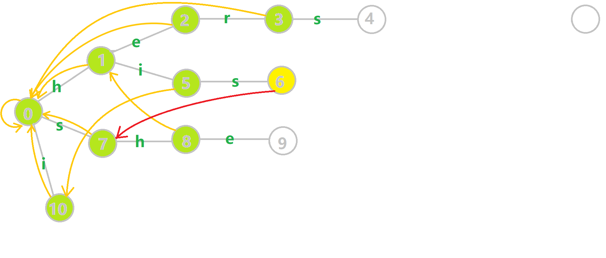
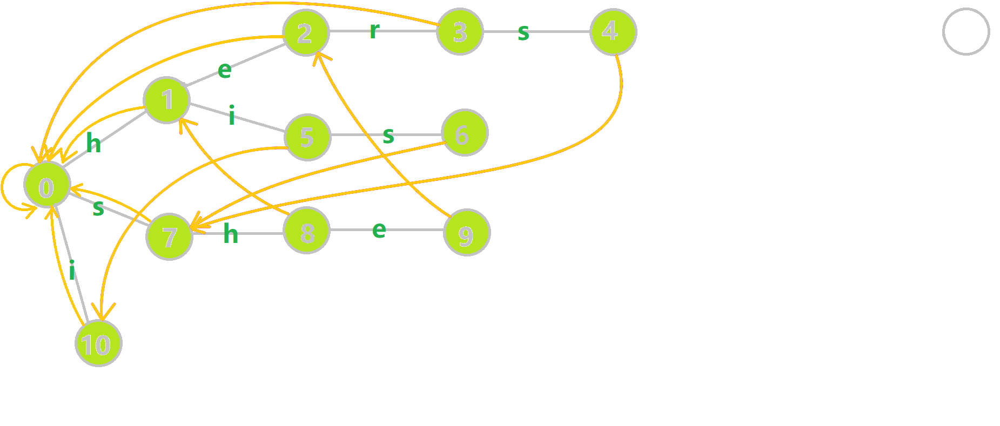
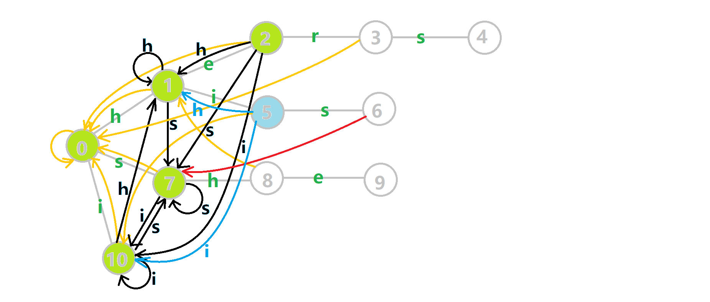
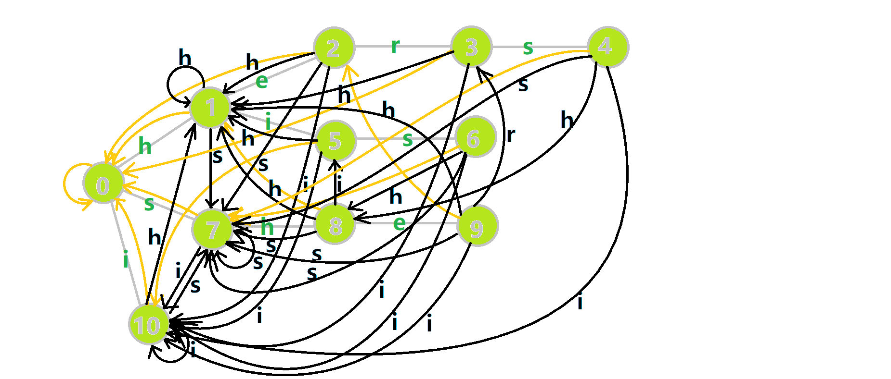

我知道，很多人在第一次看到这个东西的时侯是非常兴奋的。（别问我为什么知道）不过这个自动机啊它叫作 `Automaton` ，不是 `Automation` ，让萌新失望啦。切入正题。似乎在初学自动机相关的内容时，许多人难以建立对自动机的初步印象，尤其是在自学的时侯。而这篇文章就是为你们打造的。笔者在自学 AC 自动机后花费两天时间制作若干的 gif，呈现出一个相对直观的自动机形态。尽管这个图似乎不太可读，但这绝对是在作者自学的时侯，画得最~~妙不可读~~的 gif 了。另外有些小伙伴问这个 gif 拿什么画的。笔者用 Windows 画图软件制作。

## 概述

AC 自动机是 **以 TRIE 的结构为基础** ，结合 **KMP 的思想** 建立的。

简单来说，建立一个 AC 自动机有两个步骤：

1.  基础的 TRIE 结构：将所有的模式串构成一棵 $Trie$ 。
2.  KMP 的思想：对 $Trie$ 树上所有的结点构造失配指针。

然后就可以利用它进行多模式匹配了。

## 字典树构建

AC 自动机在初始时会将若干个模式串丢到一个 TRIE 里，然后在 TRIE 上建立 AC 自动机。这个 TRIE 就是普通的 TRIE，该怎么建怎么建。

这里需要仔细解释一下 TRIE 的结点的含义，尽管这很小儿科，但在之后的理解中极其重要。TRIE 中的结点表示的是某个模式串的前缀。我们在后文也将其称作状态。一个结点表示一个状态，TRIE 的边就是状态的转移。

形式化地说，对于若干个模式串 $s_1,s_2\dots s_n$ ，将它们构建一棵字典树后的所有状态的集合记作 $Q$ 。

## 失配指针

AC 自动机利用一个 fail 指针来辅助多模式串的匹配。

状态 $u$ 的 fail 指针指向另一个状态 $v$ ，其中 $v\in Q$ ，且 $v$ 是 $u$ 的最长后缀（即在若干个后缀状态中取最长的一个作为 fail 指针）。对于学过 KMP 的朋友，我在这里简单对比一下这里的 fail 指针与 KMP 中的 next 指针：

1.  共同点：两者同样是在失配的时候用于跳转的指针。
2.  不同点：next 指针求的是最长 Border（即最长的相同前后缀），而 fail 指针指向所有模式串的前缀中匹配当前状态的最长后缀。

因为 KMP 只对一个模式串做匹配，而 AC 自动机要对多个模式串做匹配。有可能 fail 指针指向的结点对应着另一个模式串，两者前缀不同。

没看懂上面的对比不要急（也许我的脑回路和泥萌不一样是吧），你只需要知道，AC 自动机的失配指针指向当前状态的最长后缀状态即可。

AC 自动机在做匹配时，同一位上可匹配多个模式串。

### 构建指针

下面介绍构建 fail 指针的 **基础思想** ：（强调！基础思想！基础！）

构建 fail 指针，可以参考 KMP 中构造 Next 指针的思想。

考虑字典树中当前的结点 $u$ ， $u$ 的父结点是 $p$ ， $p$ 通过字符 `c` 的边指向 $u$ ，即 $trie[p,c]=u$ 。假设深度小于 $u$ 的所有结点的 fail 指针都已求得。

1.  如果 $trie[fail[p],c]$ 存在：则让 u 的 fail 指针指向 $trie[fail[p],c]$ 。相当于在 $p$ 和 $fail[p]$ 后面加一个字符 `c` ，分别对应 $u$ 和 $fail[u]$ 。
2.  如果 $trie[fail[p],c]$ 不存在：那么我们继续找到 $trie[fail[fail[p]],c]$ 。重复 1 的判断过程，一直跳 fail 指针直到根结点。
3.  如果真的没有，就让 fail 指针指向根结点。

如此即完成了 $fail[u]$ 的构建。

### 例子

下面放一张 GIF 帮助大家理解。对字符串 `i`  `he`  `his`  `she`  `hers` 组成的字典树构建 fail 指针：

1.  黄色结点：当前的结点 $u$ 。
2.  绿色结点：表示已经 BFS 遍历完毕的结点，
3.  橙色的边：fail 指针。
4.  红色的边：当前求出的 fail 指针。


我们重点分析结点 6 的 fail 指针构建：



找到 6 的父结点 5， $fail[5]=10$ 。然而 10 结点没有字母 `s` 连出的边；继续跳到 10 的 fail 指针， $fail[10]=0$ 。发现 0 结点有字母 `s` 连出的边，指向 7 结点；所以 $fail[6]=7$ 。最后放一张建出来的图



## 字典树与字典图

我们直接上代码吧。字典树插入的代码就不分析了（后面完整代码里有），先来看构建函数 `build()` ，该函数的目标有两个，一个是构建 fail 指针，一个是构建自动机。参数如下：

1.   `tr[u,c]` 这个有两者理解方式。我们可以简单理解为字典树上的一条边，即 $trie[u,c]$ ；也可以理解为从状态（结点） $u$ 后加一个字符 `c` 到达的状态（结点），即一个状态转移函数 $trans(u,c)$ 。下文中我们将用第二种理解方式继续讲解。
2.   `q` 队列，用于 BFS 遍历字典树。
3.   `fail[u]` 结点 $u$ 的 fail 指针。

```cpp
void build() {
  for (int i = 0; i < 26; i++)
    if (tr[0][i]) q.push(tr[0][i]);
  while (q.size()) {
    int u = q.front();
    q.pop();
    for (int i = 0; i < 26; i++) {
      if (tr[u][i])
        fail[tr[u][i]] = tr[fail[u]][i], q.push(tr[u][i]);
      else
        tr[u][i] = tr[fail[u]][i];
    }
  }
}
```

为~~关爱萌新~~，笔者大力~~复读~~一下代码：Build 函数将结点按 BFS 顺序入队，依次求 fail 指针。这里的字典树根结点为 0，我们将根结点的子结点一一入队。若将根结点入队，则在第一次 BFS 的时候，会将根结点儿子的 fail 指针标记为本身。因此我们将根结点的儿子。

然后开始 BFS：每次取出队首的结点 u。fail[u]指针已经求得，我们要求 u 的子结点们的 fail 指针。然后遍历字符集（这里是 0-25，对应 a-z）：

1.  如果 $trans(u,i)$ 存在，我们就将 $trans(u,i)$ 的 fail 指针赋值为 $trans(fail[u],i)$ 。这里似乎有一个问题。根据之前的讲解，我们应该用 while 循环，不停的跳 fail 指针，判断是否存在字符 `i` 对应的结点，然后赋值。不过在代码中我们一句话就做完这件事了。
2.  否则， $trans(u,i)$ 不存在，就让 $trans(u,i)$ 指向 $trans(fail[u],i)$ 的状态。

接下来解答一下上文提出的问题。细心的同学会发现， `else` 语句的代码会修改字典树的结构。没错，它将不存在的字典树的状态链接到了失配指针的对应状态。在原字典树中，每一个结点代表一个字符串 $S$ ，是某个模式串的前缀。而在修改字典树结构后，尽管增加了许多转移关系，但结点（状态）所代表的字符串是不变的。

而 $trans(S,c)$ 相当于是在 $S$ 后添加一个字符 `c` 变成另一个状态 $S'$ 。如果 $S'$ 存在，说明存在一个模式串的前缀是 $S'$ ，否则我们让 $trans(S,c)$ 指向 $trans(fail[S],c)$ 。由于 $fail[S]$ 对应的字符串是 $S$ 的后缀，因此 $trans(fail[S],c)$ 对应的字符串也是 $S'$ 的后缀。

换言之在 TRIE 上跳转的时侯，我们只会从 $S$ 跳转到 $S'$ ，相当于匹配了一个 $S'$ ；但在 AC 自动机上跳转的时侯，我们会从 $S$ 跳转到 $S'$ 的后缀，也就是说我们匹配一个字符 `c` ，然后舍弃 $S$ 的部分前缀。舍弃前缀显然是能匹配的。那么 fail 指针呢？它也是在舍弃前缀啊！试想一下，如果文本串能匹配 $S$ ，显然它也能匹配 $S$ 的后缀。所谓的 fail 指针其实就是 $S$ 的一个后缀集合。

这样修改字典树的结构，使得匹配转移更加完善。同时它将 fail 指针跳转的路径做了压缩（就像并查集的路径压缩），使得本来需要跳很多次 fail 指针变成跳一次。

好的，我知道大家都受不了长篇叙述。上图！我们将之前的 GIF 图改一下：


1.  蓝色结点：BFS 遍历到的结点 u
2.  蓝色的边：当前结点下，AC 自动机修改字典树结构连出的边。
3.  黑色的边：AC 自动机修改字典树结构连出的边。
4.  红色的边：当前结点求出的 fail 指针
5.  黄色的边：fail 指针
6.  灰色的边：字典树的边

可以发现，众多交错的黑色边将字典树变成了 **字典图** 。图中省 s 略了连向根结点的黑边（否则会更乱）。我们重点分析一下结点 5 遍历时的情况，~~再妙不可读也请大家硬着头皮去读~~。我们求 $trans(5,\text{ s })=6$ 的 fail 指针：



本来的策略是找 fail 指针，于是我们跳到 $fail[5]=10$ 发现没有 `s` 连出的字典树的边，于是跳到 $fail[10]=0$ ，发现有 $trie[0,\text{ s }]=7$ ，于是 $fail[6]=7$ ；但是有了黑边、蓝边，我们跳到 $fail[5]=10$ 之后直接走 $trans(10,\text{ s })=7$ 就走到 $7$ 号结点了。~~其实我知道没人会仔细看这鬼扯的两张图片的 QAQ~~

这就是 build 完成的两件事：构建 fail 指针和建立字典图。这个字典图也会在查询的时候起到关键作用。

## 多模式匹配

接下来分析匹配函数 `query()` ：

```cpp
int query(char *t) {
  int u = 0, res = 0;
  for (int i = 1; t[i]; i++) {
    u = tr[u][t[i] - 'a'];  // 转移
    for (int j = u; j && e[j] != -1; j = fail[j]) {
      res += e[j], e[j] = -1;
    }
  }
  return res;
}
```

声明 $u$ 作为字典树上当前匹配到的结点， $res$ 即返回的答案。循环遍历匹配串， $u$ 在字典树上跟踪当前字符。利用 fail 指针找出所有匹配的模式串，累加到答案中。然后清 0。对 $e[j]$ 取反的操作用来判断 $e[j]$ 是否等于 -1。在上文中我们分析过，字典树的结构其实就是一个 $trans$ 函数，而构建好这个函数后，在匹配字符串的过程中，我们会舍弃部分前缀达到最低限度的匹配。fail 指针则指向了更多的匹配状态。最后上一份图。对于刚才的自动机：



我们从根结点开始尝试匹配 `ushersheishis` ，那么 p 的变化将是：


1.  红色结点：p 结点
2.  粉色箭头：p 在自动机上的跳转，
3.  蓝色的边：成功匹配的模式串
4.  蓝色结点：示跳 fail 指针时的结点（状态）。

## 总结

~~希望~~大家看懂了文章。其实总结一下，你只需要知道 AC 自动机的板子很好背就行啦。

时间复杂度：AC 自动机的时间复杂度在需要找到所有匹配位置时是 $O(|s|+m)$ ，其中 $|s|$ 表示文本串的长度， $m$ 表示模板串的总匹配次数；而只需要求是否匹配时时间复杂度为 $O(|s|)$ 。

???+ note "模板 1"
     [LuoguP3808【模板】AC 自动机（简单版）](https://www.luogu.org/problemnew/show/P3808) 

    ```cpp
    #include <bits/stdc++.h>
    using namespace std;
    const int N = 1e6 + 6;
    int n;

    namespace AC {
    int tr[N][26], tot;
    int e[N], fail[N];
    void insert(char *s) {
      int u = 0;
      for (int i = 1; s[i]; i++) {
        if (!tr[u][s[i] - 'a']) tr[u][s[i] - 'a'] = ++tot;
        u = tr[u][s[i] - 'a'];
      }
      e[u]++;
    }
    queue<int> q;
    void build() {
      for (int i = 0; i < 26; i++)
        if (tr[0][i]) q.push(tr[0][i]);
      while (q.size()) {
        int u = q.front();
        q.pop();
        for (int i = 0; i < 26; i++) {
          if (tr[u][i])
            fail[tr[u][i]] = tr[fail[u]][i], q.push(tr[u][i]);
          else
            tr[u][i] = tr[fail[u]][i];
        }
      }
    }
    int query(char *t) {
      int u = 0, res = 0;
      for (int i = 1; t[i]; i++) {
        u = tr[u][t[i] - 'a'];  // 转移
        for (int j = u; j && e[j] != -1; j = fail[j]) {
          res += e[j], e[j] = -1;
        }
      }
      return res;
    }
    }  // namespace AC

    char s[N];
    int main() {
      scanf("%d", &n);
      for (int i = 1; i <= n; i++) scanf("%s", s + 1), AC::insert(s);
      scanf("%s", s + 1);
      AC::build();
      printf("%d", AC::query(s));
      return 0;
    }
    ```

???+ note "模板 2"
     [P3796 【模板】AC 自动机（加强版）](https://www.luogu.org/problemnew/show/P3796) 

    ```cpp
    #include <bits/stdc++.h>
    using namespace std;
    const int N = 156, L = 1e6 + 6;
    namespace AC {
    const int SZ = N * 80;
    int tot, tr[SZ][26];
    int fail[SZ], idx[SZ], val[SZ];
    int cnt[N];  // 记录第 i 个字符串的出现次数
    void init() {
      memset(fail, 0, sizeof(fail));
      memset(tr, 0, sizeof(tr));
      memset(val, 0, sizeof(val));
      memset(cnt, 0, sizeof(cnt));
      memset(idx, 0, sizeof(idx));
      tot = 0;
    }
    void insert(char *s, int id) {  // id 表示原始字符串的编号
      int u = 0;
      for (int i = 1; s[i]; i++) {
        if (!tr[u][s[i] - 'a']) tr[u][s[i] - 'a'] = ++tot;
        u = tr[u][s[i] - 'a'];
      }
      idx[u] = id;
    }
    queue<int> q;
    void build() {
      for (int i = 0; i < 26; i++)
        if (tr[0][i]) q.push(tr[0][i]);
      while (q.size()) {
        int u = q.front();
        q.pop();
        for (int i = 0; i < 26; i++) {
          if (tr[u][i])
            fail[tr[u][i]] = tr[fail[u]][i], q.push(tr[u][i]);
          else
            tr[u][i] = tr[fail[u]][i];
        }
      }
    }
    int query(char *t) {  // 返回最大的出现次数
      int u = 0, res = 0;
      for (int i = 1; t[i]; i++) {
        u = tr[u][t[i] - 'a'];
        for (int j = u; j; j = fail[j]) val[j]++;
      }
      for (int i = 0; i <= tot; i++)
        if (idx[i]) res = max(res, val[i]), cnt[idx[i]] = val[i];
      return res;
    }
    }  // namespace AC
    int n;
    char s[N][100], t[L];
    int main() {
      while (~scanf("%d", &n)) {
        if (n == 0) break;
        AC::init();
        for (int i = 1; i <= n; i++) scanf("%s", s[i] + 1), AC::insert(s[i], i);
        AC::build();
        scanf("%s", t + 1);
        int x = AC::query(t);
        printf("%d\n", x);
        for (int i = 1; i <= n; i++)
          if (AC::cnt[i] == x) printf("%s\n", s[i] + 1);
      }
      return 0;
    }
    ```

## 拓展

### 确定有限状态自动机

如果大家理解了上面的讲解，那么做为拓展延伸，文末我们简单介绍一下自动机与 KMP 自动机。（现在你再去看百科上自动机的定义就会好懂很多啦）

有限状态自动机（deterministic finite automaton，DFA）是由

1.  状态集合 $Q$ ；
2.  字符集 $\Sigma$ ；
3.  状态转移函数 $\delta:Q\times \Sigma \to Q$ ，即 $\delta(q,\sigma)=q',\ q,q'\in Q,\sigma\in \Sigma$ ；
4.  一个开始状态 $s\in Q$ ；
5.  一个接收的状态集合 $F\subseteq Q$ 。

组成的五元组 $(Q,\Sigma,\delta,s,F)$ 。

那这东西你用 AC 自动机理解，状态集合就是字典树（图）的结点；字符集就是 `a` 到 `z` （或者更多）；状态转移函数就是 $trans(u,c)$ 的函数（即 `tr[u,c]` ）；开始状态就是字典树的根结点；接收状态就是你在字典树中标记的字符串结尾结点组成的集合。

### KMP 自动机

KMP 自动机就是一个不断读入待匹配串，每次匹配时走到接受状态的 DFA。如果共有 $m$ 个状态，第 $i$ 个状态表示已经匹配了前 $i$ 个字符。那么我们定义 $trans_{i,c}$ 表示状态 $i$ 读入字符 $c$ 后到达的状态， $next_{i}$ 表示 [prefix function](/string/prefix-function) ，则有：

$$
trans_{i,c} =
\begin{cases}
i + 1,  & \text{if $b_{i} = c$} \\[2ex]
trans_{next_{i},c}, & \text{else}
\end{cases}
$$

（约定 $next_{0}=0$ ）

我们发现 $trans_{i}$ 只依赖于之前的值，所以可以跟 [KMP](/string/prefix-function/#knuth-morris-pratt) 一起求出来。

时间和空间复杂度： $O(m|\Sigma|)$ 。一些细节：走到接受状态之后立即转移到该状态的 $next$ 。

对比之下，AC 自动机其实就是 Trie 上的自动机。（虽然一开始丢给你这句话可能不知所措）
