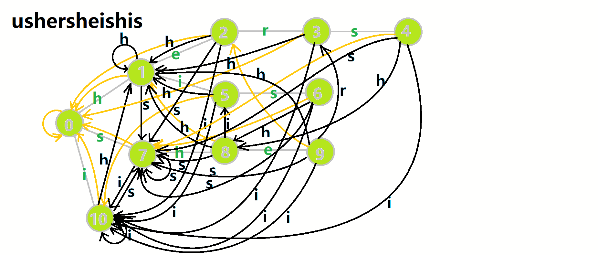

author: iamtwz, Marcythm, 383494, abc1763613206, aofall, Chrogeek, CoelacanthusHex, Dafenghh, DanJoshua, Enter-tainer, GavinZhengOI, Gesrua, Henry-ZHR, Ir1d, kenlig, ksyx, lyccrius, Menci, opsiff, orzAtalod, ouuan, partychicken, Persdre, qq2964, Ruakker, shuzhouliu, sshwy, StudyingFather, szdytom, Tiphereth-A, Xeonacid, ZXyaang, rickyxrc, XuYueming520

## 概述

AC 自动机是 **以 Trie 的结构为基础**，结合 **KMP 的思想** 建立的自动机，用于解决多模式匹配等任务。

AC 自动机本质上是 Trie 上的自动机。

在阅读本文之前，请先阅读 [KMP](./kmp.md) 和 [Trie](./trie.md)。

## 解释

简单来说，建立一个 AC 自动机有两个步骤：

1.  基础的 Trie 结构：将所有的模式串构成一棵 Trie；
2.  KMP 的思想：对 Trie 树上所有的结点构造失配指针。

建立完毕后，就可以利用它进行多模式匹配。

## 字典树构建

AC 自动机在初始时会将若干个模式串插入到一个 Trie 里，然后在 Trie 上建立 AC 自动机。这个 Trie 就是普通的 Trie，按照 Trie 原本的建树方法建树即可。

需要注意的是，Trie 中的结点表示的是某个模式串的前缀。我们在后文也将其称作状态。一个结点表示一个状态，Trie 的边就是状态的转移。

形式化地说，对于若干个模式串 $s_1,s_2\dots s_n$，将它们构建一棵字典树后的所有状态的集合记作 $Q$。

## 失配指针

AC 自动机利用一个 fail 指针来辅助多模式串的匹配。

状态 $u$ 的 fail 指针指向另一个状态 $v$，其中 $v\in Q$，且 $v$ 是 $u$ 的最长后缀（即在若干个后缀状态中取最长的一个作为 fail 指针）。

fail 指针与 [KMP](./kmp.md) 中的 next 指针相比：

1.  共同点：两者同样是在失配的时候用于跳转的指针。
2.  不同点：next 指针求的是最长 Border（即最长的相同前后缀），而 fail 指针指向所有模式串的前缀中匹配当前状态的最长后缀。

因为 KMP 只对一个模式串做匹配，而 AC 自动机要对多个模式串做匹配。有可能 fail 指针指向的结点对应着另一个模式串，两者前缀不同。

总结下来，AC 自动机的失配指针指向当前状态的最长后缀状态。

注意：AC 自动机在做匹配时，同一位上可匹配多个模式串。

### 构建指针

下面介绍构建 fail 指针的 **基础思想**：

构建 fail 指针，可以参考 KMP 中构造 next 指针的思想。

考虑字典树中当前的结点 $u$，$u$ 的父结点是 $p$，$p$ 通过字符 $c$ 的边指向 $u$，即 $\operatorname{trie}(p, c)=u$。假设深度小于 $u$ 的所有结点的 fail 指针都已求得。

1.  如果 $\operatorname{trie}(\operatorname{fail}(p), c)$ 存在：则让 $u$ 的 fail 指针指向 $\operatorname{trie}(\operatorname{fail}(p), c)$。相当于在 $p$ 和 $\operatorname{fail}(p)$ 后面加一个字符 $c$，分别对应 $u$ 和 $\operatorname{fail}(u)$；
2.  如果 $\operatorname{trie}(\operatorname{fail}(p), c)$ 不存在：那么我们继续找到 $\operatorname{trie}(\operatorname{fail}(\operatorname{fail}(p)), c)$。重复判断过程，一直跳 fail 指针直到根结点；
3.  如果依然不存在，就让 fail 指针指向根结点。

如此即完成了 $\operatorname{fail}(u)$ 的构建。

### 例子

下面将使用若干张 GIF 动图来演示对字符串 $\mathtt{i}$、$\mathtt{he}$、$\mathtt{his}$、$\mathtt{she}$、$\mathtt{hers}$ 组成的字典树构建 fail 指针的过程：

1.  黄色结点：当前的结点 $u$。
2.  绿色结点：表示已经 BFS 遍历完毕的结点。
3.  橙色的边：fail 指针。
4.  红色的边：当前求出的 fail 指针。


我们重点分析结点 $6$ 的 fail 指针构建：


找到 $6$ 的父结点 $5$，$\operatorname{fail}(5)=10$。然而结点 $10$ 没有字母 $\mathtt{s}$ 连出的边；继续跳到 $10$ 的 fail 指针，$\operatorname{fail}(10)=0$。发现 $0$ 结点有字母 $\mathtt{s}$ 连出的边，指向 $7$ 结点；所以 $\operatorname{fail}(6)=7$。

下图展示了构建完毕的状态：


## 字典树与字典图

关注构建函数 `build`，该函数的目标有两个，一个是构建 fail 指针，一个是构建自动机。相关变量定义如下：

1.  `tr[u].son[c]`：有两种理解方式。我们可以简单理解为字典树上的一条边，即 $\operatorname{trie}(u, c)$；也可以理解为从状态（结点）$u$ 后加一个字符 $c$ 到达的状态（结点），即一个状态转移函数 $\operatorname{trans}(u, c)$。为了方便，下文中我们将用第二种理解方式。
2.  队列 `q`：用于 BFS 遍历字典树。
3.  `tr[u].fail`：结点 $u$ 的 fail 指针。

???+ note "实现"
    === "C++"
        ```cpp
        void build() {
          queue<int> q;
          for (int i = 0; i < 26; i++)
            if (tr[0].son[i]) q.push(tr[0].son[i]);
          while (!q.empty()) {
            int u = q.front();
            q.pop();
            for (int i = 0; i < 26; i++) {
              if (tr[u].son[i]) {
                tr[tr[u].son[i]].fail = tr[tr[u].fail].son[i];
                q.push(tr[u].son[i]);
              } else
                tr[u].son[i] = tr[tr[u].fail].son[i];
            }
          }
        }
        ```
    
    === "Python"
        ```python
        def build():
            for i in range(0, 26):
                if tr[0][i] != 0:
                    q.append(tr[0][i])
            while q:
                u = q.pop(0)
                for i in range(0, 26):
                    if tr[u][i] != 0:
                        fail[tr[u][i]] = tr[fail[u]][i]
                        q.append(tr[u][i])
                    else:
                        tr[u][i] = tr[fail[u]][i]
        ```

### 解释

`build` 函数将结点按 BFS 顺序入队，依次求 fail 指针。这里的字典树根结点为 $0$，我们将根结点的子结点一一入队。若将根结点入队，则在第一次 BFS 的时候，会将根结点儿子的 fail 指针标记为本身。因此我们将根结点的儿子一一入队，而不是将根结点入队。

然后开始 BFS：每次取出队首的结点 $u$（$\operatorname{fail}(u)$ 在之前的 BFS 过程中已求得），然后遍历字符集（这里是 $0 \sim 25$，对应 $\mathtt{a} \sim \mathtt{z}$，即 $u$ 的各个子结点）：

1.  如果 $\operatorname{trans}(u, c)$ 存在，我们就将 $\operatorname{trans}(u, c)$ 的 fail 指针赋值为 $\operatorname{trans}(\operatorname{fail}(u), c)$。根据之前的描述，我们应该用 `while` 循环，不停地跳 fail 指针，判断是否存在字符 $c$ 对应的结点，然后赋值，但此处通过特殊处理简化了这些代码，将在下文说明；
2.  否则，令 $\operatorname{trans}(u, c)$ 指向 $\operatorname{trans}(\operatorname{fail}(u), c)$ 的状态。

这里的处理是，通过 `else` 语句的代码修改字典树的结构，将不存在的字典树的状态链接到了失配指针的对应状态。在原字典树中，每一个结点代表一个字符串 $S$，是某个模式串的前缀。而在修改字典树结构后，尽管增加了许多转移关系，但结点（状态）所代表的字符串是不变的。

而 $\operatorname{trans}(S, c)$ 相当于是在 $S$ 后添加一个字符 $c$ 变成另一个状态 $S'$。如果 $S'$ 存在，说明存在一个模式串的前缀是 $S'$，否则我们让 $\operatorname{trans}(S, c)$ 指向 $\operatorname{trans}(\operatorname{fail}(S), c)$。由于 $\operatorname{fail}(S)$ 对应的字符串是 $S$ 的后缀，因此 $\operatorname{trans}(\operatorname{fail}(S), c)$ 对应的字符串也是 $S'$ 的后缀。

换言之在 Trie 上跳转的时侯，我们只会从 $S$ 跳转到 $S'$，相当于匹配了一个 $S'$；但在 AC 自动机上跳转的时侯，我们会从 $S$ 跳转到 $S'$ 的后缀，也就是说我们匹配一个字符 $c$，然后舍弃 $S$ 的部分前缀。舍弃前缀显然是能匹配的。同时如果文本串能匹配 $S$，显然它也能匹配 $S$ 的后缀，所以 fail 指针同样在舍弃前缀。所谓的 fail 指针其实就是 $S$ 的一个后缀集合。

Trie 的结点的孩子数组 `son` 还有另一种比较简单的理解方式：如果在位置 $u$ 失配，我们会跳转到 $\operatorname{fail}(u)$ 的位置。注意这会导致我们可能沿着 fail 数组跳转多次才能来到下一个能匹配的位置。所以我们可以用 `son` 直接记录记录下一个能匹配的位置，这样保证了程序的时间复杂度。

此处对字典树结构的修改，可以使得匹配转移更加完善。同时它将 fail 指针跳转的路径做了压缩，使得本来需要跳很多次 fail 指针变成跳一次。

### 过程

这里依然用若干张 GIF 动图展示构建过程：


1.  蓝色结点：BFS 遍历到的结点 $u$。
2.  蓝色的边：当前结点下，AC 自动机修改字典树结构连出的边。
3.  黑色的边：AC 自动机修改字典树结构连出的边。
4.  红色的边：当前结点求出的 fail 指针。
5.  黄色的边：fail 指针。
6.  灰色的边：字典树的边。

可以发现，众多交错的黑色边将字典树变成了 **字典图**。图中省略了连向根结点的黑边（否则会更乱）。我们重点分析一下结点 $5$ 遍历时的情况。我们求 $\operatorname{trans}[5, \mathtt{s}]=6$ 的 fail 指针：


本来的策略是找 fail 指针，于是我们跳到 $\operatorname{fail}(5)=10$ 发现没有 $\mathtt{s}$ 连出的字典树的边，于是跳到 $\operatorname{fail}(10)=0$，发现有 $\operatorname{trie}(0, \mathtt{s})=7$，于是 $\operatorname{fail}(6)=7$；但是有了黑边、蓝边，我们跳到 $\operatorname{fail}(5)=10$ 之后直接走 $\operatorname{trans}(10, \mathtt{s})=7$ 就走到 $7$ 号结点了。

这就是 `build` 完成的两件事：构建 fail 指针和建立字典图。这个字典图也会在查询的时候起到关键作用。

## 多模式匹配

接下来分析匹配函数 `query`：

### 实现

=== "C++"
    ```cpp
    int query(const char t[]) {
      int u = 0, res = 0;
      for (int i = 1; t[i]; i++) {
        u = tr[u].son[t[i] - 'a'];
        for (int j = u; j && tr[j].cnt != -1; j = tr[j].fail) {
          res += tr[j].cnt, tr[j].cnt = -1;
        }
      }
      return res;
    }
    ```

=== "Python"
    ```python
    def query(t: str) -> int:
        u, res = 0, 0
        for c in t:
            u = tr[u][c - ord("a")]
            j = u
            while j and e[j] != -1:
                res += e[j]
                e[j] = -1
                j = fail[j]
        return res
    ```

### 解释

这里 $u$ 作为字典树上当前匹配到的结点，`res` 即返回的答案。循环遍历匹配串，$u$ 在字典树上跟踪当前字符。利用 fail 指针找出所有匹配的模式串，并累加到答案中。然后将匹配到的串的出现次数清零，这样就不会重复统计同一个串。在上文中我们分析过，字典树的结构其实就是一个 trans 函数，而构建好这个函数后，在匹配字符串的过程中，我们会舍弃部分前缀达到最低限度的匹配。fail 指针则指向了更多的匹配状态。最后上一份图。对于刚才的自动机：


我们从根结点开始尝试匹配 $\mathtt{ushersheishis}$，那么 $p$ 的变化将是：



1.  红色结点：$p$ 结点。
2.  粉色箭头：$p$ 在自动机上的跳转。
3.  蓝色的边：成功匹配的模式串。
4.  蓝色结点：示跳 fail 指针时的结点（状态）。

## 效率优化

题目请参考洛谷 [P5357【模板】AC 自动机](https://www.luogu.com.cn/problem/P5357)。

因为我们的 AC 自动机中，每次匹配，会一直向 fail 边跳来找到所有的匹配，但是这样的效率较低，在某些题目中会超时。

那么需要如何优化呢？首先需要了解到 fail 指针的一个性质：一个 AC 自动机中，如果只保留 fail 边，那么剩余的图一定是一棵树。

这是显然的，因为 fail 不会成环，且深度一定比现在低，所以得证。

这样 AC 自动机的匹配就可以转化为在 fail 树上的链求和问题，只需要优化一下该部分就可以了。

这里提供两种思路。

### 拓扑排序优化

观察到时间主要浪费在在每次都要跳 fail。如果我们可以预先记录，最后一并求和，那么效率就会优化。

于是我们按照 fail 树，做一次内向树上的拓扑排序，就能一次性求出所有模式串的出现次数。

`build` 函数在原先的基础上，增加了入度统计一部分，为拓扑排序做准备。

???+ note "构建"
    ```cpp
    void build() {
      queue<int> q;
      for (int i = 0; i < 26; i++)
        if (tr[0].son[i]) q.push(tr[0].son[i]);
      while (!q.empty()) {
        int u = q.front();
        q.pop();
        for (int i = 0; i < 26; i++) {
          if (tr[u].son[i]) {
            tr[tr[u].son[i]].fail = tr[tr[u].fail].son[i];
            tr[tr[tr[u].fail].son[i]].du++;  // 入度计数
            q.push(tr[u].son[i]);
          } else
            tr[u].son[i] = tr[tr[u].fail].son[i];
        }
      }
    }
    ```

然后我们在查询的时候就可以只为找到结点的 `ans` 打上标记，在最后再用拓扑排序求出答案。

???+ note "查询"
    ```cpp
    void query(const char t[]) {
      int u = 0;
      for (int i = 1; t[i]; i++) {
        u = tr[u].son[t[i] - 'a'];
        tr[u].ans++;
      }
    }
    
    void topu() {
      queue<int> q;
      for (int i = 0; i <= tot; i++)
        if (tr[i].du == 0) q.push(i);
      while (!q.empty()) {
        int u = q.front();
        q.pop();
        ans[tr[u].idx] = tr[u].ans;
        int v = tr[u].fail;
        tr[v].ans += tr[u].ans;
        if (!--tr[v].du) q.push(v);
      }
    }
    ```

最后是主函数：

???+ note "主函数"
    ```cpp
    int main() {
      // do_something();
      AC::build();
      scanf("%s", s + 1);
      AC::query(s);
      AC::topu();
      for (int i = 1; i <= n; i++) printf("%d\n", AC::ans[idx[i]]);
      // do_another_thing();
    }
    ```

???+ note "完整代码"
    [Luogu P5357【模板】AC 自动机](https://www.luogu.com.cn/problem/P5357)
    
    ```cpp
    --8<-- "docs/string/code/ac-automaton/ac-automaton_topu.cpp"
    ```

### DFS 优化

和拓扑排序的思路接近，不过我们使用 DFS 来代替拓扑排序。其实这两种方法本质上是相同的，都是将 fail 树的子树求和。

完整代码请见总结模板 3。

## AC 自动机上 DP

这部分将以 [P2292 \[HNOI2004\] L 语言](https://www.luogu.com.cn/problem/P2292) 为例题讲解。

不难想到一个朴素的思路：建立 AC 自动机，在 AC 自动机上对于所有 fail 指针的子串转移，最后取最大值得到答案。

主要代码如下。若不熟悉代码中的类型定义，可以先看末尾的完整代码：

???+ note "查询部分主要代码"
    ```cpp
    int query(const char t[]) {
      int u = 0, len = strlen(t + 1);
      for (int i = 1; i <= len; i++) dp[i] = 0;
      for (int i = 1; i <= len; i++) {
        u = tr[u].son[t[i] - 'a'];
        for (int j = u; j; j = tr[j].fail) {
          if (tr[j].idx && (dp[i - tr[j].depth] || i - tr[j].depth == 0)) {
            dp[i] = dp[i - tr[j].depth] + tr[j].depth;
          }
        }
      }
      int ans = 0;
      for (int i = 1; i <= len; i++) ans = std::max(ans, dp[i]);
      return ans;
    }
    ```

但是这样的思路复杂度不是线性（因为要跳每个结点的 fail），会在第二个子任务中超时，所以我们需要进行优化。

我们再看看题目的特殊性质，我们发现所有单词的长度只有 $20$，所以可以想到状态压缩优化。

我们发现，目前的时间瓶颈主要在跳 fail 这一步，如果我们可以将这一步优化到 $O(1)$，就可以保证整个问题在严格线性的时间内被解出。

我们可以将前 $20$ 位字母中，可能的子串长度存下来，并压缩到状态中，存在每个子结点中。

那么我们在 `build` 的时候就可以这么写：

???+ note "构建 fail 指针"
    ```cpp
    void build() {
      queue<int> q;
      for (int i = 0; i < 26; i++)
        if (tr[0].son[i]) {
          q.push(tr[0].son[i]);
          tr[tr[0].son[i]].depth = 1;
        }
      while (!q.empty()) {
        int u = q.front();
        q.pop();
        int v = tr[u].fail;
        // 对状态的更新在这里
        tr[u].stat = tr[v].stat;
        if (tr[u].idx) tr[u].stat |= 1 << tr[u].depth;
        for (int i = 0; i < 26; i++) {
          if (tr[u].son[i]) {
            tr[tr[u].son[i]].fail = tr[tr[u].fail].son[i];
            tr[tr[u].son[i]].depth = tr[u].depth + 1;  // 记录深度
            q.push(tr[u].son[i]);
          } else
            tr[u].son[i] = tr[tr[u].fail].son[i];
        }
      }
    }
    ```

然后查询时就可以去掉跳 fail 的循环，将代码简化如下：

???+ note "查询"
    ```cpp
    int query(const char t[]) {
      int u = 0, mx = 0;
      unsigned st = 1;
      for (int i = 1; t[i]; i++) {
        u = tr[u].son[t[i] - 'a'];
        st <<= 1;  // 往下跳了一位每一位的长度都+1
        if (tr[u].stat & st) st |= 1, mx = i;
      }
      return mx;
    }
    ```

我们的 `tr[u].stat` 维护的是从结点 $u$ 开始，整条 fail 链上的长度集（因为长度集小于 $32$ 所以不影响），而 `st` 则维护的是查询字符串走到现在，前 $32$ 位（因为状态压缩自然溢出）的长度集。

`&` 运算后结果不为 $0$，则代表两个长度集的交集非空，我们此时就找到了一个匹配。

???+ note "完整代码"
    [P2292 \[HNOI2004\] L 语言](https://www.luogu.com.cn/problem/P2292)
    
    ```cpp
    --8<-- "docs/string/code/ac-automaton/ac_automaton_luoguP2292.cpp"
    ```

## 总结

时间复杂度：定义 $|s_i|$ 是模板串的长度，$|S|$ 是文本串的长度，$|\Sigma|$ 是字符集的大小（常数，一般为 $26$）。如果连了 trie 图，时间复杂度就是 $O(\sum|s_i|+n|\Sigma|+|S|)$，其中 $n$ 是 AC 自动机中结点的数目，并且最大可以达到 $O(\sum|s_i|)$。如果不连 trie 图，并且在构建 fail 指针的时候避免遍历到空儿子，时间复杂度就是 $O(\sum|s_i|+|S|)$。

???+ note "模板 1"
    [Luogu P3808 AC 自动机（简单版）](https://www.luogu.com.cn/problem/P3808)
    
    ```cpp
    --8<-- "docs/string/code/ac-automaton/ac-automaton_1.cpp"
    ```

???+ note "模板 2"
    [Luogu P3796 AC 自动机（简单版 II）](https://www.luogu.com.cn/problem/P3796)
    
    ```cpp
    --8<-- "docs/string/code/ac-automaton/ac-automaton_2.cpp"
    ```

???+ note "模版 3"
    [Luogu P5357【模板】AC 自动机](https://www.luogu.com.cn/problem/P5357)
    
    ```cpp
    --8<-- "docs/string/code/ac-automaton/ac-automaton_3.cpp"
    ```

## 拓展

### 确定有限状态自动机

作为拓展延伸，文末我们简单介绍一下 [自动机](./automaton.md) 与 [KMP 自动机](./kmp.md)。

有限状态自动机（Deterministic Finite Automaton，DFA）是由

1.  状态集合 $Q$。
2.  字符集 $\Sigma$。
3.  状态转移函数 $\delta:Q\times \Sigma \to Q$，即 $\delta(q,\sigma)=q',\ q,q'\in Q,\sigma\in \Sigma$。
4.  一个开始状态 $s\in Q$。
5.  一个接收的状态集合 $F\subseteq Q$。

组成的五元组 $(Q,\Sigma,\delta,s,F)$。

如果用 AC 自动机理解，状态集合就是字典树（图）的结点；字符集就是 $\mathtt{a}$ 到 $\mathtt{z}$（或者更多）；状态转移函数就是 $\operatorname{trans}(u, c)$；开始状态就是字典树的根结点；接收状态就是你在字典树中标记的字符串结尾结点组成的集合。

### KMP 自动机

KMP 自动机就是一个不断读入待匹配串，每次匹配时走到接受状态的 DFA。如果共有 $m$ 个状态，第 $i$ 个状态表示已经匹配了前 $i$ 个字符。我们定义 $\operatorname{trans}(i, c)$ 表示状态 $i$ 读入字符 $c$ 后到达的状态，$\operatorname{next}(i)$ 表示 [prefix function](./kmp.md)，则有：

$$
\operatorname{trans}(i, c) =
\begin{cases}
i + 1                                           & \text{if }b_{i} = c \\[2ex]
\operatorname{trans}(\operatorname{next}(i), c) & \text{otherwise}
\end{cases}
$$

（约定 $\operatorname{next}(0)=0$。）

我们发现 $\operatorname{trans}(i, c)$ 只依赖于之前的值，所以可以跟 [KMP](./kmp.md) 一起求出来。

需要注意走到接受状态之后应该立即转移到该状态的 next。

时间和空间复杂度：$O(m|\Sigma|)$。
