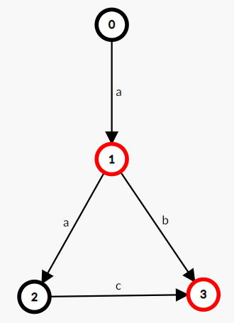

在 OI 中，我们所说的“自动机”一般都指“确定有限状态自动机”。

## 定义

一个 **确定有限状态自动机（DFA）** 由以下五部分构成：

1.   **字符集** （ $\Sigma$ ），该自动机只能输入这些字符。
2.   **状态集合** （ $Q$ ）。如果把一个 DFA 看成一张有向图，那么 DFA 中的状态就相当于图上的顶点。
3.   **起始状态** （ $start$ ）， $start\in Q$ ，是一个特殊的状态。起始状态一般用 $s$ 表示，为了避免混淆，本文中使用 $start$ 。
4.   **接受状态集合** （ $F$ ）， $F\subseteq Q$ ，是一组特殊的状态。
5.   **转移函数** （ $\delta$ ）， $\delta$ 是一个接受两个参数返回一个值的函数，其中第一个参数和返回值都是一个状态，第二个参数是字符集中的一个字符。如果把一个 DFA 看成一张有向图，那么 DFA 中的转移函数就相当于顶点间的边，而每条边上都有一个字符。

DFA 的作用就是识别字符串，一个自动机 $A$ ，若它能识别（接受）字符串 $S$ ，那么 $A(S)=True$ ，否则 $A(S)=False$ 。

当一个 DFA 读入一个字符串时，从初始状态起按照转移函数一个一个字符地转移。如果读入完一个字符串的所有字符后位于一个接受状态，那么我们称这个 DFA **接受** 这个字符串，反之我们称这个 DFA **不接受** 这个字符串。

如果一个状态 $v$ 没有字符 $c$ 的转移，那么我们令 $\delta(v,c)=null$ ，而 $null$ 只能转移到 $null$ ，且 $null$ 不属于接受状态集合。无法转移到任何一个接受状态的状态都可以视作 $null$ ，或者说， $null$ 代指所有无法转移到任何一个接受状态的状态。

我们扩展定义转移函数 $\delta$ ，令其第二个参数可以接收一个字符串： $\delta(v,s)=\delta(\delta(v,s[1]),s[2..|s|])$ ，扩展后的转移函数就可以表示从一个状态起接收一个字符串后转移到的状态。那么， $A(s)=[\delta(start,s)\in F]$ 。

如，一个接受且仅接受字符串 "a", "ab", "aac" 的 DFA：

## OI 中常用的自动机

### 字典树

 [字典树](./trie.md) 是大部分 OIer 接触到的第一个自动机，接受且仅接受指定的字符串集合中的元素。

转移函数就是 Trie 上的边，接受状态是将每个字符串插入到 Trie 时到达的那个状态。

### KMP 自动机

 [KMP 算法](./kmp.md) 可以视作自动机，基于字符串 $s$ 的 KMP 自动机接受且仅接受以 $s$ 为后缀的字符串，其接受状态为 $|s|$ 。

转移函数：

$$
\delta(i, c)=
\begin{cases}
i+1&s[i+1]=c\\
0&s[1]\ne c\land i=0\\
\delta(\pi(i),c)&s[i+1]\ne c\land i>0
\end{cases}
$$

### AC 自动机

 [AC 自动机](./ac-automaton.md) 接受且仅接受以指定的字符串集合中的某个元素为后缀的字符串。也就是 Trie + KMP。

### 后缀自动机

 [后缀自动机](./sam.md) 接受且仅接受指定字符串的后缀。

### 广义后缀自动机

 [广义后缀自动机](./general-sam.md) 接受且仅接受指定的字符串集合中的某个元素的后缀。也就是 Trie + SAM。

广义 SAM 与 SAM 的关系就是 AC 自动机与 KMP 自动机的关系。

### 回文自动机

 [回文自动机](./pam.md) 比较特殊，它不能非常方便地定义为自动机。

如果需要定义的话，它接受且仅接受某个字符串的所有回文子串的 **中心及右半部分** 。

“中心及右边部分”在奇回文串中就是字面意思，在偶回文串中定义为一个特殊字符加上右边部分。这个定义看起来很奇怪，但它能让 PAM 真正成为一个自动机，而不仅是两棵树。

### 序列自动机

 [序列自动机](./seq-automaton.md) 接受且仅接受指定字符串的子序列。

## 后缀链接

由于自动机和匹配有着密不可分的关系，而匹配的一个基本思想是“这个串不行，就试试它的后缀可不可以”，所以在很多自动机（KMP、AC 自动机、SAM、PAM）中，都有后缀链接的概念。

一个状态会对应若干字符串，而这个状态的后缀链接，是在自动机上的、是这些字符串的公共真后缀的字符串中，最长的那一个。

一般来讲，后缀链接会形成一棵树，并且不同自动机的后缀链接树有着一些相同的性质，学习时可以加以注意。

## 扩展阅读

在计算复杂性领域中，自动机是一个经典的模型。并且，自动机与正则语言有着密不可分的关系。

如果对相关内容感兴趣的话，推荐阅读博客 [计算复杂性（1) Warming Up: 自动机模型](https://lingeros-tot.github.io/2019/03/05/Warming-Up-自动机模型/) 。
