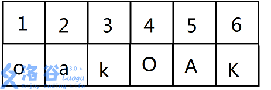
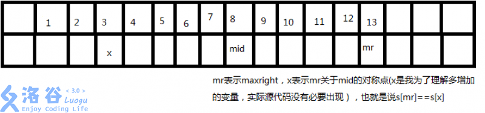

## 前言

马拉车算法（Manacher's algorithm）是一个求一个字符串中最长回文连续子序列的算法

## 正文

[【模板】manacher 算法](https://www.luogu.org/problemnew/show/P3805)

题意是求 S 中的最长回文串

最暴力的做法当然是枚举 l 和 r，对于每个 l 和 r 求遍历一遍判断是否为回文

时间复杂度达到$O(n^3)$，显然做不了这题

在这个基础上稍微优化一下，也是很显然的做法：长度为奇数回文串以最中间字符的位置为对称轴左右对称，而长度为偶数的回文串的对称轴在中间两个字符之间的空隙。可以遍历这些对称轴，在每个对称轴上同时向左和向右扩展，直到左右两边的字符不同或者到达边界。

这样的复杂度是$O(n^2)$，还是过不了

观察数据范围，$S.length()\leq11000000$，应该需要一个$O(n)$及以下的算法

dalao 云

> 暴力算法的优化是信息的利用和对重复搜索的去重

我们考虑如何利用这里的重复信息

第一种解法，是直接暴力计算

而第二种解法，是利用字符串对称的性质，把枚举端点变成枚举中点，少了一个循环，优化掉$O(n)$的复杂度

我们所求的$O(n)$算法，是不是能由第二种解法再利用一次字符串对称的性质得来呢？

观察下面的字符串:

$O A K A B A K A B A O A K$

其中的最长回文串为$ABAKABA$，若使用第二种解法，有什么可以不计算的呢？

相信很容易猜到，一个回文串的左半边有一个回文串，那它的右半边也有一个，那么我们对这个回文串的计算显然可以略去

扩展到一般性质，若一个回文串里包含着另一个回文串，那这个回文串的另一边必然存在另一个与它一模一样的回文串!

由此我们来改进第二种算法

这个$O(n^2)$算法有什么缺点呢?

1. 回文串长度的奇偶性造成了对称轴的位置可能在某字符上，也可能在两个字符之间的空隙处，要对两种情况分别处理

如何解决？我们可以强行在原字符串中插入其他本字符串不会出现的字符，如 "#"

也就是说，若原来的字符串是这样



那么我们把它改成这样


关于这部分的代码：

```cpp
inline void change() {
	s[0]=s[1]='#';
	for(int i=0; i<n; i++) {
		s[i*2+2]=a[i];
		s[i*2+3]='#';
	}
	n=n*2+2;
	s[n]=0;
}
```

这样我们就可以直接以每个字符为对称轴进行扩展了

2. 会出现很多子串被重复多次访问，时间效率大幅降低。

这个就是我们刚刚提出的优化了。

我们用一个辅助数组$hw_i$表示$i$点能够扩展出的回文长度

我们先设置一个辅助变量$maxright$，表示已经触及到的最右边的字符

以及一个辅助变量$mid$，表示包含$maxright$的回文串的对称轴所在的位置

也就是这样：



当 i 在 maxright 左边且在 mid 右边时：

设 i 关于 mid 的对称点为 j，显然$hw_i$一定不会小于$hw_j$。

我们没必要保存 j，j 可以通过计算得出，为$mid+(mid-i)=(mid\times2)-i$

那么我们就将$hw_i$设为$hw_j$，从$i+hw_i$开始扩展（利用已知信息），这样就可以较快地求出 hw[i]，然后重新 maxright 和 mid

当$i$在$maxright$右边时，我们无法得知关于$hw_i$的信息，只好从 1 开始遍历，然后更新$maxright$和$mid$

这部分的代码也是非常简短的:

```cpp
inline void manacher() {
	int maxright=0,mid;
	for(int i=1; i<n; i++) {
		if(i<maxright)
			hw[i]=min(hw[(mid<<1)-i],hw[mid]+mid-i);
		else
			hw[i]=1;
        while(s[i+hw[i]]==s[i-hw[i]])
        	++hw[i];
		if(hw[i]+i>maxright) {
			maxright=hw[i]+i;
			mid=i;
		}
	}
}
```

虽然看起来优化不了多少，但它的时间复杂度确实是$O(n)$的

## 习题

[P4555 \[国家集训队\] 最长双回文串](https://www.luogu.org/problemnew/show/P4555)

一道几乎是裸题的题

看到回文串可以想想马拉车，于是我们就用马拉车写

在朴素的马拉车基础上求出 l 和 r 数组，$l_i$表示 i 所在回文串中的最右端的下标，$r_i$代表 i 所在回文串中的最左端的下标

然后拼接一下即可：

```cpp
#include<iostream>
#include<cstdio>
#include<cstring>
#include<cstring>

using namespace std;

const int maxn=200010;
char a[maxn],s[maxn<<1];
int l[maxn<<1],r[maxn<<1];
int n,hw[maxn],ans;
inline void manacher() {
    int maxright=0,mid;
    for(int i=1; i<n; ++i) {
        if(i<maxright)
            hw[i]=min(hw[(mid<<1)-i],hw[mid]+mid-i);
        else
            hw[i]=1;
        while(s[i+hw[i]]==s[i-hw[i]])
            ++hw[i];
        if(hw[i]+i>maxright) {
            maxright=hw[i]+i;
            mid=i;
        }
    }
}

void change() {
    s[0]=s[1]='#';
    for(int i=0; i<n; ++i) {
        s[i*2+2]=a[i];
        s[i*2+3]='#';
    }
    n=n*2+2;
    s[n]=0;
}

inline int maxx(int a,int b) {
    return a>b?a:b;
}

int main() {
    scanf("%s",a);
    n=strlen(a);
    change();
    manacher();
    int now=0;
    for(int i=0; i<n; ++i)
        while(now<=i+hw[i]-1)
            l[now++]=i;
    now=n;
    for(int i=n-1; i>=0; --i) {
        while(now>=i-hw[i]+1)
            r[now--]=i;
    }
    int ans=0;
    for(int i=0; i<n; ++i)
        ans=maxx(ans,r[i]-l[i]);
    printf("%d",ans);
}
```
