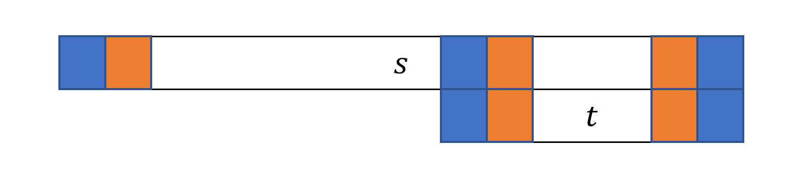

## 概述

回文树 (EER Tree，Palindromic Tree，也被称为回文自动机）是一种可以存储一个串中所有回文子串的高效数据结构，最初是由 Mikhail Rubinchik 和 Arseny M. Shur 在 2015 年发表。它的灵感来源于后缀树等字符串后缀数据结构，使用回文树可以简单高效地解决一系列涉及回文串的问题。

## 结构

回文树大概长这样


和其它自动机类似的，回文树也是由转移边和后缀链接 (fail 指针）组成，每个节点都可以代表一个回文子串。

因为回文串长度分为奇数和偶数，我们可以像 manacher 那样加入一个不在字符集中的字符（如 '#'）作为分隔符来将所有回文串的长度都变为奇数，但是这样过于麻烦了。有没有更好的办法呢？

答案自然是有。更好的办法就是建两棵树，一棵树中的节点对应的回文子串长度均为奇数，另一棵树中的节点对应的回文子串长度均为偶数。

和其它的自动机一样，一个节点的 fail 指针指向的是这个节点所代表的回文串的最长回文后缀所对应的节点，但是转移边并非代表在原节点代表的回文串后加一个字符，而是表示在原节点代表的回文串前后各加一个相同的字符（不难理解，因为要保证存的是回文串）。

我们还需要在每个节点上维护此节点对应回文子串的长度 len，这个信息保证了我们可以轻松地构造出回文树。

## 建造

回文树有两个初始状态，分别代表长度为 $-1,0$ 的回文串。我们可以称它们为奇根，偶根。它们不表示任何实际的字符串，仅作为初始状态存在，这与其他自动机的根节点是异曲同工的。

偶根的 fail 指针指向奇根，而我们并不关心奇根的 fail 指针，因为奇根不可能失配（奇根转移出的下一个状态长度为 $1$ ，即单个字符。一定是回文子串）

类似后缀自动机，我们增量构造回文树。

考虑构造完前 $p-1$ 个字符的回文树后，向自动机中添加在原串里位置为 $p$ 的字符。

我们从以上一个字符结尾的最长回文子串对应的节点开始，不断沿着 fail 指针走，直到找到一个节点满足 $s_{p}=s_{p-len-1}$ ，即满足此节点所对应回文子串的上一个字符与待添加字符相同。

这里贴出论文中的那张图


我们通过跳 fail 指针找到 A 所对应的节点，然后两边添加 `X` 就到了现在的回文串了（即 `XAX` ），很显然，这个节点就是以 $p$ 结尾的最长回文子串对应的树上节点。（同时，这个时候长度 $-1$ 节点优势出来了，如果没有 `X` 能匹配条件就是同一个位置的 $s_p=s_p$ ，就自然得到了代表字符 `X` 的节点。）此时要判断一下：没有这个节点，就需要新建。

然后我们还需要求出新建的节点的 fail 指针。具体方法与上面的过程类似，不断跳转 fail 指针，从 `A` 出发，即可找到 `XAX` 的最长回文后缀 `XBX` ，将对应节点设为 fail 指针所指的对象即可。

显然，这个节点是不需新建的， `A` 的前 $len_B$ 位和后 $len_B$ 位相同，都是 `B` ，前 $len_B$ 位的两端根据回文串对应关系，都是 `X` ，后面被钦定了是 `X` ，于是这个节点 `XBX` 肯定已经被包含了。

如果 fail 没匹配到，那么将它连向长度为 $0$ 的那个节点，显然这是可行的（因为这是所有节点的后缀）。

## 线性状态数证明

定理：对于一个字符串 $s$ ，它的本质不同回文子串个数最多只有 $|s|$ 个。

证明：考虑使用数学归纳法。

-   当 $|s| =1$ 时， $s$ 只有一个字符，同时也只有一个子串，并且这个子串是回文的，因此结论成立。

-   当 $|s| >1$ 时，设 $t=sc$ ，其中 $t$ 表示 $s$ 最后增加一个字符 $c$ 后形成的字符串，假设结论对 $s$ 串成立。考虑以最后一个字符 $c$ 结尾的回文子串，假设它们的左端点由小到大排序为 $l_1,l_2,\dots,l_k$ 。由于 $t[l_1..|t|]$ 是回文串，因此对于所有位置 $l_1 \le p \le |t|$ ，有 $t[p..|t|]=t[l_1..l_1+|t|-p]$ 。所以，对于 $1 < i \le k$ ， $t[l_i..|t|]$ 已经在 $t[1..|t|-1]$ 中出现过。因此，每次增加一个字符，本质不同的回文子串个数最多增加 $1$ 个。

由数学归纳法，可知该定理成立。

因此回文树状态数是 $O(|s|)$ 的。对于每一个状态，它实际只代表一个本质不同的回文子串，即转移到该节点的状态唯一，因此总转移数也是 $O(|s|)$ 的。

## 正确性证明

以上图为例，增加当前字符 `X` ，由线性状态数的证明，我们只需要找到包含最后一个字符 `X` 的最长回文后缀，也就是 `XAX` 。继续寻找 `XAX` 的最长回文后缀 `XBX` ，建立后缀链接。 `XBX` 对应状态已经在回文树中出现，包含最后一个字符的回文后缀就是 `XAX` ， `XBX` 本身及其对应状态在 fail 树上的所有祖先。

对于 $s$ 回文树的构造，令 $n=|s|$ ，显然除了跳 fail 指针的其他操作都是 $O(n)$ 的。

加入字符时，在上一次的基础上，每次跳 fail 后对应节点在 fail 树的深度 $-1$ ，而连接 fail 后，仅为深度 + 1（但 fail 为 $0$ 时（即到 $-1$ 才符合），深度相当于在 $-1$ 的基础上 $+2$ ）。

因为只加入 $n$ 个字符，所以只会加 $n$ 次深度，最多也只会跳 $2n$ 次 fail。

因此，构造 $s$ 的回文树的时间复杂度是 $O(|s|)$ 。

## 应用

### 本质不同回文子串个数

由线性状态数的证明，容易知道一个串的本质不同回文子串个数等于回文树的状态数（排除奇根和偶根两个状态）。

### 回文子串出现次数

建出回文树，使用类似后缀自动机统计出现次数的方法。

由于回文树的构造过程中，节点本身就是按照拓扑序插入，因此只需要逆序枚举所有状态，将当前状态的出现次数加到其 fail 指针对应状态的出现次数上即可。

例题： [「APIO2014」回文串](https://www.luogu.org/problem/P3649) 

定义 $s$ 的一个子串的存在值为这个子串在 $s$ 中出现的次数乘以这个子串的长度。对于给定的字符串 $s$ ，求所有回文子串中的最大存在值。

??? note "参考代码"
    ```cpp
    #include <bits/stdc++.h>
    using namespace std;
    typedef long long ll;
    const int maxn = 300000 + 5;
    namespace pam {
    int sz, tot, last;
    int cnt[maxn], ch[maxn][26], len[maxn], fail[maxn];
    char s[maxn];
    int node(int l) {
      sz++;
      memset(ch[sz], 0, sizeof(ch[sz]));
      len[sz] = l;
      fail[sz] = cnt[sz] = 0;
      return sz;
    }
    void clear() {
      sz = -1;
      last = 0;
      s[tot = 0] = '$';
      node(0);
      node(-1);
      fail[0] = 1;
    }
    int getfail(int x) {
      while (s[tot - len[x] - 1] != s[tot]) x = fail[x];
      return x;
    }
    void insert(char c) {
      s[++tot] = c;
      int now = getfail(last);
      if (!ch[now][c - 'a']) {
        int x = node(len[now] + 2);
        fail[x] = ch[getfail(fail[now])][c - 'a'];
        ch[now][c - 'a'] = x;
      }
      last = ch[now][c - 'a'];
      cnt[last]++;
    }
    ll solve() {
      ll ans = 0;
      for (int i = sz; i >= 0; i--) {
        cnt[fail[i]] += cnt[i];
      }
      for (int i = 1; i <= sz; i++) {
        ans = max(ans, 1ll * len[i] * cnt[i]);
      }
      return ans;
    }
    }  // namespace pam
    char s[maxn];
    int main() {
      pam::clear();
      scanf("%s", s + 1);
      for (int i = 1; s[i]; i++) {
        pam::insert(s[i]);
      }
      printf("%lld\n", pam::solve());
      return 0;
    }
    ```

### 最小回文划分

> 给定一个字符串 $s(1\le |s| \le 10^5)$ ，求最小的 $k$ ，使得存在 $s_1,s_2,\dots,s_k$ ，满足 $s_i(1\le i \le k)$ 均为回文串，且 $s_1,s_2, \dots ,s_k$ 依次连接后得到的字符串等于 $s$ 。

考虑动态规划，记 $dp[i]$ 表示 $s$ 长度为 $i$ 的前缀的最小划分数，转移只需要枚举以第 $i$ 个字符结尾的所有回文串

$$
dp[i]=1+\min_{ s[j+1..i] \text{ 为回文串} } dp[j]
$$

由于一个字符串最多会有 $O(n^2)$ 个回文子串，因此上述算法的时间复杂度为 $O(n^2)$ ，无法接受，为了优化转移过程，下面给出一些引理。

记字符串 $s$ 长度为 $i$ 的前缀为 $pre(s,i)$ ，长度为 $i$ 的后缀为 $suf(s,i)$ 。

周期：若 $0< p \le |s|$ ， $\forall 1 \le i \le |s|-p,s[i]=s[i+p]$ ，就称 $p$ 是 $s$ 的周期。

border：若 $0 \le r < |s|$ ， $pre(s,r)=suf(s,r)$ ，就称 $pre(s,r)$ 是 $s$ 的 border。

周期和 border 的关系： $t$ 是 $s$ 的 border，当且仅当 $|s|-|t|$ 是 $s$ 的周期。

证明：

若 $t$ 是 $s$ 的 border，那么 $pre(s,|t|)=suf(s,|t|)$ ，因此 $\forall 1\le i \le |t|, s[i]=s[|s|-|t|+i]$ ，所以 $|s|-|t|$ 就是 $s$ 的周期。

若 $|s|-|t|$ 为 $s$ 周期，则 $\forall 1 \le i \le |s|-(|s|-|t|)=|t|,s[i]=s[|s|-|t|+i]$ ，因此 $pre(s,|t|)=suf(s,|t|)$ ，所以 $t$ 是 $s$ 的 border。

引理 $1$ ： $t$ 是回文串 $s$ 的后缀， $t$ 是 $s$ 的 border 当且仅当 $t$ 是回文串。

证明：

对于 $1 \le i \le |t|$ ，由 $s$ 和 $t$ 为回文串，因此有 $s[i]=s[|s|-i+1]=s[|s|-|t|+i]$ ，所以 $t$ 是 $s$ 的 border。

对于 $1 \le i \le |t|$ ，由 $t$ 是 $s$ 的 border，有 $s[i]=s[|s|-|t|+i]$ ，由 $s$ 是回文串，有 $s[i]=s[|s|-i+1]$ ，因此 $s[|s|-i+1]=s[|s|-|t|+i]$ ，所以 $t$ 是回文串。

下图中，相同颜色的位置表示字符对应相同。



引理 $2$ ： $t$ 是回文串 $s$ 的 border ( $|s|\le 2|t|$ )， $s$ 是回文串当且仅当 $t$ 是回文串。

证明：

若 $s$ 是回文串，由引理 $1$ ， $t$ 也是回文串。

若 $t$ 是回文串，由 $t$ 是 $s$ 的 border，因此 $\forall 1 \le i \le |t|, s[i]=s[|s|-|t|+i]=s[|s|-i+1]$ ，因为 $|s| \le 2|t|$ ，所以 $s$ 也是回文串。

引理 $3$ ： $t$ 是字符串 $s$ 的 border，则 $|s|-|t|$ 是 $s$ 的周期， $|s|-|t|$ 为 $s$ 的最小周期，当且仅当 $t$ 是 $s$ 的最长回文真后缀。

引理 $4$ ： $x$ 是一个回文串， $y$ 是 $x$ 的最长回文真后缀， $z$ 是 $y$ 的最长回文真后缀。令 $u,v$ 分别为满足 $x=uy,y=vz$ 的字符串，则有下面三条性质

1.   $|u| \ge |v|$ ；

2.  如果 $|u| > |v|$ ，那么 $|u| > |z|$ ；

3.  如果 $|u| = |v|$ ，那么 $u=v$ 。


证明：

1.  由引理 $3$ 的推论， $|u|=|x|-|y|$ 是 $x$ 的最小周期， $|v|=|y|-|z|$ 是 $y$ 的最小周期。考虑反证法，假设 $|u| < |v|$ ，因为 $y$ 是 $x$ 的后缀，所以 $u$ 既是 $x$ 的周期，也是 $y$ 的周期，而 $|v|$ 是 $y$ 的最小周期，矛盾。所以 $|u| \ge |v|$ 。

2.  因为 $y$ 是 $x$ 的 border，所以 $v$ 是 $x$ 的前缀，设字符串 $w$ ，满足 $x=vw$ （如下图所示），其中 $z$ 是 $w$ 的 border。考虑反证法，假设 $|u| \le |z|$ ，那么 $|zu| \le 2|z|$ ，所以由引理 $2$ ， $w$ 是回文串，由引理 $1$ ， $w$ 是 $x$ 的 border，又因为 $|u| > |v|$ ，所以 $|w| > |y|$ ，矛盾。所以 $|u| > |z|$ 。

3.   $u,v$ 都是 $x$ 的前缀， $|u|=|v|$ ，所以 $u=v$ 。


推论： $s$ 的所有回文后缀按照长度排序后，可以划分成 $\log |s|$ 段等差数列。

证明：

设 $s$ 的所有回文后缀长度从小到大排序为 $l_1,l_2,\dots,l_k$ 。对于任意 $2 \le i \le k-1$ ，若 $l_{i}-l_{i-1}=l_{i+1}-l_{i}$ ，则 $l_{i-1},l_{i},l_{i+1}$ 构成一个等差数列。否则 $l_{i}-l_{i-1}\neq l_{i+1}-l_{i}$ ，由引理 $4$ ，有 $l_{i+1}-l_{i}>l_{i}-l_{i-1}$ ，且 $l_{i+1}-l_{i}>l_{i-1}$ ， $l_{i+1}>2l_{i-1}$ 。因此，若相邻两对回文后缀的长度之差发生变化，那么这个最大长度一定会相对于最小长度翻一倍。显然，长度翻倍最多只会发生 $O(\log |s|)$ 次，也就是 $s$ 的回文后缀长度可以划分成 $\log |s|$ 段等差数列。

该推论也可以通过使用弱周期引理，对 $s$ 的最长回文后缀的所有 border 按照长度 $x$ 分类， $x \in [2^0,2^1),[2^1,2^2),\dots,[2^k,n)$ ，考虑这 $\log |s|$ 组内每组的最长 border 进行证明。详细证明可以参考金策的《字符串算法选讲》和陈孙立的 2019 年 IOI 国家候选队论文《子串周期查询问题的相关算法及其应用》。

有了这个结论后，我们现在可以考虑如何优化 $dp$ 的转移。

回文树上的每个节点 $u$ 需要多维护两个信息， $diff[u]$ 和 $slink[u]$ 。 $diff[u]$ 表示节点 $u$ 和 $fail[u]$ 所代表的回文串的长度差，即 $len[u]-len[fail[u]]$ 。 $slink[u]$ 表示 $u$ 一直沿着 fail 向上跳到第一个节点 $v$ ，使得 $diff[v] \neq diff[u]$ ，也就是 $u$ 所在等差数列中长度最小的那个节点。

根据上面证明的结论，如果使用 $slink$ 指针向上跳的话，每向后填加一个字符，只需要向上跳 $O(\log |s|)$ 次。因此，可以考虑将一个等差数列表示的所有回文串的 $dp$ 值之和（在原问题中指 $\min$ ），记录到最长的那一个回文串对应节点上。

 $g[v]$ 表示 $v$ 所在等差数列的 $dp$ 值之和，且 $v$ 是这个等差数列中长度最长的节点，则 $g[v]=\sum_{slink[x]=v} dp[i-len[x]]$ 。

下面我们考虑如何更新 $g$ 数组和 $dp$ 数组。以下图为例，假设当前枚举到第 $i$ 个字符，回文树上对应节点为 $x$ 。 $g[x]$ 为橙色三个位置的 $dp$ 值之和（最短的回文串 $slink[x]$ 算在下一个等差数列中）。 $fail[x]$ 上一次出现位置是 $i-diff[x]$ （在 $i-diff[x]$ 处结束）， $g[fail[x]]$ 包含的 $dp$ 值是蓝色位置。因此， $g[x]$ 实际上等于 $g[fail[x]]$ 和多出来一个位置的 $dp$ 值之和，多出来的位置是 $i-(len[slink[x]]+diff[x])$ 。最后再用 $g[x]$ 去更新 $dp[i]$ ，这部分等差数列的贡献就计算完毕了，不断跳 $slink[x]$ ，重复这个过程即可。具体实现方式可参考例题代码。


最后，上述做法的正确性依赖于：如果 $x$ 和 $fail[x]$ 属于同一个等差数列，那么 $fail[x]$ 上一次出现位置是 $i-diff[x]$ 。

证明：

根据引理 $1$ ， $fail[x]$ 是 $x$ 的 border，因此其在 $i-diff[x]$ 处出现。

假设 $fail[x]$ 在 $(i-diff[x],i)$ 中的 $j$ 位置出现。由于 $x$ 和 $fail[x]$ 属于同一个等差数列，因此 $2|fail[x]| \ge x$ 。多余的 $fail[x]$ 和 $i-diff[x]$ 处的 $fail[x]$ 有交集，记交集为 $w$ ，设串 $u$ 满足 $uw=fail[x]$ 。用类似引理 $1$ 的方式可以证明， $w$ 是回文串，而 $x$ 的前缀 $s[i-len[x]+1..j]=uwu$ 也是回文串，这与 $fail[x]$ 是 $x$ 的最长回文前缀（后缀）矛盾。

例题： [Codeforces 932G Palindrome Partition](https://codeforces.com/problemset/problem/932/G) 

给定一个字符串 $s$ ，要求将 $s$ 划分为 $t_1, t_2, \dots, t_k$ ，其中 $k$ 是偶数，且 $t_i=t_{k-i}$ ，求这样的划分方案数。

??? note "题解"
    构造字符串 $t= s[0]s[n - 1]s[1]s[n - 2]s[2]s[n - 3] \dots s[n / 2 - 1]s[n / 2]$ ，问题等价于求 $t$ 的偶回文划分方案数，把上面的转移方程改成求和形式并且只在偶数位置更新 $dp$ 数组即可。时间复杂度 $O(n \log n)$ ，空间复杂度 $O(n)$ 。

??? note "参考代码"
    ```cpp
    #include <bits/stdc++.h>
    using namespace std;
    typedef long long ll;
    const int mod = 1e9 + 7;
    const int maxn = 1000000 + 5;
    inline int add(int x, int y) {
      x += y;
      return x >= mod ? x -= mod : x;
    }
    namespace pam {
    int sz, tot, last;
    int ch[maxn][26], len[maxn], fail[maxn];
    int cnt[maxn], dep[maxn], dif[maxn], slink[maxn];
    char s[maxn];
    int node(int l) {
      sz++;
      memset(ch[sz], 0, sizeof(ch[sz]));
      len[sz] = l;
      fail[sz] = 0;
      cnt[sz] = 0;
      dep[sz] = 0;
      return sz;
    }
    void clear() {
      sz = -1;
      last = 0;
      s[tot = 0] = '$';
      node(0);
      node(-1);
      fail[0] = 1;
    }
    int getfail(int x) {
      while (s[tot - len[x] - 1] != s[tot]) x = fail[x];
      return x;
    }
    void insert(char c) {
      s[++tot] = c;
      int now = getfail(last);
      if (!ch[now][c - 'a']) {
        int x = node(len[now] + 2);
        fail[x] = ch[getfail(fail[now])][c - 'a'];
        dep[x] = dep[fail[x]] + 1;
        ch[now][c - 'a'] = x;
        dif[x] = len[x] - len[fail[x]];
        if (dif[x] == dif[fail[x]])
          slink[x] = slink[fail[x]];
        else
          slink[x] = fail[x];
      }
      last = ch[now][c - 'a'];
      cnt[last]++;
    }
    }  // namespace pam
    using pam::dif;
    using pam::fail;
    using pam::len;
    using pam::slink;
    int n, dp[maxn], g[maxn];
    char s[maxn], t[maxn];
    int main() {
      pam::clear();
      scanf("%s", s + 1);
      n = strlen(s + 1);
      for (int i = 1, j = 0; i <= n; i++) t[++j] = s[i], t[++j] = s[n - i + 1];
      dp[0] = 1;
      for (int i = 1; i <= n; i++) {
        pam::insert(t[i]);
        for (int x = pam::last; x > 1; x = slink[x]) {
          g[x] = dp[i - len[slink[x]] - dif[x]];
          if (dif[x] == dif[fail[x]]) g[x] = add(g[x], g[fail[x]]);
          if (i % 2 == 0) dp[i] = add(dp[i], g[x]);
        }
      }
      printf("%d", dp[n]);
      return 0;
    }
    ```

## 例题

-    [最长双回文串](https://www.luogu.org/problem/P4555) 

-    [拉拉队排练](https://www.luogu.org/problem/P1659) 

-    [「SHOI2011」双倍回文](https://www.luogu.org/problem/P4287) 

-    [HDU 5421 Victor and String](http://acm.hdu.edu.cn/showproblem.php?pid=5421) 

-    [CodeChef Palindromeness](https://www.codechef.com/LTIME23/problems/PALPROB) 

## 相关资料

-    [EERTREE: An Efficient Data Structure for Processing Palindromes in Strings](https://arxiv.org/pdf/1506.04862) 

-    [Palindromic tree](http://adilet.org/blog/palindromic-tree/) 

-   2017 年 IOI 国家候选队论文集 回文树及其应用 翁文涛


-   2019 年 IOI 国家候选队论文集 子串周期查询问题的相关算法及其应用 陈孙立

-   字符串算法选讲 金策

-    [A bit more about palindromes](https://codeforces.com/blog/entry/19193) 

-    [A Subquadratic Algorithm for Minimum Palindromic Factorization](https://arxiv.org/pdf/1403.2431.pdf) 
