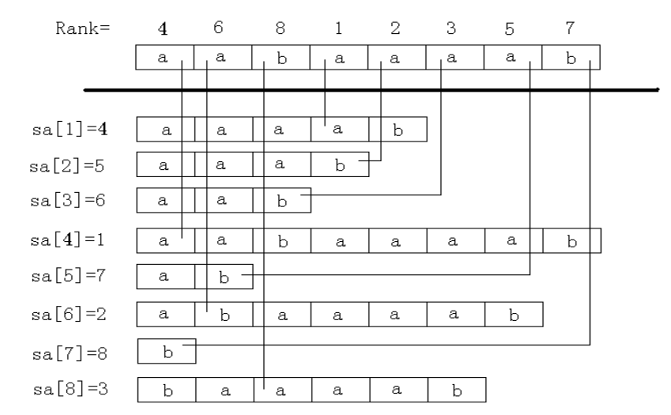
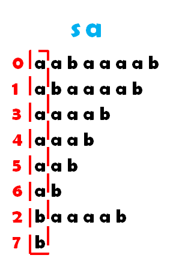
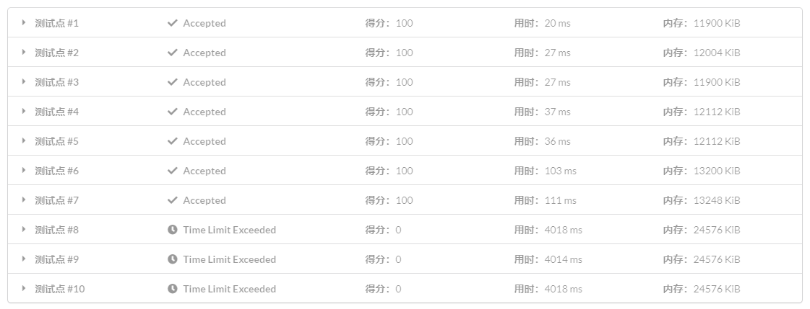

## 前言

### 后缀数组和后缀树

> 在字符串处理当中，后缀树和后缀数组都是非常有力的工具。其实后缀数组是后缀树的一个非常精巧的替代品，它比后缀树容易编程实现，能够实现后缀树的很多功能而时间复杂度也不太逊色，并且，它比后缀树所占用的空间小很多。可以说，在信息学竞赛中后缀数组比后缀树要更为实用。——百度百科

### 各种定义

子串：就是子串。[捂脸]

后缀：就是从 $i$ 这个位置开始到该字符串的末尾的一个子串。

字符串大小比较：把 $a$ 和 $b$ 这两个串按照字典序进行比较。

> 字典序：从左到右比较，遇到第一个不相同的字符时，字符在字母表中靠前的字典序较小；若某个串已扫描完，而另一个串未扫描完，且前面的字符都相同，则已扫描完的字典序靠前（即设长度较短的为串 $S_1$ ，较长的为 $S_2$ ， $S_2$ 前 $|S_1|$ 个字符为 $S_2'$ ，且 $S_2'=S_1$ ，则 $S_1$ 字典序较小）；若两串长度相等且未找到不同的字符，则称两串相同）

后缀数组： $sa[i]$ 代表该字符串的 $len$ 个后缀中，从 $sa[i]$ 开始的后缀排在为 $i$ 个。 $sa$ 数组记录的是“排第几的是哪个后缀”。

名次数组： $rank[i]$ 代表从 $i$ 开始的后缀排名为 $rank[i]$ 。 $rank$ 数组记录的是“某个后缀排在第几个”。

## 一些构造方法

### 最简单的暴力

把所有的后缀拆出来，然后 sort。由于直接比较长度为 $n$ 的字符串的时间复杂度为 $O(n)$ ，所以整体时间复杂度为 $O(n^2 \log n)$ 。

```cpp
int rank[123], sa[123];

struct Str {
  string s;
  int wei;
  friend bool operator<(Str a1, Str a2) { return a1.s < a2.s; }
} k[123];

int main() {
  string s;
  cin >> s;
  int len = s.size() - 1;

  for (int i = 0; i <= len; i++) {
    k[i].wei = i;
    for (int j = i; j <= len; j++) k[i].s = k[i].s + s[j];
  }

  sort(k, k + len + 1);
  for (int i = 0; i <= len; i++) {
    rank[k[i].wei] = i;
    sa[i] = k[i].wei;
  }

  exit(0);
}
```

### 倍增法

这个就是一般写后缀数组用的方法，复杂度是 $O(n\log n)$ ，前提是你要先会**基数排序**。

假设我们有这样一个字符串 `aabaaaab` ，然后我们把所有的后缀列举出来：



然后用基数排序的方式，按照每个后缀的第一个字母进行排序，呈现这样子的效果：



接着我们以第二个字母为关键字，在首字母有序的基础上进行排序，这个时候，我们把首字母相同的后缀拿出来单看。

对于每一组首字母相同的后缀，首字母是对排序没有影响的，所以可以直接按照第二个字母进行基数排序，同样，对于首字母不同的后缀，由于按照首字母排序时，他们的相对大小已经确定，当按照第二个字母排序时，不会出现“原来 a>b，现在 b>a”的现象，所以我们可以看成一直在做区域内的排序，这之后变成这样：



第三字母同理……

这样子我们可以处理这个问题，可是复杂度还是没有到达一个我们可以接受的范围，所以我们引入**倍增**。

当我们按照每个后缀的前 $2^k$ 个字母进行完排序后，那么我们把后缀的前 $2^{k+1}$ 看做前后两个 $2^k$ , 这样我们就可以把这前后两个 $2^k$ 作为之前说的首字母和第二个字母了，然后进行上述过程，就可以在 $O(nlogn)$ 的复杂度内处理这个问题了。

```cpp
#include <bits/stdc++.h>
using namespace std;

int n;
int sa[150], x[150], c[150], y[150];
char a[150];

inline void SA() {
  int m = 128;
  for (int i = 0; i <= m; i++) c[i] = 0;
  for (int i = 1; i <= n; i++) c[x[i]]++;
  for (int i = 1; i <= m; i++) c[i] += c[i - 1];
  for (int i = n; i; i--) sa[c[x[i]]--] = i;

  for (int k = 1, p; k <= n; k <<= 1) {
    p = 0;
    for (int i = n; i > n - k; i--) y[++p] = i;
    for (int i = 1; i <= n; i++)
      if (sa[i] > k) y[++p] = sa[i] - k;

    for (int i = 0; i <= m; i++) c[i] = 0;
    for (int i = 1; i <= n; i++) c[x[i]]++;
    for (int i = 1; i <= m; i++) c[i] += c[i - 1];
    for (int i = n; i; i--) sa[c[x[y[i]]]--] = y[i];

    p = y[sa[1]] = 1;
    for (int i = 2, a, b; i <= n; i++) {
      a = sa[i] + k > n ? -1 : x[sa[i] + k];
      b = sa[i - 1] + k > n ? -1 : x[sa[i - 1] + k];
      y[sa[i]] = (x[sa[i]] == x[sa[i - 1]]) && (a == b) ? p : ++p;
    }
    swap(x, y);
    m = p;
  }
}

int main() {
  scanf("%s", a + 1);

  n = strlen(a + 1);
  for (int i = 1; i <= n; i++) x[i] = a[i];
  SA();

  for (int i = 1; i <= n; i++) printf("%d", sa[i]);
  exit(0);
}
```

代码里 $x[i]$ 就是 $rank[i]$ 。

 $y[i]$ ：假设 $y[i]=a\ ,\  y[i+1]=b$ 那么在原串中从 $a+2^k$ 开始的 $2^k$ 个字符组成的子串**小于等于**从 $b+2^k$ 开始的 $2^k$ 个字符组成的子串。

最好理解这个代码时，每一步都结合这基数排序来考虑。

### DC3

* * *

# e-maxx 翻译

# 定义

定义 $S$ 是一个长度为 $n$ 的字符串。字符串的 $S$ 第 $i$ 个后缀是子串 $S[i \dots n-1]$ 。

一个**后缀数组**将包含一些整数，表示一个给定字符串所有排序后的后缀的**起点位置**。

例如字符串 $S=abaab$ ，它的所有后缀有：

    $$\begin{array}{ll}
    0. & abaab \\\\
    1. & baab \\\\
    2. & aab \\\\
    3. & ab \\\\
    4. & b
    \end{array}$$

在排序这些后缀后：

    $$\begin{array}{ll}
    2. & aab \\\\
    3. & ab \\\\
    0. & abaab \\\\
    4. & b \\\\
    1. & baab
    \end{array}$$

因此字符串 $S​$ 的后缀数组为 $(2,~ 3,~ 0,~ 4,~ 1)​$ 。

这是一个广泛用于数据压缩，生物信息学的领域的数据结构以及宽泛的说，用在任何处理字符串和字符串匹配的题目。

# 构造

##  $O(n^2 \log n)$ 算法

这是最朴素的算法。找出所有后缀并用快速排序或者归并排序，同时维护下标。排序时比较 $O(n\log n)$ 次，比较两个字符串有额外的 $O(n^2)$ 的时间复杂度，因此时间复杂度为 $O(n^2 \log n)$ 。

##  $O(n \log n)$ 算法

严格来说，接下来的算法将不会排序后缀，而是循环的移动一个字符串。我们可以~ 轻易地~ 得到一个算法来将它变成后缀排序：假设有一个字符串 $S'$ ，那么添加任一小于 $S'$ 中所有字符到 $S'$ 末尾的时间复杂度是可以接受的。通常使用符号 $\$$ 来表示一个小于当前字符集中所有字符的字符。在以上前提下，排序后的循环移动的排列和排序后后缀的排列相同。例如字符串 $dabbb$ ：

    $$\begin{array}{lll}
    1. & abbb\\$d & abbb \\\\
    4. & b\\$dabb & b \\\\
    3. & bb\\$dab & bb \\\\
    2. & bbb\\$da & bbb \\\\
    0. & dabbb\\$ & dabbb
    \end{array}$$

因为我们要排序循环移动，我们要考虑**循环子串**。我们将使用记号 $S[i\dots j]$ 表示 $S$ 的一个子串。即使 $i>j$ 也不例外，因为在这种情况下我们表示的字符串是 $S[i \dots n-1]+S[0\dots j]$ ，另外我们将把所有下标取模 $n$ ，但在下文中为描述简便将忽略该操作。

在我们将要讨论的算法中，将会有 $\lceil \log n \rceil + 1$ 次迭代。在第 $k(k=0\dots \lceil \log n \rceil)$ 次迭代中，我们将会排序 $n$ 个长度为 $2^k$ 的循环子串 $s$ 。在第 $\lceil \log n \rceil$ 次迭代后，长度为 $2^{\lceil \log n \rceil}\geq n$ 的子串将被排序，因此这与同时排序循环移动等价。

在算法的每次迭代中，令 $p[i]$ 表示第 $i$ 个子串（起点为 $i$ ，长度为 $2^k$ ）的子串的下标，在排列 $p[0\dots n-1]$ 的基础之上，我们还会维护数组 $c[0\dots n-1]$ ，其中 $c[i]$ 表示子串隶属的**等价类**。因为某些子串可能是相同的，因此算法需要将他们同等处理。为了方便，等价类将被以 $0$ 起的计数标记。另外， $c[i]$ 中的值将被用以保留顺序信息：如果一个子串比另外一个子串的字典序小，它的等价类标记也应该小于另一个子串。等价类的数量将被储存在一个可变的类当中。

现在来看一个例子，例如字符串 $S=aaba$ 。每次迭代时它的循环子串和对应的数组 $p[]$ 和 $c[]$ 如下所示：

$$
0: & (a,~ a,~ b,~ a) & p = (0,~ 1,~ 3,~ 2) & c = (0,~ 0,~ 1,~ 0)\\\\
1: & (aa,~ ab,~ ba,~ aa) & p = (0,~ 3,~ 1,~ 2) & c = (0,~ 1,~ 2,~ 0)\\\\
2: & (aaba,~ abaa,~ baaa,~ aaab) & p = (3,~ 0,~ 1,~ 2) & c = (1,~ 2,~ 3,~ 0)\\\\
\end{array}$$

值得注意的是，$p$ 数组的值可以不同。例如，在第一次迭代中，该数组可以是$p = (3,~ 1,~ 0,~ 2)$ 或者 $p = (3,~ 0,~ 1,~ 2)$。同时，$c[]$ 数组的值是固定的，没有其他可能性。

现在让我们来关注算法的实现。我们要写一个函数，使得输入字符串 $s​$ 后返回它排序后的循环移动。

```cpp
vector<int> sort_cyclic_shifts(string const& s) {
    int n = s.size();
    const int alphabet = 256;
```

一开始，我们要排序长度为 $1$ 的循环子串，即我们要排序字符串中所有的字符，然后将它们分入等价类，即相同字符分入相同类。这个操作可以使用朴素算法思想，例如**计数排序**。对于每个字符，我们计算它在字符串中的出现次数，然后用这个信息形成 $p$ 数组。在这之后我们遍历 $p$ 数组，然后通过比较相邻字符构造 $c$ 数组。

```cpp
    vector<int> p(n), c(n), cnt(max(alphabet, n), 0);
    for (int i = 0; i < n; i++)
        cnt[s[i]]++;
    for (int i = 1; i < alphabet; i++)
        cnt[i] += cnt[i-1];
    for (int i = 0; i < n; i++)
        p[--cnt[s[i]]] = i;
    c[p[0]] = 0;
    int classes = 1;
    for (int i = 1; i < n; i++) {
        if (s[p[i]] != s[p[i-1]])
            classes++;
        c[p[i]] = classes - 1;
    }
```

接下来我们说说如何进行迭代。假设我们已经完成了前 $k-1$ 步，并且计算了 $p$ 数组和 $c$ 数组。我们接下来想在 $O(n)$ 时间复杂度内计算这两个数组在第 $k$ 步的值。因为我们总共执行这个步骤 $O(\log n)$ 次，所以算法的时间复杂度是 $O(n\log n)$。

为了完成这一目标，我们注意到长度为 $2^k$ 的循环子串包括两个长度为 $2^{k-1}$ 的子串，我们可以使用上一步 $c$ 数组的计算结果在 $O(1)$ 的时间复杂度内通过比较得出。因此，对于两个长度为 $2^k$，起点分别为 $i$ 和 $j$ 的子串，所需的用来比较信息在二元组 $(c[i],c[i+2^{k-1}])$ 和 $(c[j],c[j+2^{k-1}])$ 中已经全部包含。
$$

\\overbrace{\\underbrace{s_i\\dots s_{i+2^{k-1}-1}}\_{\\text{length} = 2^{k-1},~\\text{class} = c[i]}\\quad\\underbrace{s_{i+2^{k-1}}\\dots s_{i+2^k-1}}\_{\\text{length} = 2^{k-1},~\\text{class} = c[i + 2^{k-1}]}
}^{\\text{length} = 2^k}\\dots\\overbrace{\\underbrace{s_j\\dots s_{j+2^{k-1}-1}}\_{\\text{length} = 2^{k-1},~\\text{class} = c[j]}\\quad\\underbrace{s_{j+2^{k-1}}\\dots s_{j+2^k-1}}\_{\\text{length} = 2^{k-1},~\\text{class} = c[j + 2^{k-1}]}
}^{\\text{length} = 2^k}\\dots

$$
这就给我们带来了一个十分简单的解法：以**这些二元组**为关键字，**排序**所有长度为 $2^k$ 的子串。这给我们带来了所需要的顺序数组 $p$。然而一般的排序算法的时间复杂度为 $O(n\log n)$，这样的时间复杂度看起来不是很令人满意，因为构造后缀数组的整体时间复杂度将变成 $O(n \log^2 n)$。

有什么办法可以使得排序更快呢？因为这些元素值不超过 $n$，我们可以再次使用计数排序。然而直接这样做并不是最优的，因为时间复杂度后面隐藏着一个常数。为了优化常数，我们要用另外一个小技巧。

我们这里使用了一个用在**基数排序**上的方法：为了排序这些元素，我们先以第二关键字排序，然后以第一关键字排序。另外，我们使用的排序是稳定排序，即不破坏值相同元素之间的相对位置关系。然而第二关键字已经在上一次的迭代中排序好了，因此，为了排序第二关键字，我们只需要从 $p[]$ 中的下标中减去 $2^{k-1}$ 即可。例如，长度为 $2^{k-1}$ 的最小子串在位置 $i$ 开始，那么第二关键字最小的且长度为 $2^k$ 的以 $i-2^{k-1}$为起点。

因此，只有通过做简单的减法，我们才能排序 $p$ 数组里的第二关键字。现在我们要对第一关键字进行一个稳定的排序。同上，这个操作能被计数排序完成。

现在就只剩计算等价类数组 $c[]$ 了，但是和之前一样，这个操作可以通过简单地迭代排序后的 $p$ 数组并比较相邻元素。

以下是剩下的代码。我们使用临时数组 $pn[]$ 和 $cn[]$ 来储存第二关键字的排序和新的等价类下标。
```cpp
    vector<int> pn(n), cn(n);
    for (int h = 0; (1 << h) < n; ++h) {
        for (int i = 0; i < n; i++) {
            pn[i] = p[i] - (1 << h);
            if (pn[i] < 0)
                pn[i] += n;
        }
        fill(cnt.begin(), cnt.begin() + classes, 0);
        for (int i = 0; i < n; i++)
            cnt[c[pn[i]]]++;
        for (int i = 1; i < classes; i++)
            cnt[i] += cnt[i-1];
        for (int i = n-1; i >= 0; i--)
            p[--cnt[c[pn[i]]]] = pn[i];
        cn[p[0]] = 0;
        classes = 1;
        for (int i = 1; i < n; i++) {
            pair<int, int> cur = {c[p[i]], c[(p[i] + (1 << h)) % n]};
            pair<int, int> prev = {c[p[i-1]], c[(p[i-1] + (1 << h)) % n]};
            if (cur != prev)
                ++classes;
            cn[p[i]] = classes - 1;
        }
        c.swap(cn);
    }
    return p;
}
```

算法整体时间复杂度为 $O(n\log n)$，空间复杂度为 $O(n)$。如果考虑字符集大小 $k$ 的影响，整体时间复杂度为 $O((n+k)\log n)$，空间复杂度为 $O(n+k)$。

为了简单，我们用了整个 ASCII 表范围作为了字母表，如果我们知道字符集，例如小写字母，那么这个做法能够得到优化。然而，这个优化并不大，因为字符集的复杂度影响仅仅只是 $O(\log k)$。

另外一点要注意的是，这个算法只排序循环的移动。在文章的一开头已经说过了，我们可以通过在后缀末尾加一个小于字符串中任意字符的字符来生成已排序的后缀顺序，同时这样的排序通过循环的移动形成了字符串，例如排序 $s+\$$ 的循环移动。这显然会给出 $s$ 的后缀数组，但是前面会多一个等于 $|S|$ 的值。
```cpp
vector<int> suffix_array_construction(string s) {
    s += "$";
    vector<int> sorted_shifts = sort_cyclic_shifts(s);
    sorted_shifts.erase(sorted_shifts.begin());
    return sorted_shifts;
}
```
# 应用
## 寻找最小的循环移动位置
在不往字符串末尾加字符时，上面的算法已经排序了所有的循环移动，因此 $p[0]$ 就是循环移动的最小位置。

## 在字符串中找子串
任务是在线地在主串 $T$ 中寻找模式串 $S$。在线的意思是，我们已经预先知道知道主串 $T$，但是当且仅当询问时才知道模式串 $S$。我们可以为字符串 $T$ 在 $O(|T|\log |T|)$ 时间复杂度内构造它的后缀数组。现在我们可以开始查找子串 $S$ 了。子串 $S$ 的出现必须是 $T$ 中一些后缀的前缀。因为我们已经将所有后缀排序了，我们可以通过在 $p$ 数组中二分 $S$ 来实现。比较子串 $S$ 和当前后缀的时间复杂度为  $O(|S|)$，因此找子串的时间复杂度为 $O(|S|\log |T|)$。注意，如果该子串在 $T$ 中出现了多次，每次出现都是在 $p$ 数组中相邻的。因此出现次数可以通过再次二分找到，输出每次出现的位置也很轻松。
## 比较一个字符串的两个子串的大小关系
这题中，我们想在 $O(1)$ 时间内比较 $S$ 的两个等长子串的大小关系。

我们先花费 $O(|S|\log |S|)$ 的时间复杂度构造 $S$ 的后缀数组并储存所有等价类数组 $c[]$ 的中间值。

通过这个信息，我们就可以在 $O(1)$ 时间复杂度内通过比较两个字符串的等价类比较任意两个长度为 $2$ 的正整数幂次方的子串了。现在，我们想要拓展这个算法，使得其可用于任意长度。

假设有两个长度为 $l$，起点下标为 $i$ 和 $j$ 的子串。我们找到子串中长度最大的子段，即使得 $2^k\leq l$ 且 $k$ 最大。然后，比较两个子串就可以等价为比较两个重叠的，长度为 $2^k$ 的子段：一开始两个子段起点是 $i$ 和 $j$，如果这两个子段相同，就去比较两个结束点为 $i+l-1$ 和 $j+l-1$ 的子段。
$$

\\overbrace{\\underbrace{s_i\\dots s_{i+l-2^k}\\dots s_{i+2^k-1}}\_{2^k}\\dots s_{i+l-1}}^{\\text{first}}\\dots\\overbrace{\\underbrace{s_j\\dots s_{j+l-2^k}\\dots s_{j+2^k-1}}\_{2^k}\\dots s_{j+l-1}}^{\\text{second}}\\dots$$

$$
\overbrace{s_i \dots \underbrace{s_{i+l-2^k} \dots s_{i+2^k-1} \dots s_{i+l-1}}\_{2^k}}^{\text{first}}
\dots
\overbrace{s_j \dots \underbrace{s_{j+l-2^k} \dots s_{j+2^k-1} \dots s_{j+l-1}}\_{2^k}}^{\text{second}}
\dots$$

以下为比较的实现。请注意，这个代码假设你已经算好了 $k$，$k$ 可以在 $\lfloor \log l \rfloor$ 的时间复杂度中算出，但是更有效的算法是预处理每个 $l$ 的 $k$ 值，你可以通过 ST 表算法算出所有的 $k$ 值，该算法与其思路相似。

```cpp
int compare(int i, int j, int l, int k) {
    pair<int, int> a = {c[k][i], c[k][(i+l-(1 << k))%n]};
    pair<int, int> b = {c[k][j], c[k][(j+l-(1 << k))%n]};
    return a == b ? 0 : a < b ? -1 : 1;
}
```
## 消耗额外空间复杂度的两子串最长公共前缀求解
对于一个给定的字符串 $S$，我们先要计算它的任意两个后缀的最长公共前缀 **LCP**，假设这两个后缀的起点是 $i$ 和 $j$。

此处的代码将额外花费 $O(|S|\log |S|)$ 的空间。下一节，我们将讨论另外一个完全不一样的做法，该做法将只花费线性的内存。

我们先花费 $O(|S|\log |S|)$ 的时间复杂度构造 $S$ 的后缀数组并储存所有等价类数组 $c[]$ 的中间值。

现在来计算两个起点在 $i$ 和 $j$ 的后缀。我们可以在 $O(1)$ 时间复杂度内比较两个长度为 $2$ 的正整数幂次方的字符串。做法是，我们按 $2$ 的从高至低次幂比较字符串，如果两个这样一个长度的字符串相同，我们在答案上加上这个长度，然后到相等部分右端继续检查，即 $i$ 和 $j$ 加上当前的长度。具体实现如下，注意，其中 `log_n` 表示 $\lfloor log_2 n\rfloor$ 。

```cpp
int lcp(int i, int j) {
    int ans = 0;
    for (int k = log_n; k >= 0; k--) {
        if (c[k][i] == c[k][j]) {
            ans += 1 << k;
            i += 1 << k;
            j += 1 << k;
        }
    }
    return ans;
}
```
## 不消耗额外空间复杂度的两子串最长公共前缀求解
我们的目标和前一节一样，即我们要计算一个给定字符串 $S$ 的两个后缀的最长公共前缀 LCP。

与前一节不一样的是，我们在这里只消耗 $O(|S|)$ 的时间复杂度，处理结果将会是一个数组，该数组中储存了字符串的重要信息，因此也会被用于解决其他问题。LCP 的询问可以通过在数组中执行 RMQ （区间最小值询问）的询问完成，所以不同的实现可以达到 $\log$ 级别甚至常数级别的时间复杂度。（译者注：此处的 LCP 数组表示通常意义上的 height 数组）

这个算法的基础是，我们要计算相邻的排序后的后缀的 LCP。换言之，我们将会构造一个数组 $\text{LCP}[0\dots n-2]​$，其中 $\text{LCP}[0\dots n-2]​$ 等于 $p[i]​$ 和 $p[i+1]​$ 的 LCP 长度。这个数组将使得我们能够计算出字符串中任意两个相邻后缀的 LCP。拓展到任意两个后缀，可以从这个数组中得到。其实，查询后缀 $p[i]​$ 和 $p[j]​$ 的 LCP 答案就是 $min{lcp[i],~lcp[i+1],~\dots,~lcp[j-1]}​$。

因此当我们算出 $\text{LCP}$ 后问题就简化成了计算 $RMQ$，不同的算法有不同的时间复杂度。

所以我们的主要任务就是构造 $\text{LCP}$ 数组。我们将使用 Kasai 算法，该算法能在 $O(|S|)$ 时间复杂度内构造这个数组。

现在来观察两个排序后的相邻后缀，假设他们的起点位置是 $i​$ 和 $j​$ 且他们的 LCP 等于 $k​$，其中 $k>0​$。如果我们同时移除这两个后缀的第一个字符，即起点变成 $i+1​$ 和 $j+1​$，此时这两个后缀的 LCP 是 $k-1​$。然而这个值不能直接拿来用然后写进 $\text{LCP}​$ 数组，因为这两个后缀在排序后不一定相邻。后缀 $i+1$ 显然小于后缀 $j+1$，但是他们之中可能有些后缀。然而，因为我们知道了两个后缀间的 LCP 是这两个下标间的最小值，同时，任意两对间的距离至少要是 $k-1$，特别是 $i+1$ 和下一个后缀。同时这个值可能会更大。

现在我们可以开始实现这个算法了。我们将按照后缀长度进行循环，通过这种方法，我们可以重用最后一次的 $k$ 值，因为从后缀 $i$ 到后缀 $i+1$ 就是去掉第一个字符。我们要开一个 $\text{rank}​$ 数组来记录一个后缀在排序后的数组中的位置。

代码如下，我们最多减去 $n$ 次 $k$（每次循环最多一次，除了 $\text{rank}[i]==n-1$，在这个情况下 $k$ 将直接被置零），并且两个子串的 LCP 最多是 $n-1$。我们增加 $k$ 的操作也是最多 $n$ 次，因此时间复杂度为 $O(n)$。
```cpp
vector<int> lcp_construction(string const& s, vector<int> const& p) {
    int n = s.size();
    vector<int> rank(n, 0);
    for (int i = 0; i < n; i++)
        rank[p[i]] = i;

    int k = 0;
    vector<int> lcp(n-1, 0);
    for (int i = 0; i < n; i++) {
        if (rank[i] == n - 1) {
            k = 0;
            continue;
        }
        int j = p[rank[i] + 1];
        while (i + k < n && j + k < n && s[i+k] == s[j+k])
            k++;
        lcp[rank[i]] = k;
        if (k)
            k--;
    }
    return lcp;
}
```
## 不同子串的数目
我们先预处理字符串 $S$，即计算它的后缀数组和 LCA 数组。使用这些信息，我们就可以算出字符串中有多少不同子串了。

为了达到目的，我们要想一下哪个新的子串在 $p[0]$ 位置开始，然后想想哪个在 $p[1]$ 开始。其实，我们使用排序后的后缀，然后看看给新的子串什么前缀，因此我们将不会错过任何一个。

因为后缀已经排序了，明显当前后缀 $p[i]​$ 将为他的所有前缀贡献一个新的子串，除了由 $p[i-1]​$ 贡献的子串。即它除了前 $\text{LCP}[i-1]​$ 个前缀的所有前缀。因为当前后缀的长度是 $n-p[i]​$，因此 $n-p[i]-\text{LCP}[i-1]​$ 个新后缀将在 $p[i]​$ 开始。对所有后缀求和即得答案，即 $$\sum_{i=0}^{n-1} (n - p[i]) - \sum_{i=0}^{n-2} \text{lcp}[i] = \frac{n^2 + n}{2} - \sum_{i=0}^{n-2} \text{lcp}[i]​$$。
## 习题
* [Uva 760 - DNA Sequencing](http://uva.onlinejudge.org/index.php?option=com_onlinejudge&Itemid=8&category=24&page=show_problem&problem=701)
* [Uva 1223 - Editor](http://uva.onlinejudge.org/index.php?option=com_onlinejudge&Itemid=8&category=24&page=show_problem&problem=3664)
* [Codechef - Tandem](https://www.codechef.com/problems/TANDEM)
* [Codechef - Substrings and Repetitions](https://www.codechef.com/problems/ANUSAR)
* [Codechef - Entangled Strings](https://www.codechef.com/problems/TANGLED)
* [Codeforces - Martian Strings](http://codeforces.com/problemset/problem/149/E)
* [Codeforces - Little Elephant and Strings](http://codeforces.com/problemset/problem/204/E)
* [SPOJ - Ada and Terramorphing](http://www.spoj.com/problems/ADAPHOTO/)
* [SPOJ - Ada and Substring](http://www.spoj.com/problems/ADASTRNG/)
* [UVA - 1227 - The longest constant gene](https://uva.onlinejudge.org/index.php?option=onlinejudge&page=show_problem&problem=3668)
* [SPOJ - Longest Common Substring](http://www.spoj.com/problems/LCS/en/)
* [UVA 11512 - GATTACA](https://uva.onlinejudge.org/index.php?option=com_onlinejudge&Itemid=8&page=show_problem&problem=2507)
* [LA 7502 - Suffixes and Palindromes](https://icpcarchive.ecs.baylor.edu/index.php?option=com_onlinejudge&Itemid=8&category=720&page=show_problem&problem=5524)
* [GYM - Por Costel and the Censorship Committee](http://codeforces.com/gym/100923/problem/D)
* [UVA 1254 - Top 10](https://uva.onlinejudge.org/index.php?option=com_onlinejudge&Itemid=8&page=show_problem&problem=3695)
* [UVA 12191 - File Recover](https://uva.onlinejudge.org/index.php?option=com_onlinejudge&Itemid=8&page=show_problem&problem=3343)
* [UVA 12206 - Stammering Aliens](https://uva.onlinejudge.org/index.php?option=onlinejudge&page=show_problem&problem=3358)
* [Codechef - Jarvis and LCP](https://www.codechef.com/problems/INSQ16F)
* [LA 3943 - Liking's Letter](https://icpcarchive.ecs.baylor.edu/index.php?option=onlinejudge&Itemid=8&page=show_problem&problem=1944)
* [UVA 11107 - Life Forms](https://uva.onlinejudge.org/index.php?option=com_onlinejudge&Itemid=8&page=show_problem&problem=2048)
* [UVA 12974 - Exquisite Strings](https://uva.onlinejudge.org/index.php?option=com_onlinejudge&Itemid=8&category=862&page=show_problem&problem=4853)
* [UVA 10526 - Intellectual Property](https://uva.onlinejudge.org/index.php?option=com_onlinejudge&Itemid=8&page=show_problem&problem=1467)
* [UVA 12338 - Anti-Rhyme Pairs](https://uva.onlinejudge.org/index.php?option=onlinejudge&page=show_problem&problem=3760)
* [DevSkills Reconstructing Blue Print of Life](https://devskill.com/CodingProblems/ViewProblem/328)
* [UVA 12191 - File Recover](https://uva.onlinejudge.org/index.php?option=com_onlinejudge&Itemid=8&page=show_problem&problem=3343)
* [SPOJ - Suffix Array](http://www.spoj.com/problems/SARRAY/)
* [LA 4513 - Stammering Aliens](https://icpcarchive.ecs.baylor.edu/index.php?option=com_onlinejudge&Itemid=8&page=show_problem&problem=2514)
* [SPOJ - LCS2](http://www.spoj.com/problems/LCS2/)
* [Codeforces - Fake News (hard)](http://codeforces.com/contest/802/problem/I)
* [SPOJ - Longest Commong Substring](http://www.spoj.com/problems/LONGCS/)
* [SPOJ - Lexicographical Substring Search](http://www.spoj.com/problems/SUBLEX/)
* [Codeforces - Forbidden Indices](http://codeforces.com/contest/873/problem/F)
* [Codeforces - Tricky and Clever Password](http://codeforces.com/contest/30/problem/E)
* [LA 6856 - Circle of digits](https://icpcarchive.ecs.baylor.edu/index.php?option=onlinejudge&page=show_problem&problem=4868)
$$
