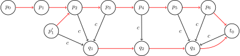
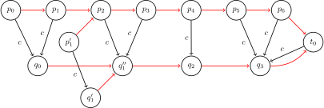

author: GoodCoder666, abc1763613206, ksyx

## 一些记号

-   $\Sigma$：字符集。字符集大小 $|\Sigma| = k$。
-   $s$：字符串。字符串长 $|s| = n$，标号自 $0$ 开始。
-   $t_0$：初始状态。
-   $\operatorname{endpos}(t)$：字符串 $s$ 中子串 $t$ 的结束位置的集合。
-   $\operatorname{link}(v)$：状态 $v$ 的后缀链接。
-   $\operatorname{len}(v)$：状态 $v$ 对应的最长子串的长度。
-   $\operatorname{longest}(v)$：状态 $v$ 对应的最长子串。
-   $\operatorname{minlen}(v)$：状态 $v$ 对应的最短子串的长度。
-   $\operatorname{shortest}(v)$：状态 $v$ 对应的最短子串。

## 后缀自动机概述

**后缀自动机**（suffix automaton, SAM）是一个能解决许多字符串相关问题的有力的数据结构。

举个例子，以下的字符串问题都可以在线性时间内通过 SAM 解决：

-   在另一个字符串中搜索一个字符串的所有出现位置；
-   计算给定的字符串中有多少个不同的子串。

直观上，字符串的 SAM 可以理解为给定字符串的 **所有子串** 的压缩形式。值得注意的事实是，SAM 将所有的这些信息以高度压缩的形式储存。对于一个长度为 $n$ 的字符串，它的空间复杂度仅为 $O(n)$。而且，构造 SAM 的时间复杂度也仅为 $O(n)$。准确地说，一个 SAM 最多有 $2n-1$ 个结点和 $3n-4$ 条转移边。

## 定义

字符串 $s$ 的 SAM 是一个接受 $s$ 的所有后缀的最小 [DFA](./automaton.md)（确定性有限自动机或确定性有限状态机）。

换句话说：

-   SAM 是一张有向无环图。结点被称作 **状态**，边被称作状态间的 **转移**。
-   图存在一个源点 $t_0$，称作 **初始状态**，其它各结点均可从 $t_0$ 出发到达。
-   每个 **转移** 都标有某个字符。从一个结点出发的所有转移均 **不同**。
-   存在一个或多个 **终止状态**。如果我们从初始状态 $t_0$ 出发，最终转移到了一个终止状态，则路径上的所有转移的标号连接起来一定是字符串 $s$ 的一个后缀。反过来，$s$ 的每个后缀均可用一条从 $t_0$ 到某个终止状态的路径构成。
-   在所有满足上述条件的自动机中，SAM 的结点数是最少的。

SAM 的关键恰在于这个最小性。实际上，直接对字符串 $s$ 的所有后缀建立 [AC 自动机](./ac-automaton.md) 同样可以得到一个接受 $s$ 的所有后缀的 DFA。但是，最差情况下，这样得到的自动机有 $\Theta(n^2)$ 个结点，复杂度难以接受。从下面的例子可以看出，对所有后缀建立 AC 自动机得到的 DFA 中很多结点是重复的，因而可以合并。SAM 正是将结点的合并做到了极致，故而将得到的 DFA 的规模控制在 $O(n)$。从这个意义上，SAM 是字符串的全体后缀的「压缩」的 AC 自动机。

### 子串和路径

SAM 最简单、也最重要的性质是，它包含关于字符串 $s$ 的所有子串的信息。任意从初始状态 $t_0$ 开始的路径，如果我们将路径上的所有转移的标号写下来，都会形成 $s$ 的一个 **子串**。反之，每个 $s$ 的子串都对应从 $t_0$ 开始的某条路径。

为了简化表达，我们称子串 **对应** 这条（从 $t_0$ 出发且它上面所有转移的标号构成这个子串的）路径。反过来，我们说任意一条路径都 **对应** 它的标号构成的字符串。

到达某个状态的路径可能不止一条，因此我们说一个状态对应一些字符串的集合，这个集合中的字符串分别对应着这些路径。

### 简单例子

我们将会在这里展示一些简单的字符串的后缀自动机。

我们用蓝色表示初始状态，用绿色表示终止状态。

对于字符串 $s=\varnothing$：


对于字符串 $s=\texttt{a}$：


对于字符串 $s=\texttt{aa}$：


对于字符串 $s=\texttt{ab}$：


对于字符串 $s=\texttt{abb}$：


对于字符串 $s=\texttt{abbb}$：


在最后这个例子中可以看到，如果直接建立它的所有后缀的 AC 自动机，路径 $\texttt{bbb}$ 和路径 $\texttt{abbb}$ 应当导向不同的结点，但是这两个结点都是终止状态，且无论再添加任何字符，都不会得到更长的匹配串，这说明两个结点在自动机的转移上表现出同样的性质，因而可以合并成同一个结点。这样就得到了如图所示的 SAM。下面的讨论会将合并结点这一想法拓展到所有的情形，并说明，只要合理地合并结点，最后得到的 SAM 只有 $O(n)$ 个结点和转移。

## 线性复杂度的构造算法

在我们描述线性时间内构造 SAM 的算法之前，我们需要引入两个对理解构造过程非常重要的概念，并对其性质进行简单证明。其中，结束位置 $\operatorname{endpos}$ 定义了 SAM 中的结点（亦即指出了结点可以合并的充要条件），而后缀链接 $\operatorname{link}$ 不过是 AC 自动机中的 [失配指针](./ac-automaton.md#失配指针) 在 SAM 中的自然对应。

### 结束位置 `endpos`

考虑字符串 $s$ 的任意非空子串 $t$，我们记 $\operatorname{endpos}(t)$ 为在字符串 $s$ 中 $t$ 的所有结束位置的集合（假设对字符串中字符的编号从零开始）。例如，对于字符串 $\texttt{abcbc}$，我们有 $\operatorname{endpos}(\texttt{bc})=\{2,4\}$。

两个子串 $t_1$ 与 $t_2$ 的结束位置可能完全相同：$\operatorname{endpos}(t_1)=\operatorname{endpos}(t_2)$。这定义了字符串 $s$ 的子串之间的等价关系。字符串 $s$ 的所有非空子串可以根据它们的结束位置集合 $\operatorname{endpos}$ 分为若干 **等价类**。

一个事实是，每个这样的等价类都对应 SAM 的一个状态[^state-endpos]。也就是说，只要两个子串的结束位置相同，它们在 SAM 中的路径就对应着同一个状态。换句话说，SAM 中的每个非初始状态都对应一个或多个 $\operatorname{endpos}$ 相同的非空子串。总之，SAM 中的状态就是所有非空子串的等价类，再加上初始状态。

暂且接受这个事实，我们将基于它介绍构造 SAM 的算法。我们还将说明，SAM 需要满足的所有性质，除了最小性以外都满足了；而最小性可以由 Myhill–Nerode 定理得出（不会在这篇文章中证明）。

由 $\operatorname{endpos}$ 的值我们可以得到一些重要结论，它们解释了同一个状态对应的不同的子串之间的关系。

???+ note "引理 1"
    字符串 $s$ 的两个非空子串 $u$ 和 $w$（假设 $\left|u\right|\le \left|w\right|$）的 $\operatorname{endpos}$ 相同，当且仅当字符串 $u$ 在 $s$ 中每次出现时，都是以 $w$ 后缀的形式存在的。

??? note "证明"
    引理显然成立。如果 $u$ 和 $w$ 的 $\operatorname{endpos}$ 相同，则 $u$ 是 $w$ 的一个后缀，且在 $s$ 中只以 $w$ 的后缀的形式出现。反过来，根据定义，如果 $u$ 为 $w$ 的一个后缀，且只以 $w$ 的后缀的形式在 $s$ 中出现，那么两个子串的 $\operatorname{endpos}$ 相同。

???+ note "引理 2"
    考虑两个非空子串 $u$ 和 $w$（假设 $\left|u\right|\le \left|w\right|$）。那么，要么 $\operatorname{endpos}(u)\cap \operatorname{endpos}(w)=\varnothing$，要么 $\operatorname{endpos}(w)\subseteq \operatorname{endpos}(u)$，取决于 $u$ 是否为 $w$ 的一个后缀：
    
    $$
    \begin{cases}
    \operatorname{endpos}(w) \subseteq \operatorname{endpos}(u), & \text{if } u \text{ is a suffix of } w, \\
    \operatorname{endpos}(w) \cap \operatorname{endpos}(u) = \varnothing, & \text{otherwise}.
    \end{cases}
    $$

??? note "证明"
    如果集合 $\operatorname{endpos}(u)$ 与 $\operatorname{endpos}(w)$ 有至少一个公共元素，那么由于字符串 $u$ 与 $w$ 在相同位置结束，$u$ 是 $w$ 的一个后缀。所以在每次 $w$ 出现的位置，子串 $u$ 也会出现。所以 $\operatorname{endpos}(w)\subseteq \operatorname{endpos}(u)$。

???+ note "引理 3"
    考虑一个 $\operatorname{endpos}$ 相同的子串等价类，将类中的所有子串按长度非递增的顺序排序。那么，每个子串都不会比它前一个子串长，与此同时每个子串也是它前一个子串的后缀。换句话说，对于同一等价类的任意两子串，较短者为较长者的后缀，且该等价类中的子串长度是连续的，取遍某个区间内的所有整数值。

??? note "证明"
    如果等价类中只包含一个子串，引理显然成立。现在我们来讨论子串元素个数大于 $1$ 的等价类。
    
    由引理 1，$\operatorname{endpos}$ 相同的两个不同字符串中，必定一长一短，且较短者总是较长者的真后缀。也就是说，等价类中没有等长的字符串。
    
    记 $w$ 为等价类中最长的字符串，$u$ 为等价类中最短的字符串。由引理 1，字符串 $u$ 是字符串 $w$ 的真后缀。现在考虑长度在区间 $[\left|u\right|,\left|w\right|]$ 中的 $w$ 的任意后缀。容易看出，这个后缀也在同一等价类中，因为这个后缀只能在字符串 $s$ 中以 $w$ 的一个后缀的形式存在（这是因为较短的后缀 $u$ 在 $s$ 中只以 $w$ 的后缀的形式存在）。因此，由引理 1，这个后缀和字符串 $w$ 的 $\operatorname{endpos}$ 相同。

一句话概括，同一个状态对应的子串的长度各不相同，而且是连续的若干自然数，其中较短的总是较长的子串的后缀。

### 后缀链接 `link`

考虑 SAM 中某个状态 $v\neq t_0$。我们已经知道，状态 $v$ 对应于具有相同 $\operatorname{endpos}$ 的子串等价类。我们如果定义 $w$ 为这些字符串中最长的一个，则所有其它的字符串都是 $w$ 的后缀。

我们还知道字符串 $w$ 的前几个后缀（按长度降序考虑）全部包含于这个等价类，且其它后缀（至少有一个——空后缀）在别的等价类中。我们记 $t$ 为其它后缀中最长的，然后将 $v$ 的后缀链接连到 $t$ 上。

换句话说，$v$ 的 **后缀链接** $\operatorname{link}(v)$ 连接到的状态，对应于 $w$ 的后缀中与它的 $\operatorname{endpos}$ 集合不同且最长的那个，也是 $w$ 的后缀中在 $s$ 中的出现次数比 $w$ 更多且最长的那个。

为方便讨论，我们规定初始状态 $t_0$ 对应的等价类，只包含一个空字符串，而且 $\operatorname{endpos}(t_0)=\{-1,0,\ldots,\left|S\right|-1\}$。

???+ note "引理 4"
    所有后缀链接构成一棵根节点为 $t_0$ 的树。

??? note "证明"
    考虑任意状态 $v\neq t_0$，后缀链接 $\operatorname{link}(v)$ 连接到的状态对应于严格更短的字符串（后缀链接的定义、引理 3）。因此，沿后缀链接移动，我们总是能到达对应空串的初始状态 $t_0$。

???+ note "引理 5"
    以 $\operatorname{endpos}$ 集合为结点、集合的包含关系作为边，这样构造的树（即每个子节点的 $\operatorname{endpos}$ 集合都包含在父节点的 $\operatorname{endpos}$ 集合中）与通过后缀链接 $\operatorname{link}$ 构造的树相同。

??? note "证明"
    由引理 2，任意一个 SAM 的 $\operatorname{endpos}$ 集合形成了一棵树（因为两个集合要么完全没有交集要么其中一个是另一个的子集）。
    
    我们现在考虑任意状态 $v\neq t_0$ 及后缀链接 $\operatorname{link}(v)$，由后缀链接和引理 2，我们可以得到
    
    $$
    \operatorname{endpos}(v)\subsetneq \operatorname{endpos}(\operatorname{link}(v)).
    $$
    
    注意这里应该是 $\subsetneq$ 而不是 $\subseteq$，因为若 $\operatorname{endpos}(v)=\operatorname{endpos}(\operatorname{link}(v))$，那么 $v$ 和 $\operatorname{link}(v)$ 应该被合并为一个结点。

结合前面的引理有：后缀链接构成的树本质上是 $\operatorname{endpos}$ 集合构成的一棵树。

以下是对字符串 $\texttt{abcbc}$ 构造 SAM 时产生的后缀链接树的一个 **例子**，结点被标记为对应等价类中最长的子串。


结合图示，如果能够形成一些对于后缀自动机的认识，将对下文理解其构造算法和应用都有所帮助。

???+ example "对图示的解释"
    -   SAM 上存在一条最长的路径，其标号恰好为字符串 $\texttt{abcbc}$ 本身。该路径从初始状态开始，经过的每个状态都对应着字符串 $\texttt{abcbc}$ 的前缀（$\varnothing,\texttt{a},\texttt{ab},\texttt{abc},\texttt{abcb},\texttt{abcbc}$）。这些状态在后续 [应用](#后缀链接树) 中至关重要。
    -   后缀链接树可以看做是将这些「前缀状态」沿着后缀链接移动到根节点（即初始状态）的路径「压缩」得到。
    
        -   沿着每条路径，结点对应的字符串集合构成了相应的前缀的所有后缀的分划。例如，标记为 $\texttt{abcbc}$ 的状态沿着后缀链接移动到根节点的路径为 $\texttt{abcbc}\rightarrow\texttt{bc}\rightarrow\varnothing$。其中，结点 $\texttt{abcbc}$ 实际对应着字符串集合 $\{\texttt{abcbc},\texttt{bcbc},\texttt{cbc}\}$，结点 $\texttt{bc}$ 实际对应着字符串集合 $\{\texttt{bc},\texttt{c}\}$，结点 $\varnothing$ 就对应空字符串。
        -   不同的路径可能共用同一个结点，这就是为什么会有「压缩」。例如，路径 $\texttt{abc}\rightarrow\texttt{bc}\rightarrow\varnothing$ 和路径 $\texttt{abcbc}\rightarrow\texttt{bc}\rightarrow\varnothing$ 共用了结点 $\texttt{bc}$。这是因为 $\operatorname{endpos}(\texttt{bc})=\{2,4\}$，而结束在位置 $2$ 的字符串 $\texttt{bc}$ 前紧接着字符 $\texttt{a}$ 而结束在位置 $4$ 的字符串 $\texttt{bc}$ 前紧接着字符 $\texttt{c}$，因此，当在前方添加字符（即逆着后缀链接移动）时，结束位置集合（即状态）会分裂。
        -   后缀链接树只需要将这些后缀路径合理地「压缩」在一起即可，而不需要考虑别的结点。这是因为，所有子串都是某个前缀的后缀，故而必然出现在某个这样的路径中。后文的构造算法本质上就是逐个添加字符，并为每个新增加的前缀，构造这样一条后缀路径，并使其合理地「压缩」到之前已有的路径中（即不重复构造已经存在的状态和转移）。
        -   终止状态恰为字符串 $\texttt{abcbc}$ 本身所在的后缀路径上的所有结点。
    -   到达同一个状态的转移必然具有相同的标号，而且这些转移的起点一定是位于后缀链接树上的某条（连续的）路径。比如，转移到状态 $\texttt{abcb}$ 的状态就有两个：$\texttt{abc}$ 和 $\texttt{bc}$。它们位于后缀树上的路径 $\texttt{abc}\rightarrow\texttt{bc}$ 上。注意，它们分别对应于字符串集合 $\{\texttt{abc}\}$ 和 $\{\texttt{bc},\texttt{c}\}$，这些字符串在后面添加字符 $\texttt{b}$，就得到状态 $\texttt{abcb}$ 对应的字符串集合 $\{\texttt{abcb},\texttt{bcb},\texttt{cb}\}$。
    
        -   添加字符后，不同状态可能转移到同一个状态，是因为新添加的字符使得结束位置的增加更为困难。
    -   后缀链接树上，每个结点的 $\operatorname{endpos}$ 集合都是其子节点的 $\operatorname{endpos}$ 集合的并集，至多再增加一个位置。而且，这个新位置存在，当且仅当该结点恰好对应着结束在该位置的原字符串的前缀。因为图示中，后缀链接树的非根非叶的结点都不对应着字符串 $\texttt{abcbc}$ 的前缀，所以不存在这种情形。

后缀自动机中存储着字符串全部子串的信息。这件事可以通过两个角度理解：

-   SAM 本身可以看作是字符串全体后缀的 AC 自动机的压缩版本。因此，它存储了字符串的全体后缀的所有前缀的信息，这就相当于存储了字符串全体子串的信息。
-   SAM 的后缀链接树可以看做是字符串全体前缀的后缀路径的压缩版本。因此，它存储了字符串的全体前缀的所有后缀的信息，这也相当于存储了字符串全体子串的信息。

这两种思考的角度在处理不同问题时都是有用的。

### 小结

在进一步讨论算法本身前，我们总结一下之前的内容，并引入一些辅助记号。

-   $s$ 的子串可以根据它们的结束位置集合 $\operatorname{endpos}$ 划分为多个等价类；

-   SAM 由初始状态 $t_0$ 和与每一个（非空子串的）$\operatorname{endpos}$ 等价类对应的每个状态组成；

-   每一个状态 $v$ 都匹配一个或多个子串。我们记 $\operatorname{longest}(v)$ 为其中最长的一个字符串，记 $\operatorname{len}(v)$ 为它的长度。类似地，记 $\operatorname{shortest}(v)$ 为最短的子串，它的长度为 $\operatorname{minlen}(v)$。那么对应这个状态的所有字符串都是字符串 $\operatorname{longest}(v)$ 的不同的后缀，且所有字符串的长度恰好取遍区间 $[\operatorname{minlen}(v),\operatorname{len}(v)]$ 中的每一个整数。

-   对于任意状态 $v\neq t_0$，定义后缀链接为连接到对应字符串 $\operatorname{longest}(v)$ 的长度为 $\operatorname{minlen}(v)-1$ 的后缀的一条边。从根节点 $t_0$ 出发的后缀链接可以形成一棵树。这棵树也表示 $\operatorname{endpos}$ 集合间的包含关系。

-   对于任意状态 $v\neq t_0$，可用后缀链接 $\operatorname{link}(v)$ 表达 $\operatorname{minlen}(v)$：

    $$
    \operatorname{minlen}(v)=\operatorname{len}(\operatorname{link}(v))+1.
    $$

-   如果我们从任意状态 $v_0$ 开始顺着后缀链接遍历，总会到达初始状态 $t_0$。这种情况下我们可以得到一个互不相交的区间 $[\operatorname{minlen}(v_i),\operatorname{len}(v_i)]$ 的序列，且它们的并集形成了连续的区间 $[0,\operatorname{len}(v_0)]$。

### 算法

现在我们可以讨论构造 SAM 的算法了。这个算法是 **在线** 算法，我们可以逐个加入字符串中的每个字符，并且在每一步中对应地维护 SAM。

在讨论详细的实现之前，首先通过图示初步感受一下增加新字符 $c$ 时，SAM 可能发生的变化。

???+ note "简单理解增量构造过程"
    在字符串 $s$ 的 SAM 的基础上，可以构造字符串 $s+c$ 的 SAM。根据前文对图示的解释，只需要构造出新增加的前缀（即 $s+c$）的后缀路径，并压缩到现有的路径上即可。而且，根据前文的描述，新的后缀路径上的结点必然都可以通过原字符串 $s$ 的后缀路径上的结点经由字符 $c$ 转移而来。
    
    我们首先考虑在添加新字符 $c$ 之前，原来的字符串 $s$ 的后缀路径可能具有什么形式，而且会怎样经由字符 $c$ 转移。最一般的情形，如下图示：
    
    
    
    图中，原字符串 $s$ 的后缀路径为 $p_0\rightarrow p_1\rightarrow\cdots\rightarrow p_6\rightarrow t_0$，后缀链接由红色箭头表示。其中部分结点（即 $p_2\sim p_6$）已经存在经由字符 $c$ 的转移；因为将连续的后缀串添加同一个字符会同样得到连续的后缀，所以这些转移的终点组成另一串后缀路径 $q_1\rightarrow q_2\rightarrow q_3\rightarrow t_0$。此时，有两点观察：
    
    -   原字符串 $s$ 的后缀路径上，没有经由 $c$ 的转移的结点一定是最初的几个结点。只要从某个结点（图中的 $p_2$）开始，存在经由 $c$ 的转移，后续经过的结点也一定存在经由 $c$ 的转移。
    
        **解释**：设 $s_2=\operatorname{longest}(p_2)$，那么后续经过的所有结点都对应 $s_2$ 的后缀，因而如果 $s_2+c$ 也出现在 $s$ 中，那么 $s_2$ 的后缀再加 $c$ 的结果也一定出现在 $s$ 中，因此这些结点都有经由 $c$ 的转移。
    -   虽然经由字符 $c$ 能够到达结点 $q_i$ 的结点一定是后缀链接树上的连续段，但是这个连续段未必全体都位于自 $p_0$ 到根的后缀路径上。特别地，只有第一个结点 $q_1$ 对应的连续段中起始的若干个结点 **可能** 不在这个后缀路径上。例如图中的结点 $q_1$ 就对应结点 $p_1'\rightarrow p_2\rightarrow p_3$，其中，$p_1'$ 不在 $p_0$ 的后缀路径上。
    
        **解释**：设 $s_2=\operatorname{longest}(p_2)$，则 $s_2+c$ 对应着 $q_1$，但是图中显然有 $s_2+c\neq\operatorname{longest}(q_1)$，因为后者是 $\operatorname{longest}(p'_1)+c$。这就说明，$q_1$ 对应的部分字符串不能由 $s_2$ 及其后缀转移来。反过来，$q_2$ 中的字符串必然是 $s_2+c$ 的后缀，因此删去末尾的 $c$ 后必然是 $s_2$ 的后缀。也就是说，经由 $c$ 转移到 $q_2$ 的结点必然在 $p_2$ 起始的后缀路径上。这也是为什么只有起始的 $q_1$ 对应的连续段中的部分结点可能不在 $p_0$ 的后缀路径上。
    
    对于这个图示，如果要在原字符串 $s$ 的末尾添加一个字符 $c$，并构造出相应的后缀路径，会发生什么变化呢？答案是如下图所示：
    
    
    
    因为结点 $q_0$ 由原字符串 $s$ 对应结点 $p_0$ 经由字符 $c$ 转移而来，它就对应新字符串 $s+c$。所以，它的后缀路径 $q_0\rightarrow q_1''\rightarrow q_2\rightarrow q_3\rightarrow t_0$ 就是新增的后缀路径。如果原来的后缀路径上的结点 $p_i$ 本就有经由 $c$ 的转移，那么新的后缀路径也必然会经过这些转移到达的结点，因此可以直接复用旧有的结点。新的后缀路径上有且只有一个完全新建的节点 $q_0$，用于接受原来的后缀路径上起始的那些没有经由 $c$ 的转移的结点的转移。
    
    除了这些显然的事实外，还可以注意到，原来的结点 $q_1$ 也经过了一次复制，或者说是分裂成了两个结点 $q'_1\rightarrow q_1''$。这是因为新增的后缀路径只是与现有路径部分重合：原来的结点 $q_1$ 对应的字符串中，只有较短的那些（即结点 $p_2$ 和 $p_3$ 能够转移到的那些）才会出现在新增的后缀路径上，而较长的那些（即结点 $p_1'$ 能够转移到的那些）并不会出现在新增的后缀路径上，因此新增的后缀路径只能经过结点 $q_1$ 的一部分，后者只能分裂成两个结点用于表示这种情形。同样的道理，前面已经解释过，$q_1$ 之后的结点 $q_2$ 和 $q_3$ 都无法由不在 $p_0$ 的后缀路径上的结点转移，因此这些结点对应的所有字符串都会出现在新增的后缀路径上，也就不需要分裂了。
    
    从 SAM 中状态代表的含义看，每个状态都是一个 $\operatorname{endpos}$ 集合。设延长字符串时，新增的结束位置为 $i$，那么新增的结点 $q_0$ 就是结束位置集合 $\{i\}$，而分裂的结点 $q_1'$ 和 $q_1''$ 分别对应集合 $\operatorname{endpos}(q_1)$ 和 $\operatorname{endpos}(q_1)\cup\{i\}$，之后的结点 $q_2$ 和 $q_3$ 其实都在原有的结束位置集合上新增了 $i$。也就是说，虽然 $q_2$ 和 $q_3$ 及其相关的转移没有发生变化，但是它们对应的 $\operatorname{endpos}$ 集合的确扩大了。
    
    以上说明的是最复杂、最一般的情形（即下文的 **情形三**）。实际操作时，可能并不存在结点 $p'_1$，因而也就不需要分裂（即下文的 **情形二**）。要判断这种情形，只需要判断 $\operatorname{longest}(q_1)=\operatorname{longest}(p_2)+c$ 即可，亦即 $\operatorname{len}(q_1)=\operatorname{len}(p_2)+1$。也有可能 $p_0$ 的后缀路径上的所有结点都没有经由 $c$ 的转移，此时，只要新建 $q_0$ 就好了（即下文的 **情形一**）。

掌握了新增后缀路径的思想后，现在讨论增量构造的具体步骤。

#### 过程

为了保证线性的空间复杂度，我们将只保存 $\operatorname{len}$ 和 $\operatorname{link}$ 的值和每个状态的转移列表，我们不会标记终止状态（但是我们稍后会展示在构造 SAM 后如何分配这些标记）。

一开始 SAM 只包含一个状态 $t_0$，编号为 $0$（其它状态的编号为 $1,2,\ldots$）。为了方便，对于状态 $t_0$ 我们指定 $\operatorname{len}(t_0)=0$，$\operatorname{link}(t_0)=-1$（$-1$ 表示虚拟状态）。

现在，只需要实现给当前字符串添加一个字符 $c$ 的过程。算法流程如下：

???+ note "SAM 增量构造过程"
    -   令 $\textit{last}$ 为添加字符 $c$ 之前，整个字符串对应的状态（一开始我们设 $\textit{last}=0$，算法的最后一步更新 $\textit{last}$）。
    -   创建一个新的状态 $\textit{cur}$，并将 $\operatorname{len}(\textit{cur})$ 赋值为 $\operatorname{len}(\textit{last})+1$，在这时 $\operatorname{link}(\textit{cur})$ 的值还未知。
    -   现在我们进行如下流程：从状态 $\textit{last}$ 开始，如果当前状态还没有标号为字符 $c$ 的转移，我们就添加一个经字符 $c$ 到状态 $\textit{cur}$ 的转移，并将当前状态沿后缀链接移动。如果过程中遇到某个状态已经存在到字符 $c$ 的转移，我们就停下来，并将这个状态标记为 $p$。
    -   **情况一**：如果没有找到这样的状态 $p$，我们就到达了虚拟状态 $-1$，我们将 $\operatorname{link}(\textit{cur})$ 赋值为 $0$ 并退出。
    -   假设现在我们找到了一个状态 $p$，它可以通过字符 $c$ 转移。我们将转移到的状态标记为 $q$。此时，要么 $\operatorname{len}(p)+1=\operatorname{len}(q)$，要么 $\operatorname{len}(p)+1<\operatorname{len}(q)$。
    -   **情况二**：如果 $\operatorname{len}(p)+1=\operatorname{len}(q)$，我们只要将 $\operatorname{link}(\textit{cur})$ 赋值为 $q$ 并退出。
    -   **情况三**：否则就会有些复杂，需要 **复制** 状态 $q$：我们创建一个新的状态 $\textit{clone}$，复制 $q$ 的除了 $\operatorname{len}$ 的值以外的所有信息（后缀链接和转移）。我们将 $\operatorname{len}(\textit{clone})$ 赋值为 $\operatorname{len}(p)+1$。
    
        复制之后，我们将后缀链接从 $\textit{cur}$ 指向 $\textit{clone}$，也从 $q$ 指向 $\textit{clone}$。
    
        最终我们需要沿着后缀链接从状态 $p$ 往回走，只要经过的状态存在指向状态 $q$ 的转移，就将该转移重新连接到状态 $\textit{clone}$。
    -   处理完以上三种情况后，我们都需要将 $\textit{last}$ 的值更新为状态 $\textit{cur}$。

如果我们还想知道哪些状态是 **终止状态** 而哪些不是，我们可以在为字符串 $s$ 构造完完整的 SAM 后找到所有的终止状态。为此，我们从对应整个字符串的状态（存储在变量 $\textit{last}$ 中），遍历它的后缀链接，直到到达初始状态。我们将所有遍历到的状态都标记为终止状态。容易理解这样做我们会准确地标记字符串 $s$ 的所有后缀，这些状态都是终止状态。

因为我们只为 $s$ 的每个字符创建一个或两个新状态，所以 SAM 只包含 **线性个** 状态。而 SAM 只有线性规模的转移个数，以及算法总体的线性运行时间，都还没有说清楚，将在后文说明。

#### 解释

我们详细解释算法每一步的细节，并说明它的 **正确性**。

???+ note "对算法的详细解释"
    -   若一个转移 $(p,q)$ 满足 $\operatorname{len}(p)+1=\operatorname{len}(q)$，则我们称这个转移是 **连续的**。否则，即当 $\operatorname{len}(p)+1<\operatorname{len}(q)$ 时，这个转移被称为 **不连续的**。
    
        从算法描述中可以看出，连续的和不连续的转移，在算法中的处理也并不相同。连续的转移是固定的，我们不会再改变了。与此相反，当向字符串中插入一个新的字符时，不连续的转移可能会改变（转移边的端点可能会改变）。
    -   为了避免引起歧义，我们记向 SAM 中插入当前字符 $c$ 之前的字符串为 $s$。
    -   算法从创建一个新状态 $\textit{cur}$ 开始，对应于整个字符串 $s+c$。我们创建一个新的节点的原因很清楚。与此同时我们也创建了一个新的字符和一个新的等价类。
    -   在创建一个新的状态之后，我们会从对应整个字符串 $s$ 的状态 $\textit{last}$ 沿着后缀链接进行移动。对于经过的每一个状态，我们尝试添加一个通过字符 $c$ 到新状态 $\textit{cur}$ 的转移。
    
        然而我们只能添加与原有转移不冲突的转移。因此我们只要找到已存在的 $c$ 的转移，我们就必须停止。
    -   最简单的情况是我们到达了虚拟状态 $-1$，这意味着我们为所有 $s$ 的后缀添加了 $c$ 的转移。这也意味着，字符 $c$ 从未在字符串 $s$ 中出现过。因此 $\textit{cur}$ 的后缀链接为状态 $0$。
    -   第二种情况下，我们找到了现有的转移 $(p,q)$。这意味着我们尝试向自动机内添加一个 **已经存在的** 字符串 $x+c$（其中 $x$ 为 $s$ 的一个后缀，且字符串 $x+c$ 已经作为 $s$ 的一个子串出现过了）。因为我们假设字符串 $s$ 的自动机的构造是正确的，我们不应该在这里添加一个新的转移。
    
        然而，难点在于，从状态 $\textit{cur}$ 出发的后缀链接应该连接到哪个状态呢？我们要把后缀链接连到一个状态上，且对应的最长的字符串恰好是 $x+c$，即这个状态的 $\operatorname{len}$ 应该是 $\operatorname{len}(p)+1$。然而这样的状态有可能并不存在，即 $\operatorname{len}(q)>\operatorname{len}(p)+1$。这种情况下，我们必须通过拆开状态 $q$ 来创建一个这样的状态。
    -   当然，如果转移 $(p,\,q)$ 是连续的，那么 $\operatorname{len}(q)=\operatorname{len}(p)+1$。在这种情况下一切都很简单。我们只需要将 $\textit{cur}$ 的后缀链接指向状态 $q$。
    -   否则转移是不连续的，即 $\operatorname{len}(q)>\operatorname{len}(p)+1$，这意味着状态 $q$ 不只对应于长度为 $\operatorname{len}(p)+1$ 的后缀 $s+c$，还对应于 $s$ 的更长的子串。除了将状态 $q$ 拆成两个子状态以外我们别无他法，所以第一个子状态的长度就是 $\operatorname{len}(p)+1$ 了。
    
        我们如何拆开一个状态呢？我们 **复制** 状态 $q$，产生一个状态 $\textit{clone}$，我们将 $\operatorname{len}(\textit{clone})$ 赋值为 $\operatorname{len}(p)+1$。由于我们不想改变经过 $q$ 的路径，我们将 $q$ 的所有转移复制到 $\textit{clone}$。我们也将从 $\textit{clone}$ 出发的后缀链接设置为 $q$ 的后缀链接的目标，并设置 $q$ 的后缀链接为 $\textit{clone}$。
    
        在拆开状态后，我们将从 $\textit{cur}$ 出发的后缀链接设置为 $\textit{clone}$。
    
        最后一步我们将一些原本指向 $q$ 的转移重新连接到 $\textit{clone}$。我们需要修改哪些转移呢？只重新连接相当于所有字符串 $w+c$（其中 $w$ 是状态 $p$ 对应的最长字符串）的后缀就够了。也就是说，我们需要继续沿着后缀链接移动，从结点 $p$ 直到虚拟状态 $-1$，或者当前状态经 $c$ 的转移不再指向状态 $q$。

### 线性时间复杂度

我们假设字符集大小为 **常数**，即每次对一个字符搜索转移、添加转移、查找下一个转移这些操作的时间复杂度都为 $O(1)$ 的。如果将每个结点的转移分别存储为一个长度为 $\left|\Sigma\right|$ 的数组（用于快速查询给定标号的转移）和一个动态列表（用于快速遍历所有可用转移），以空间换时间，那么算法的时间复杂度[^time-complexity]为 $O(n)$，空间复杂度为 $O(n\left|\Sigma\right|)$。

??? note "证明"
    如果我们考虑算法的各个部分，算法中有三处时间复杂度不明显是线性的：
    
    -   第一处是遍历所有状态 $\textit{last}$ 的后缀链接，添加字符 $c$ 的转移。
    -   第二处是当状态 $q$ 被复制到一个新的状态 $\textit{clone}$ 时复制转移的过程。
    -   第三处是修改指向 $q$ 的转移，将它们重新连接到 $\textit{clone}$ 的过程。
    
    我们使用 SAM 的大小（状态数和转移数）为 **线性的** 的事实（对状态数是线性的的证明就是算法本身，对转移数为线性的的证明将在稍后实现算法后给出）。
    
    因此上述 **第一处和第二处** 的总复杂度显然为线性的，因为单次操作均摊只为自动机添加了一个新转移。
    
    还需为 **第三处** 估计总复杂度，我们将最初指向 $q$ 的转移重新连接到 $\textit{clone}$。我们记 $v=\operatorname{longest}(p)$，这是字符串 $s$ 的一个后缀。每迭代一次，$v$ 的长度都减小，因而 $v$ 作为 $s$ 的后缀的起始位置必然在后移。因此，循环中 $p$ 沿后缀链接移动的次数，不超过 $v$ 作为 $s$ 的后缀的起始位置向后移动的距离。因为 $p$ 至少要向后移动一次，才能终止循环，而且 $p$ 至少是 $last$ 沿后缀链接移动一次的结果，因此循环终止时，$v$ 作为 $s$ 的后缀的的起始位置并不比字符串 $\operatorname{longest}(\operatorname{link}(\operatorname{link}(\textit{last}))$ 更靠前。而且，循环终止时，字符串 $v$ 作为 $s$ 的后缀的起始位置将恰好是 $v+c$ 作为 $s+c$ 的后缀的起始位置，而作为 $s+c$ 的后缀，字符串 $v+c$ 恰好是字符串 $\operatorname{longest}(\operatorname{link}(\operatorname{link}(\textit{cur}))$。因为 $cur$ 是更新后的 $last$ 的值，所以循环中移动的次数不会超过更新前后 $\operatorname{longest}(\operatorname{link}(\operatorname{link}(\textit{last}))$ 作为当前字符串后缀的起始位置向后移动的距离，再加一（即为了终止循环必须移动的次数）。
    
    因为作为当前字符串后缀的字符串 $\operatorname{longest}(\operatorname{link}(\operatorname{link}(\textit{last}))$ 的位置在整个 SAM 构造过程中单调递增[^monotone-loc]，它的总移动距离必然不超过 $n$。这就说明，需要修改指向 $q$ 的转移的循环中，迭代次数不超过 $2n$。这正是我们需要证明的。

当然，如果字符集大小不是常数，SAM 的时间复杂度就不是线性的。从一个结点出发的转移需要存储在支持快速查询和插入的平衡树中。因此如果我们记 $\Sigma$ 为字符集，$\left|\Sigma\right|$ 为字符集大小，则算法的渐进时间复杂度为 $O(n\log\left|\Sigma\right|)$，空间复杂度为 $O(n)$。

### 实现

首先，我们实现一种存储一个转移的全部信息的数据结构。如果需要的话，你可以在这里加入一个终止标记，也可以是一些其它信息。我们将用一个 `map` 存储转移的列表，允许我们在总计 $O(n)$ 的空间复杂度和 $O(n\log\left|\Sigma\right|)$ 的时间复杂度内处理整个字符串。当然，在字符集大小为较小的常数 $K$（比如 26）时，将 `next` 声明为 `int[K]` 更方便。

```cpp
struct state {
  int len, link;
  std::map<char, int> next;
};
```

SAM 本身将会存储在一个 `state` 结构体数组中。我们记录当前自动机的大小 `sz` 和变量 `last`，当前整个字符串对应的状态。

```cpp
constexpr int MAXLEN = 100000;
state st[MAXLEN * 2];
int sz, last;
```

我们定义一个函数来初始化 SAM（创建一个只有初始状态的 SAM）。

```cpp
void sam_init() {
  st[0].len = 0;
  st[0].link = -1;
  sz++;
  last = 0;
}
```

最终我们给出主函数的实现：给当前行末增加一个字符，对应地在之前的基础上建造自动机。

???+ note "实现"
    ```cpp
    void sam_extend(char c) {
      int cur = sz++;
      st[cur].len = st[last].len + 1;
      int p = last;
      while (p != -1 && !st[p].next.count(c)) {
        st[p].next[c] = cur;
        p = st[p].link;
      }
      if (p == -1) {
        st[cur].link = 0;
      } else {
        int q = st[p].next[c];
        if (st[p].len + 1 == st[q].len) {
          st[cur].link = q;
        } else {
          int clone = sz++;
          st[clone].len = st[p].len + 1;
          st[clone].next = st[q].next;
          st[clone].link = st[q].link;
          while (p != -1 && st[p].next[c] == q) {
            st[p].next[c] = clone;
            p = st[p].link;
          }
          st[q].link = st[cur].link = clone;
        }
      }
      last = cur;
    }
    ```

正如之前提到的一样，如果你用内存换时间（空间复杂度为 $O(n\left|\Sigma\right|)$，其中 $\left|\Sigma\right|$ 为字符集大小），你可以在 $O(n)$ 的时间[^time-complexity]内构造字符集大小任意的 SAM。但是这样你需要为每一个状态储存一个大小为 $\left|\Sigma\right|$ 的数组（用于快速根据字符找到相应的转移）以及一个包含所有可用转移的列表（用于快速遍历所有可用的转移）。

## 更多性质

### 状态数

对于一个长度为 $n$ 的字符串 $s$，它的 SAM 中的状态数 **不会超过**  $2n-1$（假设 $n\ge 2$）。

??? note "证明"
    算法本身即可证明该结论。一开始，自动机含有一个状态，第一次和第二次迭代中只会创建一个节点，剩余的 $n-2$ 步中每步会创建至多 $2$ 个状态。
    
    然而我们也能在 **不借助这个算法** 的情况下 **证明** 这个估计值。我们回忆一下状态数等于不同的 $\operatorname{endpos}$ 集合个数。这些 $\operatorname{endpos}$ 集合形成了一棵树（父节点的 $\operatorname{endpos}$ 集合包含子节点的 $\operatorname{endpos}$ 集合）。考虑将这棵树稍微变形一下：只要它有一个只有一个子节点的内部节点（这意味着该子节点的集合至少遗漏了它的父节点的集合中的一个位置），我们就创建一个含有这些遗漏位置的集合作为它的子节点。最后我们可以获得一棵每一个内部结点的度数都大于一的树，且叶子节点的个数不超过 $n$。这样的树里有不超过 $2n-1$ 个节点，因此，原来的不同的 $\operatorname{endpos}$ 集合个数也不超过 $2n-1$。
    
    字符串 $\texttt{abbb} \cdots \texttt{bbb}$ 的状态数达到了该上界：从第三次迭代后的每次迭代，算法都会拆开一个状态，最终产生恰好 $2n-1$ 个状态。

### 转移数

对于一个长度为 $n$ 的字符串 $s$，它的 SAM 中的转移数 **不会超过**  $3n-4$（假设 $n\ge 3$）。

??? note "证明"
    我们首先估计连续的转移的数量。考虑自动机中由从状态 $t_0$ 开始到达所有状态的最长路径组成的生成树。生成树只包含连续的边，因此数量少于状态数，即边数不会超过 $2n-2$。
    
    现在我们来估计不连续的转移的数量。令当前不连续转移为 $(p,\,q)$，其字符为 $c$。我们取它的对应字符串 $u+c+w$，其中字符串 $u$ 对应于初始状态到 $p$ 的最长路径，$w$ 对应于从 $q$ 到任意终止状态的最长路径。一方面，每个不完整的字符串所对应的形如 $u+c+w$ 的字符串是不同的（因为字符串 $u$ 和 $w$ 仅由完整的转移组成）。另一方面，由终止状态的定义，每个形如 $u+c+w$ 的字符串都是整个字符串 $s$ 的后缀。因为 $s$ 只有 $n$ 个非空后缀，且形如 $u+c+w$ 的字符串都不包含 $s$（因为整个字符串只包含完整的转移），所以非完整的转移的总数不会超过 $n-1$。
    
    将以上两个估计值相加，我们可以得到上界 $3n-3$。然而，最大的状态数只能在类似于 $\texttt{abbb} \cdots \texttt{bbb}$ 的情况中产生，而此时转移数量显然少于 $3n-3$。
    
    因此我们可以获得更为紧确的 SAM 的转移数的上界：$3n-4$。字符串 $\texttt{abbb} \cdots \texttt{bbbc}$ 就达到了这个上界。

### 后缀链接树

尽管构造 SAM 是为了得到它的状态和转移的信息，但是构造过程中记录的后缀链接 $\operatorname{link}$ 和该状态对应的最长子串长度 $\operatorname{len}$ 在应用中常常比 SAM 的转移更为重要，甚至可以抛开转移单独使用。

在构建 SAM 的过程中，需要更新 $\textit{last}$ 状态的值。它对应的是每次添加字符前（后）的字符串，也就是整个字符串 $s$ 的所有前缀。将第 $i$ 个前缀对应的状态记为 $v_i$，这样就得到 $v_0,v_1,\cdots,v_{n-1}$ 共计 $n$ 个状态。另外，规定初始状态 $t_0$ 为 $v_{-1}$，对应着空前缀。这些状态姑且称为「前缀节点」。

引理 4 中提及，所有状态和所有后缀链接构成根为 $t_0$ 的根向树，这个树也称为 **后缀链接树**（国内 OI 选手也常称它为 **parent 树**）。它记录了字符串全体前缀的所有后缀的信息，亦即全体子串的信息。

后缀链接树有如下性质：

-   祖先节点对应的字符串总是子孙节点对应的字符串的后缀。
-   每个节点处的 $\operatorname{endpos}$ 集合就是它的子树内的所有「前缀节点」$v_i$ 的下标 $i$ 的集合。
-   后缀链接树的祖先节点的 $\operatorname{endpos}$ 集合总是严格包含子孙节点的 $\operatorname{endpos}$ 集合。
-   每个节点处的 $\operatorname{len}$ 的值就是它的子树内的所有「前缀节点」$v_i$ 对应前缀的最长公共后缀的长度。
-   除根节点 $t_0$ 外，每个节点对应的不同子串的数目，就是它的 $\operatorname{len}$ 值，减去它的父节点的 $\operatorname{len}$ 值，即 $\operatorname{len}(v)-\operatorname{len}(\operatorname{link}(v))$。

这些性质有很多应用。比如，第 $i$ 个前缀和第 $j$ 个前缀的最长公共后缀对应的字符串就是 $v_i$ 和 $v_j$ 的 LCA 对应的最长字符串。

最后，对字符串 $s$ 建立的后缀链接树与对它的翻转 $s_R$ 建立的 [后缀树](./suffix-tree.md) 有相同的结构。这一点常常用于离线构造后缀树。

## 应用

下面我们来看一些可以用 SAM 解决的问题。简单起见，假设字符集的大小 $k$ 为常数。这允许我们认为增加一个字符和遍历的复杂度为常数。

### 检查字符串是否出现

???+ example "问题"
    给一个文本串 $T$ 和多个模式串 $P$，我们要检查字符串 $P$ 是否作为 $T$ 的一个子串出现。

??? note "解法"
    我们在 $O(\left|T\right|)$ 的时间内对文本串 $T$ 构造后缀自动机。为了检查模式串 $P$ 是否在 $T$ 中出现，我们沿转移（边）从 $t_0$ 开始根据 $P$ 的字符进行转移。如果在某个点无法转移下去，则模式串 $P$ 不是 $T$ 的一个子串。如果我们能够这样处理完整个字符串 $P$，那么模式串在 $T$ 中出现过。
    
    对于每个字符串 $P$，算法的时间复杂度为 $O(\left|P\right|)$。此外，这个算法还找到了模式串 $P$ 在文本串中出现的最大前缀长度。

### 不同子串个数

???+ example "问题"
    给一个字符串 $S$，计算不同子串的个数。

??? note "解法一"
    对字符串 $S$ 构造后缀自动机。
    
    每个 $S$ 的子串都相当于自动机中的一些路径。因此不同子串的个数等于自动机中以 $t_0$ 为起点的不同路径的条数。
    
    考虑到 SAM 为有向无环图，不同路径的条数可以通过动态规划计算。即令 $d_{v}$ 为从状态 $v$ 开始的路径数量（包括长度为零的路径），则我们有如下递推方程：
    
    $$
    d_{v}=1+\sum_{w:(v,w,c)\in DAWG}d_{w}
    $$
    
    即，$d_{v}$ 可以表示为所有 $v$ 的转移的末端的和，$DAWG$ 中的三元组 $(v,w,c)$ 表示后缀自动机中存在自 $v$ 经 $c$ 至 $w$ 的转移。
    
    所以不同子串的个数为 $d_{t_0}-1$（因为要去掉空子串）。
    
    总时间复杂度为：$O(\left|S\right|)$。

??? note "解法二"
    另一种方法是在构造完后缀自动机后，利用得到的后缀链接树的信息。每个节点对应的子串数量是 $\operatorname{len}(v)-\operatorname{len}(\operatorname{link}(v))$，对自动机所有节点求和即可。
    
    总时间复杂度仍然为：$O(\left|S\right|)$。

例题：[【模板】后缀自动机](https://www.luogu.com.cn/problem/P3804)，[SDOI2016 生成魔咒](https://loj.ac/problem/2033)

### 所有不同子串的总长度

???+ example "问题"
    给定一个字符串 $S$，计算所有不同子串的总长度。

??? note "解法一"
    本题做法与上一题类似，只是现在我们需要考虑分两部分进行动态规划：不同子串的数量 $d_{v}$ 和它们的总长度 $ans_{v}$。
    
    我们已经在上一题中介绍了如何计算 $d_{v}$。$ans_{v}$ 的值可以通过以下递推式计算：
    
    $$
    ans_{v}=\sum_{w:(v,w,c)\in DAWG}d_{w}+ans_{w}
    $$
    
    我们取每个邻接结点 $w$ 的答案，并加上 $d_{w}$（因为从状态 $v$ 出发的子串都增加了一个字符）。
    
    算法的时间复杂度仍然是 $O(\left|S\right|)$。

??? note "解法二"
    同样可以利用后缀链接树的信息。每个节点对应的最长子串的所有后缀长度是
    
    $$
    \dfrac{\operatorname{len}(v)\times (\operatorname{len}(v)+1)}{2},
    $$
    
    减去其 $\operatorname{link}$ 节点的对应值就是该节点的净贡献，对自动机所有节点求和即可。
    
    总时间复杂度仍然为：$O(\left|S\right|)$。

### 字典序第 k 大子串

???+ example "问题"
    给定一个字符串 $S$。多组询问，每组询问给定一个数 $K_i$，查询 $S$ 的所有子串中字典序第 $K_i$ 大的子串。

??? note "解法"
    解决这个问题的思路可以从解决前两个问题的思路发展而来。字典序第 $k$ 大的子串对应于 SAM 中字典序第 $k$ 大的路径，因此在计算每个状态的路径数后，我们可以很容易地从 SAM 的根开始找到第 $k$ 大的路径。
    
    预处理的时间复杂度为 $O(\left|S\right|)$，单次查询的复杂度为 $O(\left|ans\right|\cdot\left|\Sigma\right|)$（其中 $ans$ 是查询的答案，$\left|\Sigma\right|$ 为字符集的大小）。

??? info "另注"
    虽然该题是后缀自动机的经典题，但实际上这题由于涉及字典序，用后缀数组做最方便。

例题：[SPOJ - SUBLEX](https://www.spoj.com/problems/SUBLEX/)，[TJOI2015 弦论](https://loj.ac/problem/2102)

### 最小循环移位

???+ example "问题"
    给定一个字符串 $S$。找出字典序最小的循环移位。

??? note "解法"
    容易发现字符串 $S+S$ 包含字符串 $S$ 的所有循环移位作为子串。
    
    所以问题简化为在 $S+S$ 对应的后缀自动机上寻找最小的长度为 $\left|S\right|$ 的路径，这可以通过平凡的方法做到：我们从初始状态开始，贪心地访问最小的字符即可。
    
    总的时间复杂度为 $O(\left|S\right|)$。

### 出现次数

???+ example "问题"
    对于一个给定的文本串 $T$，有多组询问，每组询问给一个模式串 $P$，回答模式串 $P$ 在字符串 $T$ 中作为子串出现了多少次。

??? note "解法一"
    利用后缀链接树的信息，进行 dfs 即可预处理每个节点的 $\operatorname{endpos}$ 集合的大小。
    
    所有「前缀节点」的初始集合大小为 $1$，非「前缀节点」的初始集合大小为 $0$。然后，沿着后缀链接自下向上回溯时，每个父节点的集合大小都加上它的所有子节点的集合大小（不要遗漏父节点本身的初始值）。这样得到的每个节点处的值，就是该节点的 $\operatorname{endpos}$ 集合的大小。不同子节点的集合大小可以直接相加的理由是，同一个 $v_i$ 只会出现在一个子树内，故而相加不会重复。
    
    查询时，在自动机上查找模式串 $P$ 对应的节点，如果存在，则答案就是该节点的 $\operatorname{endpos}$ 集合的大小；如果不存在，则答案为 $0$。
    
    预处理时间复杂度为 $O(|T|)$。单次查询的时间复杂度为 $O(|P|)$。

??? note "解法二"
    对文本串 $T$ 构造后缀自动机。
    
    接下来做预处理：对于自动机中的每个状态 $v$，预处理 $cnt_{v}$，使之等于 $\operatorname{endpos}(v)$ 集合的大小。事实上，对应同一状态 $v$ 的所有子串在文本串 $T$ 中的出现次数相同，这相当于集合 $\operatorname{endpos}$ 中的位置数。
    
    然而我们不能明确的构造集合 $\operatorname{endpos}$，因此我们只考虑它们的大小 $cnt$。
    
    为了计算这些值，我们进行以下操作。对于每个状态，如果它不是通过复制创建的（且它不是初始状态 $t_0$），我们将它的 $cnt$ 初始化为 1。然后我们按它们的长度 $\operatorname{len}$ 降序遍历所有状态，并将当前的 $cnt_{v}$ 的值加到后缀链接指向的状态上，即：
    
    $$
    cnt_{\operatorname{link}(v)}+=cnt_{v}
    $$
    
    这样做每个状态的答案都是正确的。
    
    为什么这是正确的？不是通过复制获得的状态，恰好有 $\left|T\right|$ 个，并且它们中的前 $i$ 个在我们插入前 $i$ 个字符时产生。因此对于每个这样的状态，我们在它被处理时计算它们所对应的位置的数量。因此我们初始将这些状态的 $cnt$ 的值赋为 $1$，其它状态的 $cnt$ 值赋为 $0$。
    
    接下来我们对每一个 $v$ 执行以下操作：$cnt_{\operatorname{link}(v)}+=cnt_{v}$。其背后的含义是，如果有一个字符串 $v$ 出现了 $cnt_{v}$ 次，那么它的所有后缀也在完全相同的地方结束，即也出现了 $cnt_{v}$ 次。
    
    为什么我们在这个过程中不会重复计数（即把某些位置数了两次）呢？因为我们只将一个状态的位置添加到 **一个** 其它的状态上，所以一个状态不可能以两种不同的方式将其位置重复地指向另一个状态。
    
    因此，我们可以在 $O(\left|T\right|)$ 的时间内计算出所有状态的 $cnt$ 的值。
    
    最后回答询问只需要查找值 $cnt_{t}$，其中 $t$ 为模式串对应的状态，如果该模式串不存在答案就为 $0$。单次查询的时间复杂度为 $O(\left|P\right|)$。

### 第一次出现的位置

???+ example "问题"
    给定一个文本串 $T$，多组查询。每次查询字符串 $P$ 在字符串 $T$ 中第一次出现的位置（$P$ 的开头位置）。

??? note "解法一"
    利用后缀链接树的信息，进行 dfs 即可预处理每个节点的 $\operatorname{endpos}$ 集合中的最小值。
    
    所有「前缀节点」$v_i$ 的初始值为 $i$，非「前缀节点」的初始值为 $\infty$。然后，沿着后缀链接自下向上回溯时，每个父节点的值都与它的所有子节点的值比较，取最小值（不要遗漏父节点本身的初始值）。这样得到的每个节点处的值，就是该节点的 $\operatorname{endpos}$ 集合中的最小值。
    
    查询时，在自动机上查找模式串 $P$ 对应的节点，如果存在，则答案就是该节点的值，减去 $|P|-1$；如果不存在，则答案不存在。
    
    预处理时间复杂度为 $O(|T|)$。单次查询的时间复杂度为 $O(|P|)$。

??? note "解法二"
    我们构造一个后缀自动机。我们对 SAM 中的所有状态预处理位置 $\operatorname{firstpos}$。即，对每个状态 $v$ 我们想要找到第一次出现这个状态的末端的位置 $\operatorname{firstpos}[v]$。换句话说，我们希望先找到每个集合 $\operatorname{endpos}$ 中的最小的元素（显然我们不能显式地维护所有 $\operatorname{endpos}$ 集合）。
    
    为了维护 $\operatorname{firstpos}$ 这些位置，我们对函数 `sam_extend()` 进行扩展。当我们创建新状态 $\textit{cur}$ 时，我们令：
    
    $$
    \operatorname{firstpos}(\textit{cur})=\operatorname{len}(\textit{cur})-1.
    $$
    
    当我们将结点 $q$ 复制到 $\textit{clone}$ 时，我们令：
    
    $$
    \operatorname{firstpos}(\textit{clone})=\operatorname{firstpos}(q).
    $$
    
    （因为值的唯一的其它选项 $\operatorname{firstpos}(\textit{cur})$ 显然太大了）。
    
    那么查询的答案就是 $\operatorname{firstpos}(t)-\left|P\right|+1$，其中 $t$ 为对应字符串 $P$ 的状态。单次查询只需要 $O(\left|P\right|)$ 的时间。

### 所有出现的位置

???+ example "问题"
    问题同上，这一次需要查询文本串 $T$ 中模式串 $P$ 出现的所有位置。

??? note "解法一"
    找到模式串 $P$ 对应的节点后，利用后缀链接树的信息，遍历子树，一旦发现终点节点就输出。
    
    单次查询复杂度为 $O(|P|)+O(\textit{answer}(P))$，其中，$\textit{answer}(P)$ 为本次询问的答案。仿照 [状态数为线性的证明](#状态数) 可以说明，后缀链接树的子树大小不会超过该节点的 $\operatorname{endpos}$ 集合的大小的二倍，因此遍历子树的复杂度是 $O(\textit{answer}(P))$ 的。

??? note "解法二"
    我们还是对文本串 $T$ 构造后缀自动机。与上一个问题相似，我们为所有状态计算位置 $\operatorname{firstpos}$。
    
    如果 $t$ 为对应于模式串 $P$ 的状态，显然 $\operatorname{firstpos}(t)$ 为答案之一。我们已经找到了自动机中对应于 $P$ 的状态。还需要找到其它哪些位置？正是那些对应于以 $P$ 为后缀的字符串的状态。换句话说，我们要找到所有可以通过后缀链接到达状态 $t$ 的状态。
    
    因此为了解决这个问题，我们需要为每一个状态保存一个指向它的后缀连接列表。查询的答案就包含了对于每个我们能从状态 $t$ 只使用反向的后缀链接进行 DFS 或 BFS 找到的所有状态的 $\operatorname{firstpos}$ 值。
    
    预处理的复杂度为 $O(|T|)$，单次查询的复杂度为 $O(|P|+\textit{answer}(P))$。
    
    我们不会重复访问一个状态（因为对于仅有一个后缀链接指向一个状态，所以不存在两条不同的路径指向同一状态）。
    
    我们只需要考虑两个可能有相同 $\operatorname{firstpos}$ 值的不同状态。这种情形只在一个状态是由另一个状态复制而来时发生。然而，这并不会对复杂度分析造成影响。仿照 [状态数为线性的证明](#状态数)，所有这种后缀为 $P$ 的状态数目不会超过 $2\textit{answer}(P)$。
    
    此外，我们可以通过不考虑复制而来的节点的 $\operatorname{firstpos}$ 值来去除重复的位置。事实上对于一个状态，如果经过被复制状态可以到达，则经过原状态也可以到达。因此，如果我们给每个状态记录标记 `is_clone` 来代表这个状态是不是被复制出来的，我们就可以简单地忽略掉被复制的状态，只输出其它所有状态的 $firstpos$ 的值。
    
    以下是大致的实现：
    
    ```cpp
    struct state {
      bool is_clone;
      int first_pos;
      std::vector<int> inv_link;
      // some other variables
    };
    
    // 在构造 SAM 后
    for (int v = 1; v < sz; v++) st[st[v].link].inv_link.push_back(v);
    
    // 输出所有出现位置
    void output_all_occurrences(int v, int P_length) {
      if (!st[v].is_clone) cout << st[v].first_pos - P_length + 1 << endl;
      for (int u : st[v].inv_link) output_all_occurrences(u, P_length);
    }
    ```

### 最短的没有出现的字符串

???+ example "问题"
    给定一个字符串 $S$ 和一个特定的字符集，我们要找一个长度最短的没有在 $S$ 中出现过的字符串。

??? note "解法"
    我们在字符串 $S$ 的后缀自动机上做动态规划。
    
    假定我们已经处理完了子串的一部分，当前在状态 $v$，想找到不连续的转移需要添加的最小字符数量，将节点 $v$ 处的这个数量记作 $d_v$。
    
    计算 $d_{v}$ 非常简单。如果不存在使用字符集中至少一个字符的转移，则 $d_{v}=1$。否则添加一个字符是不够的，我们需要求出所有转移中的最小值：
    
    $$
    d_{v}=1+\min_{w:(v,w,c)\in SAM}d_{w}
    $$
    
    问题的答案就是 $d_{t_0}$，字符串可以通过计算过的数组 $d$ 逆推回去。

### 两个字符串的最长公共子串

???+ example "问题"
    给定两个字符串 $S$ 和 $T$，求出最长公共子串，公共子串定义为在 $S$ 和 $T$ 中都作为子串出现过的字符串 $X$。

??? note "解法"
    我们对字符串 $S$ 构造后缀自动机。
    
    我们现在处理字符串 $T$，对于每一个前缀，都在 $S$ 中寻找这个前缀的最长后缀。换句话说，对于每个字符串 $T$ 中的位置，我们想要找到这个位置结束的 $S$ 和 $T$ 的最长公共子串的长度。
    
    为了达到这一目的，我们使用两个变量，**当前状态**  $v$ 和 **当前长度**  $l$。这两个变量描述当前匹配的部分：它的长度和它们对应的状态。
    
    一开始 $v=t_0$ 且 $l=0$，即，匹配为空串。
    
    现在我们来描述如何添加一个字符 $T_{i}$ 并为其重新计算答案：
    
    -   如果存在一个从 $v$ 到字符 $T_{i}$ 的转移，我们只需要转移并让 $l$ 自增一。
    -   如果不存在这样的转移，我们需要缩短当前匹配的部分，这意味着我们需要按照后缀链接进行转移：
    
        $$
        v=\operatorname{link}(v)
        $$
    
        与此同时，需要缩短当前长度。显然我们需要将 $l$ 赋值为 $\operatorname{len}(v)$，因为经过这个后缀链接后我们到达的状态所对应的最长字符串是一个子串。
    -   如果仍然没有使用这一字符的转移，我们继续重复经过后缀链接并减小 $l$，直到我们找到一个转移或到达虚拟状态 $-1$（这意味着字符 $T_{i}$ 根本没有在 $S$ 中出现过，所以我们设置 $v=l=0$）。
    
    显然问题的答案就是所有 $l$ 的最大值。
    
    这一部分的时间复杂度为 $O(\left|T\right|)$，因为每次移动我们要么可以使 $l$ 增加一，要么可以在后缀链接间移动几次，每次都减小 $l$ 的值。
    
    代码实现：
    
    ```cpp
    string lcs(const string &S, const string &T) {
      sam_init();
      for (int i = 0; i < S.size(); i++) sam_extend(S[i]);
    
      int v = 0, l = 0, best = 0, bestpos = 0;
      for (int i = 0; i < T.size(); i++) {
        while (v && !st[v].next.count(T[i])) {
          v = st[v].link;
          l = st[v].length;
        }
        if (st[v].next.count(T[i])) {
          v = st[v].next[T[i]];
          l++;
        }
        if (l > best) {
          best = l;
          bestpos = i;
        }
      }
      return T.substr(bestpos - best + 1, best);
    }
    ```

例题：[SPOJ Longest Common Substring](https://www.spoj.com/problems/LCS/en/)

### 多个字符串间的最长公共子串

???+ example "问题"
    给定 $k$ 个字符串 $S_i$。我们需要找到它们的最长公共子串，即作为子串出现在每个字符串中的字符串 $X$。

??? note "解法一"
    我们将所有的子串连接成一个较长的字符串 $T$，以特殊字符 $D_i$ 分开每个字符串（一个字符对应一个字符串）：
    
    $$
    T=S_1+D_1+S_2+D_2+\cdots+S_k+D_k.
    $$
    
    然后对字符串 $T$ 构造后缀自动机。
    
    现在我们需要在自动机中找到存在于所有字符串 $S_i$ 中的一个字符串，为此可以利用添加的特殊字符。如果 $S_j$ 包含了一个子串 $X$，则从子串 $X$ 对应的节点 $t$ 出发，必然存在一条到达 $D_j$ 但是不经过任何其它特殊字符 $D_1,\cdots,D_{j-1},D_{j+1},\cdots,D_k$ 的路径。对于公共子串 $X$，应当对每个特殊字符 $D_j$ 都存在这样的路径。
    
    因此我们需要计算可达性，即对于自动机中的每个状态和每个字符 $D_i$，是否存在这样的一条路径。这可以容易地通过 DFS 或 BFS 及动态规划计算。这之后，问题的答案就是所有能够达到所有特殊字符的状态 $v$ 对应的最长子串 $\operatorname{longest}(v)$ 中最长的那个。

??? note "解法二"
    不妨设 **最短** 的字符串为 $S_1$，对它构造 SAM。利用解决两个字符串最长公共子串的算法，计算剩余的每个字符串与 $S_1$ 的最长公共子串长度。在匹配过程中，每添加一个要匹配的字符串 $S_j$ 中的字符，就相应地在 SAM 上移动，因此，可以直接记录 **在匹配过程中** SAM 每个状态能够匹配上的 $S_j$ 的最长子串的长度。
    
    因为匹配过程中，每次匹配到 SAM 的一个状态时，必然同时匹配到了它在后缀链接树上的所有祖先节点，但是祖先节点的匹配长度的信息并没有更新。所以，在完成对字符串 $S_j$ 的匹配后，需要自下而上地沿着后缀链接更新，将子节点匹配到的最长子串的信息更新到父节点。此时，需要注意父节点记录的最长匹配长度不能超过它自身的 $\operatorname{len}$ 值。这样，就得到了 $S_1$ 的 SAM 上每个状态 **实际能够匹配到** 的 $S_j$ 的最长字串长度。
    
    最后，只需要对每个 $S_2,\cdots,S_k$ 都匹配一遍，再对 SAM 上每个状态记录的实际匹配到的长度取最小值，就得到 SAM 上每个状态实际能够匹配到的 $S_2,\cdots,S_k$ 的最长公共子串的长度。然后，遍历 SAM 所有状态，取最大值就是这 $k$ 个串的最长公共子串长度。
    
    算法时间复杂度是 $O(\sum_i |S_i|)$ 的。字符串 $S_1$ 的 SAM 虽然遍历了 $k$ 遍，但是因为 $|S_1|$ 是最小的，所以 $k|S_1|\le \sum_i |S_i|$，复杂度的主要项依然是匹配过程遍历所有子串。

例题：[SPOJ Longest Common Substring II](https://www.spoj.com/problems/LCS2/)

## 习题

-   [HihoCoder #1441 : 后缀自动机一·基本概念](http://hihocoder.com/problemset/problem/1441)
-   [【模板】后缀自动机](https://www.luogu.com.cn/problem/P3804)
-   [SDOI2016 生成魔咒](https://loj.ac/problem/2033)
-   [SPOJ - SUBLEX](https://www.spoj.com/problems/SUBLEX/)
-   [TJOI2015 弦论](https://loj.ac/problem/2102)
-   [SPOJ Longest Common Substring](https://www.spoj.com/problems/LCS/en/)
-   [SPOJ Longest Common Substring II](https://www.spoj.com/problems/LCS2/)
-   [Codeforces 1037H Security](https://codeforces.com/problemset/problem/1037/H)
-   [Codeforces 666E Forensic Examination](https://codeforces.com/problemset/problem/666/E)
-   [HDU4416 Good Article Good sentence](https://acm.hdu.edu.cn/showproblem.php?pid=4416)
-   [HDU4436 str2int](https://acm.hdu.edu.cn/showproblem.php?pid=4436)
-   [HDU6583 Typewriter](https://acm.hdu.edu.cn/showproblem.php?pid=6583)
-   [Codeforces 235C Cyclical Quest](https://codeforces.com/problemset/problem/235/C)
-   [CTSC2012 熟悉的文章](https://www.luogu.com.cn/problem/P4022)
-   [NOI2018 你的名字](https://uoj.ac/problem/395)

## 相关资料

我们先给出与 SAM 有关的最初的一些文献：

-   A. Blumer, J. Blumer, A. Ehrenfeucht, D. Haussler, R. McConnell. Linear Size Finite Automata for the Set of All Subwords of a Word. An Outline of Results. \[1983]
-   A. Blumer, J. Blumer, A. Ehrenfeucht, D. Haussler. The Smallest Automaton Recognizing the Subwords of a Text. \[1984]
-   Maxime Crochemore. Optimal Factor Transducers. \[1985]
-   Maxime Crochemore. Transducers and Repetitions. \[1986]
-   A. Nerode. Linear automaton transformations. \[1958]

另外，在更新的一些资源以及很多关于字符串算法的书中，都能找到这个主题：

-   Maxime Crochemore, Rytter Wowjcieh. Jewels of Stringology. \[2002]
-   Bill Smyth. Computing Patterns in Strings. \[2003]
-   Bill Smith. Methods and algorithms of calculations on lines. \[2006]

另外，还有一些资料：

-   《后缀自动机》，陈立杰。
-   《后缀自动机在字典树上的拓展》，刘研绎。
-   《后缀自动机及其应用》，张天扬。
-   <https://www.cnblogs.com/zinthos/p/3899679.html>
-   <https://codeforces.com/blog/entry/20861>
-   <https://zhuanlan.zhihu.com/p/25948077>

**本页面主要译自博文 [Суффиксный автомат](http://e-maxx.ru/algo/suffix_automata) 与其英文翻译版 [Suffix Automaton](https://cp-algorithms.com/string/suffix-automaton.html)。其中俄文版版权协议为 Public Domain + Leave a Link；英文版版权协议为 CC-BY-SA 4.0。**

[^state-endpos]: 需要将每个状态都取作一个 $\operatorname{endpos}$ 等价类的原因，其实就是本段提到的 Myhill–Nerode 定理。简单来说，如果两个字符串 $t$ 和 $u$ 的 $\operatorname{endpos}$ 集合不同，那么它们不能对应于 SAM 的同一个状态：同一个状态到达终止状态的路径总是一样的，这意味着在 $t$ 和 $u$ 末尾添加字符到达 $s$ 的结尾的方式也是一样的，而这正说明 $t$ 和 $u$ 在字符串 $s$ 中的结束位置一样。反过来，只要两个字符串 $t$ 和 $u$ 的 $\operatorname{endpos}$ 集合相同，就可以将它们对应到 SAM 的同一个状态。这样做可行，就是 Nerode 定理的证明的内容，在此不多讨论。但是，此处的讨论至少可以相信，将 $\operatorname{endpos}$ 集合相同的字符串放到同一个状态，这样得到的 SAM 一定是最小的，因为进一步合并节点是不可能的。

[^time-complexity]: 如果不额外使用列表记录当前状态的可用转移，只用数组存储所有可能的转移（无论是否存在）并在复制节点时直接复制，那么时间复杂度也是 $O(n\left|\Sigma\right|)$ 的。

[^monotone-loc]: 此处正文没有解释的是，在第一种和第二种情况中，$\operatorname{longest}(\operatorname{link}(\operatorname{link}(\textit{last})))$ 的位置是否也是单调（弱）递增的。第一种情况容易验证，因为更新后 $\operatorname{longest}(\operatorname{link}(\operatorname{link}(\textit{last})))$ 是空串，起止位置在字符串 $s$ 的末尾。第二种情况，转移是连续的，说明 $\operatorname{longest}(q) = \operatorname{longest}(p)+c$。然而，向子串的末尾添加新的字符只会使得该子串更难以出现在字符串中，也就是说，当字符串 $\operatorname{longest}(p)$ 的长度为 $\operatorname{len}(\operatorname{link}(p))$ 的后缀的结束位置集合严格包含 $\operatorname{endpos}(p)$ 时，字符串 $\operatorname{longest}(q)$ 的长度为 $\operatorname{len}(\operatorname{link}(p))+1$ 的后缀的结束位置集合可能仍然与 $\operatorname{endpos}(q)$ 相同。故而，$\operatorname{len}(\operatorname{link}(q))<\operatorname{len}(\operatorname{link}(p))+1$，亦即 $\operatorname{longest}(\operatorname{link}(p))$ 作为 $s$ 的后缀的起始位置必然不大于 $\operatorname{longest}(\operatorname{link}(q))$ 作为 $s+c$ 的后缀的起始位置。而当一次找到状态 $p$ 使得存在经由 $c$ 的转移时，必定移动了至少一次，这说明 $\operatorname{longest}(\operatorname{link}(p))$ 作为 $s$ 的后缀的起始位置不小于 $\operatorname{longest}(\operatorname{link}(\operatorname{link}(\textit{last})))$ 作为 $s$ 的后缀的起始位置。最后，$\operatorname{longest}(\operatorname{link}(q))=\operatorname{longest}(\operatorname{link}(\operatorname{link}(\textit{cur})))$。这就说明，在第二种情况中，$\operatorname{longest}(\operatorname{link}(\operatorname{link}(\textit{last})))$ 的位置也是单调递增的。
