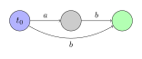
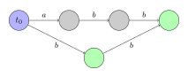

# 后缀自动机

[TOC]

**后缀自动机**是一个能解决许多字符串相关问题的有力的数据结构。

举个例子，字符串问题：

 - 在另一个字符串中搜索一个字符串的所有出现位置。
 - 计算给定的字符串中有多少个不同的子串。

以上问题都可以在线性的时间复杂度内通过后缀自动机来实现。

直观上，字符串的后缀自动机可以理解为给定字符串的**所有子串**的压缩形式。引人注
意的事实是，后缀自动机将所有的这些信息以高度压缩的形式储存。对于一个长度为 $n$ 
的字符串，它的空间复杂度仅为 $O(n)$。此外，构造后缀自动机的时间复杂度仅为 
$O(n)$（这里我们将字符集的大小 $k$ 看作常数，否则时间复杂度和空间复杂度均为 
$O(n\log k)$）。

## 后缀自动机的定义

给定字符串 $s$ 的后缀自动机是一个接受所有字符串 $s$ 的后缀的最小 **DFA**（确定
性有限自动机或确定性有限状态自动机）。

换句话说：

 - 后缀自动机是一张有向无环图。顶点被称作**状态**，边被称作状态间的**转移**。
 - 一个状态　$t_0$ 为**初始状态**，它必定为这张图的源点（其它各点均与 $t_0$
   联通）。
 - 每个**转移**都标有一些字母。从一个顶点出发的所有转移均**不同**。
 - 一个或多个状态为**终止状态**。如果我们从初始状态 $t_0$ 出发，最终转移到了一
   个终止状态，则路径上的所有转移连接起来一定是字符串 $s$ 的一个后缀。 $s$ 的每
   个后缀均可用一条从 $t_0$ 到一个终止状态的路径构成。
 - 后缀自动机是所有满足上述条件的自动机中顶点数最少的一个。

### 子串的性质

后缀自动机最简单和最重要的性质是，它包含关于字符串 $s$ 的所有子串的信息。任意从
初始状态 $t_0$ 开始的路径，如果我们将转移路径上的标号写下来，都会形成 $s$ 的一
个**子串**。反之每个 $s$ 的子串对应于从 $t_0$ 开始的某条路径。

为了简化表达，我们将会说子串**对应于**一条路径（从 $t_0$ 开始且一些标号构成这个
子串）。反过来我们说任意一条路径**对应于**它的标号构成的字符串。

一条或多条路径可以到达一个状态，因此我们说一个状态对应于字符串的集合，这也对应
于那些路径。

### 构造后缀自动机的实例

我们将会在这里展示一些简单的字符串的后缀自动机。

我们用蓝色表示初始状态，用绿色表示终止状态。

对于字符串 $s=``"$：

对于字符串 $s=``a"$：

对于字符串 $s=``aa"$：

对于字符串 $s=``ab"$：

对于字符串 $s=``abb"$：

对于字符串 $s=``abbb"$：

## 在线性时间内构造后缀自动机

在我们描述线性时间内构造后缀自动机的算法之前，我们需要引入几个对理解构造过程非
常重要的新概念并简单证明。

### 结束位置 $endpos$

考虑字符串 $s$ 的任意非空子串 $t$，我们记 $endpos(t)$ 为在字符串 $s$ 中 $t$ 
的所有结束位置。例如，对于字符串 $``abcbc''$，我们有 $endpos(``bc")=2,\,4$。

当两个子串 $t_1$ 与 $t_2$ 的末尾集合相等时我们称它们是 $endpos$ 等价的：即 
$endpos(t_1)=endpos(t_2)$。因此所有字符串 $s$ 的非空子串都可以根据他们的**
endpos**集合被分为几个**等价类**。

显然，在后缀自动机中，$endpos$ 等价的子串对应于同一状态。换句话说，后缀自动机
中的状态数等于所有子串的等价类的个数，加上初始状态。后缀自动机的状态个数等价于 
$endpos$ 相同的一个或多个子串。

我们稍后将会用这个假设介绍构造后缀自动机的算法。在那时我们将会发现，后缀自动机
需要满足的所有性质，除了最小性以外都满足了。由 Nerode 定理我们可以得出最小性
（这篇文章不会证明 Nerode 定理）。

由 $endpos$ 的值我们可以得到一些重要结论：

 > **引理 1：**当且仅当字符串 $u$ 以 $w$ 的一个后缀的形式出现在字符串 $s$   
 >             中时，两个非空子串 $u$ 和 $w$（假设 $length(u)\le length(w)$）
 >             是 $endpos$ 等价的。

引理显然成立。如果 $u$ 和 $v$ 的 $endpos$ 相同，则 $u$ 是 $w$ 的一个后缀，且只
以 $s$ 中的一个 $w$ 的后缀的形式出现。且根据定义，如果 $u$ 为 $w$ 的一个后缀，
且只以后缀的形式在 $s$ 中出现时，两个子串的 $endpos$ 值相等。

 > **引理 2：**考虑两个非空子串 $u$ 和 $w$（假设 $length(u)\le length(w)$）。则
 >             它们的 $endpos$ 构成的集合要么完全没有交集，要么 $endpos(w)$ 
 >             是 $endpos(u)$ 的一个子集。并且这依赖于 $u$ 是否为 $w$ 的一个后
 >               缀。即：
 >
 >             $$
 >             \begin{cases}
 >             endpos(w)\subseteq endpos(u)&\text{if $u$ is a suffix of $w$}\\
 >             endpos{w}\cap endpos(u)=\emptyset&\text{otherwise}\\
 >             \end{cases}
 >             $$

证明：如果集合 $endpos(u)$ 与 $endpos(w)$ 有至少一个公共元素，那么由于字符串 
$u$ 与 $w$ 都在一个位置结束，即 $u$ 是 $w$ 的一个后缀。但是如果如此在每次 $w$ 
出现的位置子串 $u$ 也会出现，这意味着 $endpos(w)$ 是 $endpos(u)$ 的一个子集。

 > **引理 3：**考虑一个 $endpos$ 等价类。将类中的所有子串按长度非递增的顺序排
 >             序。即每个子串都会比它前一个子串短，与此同时每个子串也是它前一
 >             个子串的一个后缀。换句话说，同一等价类中的所有子串均互为后缀，
 >             且子串的长度恰好覆盖整个区间 $[x,\,y]$。

证明：固定一些 $endpos$ 等价类。如果等价类中只包含一个子串，引理显然成立。现在
我们来讨论子串元素个数大于 $1$ 的等价类。

由引理 1，两个不同的 $endpos$ 等价字符串中较短的一个总是较长的一个的真后缀。因
此，等价类中不可能有两个等长的字符串。

记 $w$ 为等价类中最长的字符串，类似地，记 $u$ 为等价类中最短的字符串。由引理
1，字符串 $u$ 是字符串 $w$ 的真后缀。现在考虑长度在区间 
$[length(u),\,length(w)]$ 中的 $w$ 的任意后缀。容易看出，这个后缀也在同一等价类
中。因为这个后缀只能在字符串 $s$ 中以 $w$ 的一个后缀的形式存在（也因为较短的后
缀 $u$ 在 $s$ 中只以 $w$ 的后缀的形式存在）。因此，由引理 1，这个后缀与字符串 
$w$ $endpos$ 等价。

### 后缀连接 $link$

考虑后缀自动机中满足 $v\ne t_0$ 的一些状态。我们已经知道，状态 $v$ 对应于具有相
同 $endpos$ 的等价类。我们如果定义 $w$ 为这些字符串中最长的一个，则所有其它的字
符串都是 $w$ 的后缀。

我们还知道字符串 $w$ 的前几个后缀（如果我们用长度降序考虑这些后缀）在这个等价类
中全部被包含，且所有其它后缀（至少一个——空后缀）在其它的等价类中。我们记 $t$ 
为最大的这样的后缀，然后用后缀连接连到 $t$ 上。

换句话说，一个**后缀连接** $link(v)$ 连接到对应于 $w$ 的最长后缀的另一个 
$endpos$ 等价类的状态。

以下我们假设初始状态 $t_0$ 对应于它自己这个等价类（只包含一个空字符串），为了方
便我们规定 $endpos(t)=\{-1,\,0,\,\ldots,\,length(s)-1\}$。

 > **引理 4：**所有后缀连接构成一棵根节点为 $t_0$ 的树。

证明：考虑任意满足 $v\ne t_0$ 的状态，一个后缀连接 $link(v)$ 连接到对应于严格更
短的字符串（根据后缀连接的定义和引理 3）。因此，通过在后缀连接上移动，我们早晚
会到达对应空串的初始状态 $t_0$。

