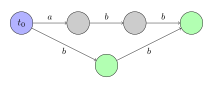
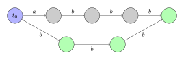
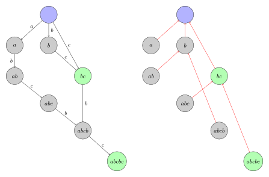

author: GoodCoder666, abc1763613206, ksyx

## 一些前置约定/定义

记 $\Sigma$ 为字符集，$\left|\Sigma\right|$ 为字符集大小。
对于一个字符串 $s$，记 $\left|s\right|$ 为其长度。

## 后缀自动机概述

**后缀自动机**(suffix automaton, SAM) 是一个能解决许多字符串相关问题的有力的数据结构。

举个例子，以下的字符串问题都可以在线性时间内通过 SAM 解决。

-   在另一个字符串中搜索一个字符串的所有出现位置。
-   计算给定的字符串中有多少个不同的子串。

直观上，字符串的 SAM 可以理解为给定字符串的 **所有子串** 的压缩形式。值得注意的事实是，SAM 将所有的这些信息以高度压缩的形式储存。对于一个长度为 $n$ 的字符串，它的空间复杂度仅为 $O(n)$。此外，构造 SAM 的时间复杂度仅为 $O(n)$。准确地说，一个 SAM 最多有 $2n-1$ 个节点和 $3n-4$ 条转移边。

## 定义

字符串 $s$ 的 SAM 是一个接受 $s$ 的所有后缀的最小 **DFA**（确定性有限自动机或确定性有限状态自动机）。

换句话说：

-   SAM 是一张有向无环图。结点被称作 **状态**，边被称作状态间的 **转移**。
-   图存在一个源点 $t_0$，称作 **初始状态**，其它各结点均可从 $t_0$ 出发到达。
-   每个 **转移** 都标有一些字母。从一个结点出发的所有转移均 **不同**。
-   存在一个或多个 **终止状态**。如果我们从初始状态 $t_0$ 出发，最终转移到了一个终止状态，则路径上的所有转移连接起来一定是字符串 $s$ 的一个后缀。$s$ 的每个后缀均可用一条从 $t_0$ 到某个终止状态的路径构成。
-   在所有满足上述条件的自动机中，SAM 的结点数是最少的。

### 子串的性质

SAM 最简单、也最重要的性质是，它包含关于字符串 $s$ 的所有子串的信息。任意从初始状态 $t_0$ 开始的路径，如果我们将转移路径上的标号写下来，都会形成 $s$ 的一个 **子串**。反之每个 $s$ 的子串对应从 $t_0$ 开始的某条路径。

为了简化表达，我们称子串 **对应** 一条路径（从 $t_0$ 开始、由一些标号构成这个子串）。反过来，我们说任意一条路径 **对应** 它的标号构成的字符串。

到达某个状态的路径可能不止一条，因此我们说一个状态对应一些字符串的集合，这个集合的每个元素对应这些路径。

### 构建过程

我们将会在这里展示一些简单的字符串的后缀自动机。

我们用蓝色表示初始状态，用绿色表示终止状态。

对于字符串 $s=\varnothing$：


对于字符串 $s=\texttt{a}$：


对于字符串 $s=\texttt{aa}$：


对于字符串 $s=\texttt{ab}$：


对于字符串 $s=\texttt{abb}$：



对于字符串 $s=\texttt{abbb}$：



## 在线性时间内构造

在我们描述线性时间内构造 SAM 的算法之前，我们需要引入几个对理解构造过程非常重要的概念，并对其性质进行简单证明。

### 结束位置 `endpos`

考虑字符串 $s$ 的任意非空子串 $t$，我们记 $\operatorname{endpos}(t)$ 为在字符串 $s$ 中 $t$ 的所有结束位置（假设对字符串中字符的编号从零开始）。例如，对于字符串 $\texttt{abcbc}$，我们有 $\operatorname{endpos}(\texttt{bc})=2,\,4$。

两个子串 $t_1$ 与 $t_2$ 的 $\operatorname{endpos}$ 集合可能相等：$\operatorname{endpos}(t_1)=\operatorname{endpos}(t_2)$。这样所有字符串 $s$ 的非空子串都可以根据它们的 $\operatorname{endpos}$ 集合被分为若干 **等价类**。

显然，SAM 中的每个状态对应一个或多个 $\operatorname{endpos}$ 相同的子串。换句话说，SAM 中的状态数等于所有子串的等价类的个数，再加上初始状态。SAM 的状态个数等价于 $\operatorname{endpos}$ 相同的一个或多个子串所组成的集合的个数 $+1$。

我们稍后将会用这个假设来介绍构造 SAM 的算法。我们将发现，SAM 需要满足的所有性质，除了最小性以外都满足了。由 Nerode 定理我们可以得出最小性（不会在这篇文章中证明）。

由 $\operatorname{endpos}$ 的值我们可以得到一些重要结论：

> **引理 1：** 字符串 $s$ 的两个非空子串 $u$ 和 $w$（假设 $\left|u\right|\le \left|w\right|$）的 $\operatorname{endpos}$ 相同，当且仅当字符串 $u$ 在 $s$ 中的每次出现，都是以 $w$ 后缀的形式存在的。

引理显然成立。如果 $u$ 和 $w$ 的 $\operatorname{endpos}$ 相同，则 $u$ 是 $w$ 的一个后缀，且只以 $s$ 中的一个 $w$ 的后缀的形式出现。且根据定义，如果 $u$ 为 $w$ 的一个后缀，且只以后缀的形式在 $s$ 中出现时，两个子串的 $\operatorname{endpos}$ 相同。

> **引理 2：** 考虑两个非空子串 $u$ 和 $w$（假设 $\left|u\right|\le \left|w\right|$）。那么要么 $\operatorname{endpos}(u)\cap \operatorname{endpos}(w)=\varnothing$，要么 $\operatorname{endpos}(w)\subseteq \operatorname{endpos}(u)$，取决于 $u$ 是否为 $w$ 的一个后缀：
>
> $$
> \begin{cases}
> \operatorname{endpos}(w) \subseteq \operatorname{endpos}(u) & \text{if } u \text{ is a suffix of } w \\
> \operatorname{endpos}(w) \cap \operatorname{endpos}(u) = \varnothing & \text{otherwise}
> \end{cases}
> $$

证明：如果集合 $\operatorname{endpos}(u)$ 与 $\operatorname{endpos}(w)$ 有至少一个公共元素，那么由于字符串 $u$ 与 $w$ 在相同位置结束，$u$ 是 $w$ 的一个后缀。所以在每次 $w$ 出现的位置，子串 $u$ 也会出现。所以 $\operatorname{endpos}(w)\subseteq \operatorname{endpos}(u)$。

> **引理 3：** 考虑一个 $\operatorname{endpos}$ 等价类，将类中的所有子串按长度非递增的顺序排序。每个子串都不会比它前一个子串长，与此同时每个子串也是它前一个子串的后缀。换句话说，对于同一等价类的任一两子串，较短者为较长者的后缀，且该等价类中的子串长度恰好覆盖整个区间 $[x,y]$。

???+ note "证明"
    如果 $\operatorname{endpos}$ 等价类中只包含一个子串，引理显然成立。现在我们来讨论子串元素个数大于 $1$ 的等价类。
    
    由引理 1，两个不同的 $\operatorname{endpos}$ 等价的字符串中，较短者总是较长者的真后缀。因此，等价类中没有等长的字符串。
    
    记 $w$ 为等价类中最长的字符串、$u$ 为等价类中最短的字符串。由引理 1，字符串 $u$ 是字符串 $w$ 的真后缀。现在考虑长度在区间 $[\left|u\right|,\left|w\right|]$ 中的 $w$ 的任意后缀。容易看出，这个后缀也在同一等价类中，因为这个后缀只能在字符串 $s$ 中以 $w$ 的一个后缀的形式存在（也因为较短的后缀 $u$ 在 $s$ 中只以 $w$ 的后缀的形式存在）。因此，由引理 1，这个后缀和字符串 $w$ 的 $\operatorname{endpos}$ 相同。

### 后缀链接 `link`

考虑 SAM 中某个不是 $t_0$ 的状态 $v$。我们已经知道，状态 $v$ 对应于具有相同 $\operatorname{endpos}$ 的等价类。我们如果定义 $w$ 为这些字符串中最长的一个，则所有其它的字符串都是 $w$ 的后缀。

我们还知道字符串 $w$ 的前几个后缀（按长度降序考虑）全部包含于这个等价类，且所有其它后缀（至少有一个——空后缀）在其它的等价类中。我们记 $t$ 为最长的这样的后缀，然后将 $v$ 的后缀链接连到 $t$ 上。

换句话说，一个 **后缀链接** $\operatorname{link}(v)$ 连接到对应于 $w$ 的最长后缀的另一个 $\operatorname{endpos}$ 等价类的状态。

以下我们假设初始状态 $t_0$ 对应于它自己这个等价类（只包含一个空字符串）。为了方便，我们规定 $\operatorname{endpos}(t_0)=\{-1,0,\ldots,\left|S\right|-1\}$。

> **引理 4：** 所有后缀链接构成一棵根节点为 $t_0$ 的树。

证明：考虑任意不是 $t_0$ 的状态 $v$，后缀链接 $\operatorname{link}(v)$ 连接到的状态对应于严格更短的字符串（后缀链接的定义、引理 3）。因此，沿后缀链接移动，我们总是能到达对应空串的初始状态 $t_0$。

> **引理 5：** 通过 $\operatorname{endpos}$ 集合构造的树（每个子节点的 $\textit{subset}$ 都包含在父节点的 $\textit{subset}$ 中）与通过后缀链接 $\operatorname{link}$ 构造的树相同。

证明：由引理 2，任意一个 SAM 的 $\operatorname{endpos}$ 集合形成了一棵树（因为两个集合要么完全没有交集要么其中一个是另一个的子集）。

我们现在考虑任意不是 $t_0$ 的状态 $v$ 及后缀链接 $\operatorname{link}(v)$，由后缀链接和引理 2，我们可以得到

$$
\operatorname{endpos}(v)\subsetneq \operatorname{endpos}(\operatorname{link}(v)),
$$

注意这里应该是 $\subsetneq$ 而不是 $\subseteq$，因为若 $\operatorname{endpos}(v)=\operatorname{endpos}(\operatorname{link}(v))$，那么 $v$ 和 $\operatorname{link}(v)$ 应该被合并为一个节点

结合前面的引理有：后缀链接构成的树本质上是 $\operatorname{endpos}$ 集合构成的一棵树。

以下是对字符串 $\texttt{abcbc}$ 构造 SAM 时产生的后缀链接树的一个 **例子**，节点被标记为对应等价类中最长的子串。



### 小结

在学习算法本身前，我们总结一下之前学过的知识，并引入一些辅助记号。

-   $s$ 的子串可以根据它们结束的位置 $\operatorname{endpos}$ 被划分为多个等价类；
-   SAM 由初始状态 $t_0$ 和与每一个 $\operatorname{endpos}$ 等价类对应的每个状态组成；
-   对于每一个状态 $v$，一个或多个子串与之匹配。我们记 $\operatorname{longest}(v)$ 为其中最长的一个字符串，记 $\operatorname{len}(v)$ 为它的长度。类似地，记 $\operatorname{shortest}(v)$ 为最短的子串，它的长度为 $\operatorname{minlen}(v)$。那么对应这个状态的所有字符串都是字符串 $\operatorname{longest}(v)$ 的不同的后缀，且所有字符串的长度恰好覆盖区间 $[\operatorname{minlen}(v),\operatorname{len}(v)]$ 中的每一个整数。
-   对于任意不是 $t_0$ 的状态 $v$，定义后缀链接为连接到对应字符串 $\operatorname{longest}(v)$ 的长度为 $\operatorname{minlen}(v)-1$ 的后缀的一条边。从根节点 $t_0$ 出发的后缀链接可以形成一棵树。这棵树也表示 $\operatorname{endpos}$ 集合间的包含关系。
-   对于 $t_0$ 以外的状态 $v$，可用后缀链接 $\operatorname{link}(v)$ 表达 $\operatorname{minlen}(v)$：

$$
\operatorname{minlen}(v)=\operatorname{len}(\operatorname{link}(v))+1.
$$

-   如果我们从任意状态 $v_0$ 开始顺着后缀链接遍历，总会到达初始状态 $t_0$。这种情况下我们可以得到一个互不相交的区间 $[\operatorname{minlen}(v_i),\operatorname{len}(v_i)]$ 的序列，且它们的并集形成了连续的区间 $[0,\operatorname{len}(v_0)]$。

### 算法

现在我们可以学习构造 SAM 的算法了。这个算法是 **在线** 算法，我们可以逐个加入字符串中的每个字符，并且在每一步中对应地维护 SAM。

为了保证线性的空间复杂度，我们将只保存 $\operatorname{len}$ 和 $\operatorname{link}$ 的值和每个状态的转移列表，我们不会标记终止状态（但是我们稍后会展示在构造 SAM 后如何分配这些标记）。

一开始 SAM 只包含一个状态 $t_0$，编号为 $0$（其它状态的编号为 $1,2,\ldots$）。为了方便，对于状态 $t_0$ 我们指定 $\operatorname{len}=0$、$\operatorname{link}=-1$（$-1$ 表示虚拟状态）。

#### 过程

现在，任务转化为实现给当前字符串添加一个字符 $c$ 的过程。算法流程如下：

-   令 $\textit{last}$ 为添加字符 $c$ 之前，整个字符串对应的状态（一开始我们设 $\textit{last}=0$，算法的最后一步更新 $\textit{last}$）。
-   创建一个新的状态 $\textit{cur}$，并将 $\operatorname{len}(\textit{cur})$ 赋值为 $\operatorname{len}(\textit{last})+1$，在这时 $\operatorname{link}(\textit{cur})$ 的值还未知。
-   现在我们按以下流程进行（从状态 $\textit{last}$ 开始）。如果还没有到字符 $c$ 的转移，我们就添加一个到状态 $\textit{cur}$ 的转移，遍历后缀链接。如果在某个点已经存在到字符 $c$ 的转移，我们就停下来，并将这个状态标记为 $p$。
-   如果没有找到这样的状态 $p$，我们就到达了虚拟状态 $-1$，我们将 $\operatorname{link}(\textit{cur})$ 赋值为 $0$ 并退出。
-   假设现在我们找到了一个状态 $p$，其可以通过字符 $c$ 转移。我们将转移到的状态标记为 $q$。
-   现在我们分类讨论两种状态，要么 $\operatorname{len}(p) + 1 = \operatorname{len}(q)$，要么不是。
-   如果 $\operatorname{len}(p)+1=\operatorname{len}(q)$，我们只要将 $\operatorname{link}(\textit{cur})$ 赋值为 $q$ 并退出。
-   否则就会有些复杂。需要 **复制** 状态 $q$：我们创建一个新的状态 $\textit{clone}$，复制 $q$ 的除了 $\operatorname{len}$ 的值以外的所有信息（后缀链接和转移）。我们将 $\operatorname{len}(\textit{clone})$ 赋值为 $\operatorname{len}(p)+1$。  
    复制之后，我们将后缀链接从 $\textit{cur}$ 指向 $\textit{clone}$，也从 $q$ 指向 $\textit{clone}$。  
    最终我们需要使用后缀链接从状态 $p$ 往回走，只要存在一条通过 $p$ 到状态 $q$ 的转移，就将该转移重定向到状态 $\textit{clone}$。
-   以上三种情况，在完成这个过程之后，我们将 $\textit{last}$ 的值更新为状态 $\textit{cur}$。

如果我们还想知道哪些状态是 **终止状态** 而哪些不是，我们可以在为字符串 $s$ 构造完完整的 SAM 后找到所有的终止状态。为此，我们从对应整个字符串的状态（存储在变量 $\textit{last}$ 中），遍历它的后缀链接，直到到达初始状态。我们将所有遍历到的节点都标记为终止节点。容易理解这样做我们会准确地标记字符串 $s$ 的所有后缀，这些状态都是终止状态。

在下一部分，我们将详细叙述算法每一步的细节，并证明它的 **正确性**。
因为我们只为 $s$ 的每个字符创建一个或两个新状态，所以 SAM 只包含 **线性个** 状态。

而线性规模的转移个数，以及算法总体的线性运行时间还不那么清楚。

### 正确性证明

-   若一个转移 $(p,q)$ 满足 $\operatorname{len}(p)+1=\operatorname{len}(q)$，则我们称这个转移是 **连续的**。否则，即当 $\operatorname{len}(p)+1<\operatorname{len}(q)$ 时，这个转移被称为 **不连续的**。从算法描述中可以看出，连续的、不连续的转移是算法的不同情况。连续的转移是固定的，我们不会再改变了。与此相反，当向字符串中插入一个新的字符时，不连续的转移可能会改变（转移边的端点可能会改变）。
-   为了避免引起歧义，我们记向 SAM 中插入当前字符 $c$ 之前的字符串为 $s$。
-   算法从创建一个新状态 $\textit{cur}$ 开始，对应于整个字符串 $s+c$。我们创建一个新的节点的原因很清楚。与此同时我们也创建了一个新的字符和一个新的等价类。
-   在创建一个新的状态之后，我们会从对应整个字符串 $s$ 的状态通过后缀链接进行遍历。对于每一个状态，我们尝试添加一个通过字符 $c$ 到新状态 $\textit{cur}$ 的转移。然而我们只能添加与原有转移不冲突的转移。因此我们只要找到已存在的 $c$ 的转移，我们就必须停止。
-   最简单的情况是我们到达了虚拟状态 $-1$，这意味着我们为所有 $s$ 的后缀添加了 $c$ 的转移。这也意味着，字符 $c$ 从未在字符串 $s$ 中出现过。因此 $\textit{cur}$ 的后缀链接为状态 $0$。
-   第二种情况下，我们找到了现有的转移 $(p,q)$。这意味着我们尝试向自动机内添加一个 **已经存在的** 字符串 $x+c$（其中 $x$ 为 $s$ 的一个后缀，且字符串 $x+c$ 已经作为 $s$ 的一个子串出现过了）。因为我们假设字符串 $s$ 的自动机的构造是正确的，我们不应该在这里添加一个新的转移。然而，难点在于，从状态 $\textit{cur}$ 出发的后缀链接应该连接到哪个状态呢？我们要把后缀链接连到一个状态上，且其中最长的一个字符串恰好是 $x+c$，即这个状态的 $\operatorname{len}$ 应该是 $\operatorname{len}(p)+1$。然而还不存在这样的状态，即 $\operatorname{len}(q)>\operatorname{len}(p)+1$。这种情况下，我们必须通过拆开状态 $q$ 来创建一个这样的状态。
-   如果转移 $(p,\,q)$ 是连续的，那么 $\operatorname{len}(q)=\operatorname{len}(p)+1$。在这种情况下一切都很简单。我们只需要将 $\textit{cur}$ 的后缀链接指向状态 $q$。
-   否则转移是不连续的，即 $\operatorname{len}(q)>\operatorname{len}(p)+1$，这意味着状态 $q$ 不只对应于长度为 $\operatorname{len}(p)+1$ 的后缀 $s+c$，还对应于 $s$ 的更长的子串。除了将状态 $q$ 拆成两个子状态以外我们别无他法，所以第一个子状态的长度就是 $\operatorname{len}(p)+1$ 了。  
    我们如何拆开一个状态呢？我们 **复制** 状态 $q$，产生一个状态 $\textit{clone}$，我们将 $\operatorname{len}(\textit{clone})$ 赋值为 $\operatorname{len}(p)+1$。由于我们不想改变遍历到 $q$ 的路径，我们将 $q$ 的所有转移复制到 $\textit{clone}$。我们也将从 $\textit{clone}$ 出发的后缀链接设置为 $q$ 的后缀链接的目标，并设置 $q$ 的后缀链接为 $\textit{clone}$。  
    在拆开状态后，我们将从 $\textit{cur}$ 出发的后缀链接设置为 $\textit{clone}$。  
    最后一步我们将一些到 $q$ 转移重定向到 $\textit{clone}$。我们需要修改哪些转移呢？只重定向相当于所有字符串 $w+c$（其中 $w$ 是 $p$ 的最长字符串）的后缀就够了。即，我们需要继续沿着后缀链接遍历，从结点 $p$ 直到虚拟状态 $-1$ 或者是转移到不是状态 $q$ 的一个转移。

### 对操作次数为线性的证明

首先我们假设字符集大小为 **常数**。如果字符集大小不是常数，SAM 的时间复杂度就不是线性的。从一个结点出发的转移存储在支持快速查询和插入的平衡树中。因此如果我们记 $\Sigma$ 为字符集，$\left|\Sigma\right|$ 为字符集大小，则算法的渐进时间复杂度为 $O(n\log\left|\Sigma\right|)$，空间复杂度为 $O(n)$。然而如果字符集足够小，可以不写平衡树，以空间换时间将每个结点的转移存储为长度为 $\left|\Sigma\right|$ 的数组（用于快速查询）和链表（用于快速遍历所有可用关键字）。这样算法的时间复杂度为 $O(n)$，空间复杂度为 $O(n\left|\Sigma\right|)$。

所以我们将认为字符集的大小为常数，即每次对一个字符搜索转移、添加转移、查找下一个转移。这些操作的时间复杂度都为 $O(1)$。

如果我们考虑算法的各个部分，算法中有三处时间复杂度不明显是线性的：

-   第一处是遍历所有状态 $\textit{last}$ 的后缀链接，添加字符 $c$ 的转移。
-   第二处是当状态 $q$ 被复制到一个新的状态 $\textit{clone}$ 时复制转移的过程。
-   第三处是修改指向 $q$ 的转移，将它们重定向到 $\textit{clone}$ 的过程。

我们使用 SAM 的大小（状态数和转移数）为 **线性的** 的事实（对状态数是线性的的证明就是算法本身，对转移数为线性的的证明将在稍后实现算法后给出）。

因此上述 **第一处和第二处** 的总复杂度显然为线性的，因为单次操作均摊只为自动机添加了一个新转移。

还需为 **第三处** 估计总复杂度，我们将最初指向 $q$ 的转移重定向到 $\textit{clone}$。我们记 $v=\operatorname{longest}(p)$，这是一个字符串 $s$ 的后缀，每次迭代长度都递减——因为字符串 $s$ 的位置每次迭代都单调上升。这种情况下，如果在循环的第一次迭代之前，相对应的字符串 $v$ 在距离 $\textit{last}$ 的深度为 $k$ $(k\ge 2)$ 的位置上（深度记为后缀链接的数量），那么在最后一次迭代后，字符串 $v+c$ 将会成为路径上第二个从 $\textit{cur}$ 出发的后缀链接（它将会成为新的 $\textit{last}$ 的值）。

因此，循环中的每次迭代都会使作为当前字符串的后缀的字符串 $\operatorname{longest}(\operatorname{link}(\operatorname{link}(\textit{last}))$ 的位置单调递增。因此这个循环最多不会执行超过 $n$ 次迭代，这正是我们需要证明的。

### 实现

首先，我们实现一种存储一个转移的全部信息的数据结构。如果需要的话，你可以在这里加入一个终止标记，也可以是一些其它信息。我们将用一个 `map` 存储转移的列表，允许我们在总计 $O(n)$ 的空间复杂度和 $O(n\log\left|\Sigma\right|)$ 的时间复杂度内处理整个字符串。（注：在字符集大小为较小的常数，比如 26 时，将 `next` 定义为 `int[26]` 更方便）

```cpp
struct state {
  int len, link;
  std::map<char, int> next;
};
```

SAM 本身将会存储在一个 `state` 结构体数组中。我们记录当前自动机的大小 `sz` 和变量 `last`，当前整个字符串对应的状态。

```cpp
const int MAXLEN = 100000;
state st[MAXLEN * 2];
int sz, last;
```

我们定义一个函数来初始化 SAM（创建一个只有初始状态的 SAM）。

```cpp
void sam_init() {
  st[0].len = 0;
  st[0].link = -1;
  sz++;
  last = 0;
}
```

最终我们给出主函数的实现：给当前行末增加一个字符，对应地在之前的基础上建造自动机。

???+ note "实现"
    ```cpp
    void sam_extend(char c) {
      int cur = sz++;
      st[cur].len = st[last].len + 1;
      int p = last;
      while (p != -1 && !st[p].next.count(c)) {
        st[p].next[c] = cur;
        p = st[p].link;
      }
      if (p == -1) {
        st[cur].link = 0;
      } else {
        int q = st[p].next[c];
        if (st[p].len + 1 == st[q].len) {
          st[cur].link = q;
        } else {
          int clone = sz++;
          st[clone].len = st[p].len + 1;
          st[clone].next = st[q].next;
          st[clone].link = st[q].link;
          while (p != -1 && st[p].next[c] == q) {
            st[p].next[c] = clone;
            p = st[p].link;
          }
          st[q].link = st[cur].link = clone;
        }
      }
      last = cur;
    }
    ```

正如之前提到的一样，如果你用内存换时间（空间复杂度为 $O(n\left|\Sigma\right|)$，其中 $\left|\Sigma\right|$ 为字符集大小），你可以在 $O(n)$ 的时间内构造字符集大小任意的 SAM。但是这样你需要为每一个状态储存一个大小为 $\left|\Sigma\right|$ 的数组（用于快速跳转到转移的字符），和另外一个所有转移的链表（用于快速在转移中迭代）。

## 更多性质

### 状态数

对于一个长度为 $n$ 的字符串 $s$，它的 SAM 中的状态数 **不会超过**  $2n-1$（假设 $n\ge 2$）。

算法本身即可证明该结论。一开始，自动机含有一个状态，第一次和第二次迭代中只会创建一个节点，剩余的 $n-2$ 步中每步会创建至多 $2$ 个状态。

然而我们也能在 **不借助这个算法** 的情况下 **证明** 这个估计值。我们回忆一下状态数等于不同的 $\operatorname{endpos}$ 集合个数。这些 $\operatorname{endpos}$ 集合形成了一棵树（祖先节点的集合包含了它所有孩子节点的集合）。考虑将这棵树稍微变形一下：只要它有一个只有一个孩子的内部结点（这意味着该子节点的集合至少遗漏了它的父集合中的一个位置），我们创建一个含有这个遗漏位置的集合。最后我们可以获得一棵每一个内部结点的度数大于 1 的树，且叶子节点的个数不超过 $n$。因此这样的树里有不超过 $2n-1$ 个节点。

字符串 $\texttt{abbb} \cdots \texttt{bbb}$ 的状态数达到了该上界：从第三次迭代后的每次迭代，算法都会拆开一个状态，最终产生恰好 $2n-1$ 个状态。

### 转移数

对于一个长度为 $n$ 的字符串 $s$，它的 SAM 中的转移数 **不会超过**  $3n-4$（假设 $n\ge 3$）。

证明如下：

我们首先估计连续的转移的数量。考虑自动机中从状态 $t_0$ 开始的所有最长路径的生成树。生成树只包含连续的边，因此数量少于状态数，即边数不会超过 $2n-2$。

现在我们来估计不连续的转移的数量。令当前不连续转移为 $(p,\,q)$，其字符为 $c$。我们取它的对应字符串 $u+c+w$，其中字符串 $u$ 对应于初始状态到 $p$ 的最长路径，$w$ 对应于从 $q$ 到任意终止状态的最长路径。一方面，每个不完整的字符串所对应的形如 $u+c+w$ 的字符串是不同的（因为字符串 $u$ 和 $w$ 仅由完整的转移组成）。另一方面，由终止状态的定义，每个形如 $u+c+w$ 的字符串都是整个字符串 $s$ 的后缀。因为 $s$ 只有 $n$ 个非空后缀，且形如 $u+c+w$ 的字符串都不包含 $s$（因为整个字符串只包含完整的转移），所以非完整的转移的总数不会超过 $n-1$。

将以上两个估计值相加，我们可以得到上界 $3n-3$。然而，最大的状态数只能在类似于 $\texttt{abbb} \cdots \texttt{bbb}$ 的情况中产生，而此时转移数量显然少于 $3n-3$。

因此我们可以获得更为紧确的 SAM 的转移数的上界：$3n-4$。字符串 $\texttt{abbb} \cdots \texttt{bbbc}$ 就达到了这个上界。

### 额外信息

观察 [实现](#实现) 中的结构体的每个变量。实际上，尽管 SAM 本身由 `next` 组成，但 SAM 构造算法中作为辅助变量的 `link` 和 `len` 在应用中常常比 `next` 重要，甚至可以抛开 `next` 单独使用。

设字符串的长度为 $n$，考虑 `extend` 操作中 `cur` 变量的值，这个节点对应的状态是<u>执行 `extend` 操作时的当前字符串</u>，即字符串的一个前缀，每个前缀有一个终点。这样得到的 $n$ 个节点，对应了 $n$ 个不同的 **终点**。设第 $i$ 个节点为 $v_i$，对应的是 $S_{1 \ldots i}$，终点是 $i$。姑且把这些节点称之为「终点节点」。

考虑给 SAM 赋予树形结构，树的根为 0，且其余节点 $v$ 的父亲为 $\operatorname{link}(v)$。则这棵树与原 SAM 的关系是：

-   每个节点的终点集合等于其 **子树** 内所有终点节点对应的终点的集合。

在此基础上可以给每个节点赋予一个最长字符串，是其终点集合中 **任意** 一个终点开始 **往前** 取 `len` 个字符得到的字符串。每个这样的字符串都一样，且 `len` 恰好是满足这个条件的最大值。

这些字符串满足的性质是：

-   如果节点 A 是 B 的祖先，则节点 A 对应的字符串是节点 B 对应的字符串的 **后缀**。

这条性质把字符串所有前缀组成了一棵树，且有许多符合直觉的树的性质。例如，$S_{1 \ldots p}$ 和 $S_{1 \ldots q}$ 的最长公共后缀对应的字符串就是 $v_p$ 和 $v_q$ 对应的 LCA 的字符串。实际上，这棵树与将字符串 $S$ 翻转后得到字符串的压缩后缀树结构相同。

每个状态 $i$ 对应的子串数量是 $\operatorname{len}(i)-\operatorname{len}(\operatorname{link}(i))$（节点 $0$ 例外）。注意到 $\operatorname{link}(i)$ 对应的字符串是 $i$ 对应的字符串的一个后缀，这些子串就是 $i$ 对应字符串的所有后缀，去掉被父亲「抢掉」的那部分，即 $\operatorname{link}(i)$ 对应字符串的所有后缀。

## 应用

下面我们来看一些可以用 SAM 解决的问题。简单起见，假设字符集的大小 $k$ 为常数。这允许我们认为增加一个字符和遍历的复杂度为常数。

### 检查字符串是否出现

> 给一个文本串 $T$ 和多个模式串 $P$，我们要检查字符串 $P$ 是否作为 $T$ 的一个子串出现。

我们在 $O(\left|T\right|)$ 的时间内对文本串 $T$ 构造后缀自动机。为了检查模式串 $P$ 是否在 $T$ 中出现，我们沿转移（边）从 $t_0$ 开始根据 $P$ 的字符进行转移。如果在某个点无法转移下去，则模式串 $P$ 不是 $T$ 的一个子串。如果我们能够这样处理完整个字符串 $P$，那么模式串在 $T$ 中出现过。

对于每个字符串 $P$，算法的时间复杂度为 $O(\left|P\right|)$。此外，这个算法还找到了模式串 $P$ 在文本串中出现的最大前缀长度。

### 不同子串个数

> 给一个字符串 $S$，计算不同子串的个数。

对字符串 $S$ 构造后缀自动机。

每个 $S$ 的子串都相当于自动机中的一些路径。因此不同子串的个数等于自动机中以 $t_0$ 为起点的不同路径的条数。

考虑到 SAM 为有向无环图，不同路径的条数可以通过动态规划计算。即令 $d_{v}$ 为从状态 $v$ 开始的路径数量（包括长度为零的路径），则我们有如下递推方程：

$$
d_{v}=1+\sum_{w:(v,w,c)\in DAWG}d_{w}
$$

即，$d_{v}$ 可以表示为所有 $v$ 的转移的末端的和。

所以不同子串的个数为 $d_{t_0}-1$（因为要去掉空子串）。

总时间复杂度为：$O(\left|S\right|)$。

另一种方法是利用上述后缀自动机的树形结构。每个节点对应的子串数量是 $\operatorname{len}(i)-\operatorname{len}(\operatorname{link}(i))$，对自动机所有节点求和即可。

例题：[【模板】后缀自动机](https://www.luogu.com.cn/problem/P3804)，[SDOI2016 生成魔咒](https://loj.ac/problem/2033)

### 所有不同子串的总长度

> 给定一个字符串 $S$，计算所有不同子串的总长度。

本题做法与上一题类似，只是现在我们需要考虑分两部分进行动态规划：不同子串的数量 $d_{v}$ 和它们的总长度 $ans_{v}$。

我们已经在上一题中介绍了如何计算 $d_{v}$。$ans_{v}$ 的值可以通过以下递推式计算：

$$
ans_{v}=\sum_{w:(v,w,c)\in DAWG}d_{w}+ans_{w}
$$

我们取每个邻接结点 $w$ 的答案，并加上 $d_{w}$（因为从状态 $v$ 出发的子串都增加了一个字符）。

算法的时间复杂度仍然是 $O(\left|S\right|)$。

同样可以利用上述后缀自动机的树形结构。每个节点对应的所有后缀长度是 $\frac{\operatorname{len}(i)\times (\operatorname{len}(i)+1)}{2}$，减去其 $\operatorname{link}$ 节点的对应值就是该节点的净贡献，对自动机所有节点求和即可。

### 字典序第 k 大子串

> 给定一个字符串 $S$。多组询问，每组询问给定一个数 $K_i$，查询 $S$ 的所有子串中字典序第 $K_i$ 大的子串。

解决这个问题的思路可以从解决前两个问题的思路发展而来。字典序第 $k$ 大的子串对应于 SAM 中字典序第 $k$ 大的路径，因此在计算每个状态的路径数后，我们可以很容易地从 SAM 的根开始找到第 $k$ 大的路径。

预处理的时间复杂度为 $O(\left|S\right|)$，单次查询的复杂度为 $O(\left|ans\right|\cdot\left|\Sigma\right|)$（其中 $ans$ 是查询的答案，$\left|\Sigma\right|$ 为字符集的大小）。

> 虽然该题是后缀自动机的经典题，但实际上这题由于涉及字典序，用后缀数组做最方便。

例题：[SPOJ - SUBLEX](https://www.spoj.com/problems/SUBLEX/)，[TJOI2015 弦论](https://loj.ac/problem/2102)

### 最小循环移位

> 给定一个字符串 $S$。找出字典序最小的循环移位。

容易发现字符串 $S+S$ 包含字符串 $S$ 的所有循环移位作为子串。

所以问题简化为在 $S+S$ 对应的后缀自动机上寻找最小的长度为 $\left|S\right|$ 的路径，这可以通过平凡的方法做到：我们从初始状态开始，贪心地访问最小的字符即可。

总的时间复杂度为 $O(\left|S\right|)$。

### 出现次数

> 对于一个给定的文本串 $T$，有多组询问，每组询问给一个模式串 $P$，回答模式串 $P$ 在字符串 $T$ 中作为子串出现了多少次。

利用后缀自动机的树形结构，进行 dfs 即可预处理每个节点的终点集合大小。在自动机上查找模式串 $P$ 对应的节点，如果存在，则答案就是该节点的终点集合大小；如果不存在，则答案为 $0$.

以下为原方法：

> 对文本串 $T$ 构造后缀自动机。
>
> 接下来做预处理：对于自动机中的每个状态 $v$，预处理 $cnt_{v}$，使之等于 $\operatorname{endpos}(v)$ 集合的大小。事实上，对应同一状态 $v$ 的所有子串在文本串 $T$ 中的出现次数相同，这相当于集合 $\operatorname{endpos}$ 中的位置数。
>
> 然而我们不能明确的构造集合 $\operatorname{endpos}$，因此我们只考虑它们的大小 $cnt$。
>
> 为了计算这些值，我们进行以下操作。对于每个状态，如果它不是通过复制创建的（且它不是初始状态 $t_0$），我们将它的 $cnt$ 初始化为 1。然后我们按它们的长度 $\operatorname{len}$ 降序遍历所有状态，并将当前的 $cnt_{v}$ 的值加到后缀链接指向的状态上，即：
>
> $$
> cnt_{\operatorname{link}(v)}+=cnt_{v}
> $$
>
> 这样做每个状态的答案都是正确的。
>
> 为什么这是正确的？不是通过复制获得的状态，恰好有 $\left|T\right|$ 个，并且它们中的前 $i$ 个在我们插入前 $i$ 个字符时产生。因此对于每个这样的状态，我们在它被处理时计算它们所对应的位置的数量。因此我们初始将这些状态的 $cnt$ 的值赋为 $1$，其它状态的 $cnt$ 值赋为 $0$。
>
> 接下来我们对每一个 $v$ 执行以下操作：$cnt_{\operatorname{link}(v)}+=cnt_{v}$。其背后的含义是，如果有一个字符串 $v$ 出现了 $cnt_{v}$ 次，那么它的所有后缀也在完全相同的地方结束，即也出现了 $cnt_{v}$ 次。
>
> 为什么我们在这个过程中不会重复计数（即把某些位置数了两次）呢？因为我们只将一个状态的位置添加到 **一个** 其它的状态上，所以一个状态不可能以两种不同的方式将其位置重复地指向另一个状态。
>
> 因此，我们可以在 $O(\left|T\right|)$ 的时间内计算出所有状态的 $cnt$ 的值。
>
> 最后回答询问只需要查找值 $cnt_{t}$，其中 $t$ 为模式串对应的状态，如果该模式串不存在答案就为 $0$。单次查询的时间复杂度为 $O(\left|P\right|)$。

### 第一次出现的位置

> 给定一个文本串 $T$，多组查询。每次查询字符串 $P$ 在字符串 $T$ 中第一次出现的位置（$P$ 的开头位置）。

我们构造一个后缀自动机。我们对 SAM 中的所有状态预处理位置 $\operatorname{firstpos}$。即，对每个状态 $v$ 我们想要找到第一次出现这个状态的末端的位置 $\operatorname{firstpos}[v]$。换句话说，我们希望先找到每个集合 $\operatorname{endpos}$ 中的最小的元素（显然我们不能显式地维护所有 $\operatorname{endpos}$ 集合）。

为了维护 $\operatorname{firstpos}$ 这些位置，我们将原函数扩展为 `sam_extend()`。当我们创建新状态 $\textit{cur}$ 时，我们令：

$$
\operatorname{firstpos}(\textit{cur})=\operatorname{len}(\textit{cur})-1
$$

；当我们将结点 $q$ 复制到 $\textit{clone}$ 时，我们令：

$$
\operatorname{firstpos}(\textit{clone})=\operatorname{firstpos}(q)
$$

（因为值的唯一的其它选项 $\operatorname{firstpos}(\textit{cur})$ 显然太大了）。

那么查询的答案就是 $\operatorname{firstpos}(t)-\left|P\right|+1$，其中 $t$ 为对应字符串 $P$ 的状态。单次查询只需要 $O(\left|P\right|)$ 的时间。

### 所有出现的位置

> 问题同上，这一次需要查询文本串 $T$ 中模式串出现的所有位置。

利用后缀自动机的树形结构，遍历子树，一旦发现终点节点就输出。

以下为原解法：

> 我们还是对文本串 $T$ 构造后缀自动机。与上一个问题相似，我们为所有状态计算位置 $\operatorname{firstpos}$。
>
> 如果 $t$ 为对应于模式串 $T$ 的状态，显然 $\operatorname{firstpos}(t)$ 为答案的一部分。需要查找的其它位置怎么办？我们使用了含有字符串 $P$ 的自动机，我们还需要将哪些状态纳入自动机呢？所有对应于以 $P$ 为后缀的字符串的状态。换句话说我们要找到所有可以通过后缀链接到达状态 $t$ 的状态。
>
> 因此为了解决这个问题，我们需要为每一个状态保存一个指向它的后缀引用列表。查询的答案就包含了对于每个我们能从状态 $t$ 只使用后缀引用进行 DFS 或 BFS 的所有状态的 $\operatorname{firstpos}$ 值。
>
> 这种变通方案的时间复杂度为 $O(\textit{answer}(P))$，因为我们不会重复访问一个状态（因为对于仅有一个后缀链接指向一个状态，所以不存在两条不同的路径指向同一状态）。
>
> 我们只需要考虑两个可能有相同 $\operatorname{endpos}$ 值的不同状态。如果一个状态是由另一个复制而来的，则这种情况会发生。然而，这并不会对复杂度分析造成影响，因为每个状态至多被复制一次。
>
> 此外，如果我们不从被复制的节点输出位置，我们也可以去除重复的位置。事实上对于一个状态，如果经过被复制状态可以到达，则经过原状态也可以到达。因此，如果我们给每个状态记录标记 `is_clone` 来代表这个状态是不是被复制出来的，我们就可以简单地忽略掉被复制的状态，只输出其它所有状态的 $firstpos$ 的值。
>
> 以下是大致的实现：
>
> ```cpp
> struct state {
>   bool is_clone;
>   int first_pos;
>   std::vector<int> inv_link;
>   // some other variables
> };
>
> // 在构造 SAM 后
> for (int v = 1; v < sz; v++) st[st[v].link].inv_link.push_back(v);
>
> // 输出所有出现位置
> void output_all_occurrences(int v, int P_length) {
>   if (!st[v].is_clone) cout << st[v].first_pos - P_length + 1 << endl;
>   for (int u : st[v].inv_link) output_all_occurrences(u, P_length);
> }
> ```

### 最短的没有出现的字符串

> 给定一个字符串 $S$ 和一个特定的字符集，我们要找一个长度最短的没有在 $S$ 中出现过的字符串。

我们在字符串 $S$ 的后缀自动机上做动态规划。

令 $d_{v}$ 为节点 $v$ 的答案，即，我们已经处理完了子串的一部分，当前在状态 $v$，想找到不连续的转移需要添加的最小字符数量。计算 $d_{v}$ 非常简单。如果不存在使用字符集中至少一个字符的转移，则 $d_{v}=1$。否则添加一个字符是不够的，我们需要求出所有转移中的最小值：

$$
d_{v}=1+\min_{w:(v,w,c)\in SAM}d_{w}
$$

问题的答案就是 $d_{t_0}$，字符串可以通过计算过的数组 $d$ 逆推回去。

### 两个字符串的最长公共子串

> 给定两个字符串 $S$ 和 $T$，求出最长公共子串，公共子串定义为在 $S$ 和 $T$ 中都作为子串出现过的字符串 $X$。

我们对字符串 $S$ 构造后缀自动机。

我们现在处理字符串 $T$，对于每一个前缀，都在 $S$ 中寻找这个前缀的最长后缀。换句话说，对于每个字符串 $T$ 中的位置，我们想要找到这个位置结束的 $S$ 和 $T$ 的最长公共子串的长度。显然问题的答案就是所有 $l$ 的最大值。

为了达到这一目的，我们使用两个变量，**当前状态**  $v$ 和 **当前长度**  $l$。这两个变量描述当前匹配的部分：它的长度和它们对应的状态。

一开始 $v=t_0$ 且 $l=0$，即，匹配为空串。

现在我们来描述如何添加一个字符 $T_{i}$ 并为其重新计算答案：

-   如果存在一个从 $v$ 到字符 $T_{i}$ 的转移，我们只需要转移并让 $l$ 自增一。
-   如果不存在这样的转移，我们需要缩短当前匹配的部分，这意味着我们需要按照后缀链接进行转移：

$$
v=\operatorname{link}(v)
$$

与此同时，需要缩短当前长度。显然我们需要将 $l$ 赋值为 $\operatorname{len}(v)$，因为经过这个后缀链接后我们到达的状态所对应的最长字符串是一个子串。

-   如果仍然没有使用这一字符的转移，我们继续重复经过后缀链接并减小 $l$，直到我们找到一个转移或到达虚拟状态 $-1$（这意味着字符 $T_{i}$ 根本没有在 $S$ 中出现过，所以我们设置 $v=l=0$）。

这一部分的时间复杂度为 $O(\left|T\right|)$，因为每次移动我们要么可以使 $l$ 增加一，要么可以在后缀链接间移动几次，每次都减小 $l$ 的值。

代码实现：

```cpp
string lcs(const string &S, const string &T) {
  sam_init();
  for (int i = 0; i < S.size(); i++) sam_extend(S[i]);

  int v = 0, l = 0, best = 0, bestpos = 0;
  for (int i = 0; i < T.size(); i++) {
    while (v && !st[v].next.count(T[i])) {
      v = st[v].link;
      l = st[v].length;
    }
    if (st[v].next.count(T[i])) {
      v = st[v].next[T[i]];
      l++;
    }
    if (l > best) {
      best = l;
      bestpos = i;
    }
  }
  return T.substr(bestpos - best + 1, best);
}
```

例题：[SPOJ Longest Common Substring](https://www.spoj.com/problems/LCS/en/)

### 多个字符串间的最长公共子串

> 给定 $k$ 个字符串 $S_i$。我们需要找到它们的最长公共子串，即作为子串出现在每个字符串中的字符串 $X$。

我们将所有的子串连接成一个较长的字符串 $T$，以特殊字符 $D_i$ 分开每个字符串（一个字符对应一个字符串）：

$$
T=S_1+D_1+S_2+D_2+\cdots+S_k+D_k.
$$

然后对字符串 $T$ 构造后缀自动机。

现在我们需要在自动机中找到存在于所有字符串 $S_i$ 中的一个字符串，这可以通过使用添加的特殊字符完成。注意如果 $S_j$ 包含了一个子串，则 SAM 中存在一条从包含字符 $D_j$ 的子串而不包含以其它字符 $D_1,\,\ldots,\,D_{j-1},\,D_{j+1},\,\ldots,\,D_k$ 开始的路径。

因此我们需要计算可达性，即对于自动机中的每个状态和每个字符 $D_i$，是否存在这样的一条路径。这可以容易地通过 DFS 或 BFS 及动态规划计算。之后，问题的答案就是状态 $v$ 的字符串 $\operatorname{longest}(v)$ 中存在所有特殊字符的路径。

例题：[SPOJ Longest Common Substring II](https://www.spoj.com/problems/LCS2/)

## 例题

-   [HihoCoder #1441 : 后缀自动机一·基本概念](http://hihocoder.com/problemset/problem/1441)
-   [【模板】后缀自动机](https://www.luogu.com.cn/problem/P3804)
-   [SDOI2016 生成魔咒](https://loj.ac/problem/2033)
-   [SPOJ - SUBLEX](https://www.spoj.com/problems/SUBLEX/)
-   [TJOI2015 弦论](https://loj.ac/problem/2102)
-   [SPOJ Longest Common Substring](https://www.spoj.com/problems/LCS/en/)
-   [SPOJ Longest Common Substring II](https://www.spoj.com/problems/LCS2/)
-   [Codeforces 1037H Security](https://codeforces.com/problemset/problem/1037/H)
-   [Codeforces 666E Forensic Examination](https://codeforces.com/problemset/problem/666/E)
-   [HDU4416 Good Article Good sentence](https://acm.hdu.edu.cn/showproblem.php?pid=4416)
-   [HDU4436 str2int](https://acm.hdu.edu.cn/showproblem.php?pid=4436)
-   [HDU6583 Typewriter](https://acm.hdu.edu.cn/showproblem.php?pid=6583)
-   [Codeforces 235C Cyclical Quest](https://codeforces.com/problemset/problem/235/C)
-   [CTSC2012 熟悉的文章](https://www.luogu.com.cn/problem/P4022)
-   [NOI2018 你的名字](https://uoj.ac/problem/395)

## 相关资料

我们先给出与 SAM 有关的最初的一些文献：

-   A. Blumer, J. Blumer, A. Ehrenfeucht, D. Haussler, R. McConnell.**Linear Size Finite Automata for the Set of All Subwords of a Word. An Outline of Results**\[1983]
-   A. Blumer, J. Blumer, A. Ehrenfeucht, D. Haussler.**The Smallest Automaton Recognizing the Subwords of a Text**\[1984]
-   Maxime Crochemore.**Optimal Factor Transducers**\[1985]
-   Maxime Crochemore.**Transducers and Repetitions**\[1986]
-   A. Nerode.**Linear automaton transformations**\[1958]

另外，在更新的一些资源以及很多关于字符串算法的书中，都能找到这个主题：

-   Maxime Crochemore, Rytter Wowjcieh.**Jewels of Stringology**\[2002]
-   Bill Smyth.**Computing Patterns in Strings**\[2003]
-   Bill Smith.**Methods and algorithms of calculations on lines**\[2006]

另外，还有一些资料：

-   《后缀自动机》，陈立杰。
-   《后缀自动机在字典树上的拓展》，刘研绎。
-   《后缀自动机及其应用》，张天扬。
-   <https://www.cnblogs.com/zinthos/p/3899679.html>
-   <https://codeforces.com/blog/entry/20861>
-   <https://zhuanlan.zhihu.com/p/25948077>

***

**本页面主要译自博文 [Суффиксный автомат](http://e-maxx.ru/algo/suffix_automata) 与其英文翻译版 [Suffix Automaton](https://cp-algorithms.com/string/suffix-automaton.html)。其中俄文版版权协议为 Public Domain + Leave a Link；英文版版权协议为 CC-BY-SA 4.0。**
