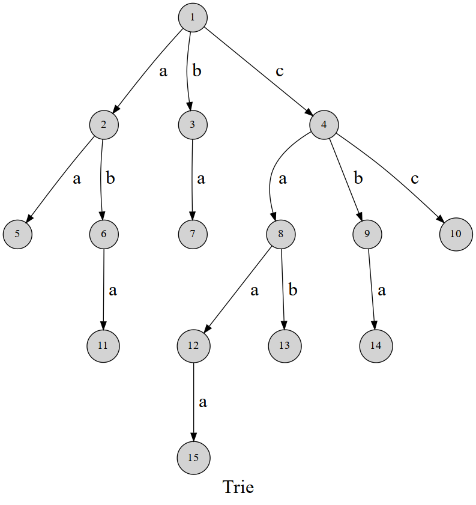

字典树，英文名 Trie。顾名思义，就是一个像字典一样的树。

## 简介

先放一张图：



可以发现，这棵字典树用边来代表字母，而从根结点到树上某一结点的路径就代表了一个字符串。举个例子， $1\to4\to 8\to 12$ 表示的就是字符串 `caa` 。

Trie 的结构非常好懂，我们用一个二维数组 $tr[i,j]$ 表示结点 i 的 j 字符指向的下一个结点，或着说是结点 i 代表的字符串后面添加一个字符 j 形成的字符串的结点。（j 的取值和字符集大小有关，不一定是 $0\sim 26$ ）

## 代码实现

放一个结构体封装的模板，十分好懂

```cpp
struct trie {
  int nex[100000][26], cnt;
  bool exist[100000];  // 该结点结尾的字符串是否存在

  void insert(char *s, int l) {  // 插入字符串
    int p = 0;
    for (int i = 0; i < l; i++) {
      int c = s[i] - 'a';
      if (!nex[p][c]) nex[p][c] = ++cnt;  // 如果没有，就添加结点
      p = nex[p][c];
    }
    exist[p] = 1;
  }
  bool find(char *s, int l) {  // 查找字符串
    int p = 0;
    for (int i = 0; i < l; i++) {
      int c = s[i] - 'a';
      if (!nex[p][c]) return 0;
      p = nex[p][c];
    }
    return exist[p];
  }
};
```

## 在 Trie 上 KMP

实际上要做的事情是求出 Trie 的每个节点的 $next$ 值。

当然，这里的 $next$ 不再是一个值，而是相当于是一个指针——它可能指向其他分支的节点。

这时 $next$ 的定义：最长的等于同长度的后缀的从根开始的路径的长度。

求法跟[KMP](/string/prefix-function/#knuth-morris-pratt)中的一样，只是要改成在 Trie 上[BFS](/search/bfs)。

复杂度：均摊分析失效了，其实只能在每条链上均摊分析，于是总复杂度为模式串长总和。
