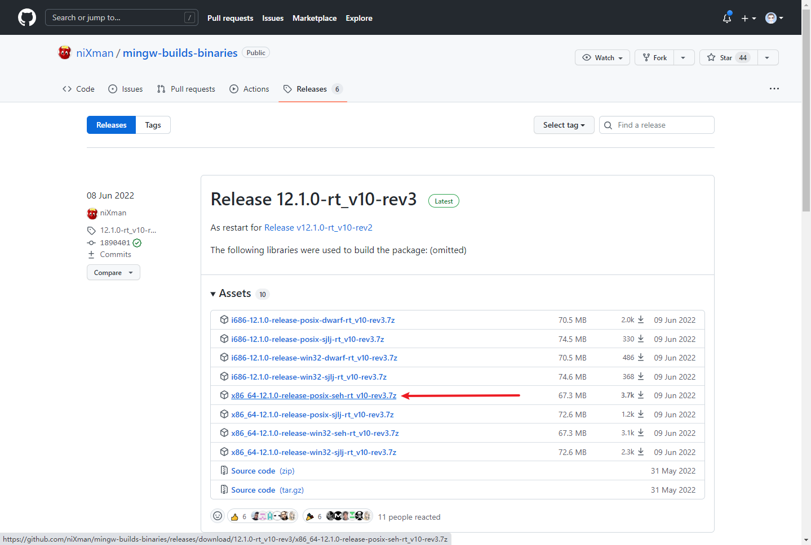
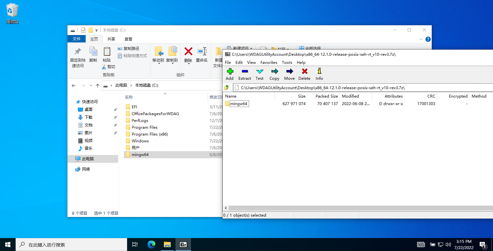
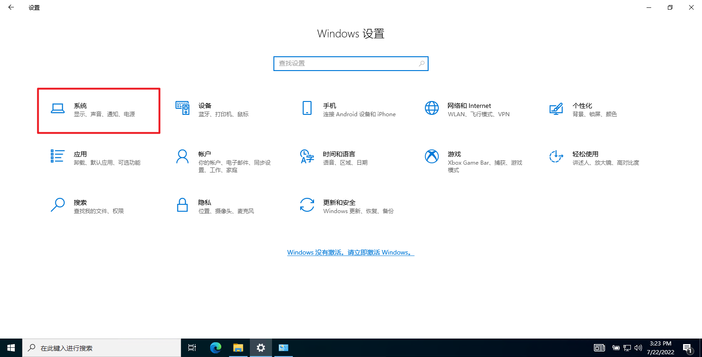
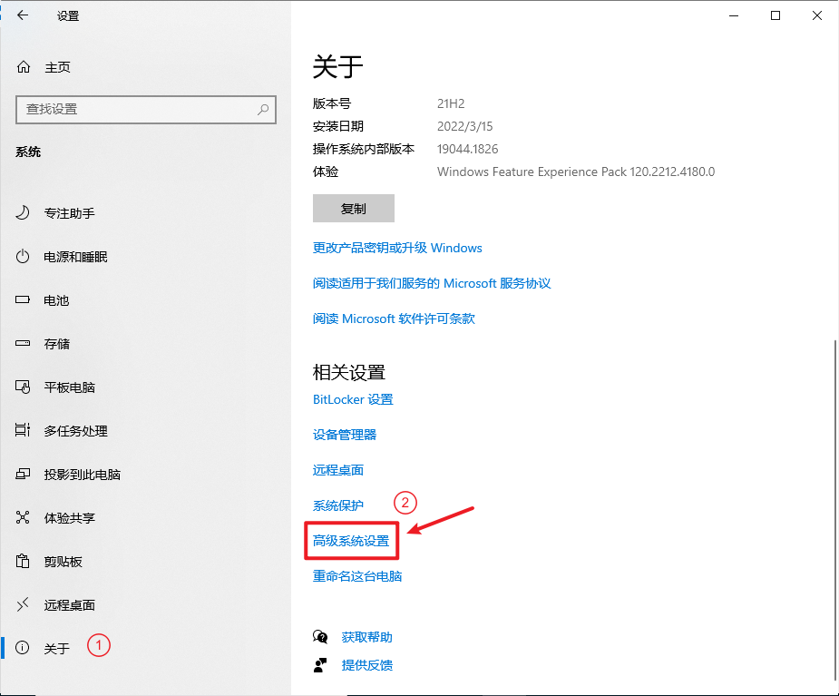
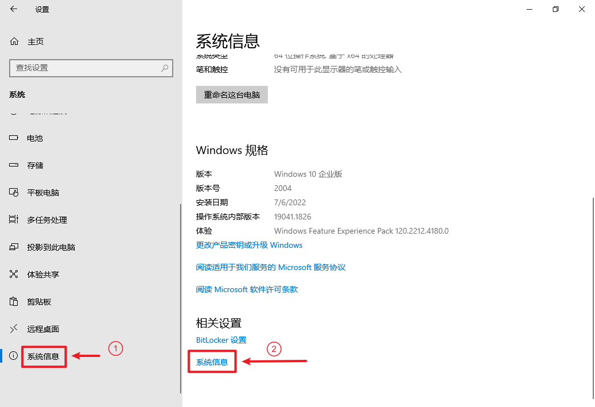
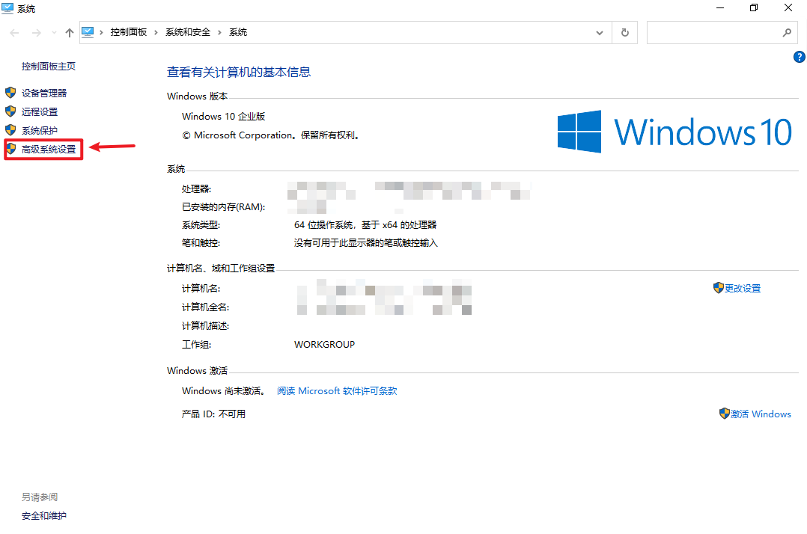

本页面主要介绍了各系统下各类编译器/解释器的安装步骤。

## GCC

### Windows

#### 手动下载安装

访问 [MinGW-w64](https://www.mingw-w64.org/downloads) 的下载页面，有多个构建版本。方便起见，我们使用由 WinLibs 提供的构建版本。

首先前往 [WinLibs](https://winlibs.com) 下载最新的安装包，选择合适的版本，本文选择了 GCC 12.3.0 + LLVM/Clang/LLD/LLDB 16.0.4 + MinGW-w64 11.0.0 (UCRT)：

默认会附带安装 LLVM Clang，如果不想安装，你也可以选择右边的 without LLVM/Clang/LLD/LLDB。



下载好后将其解压到电脑中的某个位置，教程中将其解压到了 C 盘的根目录。目录名中最好不要包含非英文字符和空格，否则可能会在后期导致一些问题。



接下来我们需要将编译器的可执行文件目录添加到系统环境变量中，这样在编译时就不需要指定编译器的路径了，方便使用。上方我们将 MinGW 解压到了 `C:\mingw64` 目录中，那么可执行文件所在的目录就是 `C:\mingw64\bin`。

按下 Windows 徽标 + R 组合键，输入 `rundll32.exe sysdm.cpl,EditEnvironmentVariables`，打开系统环境变量设置窗口，并在「系统变量」一节中选中名为「Path」的变量，然后点击「编辑」按钮：



在编辑窗口中点击右侧的「新建」按钮，为「Path」变量新建一个条目，并填入上文中记录下的可执行文件所在的目录（教程中为 `C:\mingw64\bin`）。



??? note "对部分老版本系统的提示"
    部分老版本系统只能手动修改变量的文本值，那么需要在变量的值的末尾插入一个 **半角分号**，再将可执行文件所在的目录粘贴到这个半角分号的后面，如图所示：
    
    

完成后一路点击「确定」按钮退出即可。

接下来打开终端，输入 `g++ --version` 并按下回车，如果出现如图所示的提示则代表安装成功。



#### Scoop 安装

打开 PowerShell，运行以下脚本：

```powershell
Set-ExecutionPolicy RemoteSigned -Scope CurrentUser
irm get.scoop.sh | iex
scoop install mingw-winlibs
```

### Linux

#### Debian/Ubuntu

首先先更新软件包列表：

```bash
sudo apt update
```

再使用命令直接安装即可：

```bash
sudo apt install g++
```

#### Arch Linux

使用命令直接安装即可：

```bash
sudo pacman -Syu gcc
```

#### openSUSE

使用命令直接安装即可：

```bash
sudo zypper in gcc-c++
```

### macOS

首先更新包管理器：

```bash
brew upgrade
brew update
```

再使用命令直接安装即可：

```bash
brew install gcc
```

## JDK

JDK 的发行版有很多，以下介绍两种：

-   OpenJDK 中的 [Eclipse Temurin](https://adoptium.net/zh-cn/)[^temurin]：参见 [Install Eclipse Temurin™ | Adoptium](https://adoptium.net/zh-CN/installation/)。
-   Oracle JDK：可参见 [JDK Installation Guide（JDK 17）](https://docs.oracle.com/en/java/javase/17/install/overview-jdk-installation.html)。

## Python 3

Python 的实现也有很多[^pythonimpl]，以 CPython 3 为例，参见 [Download Python | Python.org](https://www.python.org/downloads/)。

## LLVM

### Windows

??? note "LLVM 在 Windows 上的坑"
    由于 LLVM 在 Windows 上缺失标准库，所以你仍需安装 MSVC 或 GCC。

#### 直接安装

访问 [LLVM](https://github.com/llvm/llvm-project/releases/latest) 的下载页面，选择 LLVM-\*-win64.exe 下载。

如果你的网络质量不佳，你也可以选择访问 [清华大学开源软件镜像站](https://mirrors.tuna.tsinghua.edu.cn/github-release/llvm/llvm-project/LatestRelease/) 进行下载。

打开 .exe 文件，安装时勾选 Add LLVM to system PATH for current user，随后一直点击下一步即可安装完成。

打开终端，输入 `clang++ --version` 并回车，出现

```text
clang version 15.0.1
Target: x86_64-pc-windows-msvc
Thread model: posix
InstalledDir: <omitted>
```

类似物即代表成功。

#### Scoop 安装

打开 PowerShell，运行以下脚本：

```powershell
Set-ExecutionPolicy RemoteSigned -Scope CurrentUser
irm get.scoop.sh | iex
scoop install llvm
```

### Linux

#### openSUSE

使用命令直接安装即可：

```bash
sudo zypper in llvm clang
```

## MSVC (Visual Studio)

访问 [下载 Visual Studio](https://visualstudio.microsoft.com/zh-hans/downloads/) 页面，找到「下载」一节中的「社区」部分，点击「免费下载」。下载完成后打开安装器选择「Community 2022 安装」。在随后弹出来的窗口中仅选择「使用 C++ 的桌面开发」，然后单击安装。

如果你不想安装完整的 Visual Studio，可以滚动到下方「所有下载」一节，在「用于 Visual Studio 的工具」中找到「Visual Studio 生成工具」，点击后方的「下载」。下载完成后打开安装器，按照提示步骤选择「使用 C++ 的桌面开发」后安装即可。也可以使用 [PortableBuildTools](https://github.com/Data-Oriented-House/PortableBuildTools) 工具以仅安装 MSVC 编译器。

[^temurin]: [Eclipse Temurin](https://adoptium.net/) 即为原 [AdoptOpenJDK](https://adoptopenjdk.net/)，后者已于 2021 年 7 月移交至 [Eclipse 基金会](https://www.eclipse.org/org/foundation/)。具体可见 [本声明](https://blog.adoptopenjdk.net/2021/03/transition-to-eclipse-an-update/)。

[^pythonimpl]: [Alternative Python Implementations | Python.org](https://www.python.org/download/alternatives/)
