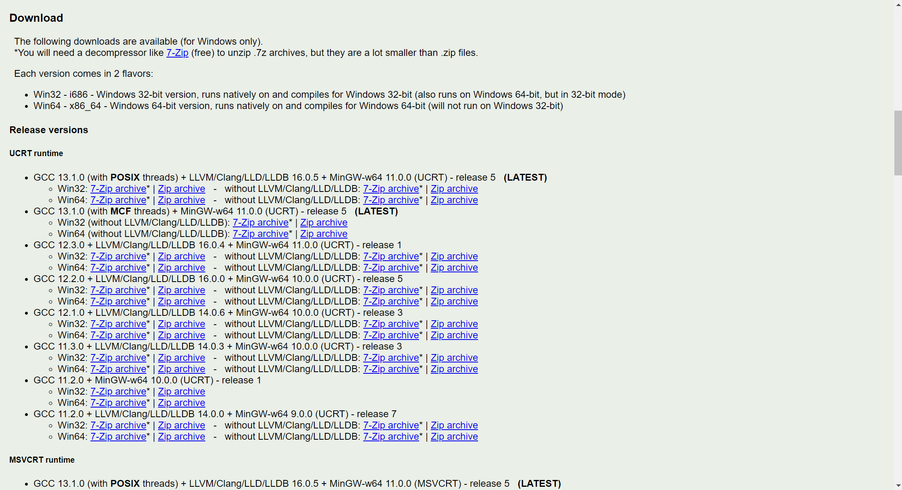
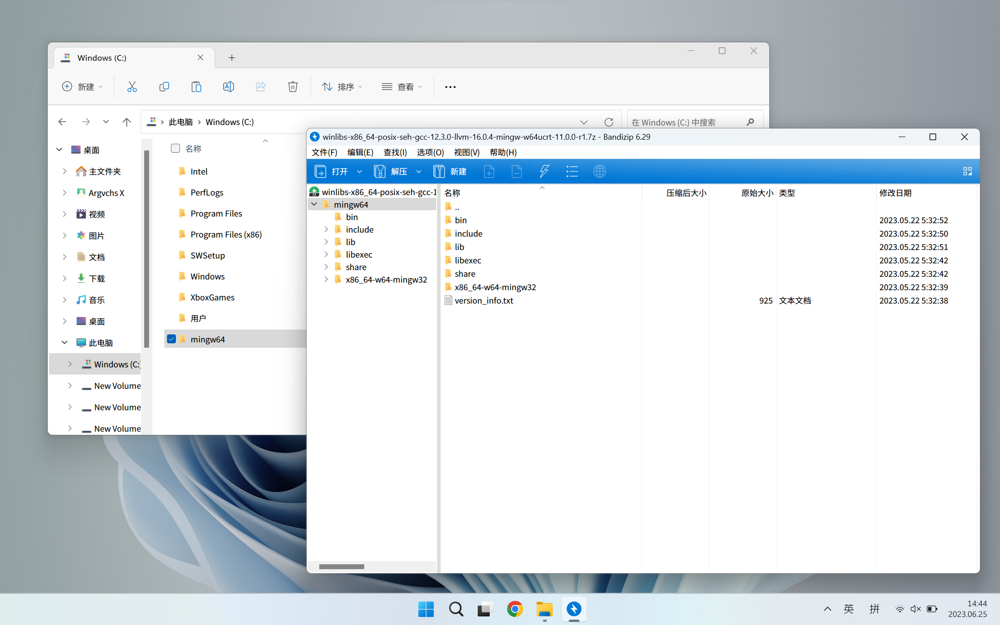
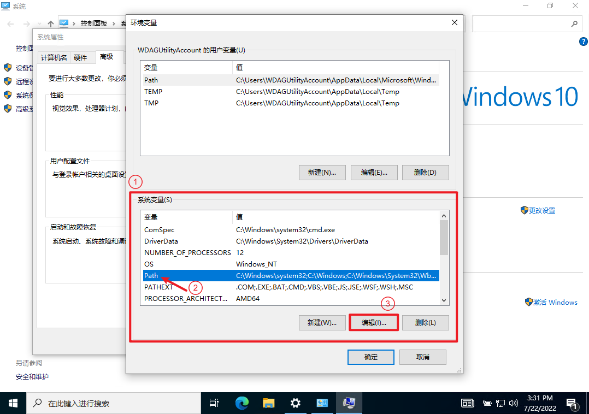
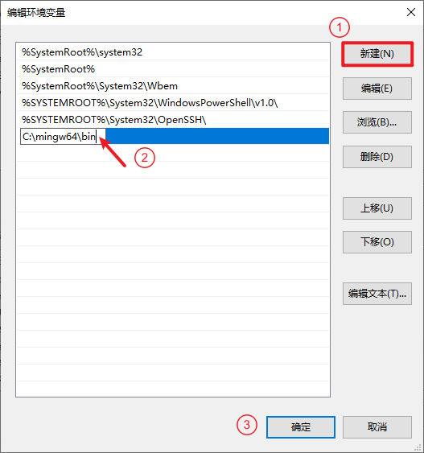
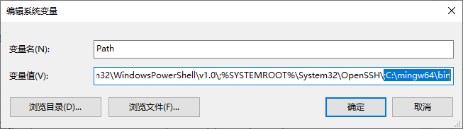
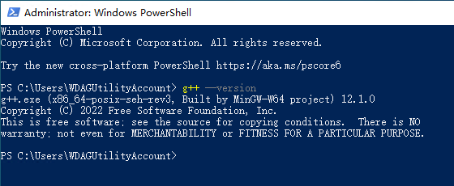

本页面主要介绍了各系统下 GCC 编译器的安装步骤。

## Windows

方便起见，我们在 Windows 系统下使用由 MinGW-w64 项目提供的 GCC 编译器。

首先前往 MinGW 的 [Releases](https://github.com/niXman/mingw-builds-binaries/releases/latest) 页面下载最新的安装包，如下图中红色箭头所示：



下载好后将其解压到电脑中的某个位置，教程中将其解压到了 C 盘的根目录。目录名中最好不要包含非英文字符和空格，否则可能会在后期导致一些问题。



接下来我们需要将编译器的可执行文件目录添加到系统环境变量中，这样在编译时就不需要指定编译器的路径了，方便使用。上方我们将 MinGW 解压到了 `C:\mingw64` 目录中，那么可执行文件所在的目录就是 `C:\mingw64\bin`。

接下来打开系统设置，进入「系统」页面：



向下滚动左侧栏，找到「关于」选项卡，点击「相关设置」一节中的「高级系统设置」选项：



??? note "对部分老版本系统的提示"

    部分老版本系统需要先点击「系统信息」选项打开控制面板，再点击「高级系统设置」选项进入菜单。

    

    

然后点击弹出菜单的「环境变量」按钮打开环境变量设置窗口：


在「系统变量」一节中找到名为「Path」的变量，点击「编辑」按钮：


在编辑窗口中点击右侧的「新建」按钮，为「Path」变量新建一个条目，并填入上文中记录下的可执行文件所在的目录（教程中为 `C:\mingw64\bin`）。


??? note "对部分老版本系统的提示"

    部分老版本系统只能手动修改变量的文本值，那么需要在变量的值的末尾插入一个 **半角分号**，再将可执行文件所在的目录粘贴到这个半角分号的后面，如图所示：

    

完成后一路点击「确定」按钮退出即可。

接下来打开终端，输入 `g++ --version` 并按下回车，如果出现如图所示的提示则代表安装成功。


## Linux

### Debian / Ubuntu

首先先更新软件包列表：

```bash
sudo apt update
```

再使用命令直接安装即可：

```bash
sudo apt install g++
```

### Arch Linux

首先先更新软件包列表：

```bash
sudo pacman -Syu
```

再使用命令直接安装即可：

```bash
sudo pacman -Ss gcc
```
