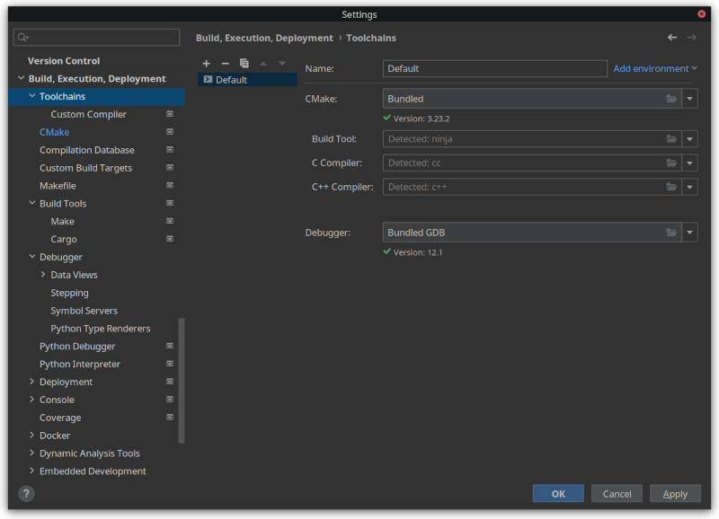
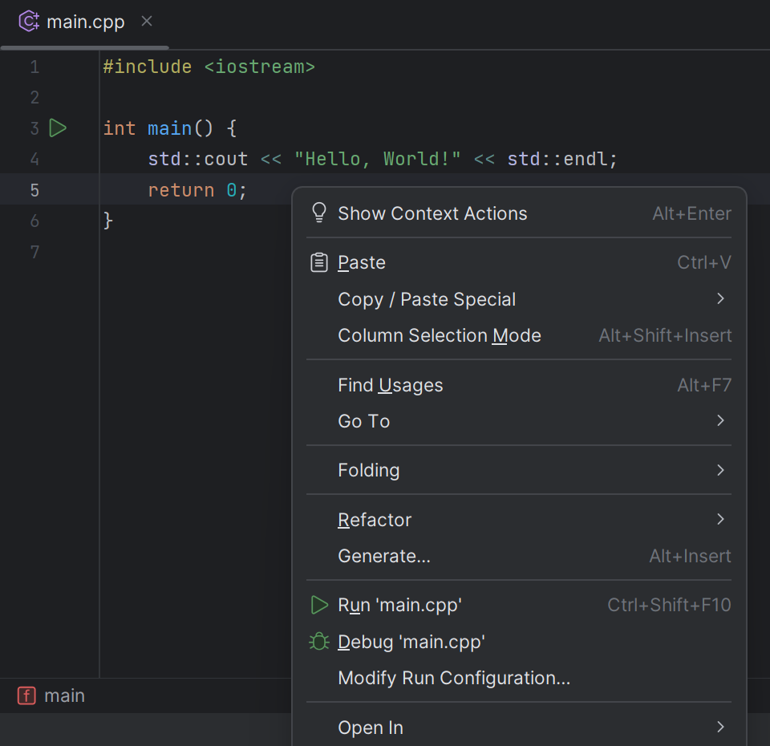
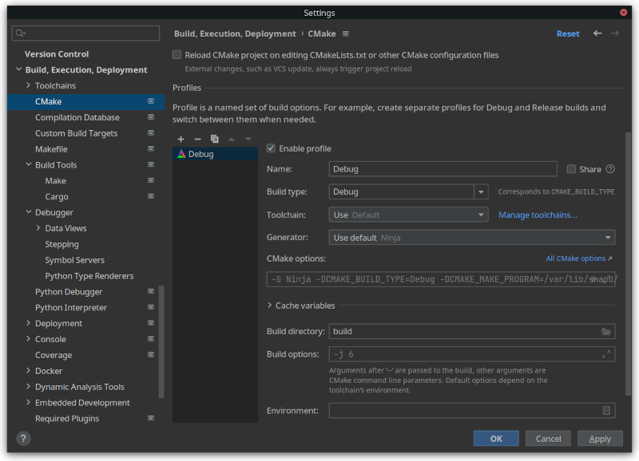

## 简介

CLion 是一款由 JetBrains 公司开发的功能丰富且强大的跨平台 C/C++ 集成开发环境（IDE）。


## 官方教程

在官方网站中给出了 [学习 CLion](https://www.jetbrains.com/clion/learn/) 的教程。

## 安装

参见 [Download CLion](https://www.jetbrains.com/clion/download/)。

## 配置

### 工具链安装

CLion 默认不带编译器，构建工具和调试工具，需要手动进行安装。

#### Windows

参见 [Tutorial: Configure CLion on Windows | CLion Documentation](https://www.jetbrains.com/help/clion/quick-tutorial-on-configuring-clion-on-windows.html)

值得一提的是 CLion 的 Windows 版本中自带了 MinGW，所以可以不用额外安装 MinGW 工具链。

#### Linux

##### Debian/Ubuntu 及其衍生发行版

```bash
sudo apt install make cmake # build tools
sudo apt install gcc g++ gdb # compiler and debugger
sudo apt install clang clang++ llvm lldb # you can also choose to use clang toolchain
```

##### Arch Linux 及其衍生发行版

```bash
sudo pacman -S make cmake # build tools
sudo pacman -S gcc g++ gdb # compiler and debugger
sudo pacman -S clang clang++ llvm lldb # you can also choose to use clang toolchain
```

##### Fedora/RHEL/CentOS/Rocky Linux

```bash
sudo dnf install make cmake # build tools
sudo dnf install gcc g++ gdb # compiler and debugger
sudo dnf install clang clang++ llvm lldb # you can also choose to use clang toolchain
```

#### macOS

参见 [Tutorial: Configure CLion on macOS | CLion Documentation](https://www.jetbrains.com/help/clion/quick-tutorial-on-configuring-clion-on-macos.html)

### 工具链设置

#### 手动设置工具链

新安装的 CLion 会自动检测系统中的 C/C++ 开发工具链，如果已安装的工具链无法自动检测到，可在 `Settings` 中找到 `Build, Execution, Deployment`>`Toolchains` 进行手动配置。



### 编译、运行和调试

虽然 CLion 诞生之初是面向多文件的复杂 C/C++ 项目诞生的，早些时候的 CLion 默认使用 [CMake](https://cmake.org/) 作为构建工具，但是自 CLion 2022.3 版本起，CLion 已经支持 [C, C++ 单文件运行](https://www.jetbrains.com/help/clion/run-single-file.html)。

有多种方式来运行一个 C++ 程序，一个简单的流程如下：

1.  创建一个 C/C++ 项目：`New -> Project -> C++ Executable`，选择合适的地址和语言标准版本，点击 `Create`。
2.  打开项目，此时的项目目录下应当存在一个 `cmake-build-debug` 目录、一个 `CMakeLists.txt` 文件和一个 `main.cpp` 文件。因为我们不需要使用 CMake 来管理项目，因此我们可以删去 `CMakeLists.txt` 文件和 `cmake-build-debug` 目录及其内所有文件。
3.  点击打开 `main.cpp` 文件，并在编辑区右键单击，可以看到 `Run 'main.cpp'` 选项。选择此选项后，CLion 可以自动创建一个运行配置并运行程序。



如需调试程序，可以编辑区打好断点，在编辑区右键单击，选择 `Debug 'main.cpp'` 选项。

### 通过 CMake 编译、运行和调试

#### 设置

CLion 也可使用 [CMake](https://cmake.org/) 作为构建工具，关于 CMake 的设置可以在 `Build, Execution, Deployment -> Toolchains -> CMake` 中修改。



#### 编译选项

CMake 默认使用项目根目录下的 `CMakeList.txt` 作为构建项目的配置文件，可以使用 `add_compile_options` 命令来增加编译选项，例如：

```cmake
add_compile_options(-std=c++17 -DDEBUG)
```

其他 CMake 的功能请参考 [CMake 官方文档](https://cmake.org/documentation/)

## 免费获取 CLion IDE 许可证

CLion 为付费产品，但是可以通过教育邮箱或开源项目申请特殊许可证。申请之后不仅可以免费使用正版 CLion IDE, 还可以免费使用 JetBrains 公司开发的其他付费产品。

### 使用教育邮箱获取

进入官网的 [Free Educational Licenses 页面](https://www.jetbrains.com/community/education/#students), 点击 `Apply` 按钮，填写相关信息即可申请。


注意：在注册时于邮箱选项请填如 @edu.cn 后缀的教育邮箱，特殊许可证需要邮箱验证后方可拿到。

你可以到所在高校的教务中心官网去申请教育邮箱，如果申请不到需要使用 [学信网](https://www.chsi.com.cn) 进行认证（仅中国大陆）。

### 使用开源项目获取

如果您是某个开源项目的核心开发者或维护者之一，您可以尝试申请开源开发许可证 (Open Source Development License). 申请流程与教育许可证类似，但需要填写开源项目的仓库地址。


