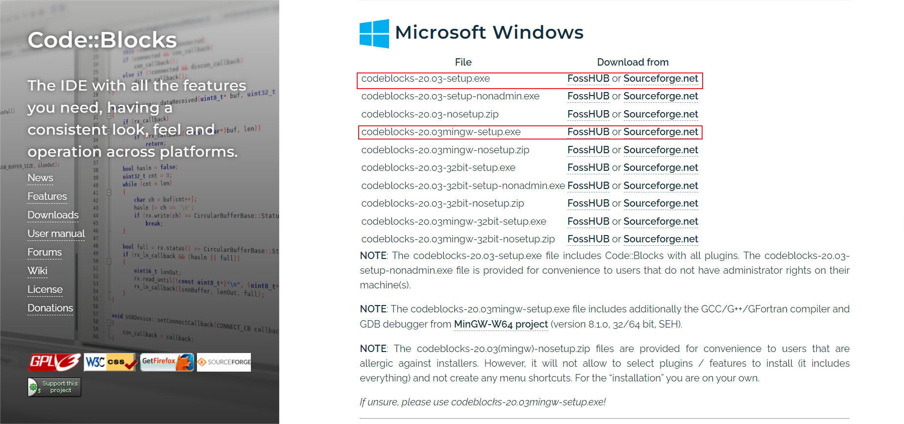
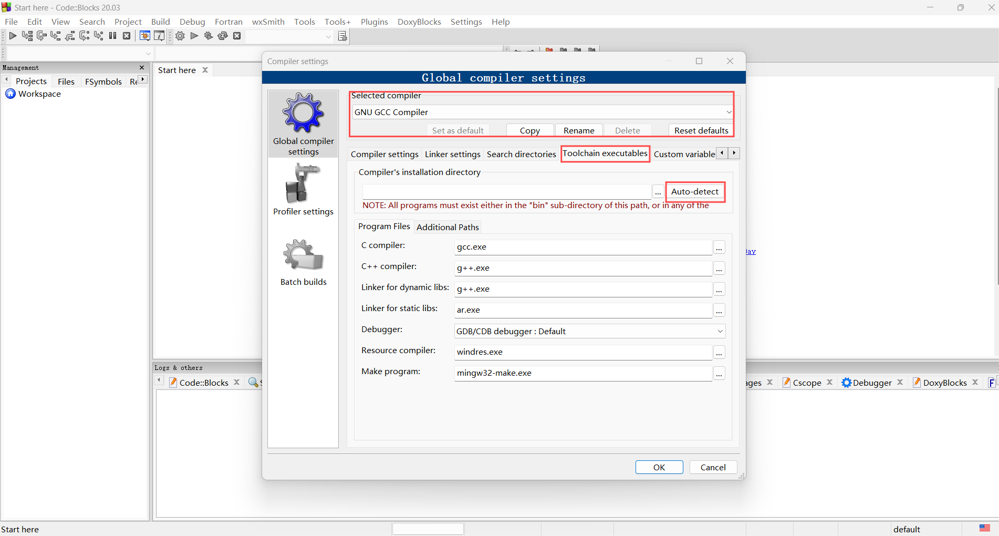

## 简介

Code::Blocks 是一个使用 C++ 开发的开源集成开发环境（IDE），采用 wxWidgets 作为图形界面库。该项目始于 2001 年，目前由官方社区维护，主要用于 C、C++ 和 Fortran 等编程语言的开发。[^ref1]

优点：

-   **轻量和高效**：Code::Blocks 资源占用少且启动迅速，适合资源有限的环境以及偏好轻量级 IDE 的开发者，也适合入门级开发者学习和使用。

-   **跨平台兼容性**：支持 Windows、Linux 和 macOS 等多种操作系统，提供了一致的用户体验，使得开发者可以无缝地在不同平台上工作。

-   **广泛的编译器支持**：支持包括 GCC、MSVC (Microsoft Visual C++)、Digital Mars 和 Borland C++ 5.5 在内的多种编译器，允许开发者根据项目需求选择最合适的编译工具。

缺点：

-   **功能范围有限**：相比于 CLion 或 Eclipse 等 IDE，内置功能和工具较为基础，可能不足以满足复杂项目的需求。

-   **插件生态较弱**：尽管支持插件扩展功能，但第三方插件数量和质量有限，插件生态相对较弱。

## 安装

参见 [Code::Blocks 官方网站](https://www.codeblocks.org/downloads/)，选择下载二进制安装程序（Binary Release），或者下载源代码编译安装（Source Code），然后根据需求和操作系统选择合适的安装程序，按照安装向导完成安装即可。

???+ note "下载包含 MinGW 的安装包"
    对于 Windows 用户，如果不希望手动配置编译器，建议下载包含 MinGW 的安装程序，例如 `codeblocks-xxxxmingw-setup.exe`，该版本已经包括了 GCC 编译器，无需额外安装和配置即可开始开发 C 和 C++ 项目。

## 配置

如果安装时选择了不包含 MinGW 的安装程序，或者需要使用其他编译器，则需要手动安装和配置编译器，然后设置 Code::Blocks 以使用该编译器。

### 工具链安装

参考本站的 [编译器](../compiler.md) 安装指南，下载并安装你需要的编译器。

### 工具链设置

当第一次启动 Code::Blocks 时，软件会自动扫描系统中已安装的编译器，如果没有找到编译器，可以通过以下步骤手动添加：

1.  打开 Code::Blocks，点击菜单栏的 `Settings -> Compiler`，打开编译器设置对话框（如下图所示）。
2.  在 `Selected compiler` 下拉框中选择需要配置的编译器，例如 `GNU GCC Compiler`。
3.  在 `Toolchain executables` 选项卡中，单击 `Auto-detect` 按钮，Code::Blocks 将自动扫描系统中已安装的编译器。
4.  如果自动扫描失败，你可以手动设置编译器路径。在 `Compiler's installation directory` 中输入编译器的安装路径，例如 `C:\MinGW\bin`。
5.  设置完成后，点击 `OK` 保存设置，现在你可以使用该编译器来编译和运行项目。

## 使用

Code::Blocks 内置项目管理器，支持用户自定义构建项目，你可以在 `Project -> Build options` 中设置编译选项，选择编译器、编译选项、链接选项等，也可以在 `Project -> Properties` 中设置项目属性，例如项目名称、路径、文件列表等。

??? note "配置 Makefile"
    Code::Blocks 默认不需要编写 Makefile，如果需要使用自定义的 Makefile，可以在 `Project -> Properties` 中勾选 `This is a custom Makefile` 选项，然后在 `Project -> Build options` 中设置 Makefile 的路径。

### 创建项目

Code::Blocks 支持的编程语言包括 C、C++ 和 Fortran 等，当启动 Code::Blocks 后，可以通过 `File -> New -> Project` 创建新项目，选择项目类型和模板，然后按照向导的指示，设置项目名称、路径、编译器等，最后点击 `Finish` 完成项目创建。

Code::Blocks 也支持单文件的编译和运行，可以通过 `File -> New -> File` 创建新文件，编写代码并保存后，点击工具栏上的 `Build and run` 按钮，或者按下 `F9` 键，自动编译和运行当前文件。

### 构建和运行

以一个简单的 Console Application 项目为例，接下来介绍如何构建和运行项目：

1.  项目创建完成后，你会看到一个默认的 `main.cpp` 文件，你可以在该文件中编写代码，然后保存文件。
2.  编写完代码后，点击工具栏上的 `Build and run` 按钮，或者按下 `F9` 键，Code::Blocks 将自动编译和运行项目。
3.  编译和运行后，输出窗口中会显示程序的输出结果，你可以在输出窗口中查看程序的输出，根据需要调整代码。
4.  如果只需要编译项目，而不运行，可以点击工具栏上的 `Build` 按钮，或者按下 `Ctrl + F9` 键，Code::Blocks 将只编译项目，不运行程序。

### 调试

Code::Blocks 内置了调试器，你可以在 `Debug` 菜单中设置和启动调试器，帮助你定位和解决程序中的错误。

同理，以一个简单的 Console Application 项目为例，接下来介绍如何调试项目：

1.  **设置断点**：在需要调试的代码行左侧单击鼠标左键，设置断点，程序将在断点处停止执行。
2.  **启动调试器**：点击工具栏上的 `Debug` 按钮，或者按下 `F8` 键，Code::Blocks 将自动编译并启动调试器。
3.  **调试程序**：在调试器中，你可以单步执行程序，查看变量值、调用栈等，帮助你定位和解决程序中的错误。
4.  **停止调试**：调试完成后，你可以点击工具栏上的 `Stop` 按钮，或者按下 `Shift + F8`，停止调试器。

## 自定义设置

Code::Blocks 提供了丰富的设置选项，可以帮助调整编辑器的行为，以下是一些常用的设置：

### 界面设置

1.  在 `Settings -> Editor` 中，可以设置编辑器的字体、颜色、缩进、自动补全等选项。
2.  在 `Settings -> Environment` 中，可以设置 Code::Blocks 的全局行为，例如自动保存、自动备份、自动提示等。
3.  在 `View` 菜单中，可以调整编辑器的布局，例如打开/关闭文件浏览器、工具栏、状态栏、输出窗口等。

### 插件设置

Code::Blocks 支持插件来扩展功能，可以通过 `Settings -> Plugins` 查看和安装可用的插件，例如 DoxyBlocks、wxSmith 等，以下是一些常用的插件：

-   **DoxyBlocks**：著名的文档生成工具 Doxygen 的集成插件，可以直接在 Code::Blocks 中生成项目文档。
-   **wxSmith**：用于开发 wxWidgets 应用程序的插件，提供了可视化的界面设计工具，允许快速创建和布局 GUI 界面，简化开发流程。
-   **Thread Search**：支持多线程搜索的插件，可以在项目中快速搜索和替换符号和文本，适用于大型项目的开发。

插件的安装和使用方法请参考 [Code::Blocks 的插件文档](https://wiki.codeblocks.org/index.php/Code::Blocks_Plugins)，根据插件的需求和功能，选择合适的插件安装和使用。

???+ warning "注意"
    Code::Blocks 的插件相对单一和基础，且大部分插件已经集成到软件中，第三方插件的数量和质量有限，建议根据实际需求选择合适的插件。

### 快捷键设置

你可以通过 `Settings -> Editor -> Keyboard shortcuts` 选项卡查看和修改快捷键设置，根据自己的习惯调整快捷键。

以下是一些常用的快捷键：

| 功能        | 快捷键                 |
| --------- | ------------------- |
| 新建文件      | `Ctrl + Shift + N`  |
| 打开文件      | `Ctrl + O`          |
| 保存当前文件    | `Ctrl + S`          |
| 全部保存      | `Ctrl + Shift + S`  |
| 关闭当前文件    | `Ctrl + W`          |
| 关闭所有文件    | `Ctrl + Shift + W`  |
| 构建和运行当前项目 | `F9`                |
| 只构建当前项目   | `Ctrl + F9`         |
| 只编译当前项目   | `Ctrl + Shift + F9` |
| 运行当前项目    | `Ctrl + F10`        |
| 调试：开始/继续  | `F8`                |
| 调试：停止     | `Shift + F8`        |
| 调试：下一步    | `F7`                |
| 调试：进入     | `Shift + F7`        |
| 调试：跳出     | `Ctrl + F7`         |
| 调试：切换断点   | `F5`                |
| 查找        | `Ctrl + F`          |
| 查找并替换     | `Ctrl + R`          |
| 转到指定行     | `Ctrl + G`          |
| 转到匹配的括号   | `Ctrl + B`          |
| 全屏切换      | `F11`               |
| 开关所有折叠    | `Ctrl + Shift + -`  |
| 展开所有折叠    | `Ctrl + Shift + +`  |

## 参考资料与注释

[^ref1]: [Code::Blocks - 维基百科](https://zh.wikipedia.org/wiki/Code::Blocks)
