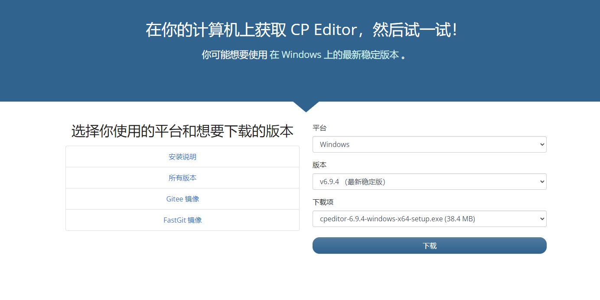
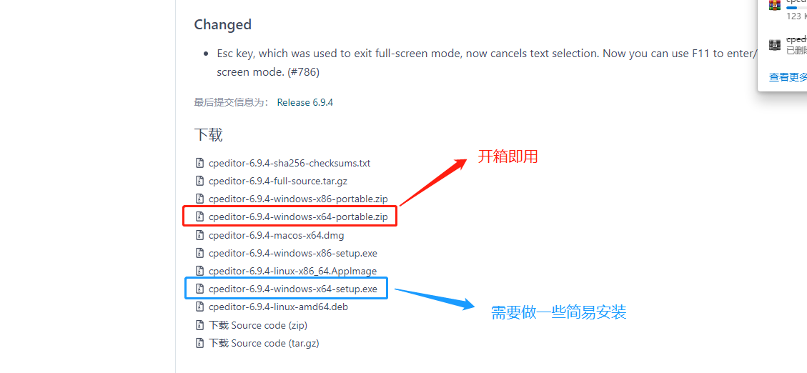
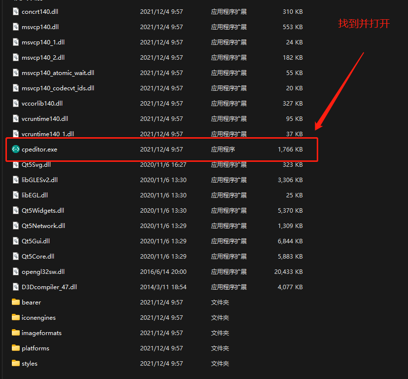
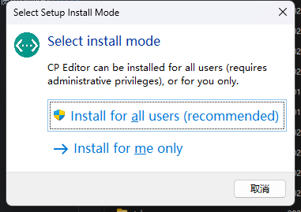
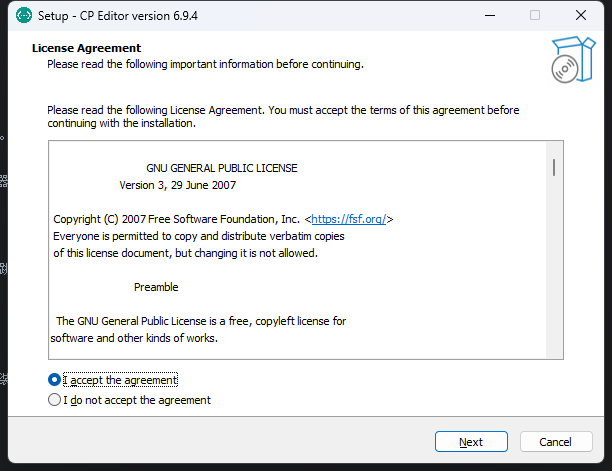
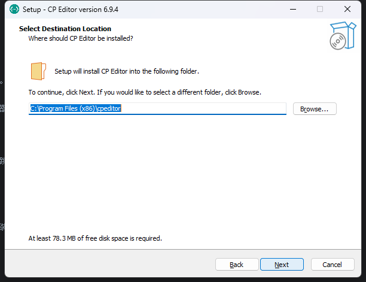
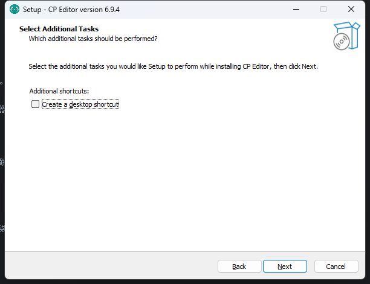
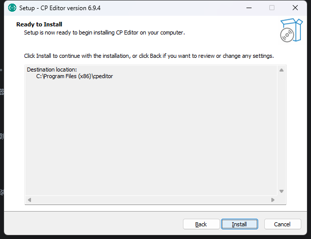

author: zarrtic

## 简介

[CP Editor](https://github.com/cpeditor/cpeditor) 专为算法竞赛设计，不像其它 IDE 主要是为了开发设计的。它可以帮助你自动化编译、运行、测试，从而让你专注于算法设计。它甚至可以从各种算法竞赛网站上获取样例，将代码提交到 Codeforces 上！

## 下载

打开 [CP Editor 的下载页面](https://cpeditor.org/zh/download/)。

推荐下载速度较快的 [Gitee 发行版](https://gitee.com/ouuan/cpeditor/releases)。

## 安装

???+ note "提示"
    开箱即用版本和安装版本只需要选择一个安装即可。

### 开箱即用版本

选择 `xxxxx-portable.zip` 进行下载，下载完成之后会得到一个压缩包，进行解压即可。

**解压后的文件**

双击 `cpeditor.exe` 即可打开编辑器。

打开编辑器如果出现如下页面，就代表你安装成功了，就可以直接跳到 **基础配置** 来进行一些必要的设置。

### 安装版本

下载 `xxxxx-setup.exe` 来进行安装，下载完成后双击下载的文件进入安装界面。

-   是否为所有用户安装

    

-   同意协议

    

-   选择安装路径

    

-   是否创建桌面快捷方式

    

-   安装完成

    

安装完成之后打开 `cpeditor` 如果出现如下界面就代表安装成功了，就可以跳转到 **基础配置** 来进行一些必要的设置了！

## 基础配置

> CP Editor 内部没有集成编译器，需要自己安装配置编译器，如有需要请参考本站关于编译器安装相关的文章[^compiler]。

-   设置默认语言

    编辑器默认的语言为 `C++`。

    

-   设置 `C++` 命令

    需要设置一些必要的编译命令，这个要根据编译器来设定。

    

-   设置模板

    新建文件的时候会自动初始化的模板，需要注意的是 CP Editor 需要的是一个 `xxx.cpp` 的文件作为模板文件。

    

> 完成了以上的基本操作你就可以使用最基本的功能了。

## 参考资料

[^compiler]: [编译器 - OI Wiki](../compiler.md)
