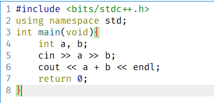
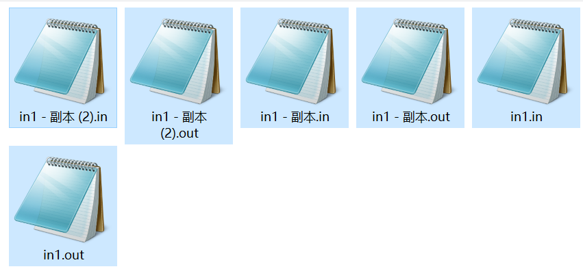
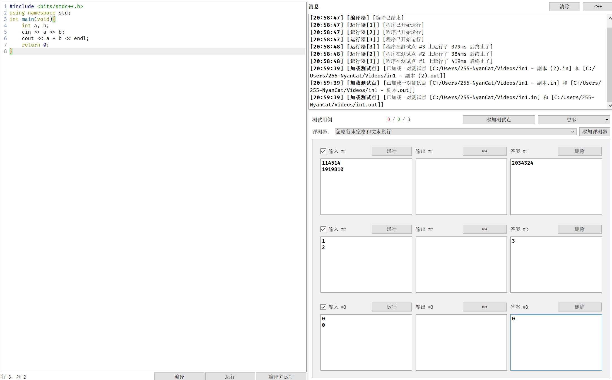
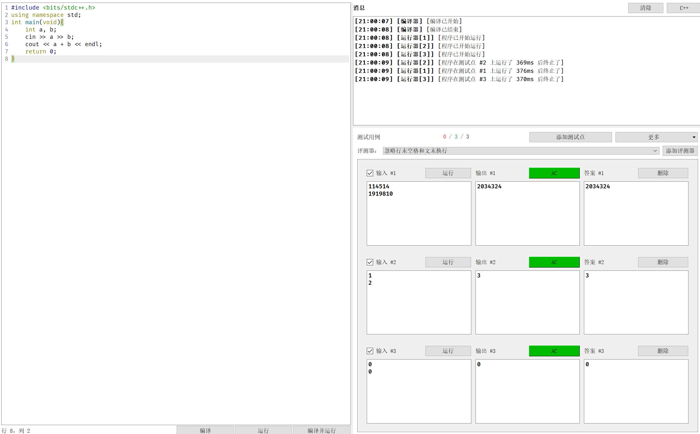
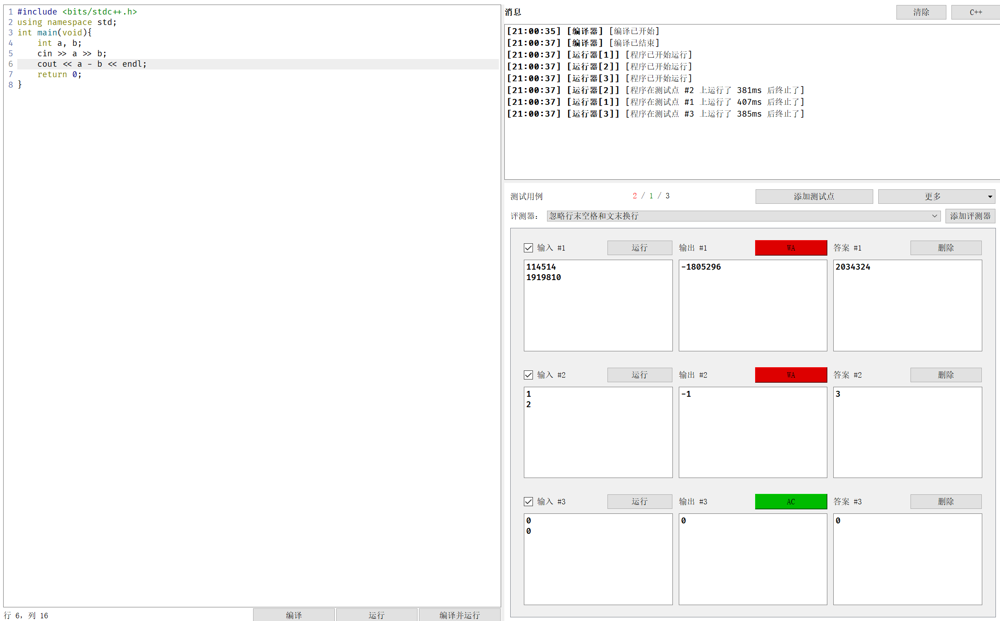
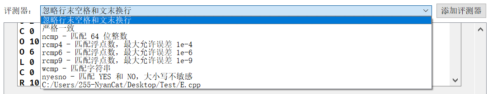

author: Forever-God404
## 介绍
> CP Editor 解决了算法竞赛中重复和无聊的任务。它会尽可能地将操作自动化，让你完全专注于代码。
>
> 它可以从几乎所有的算法竞赛网站上自动获取样例。你再也不用手动进行麻烦的复制粘贴。
>
> 它强大的可自定义代码片段功能可加快编程速度。在短短两秒钟内，你可以将整个 DFS 代码插入编辑器。
>
> 你可以通过内置检查器或来自 testlib 的检查器一键获取样例的评测结果。你也可以添加自己的 SPJ。
以上摘自 CP Editor官网 [^1]

可见，CP Editor对参加OI及ICPC等竞赛的选手可谓是一大利器。

## 环境配置

CP Editor共支持C++ [^2], Java [^3], Python [^4]这三种语言，你均可以通过本站的语言基础部分来了解如何配置他们的环境。

## 常规热键操作

### 文件部分
- 'Ctrl + N': 创建新文件
- 'Ctrl + O': 打开文件
- 'Ctrl + Shift + O': 打开比赛
- 'Ctrl + W': 关闭文件
- 'Ctrl + S': 保存文件

### 格式部分
- 'Ctrl + /': 加入注释
- 'Tab': 缩进
- 'Ctrl + Shift + I': 格式化代码

### 跳转部分
- 'Ctrl + F': 查找和替换

### 运行部分
- 'Ctrl + Shift + R': 编译并运行
- 'Ctrl + Alt + D': 在终端中运行
- 'Ctrl + K': 终止所有进程

???+ warning
    CP Editor目前还不支持任何语言的调试，推荐使用IDE编辑确认无误后使用CP Editor来对拍。

## 打开比赛
当使用'Ctrl + Shift + O'打开比赛时，CP Editor会自动为您建立题目，并默认存放到所选择文件夹中。这样既可以快速进入工作状态，又可以在编译运行时不被选择路径打断思路。

## 自测

???+ note "题目"
    Luogu/U126428 [^5]，使用私题是为了防止一切侵权，与打广告无关。数据可以通过附件下载。

???+ note "标程"
    ```cpp
    #include <bits/stdc++.h>
    using namespace std;
    const int N = 30;
    char buf[N],buf2[N];
    int convertBIN_DEC(){
        int len = strlen(buf);
        int ans=0;
        for (int i = len-1; i >= 0; i--){
            ans += (buf[i]-48)*pow(2,len-i-1);
        }
        return ans;   
    }
    int countBIN(bool mode){
        int len = strlen(buf);
        int ans=0;
        for (int i = 0; i < len; i++){
            if(buf[i]-48==mode){
                ans++;
            }
        }
        return ans;
    }
    void convertDEC(int dec, int in){
        int c,m=0,s[1024];
        while (dec!=0){  
            c=dec%in;  
            dec=dec/in;  
            m++;
            s[m]=c;
        }  
        for(int k=m;k>=1;k--){  
            cout<<s[k];  
        } 
        cout<<endl;
    }
    void Lshift(int bit){
        int len = strlen(buf);
        for(int i=0;i<len;i++){
            buf2[(i-bit+len)%len] = buf[i];
        }
        for(int i = 0;i<len;i++){
            buf[i] = buf2[i];
        }
    }
    void Rshift(int bit){
        int len = strlen(buf);
        for(int i=0;i<len;i++){
            buf2[(i+bit)%len] = buf[i];
        }
        for(int i = 0;i<len;i++){
            buf[i] = buf2[i];
        }
    }
    int main(){
        //freopen("binary5.in","r",stdin);
        //freopen("binary5.out","w",stdout);
        int T;
        cin >> T;
        while(T--){
        
            int tm;
            cin >> buf >> tm;
            while(tm--){
                char type;
                cin >> type;
                if(type=='L'){
                    int btdig;
                    cin>>btdig;
                    Lshift(btdig);
                }
                if(type=='R'){
                    int btdig;
                    cin>>btdig;
                    Rshift(btdig);
                }
                if(type=='C'){
                    bool md;
                    cin>>md;
                    cout<<countBIN(md)<<endl;
                }
                if(type=='O'){
                    int in;
                    int dec=convertBIN_DEC();
                    cin>>in;
                    convertDEC(dec,in);
                }
                if(type=='T'){//for debug
                    cout<<buf<<endl;
                }
            }
        }
        return 0;
    }
    ```

首先，将源代码粘贴到CP Editor。



这里，我们选择通过'更多->从文件添加成对的测试点'。



这时，我们的所有测试点已经添加成功：



单击'编译并运行'，静待片刻，就可以看到我们的运行结果出现在屏幕上啦！





下面，复制这段代码，自己动手造两组数据试试吧！

???+ note "关于SPJ"
    你可以在编译输出信息框下的添加评测器来使用SPJ。值得一提的是CP Editor自带了一些常用的SPJ。
    

## 技巧

### 手动扩栈

'Ctrl + P'打开设置，找到C++编译运行命令，在运行参数中输入'-Wl,--stack=128000000'。


### 预处理宏定义

'Ctrl + P'打开设置，找到C++编译运行命令，在编译命令中加入'-D{你想define的内容}'


## 参考资料

[^1]: [CP Editor](https://cpeditor.org/zh)
[^2]: [Hello, world! - OI Wiki](https://oi-wiki.org/lang/helloworld/)
[^3]: [Java速成 - OI Wiki](https://oi-wiki.org/lang/java/)
[^4]: [Python速成 - OI Wiki](https://oi-wiki.org/lang/python/)
[^5]: [U126428 二进制 - 洛谷](https://www.luogu.com.cn/problem/U126428)