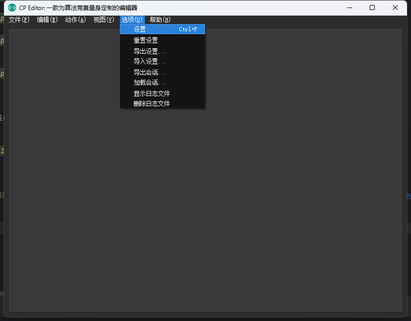
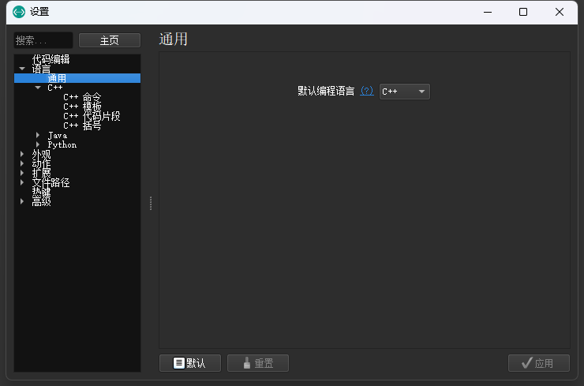
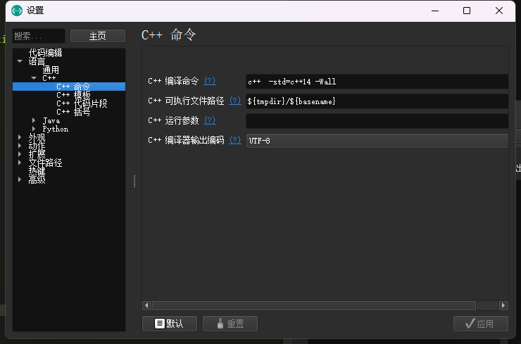
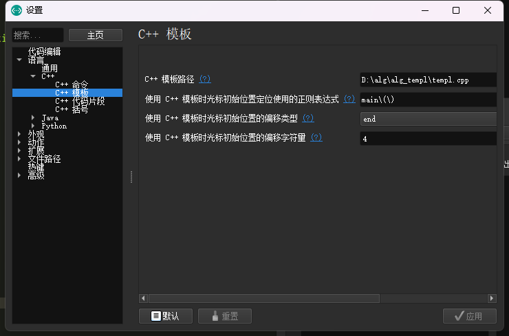

author: zarrtic

## 简介

[CP Editor](https://github.com/cpeditor/cpeditor) 专为算法竞赛设计，不像其它 IDE 主要是为了开发设计的。它可以帮助你自动化编译、运行、测试，从而让你专注于算法设计。它甚至可以从各种算法竞赛网站上获取样例，将代码提交到 Codeforces 上！

## 下载与安装

参见 [安装 | CP Editor](https://cpeditor.org/zh/docs/installation/)。

## 基础配置

> CP Editor 内部没有集成编译器，需要自己安装配置编译器，如有需要请参考本站关于编译器安装相关的文章[^compiler]。

-   设置默认语言

    编辑器默认的语言为 `C++`。

    

    

-   设置 `C++` 命令

    需要设置一些必要的编译命令，这个要根据编译器来设定。

    

-   设置模板

    新建文件的时候会自动初始化的模板，需要注意的是 CP Editor 需要的是一个 `xxx.cpp` 的文件作为模板文件。

    

> 完成了以上的基本操作你就可以使用最基本的功能了。

## 参考资料

[^compiler]: [编译器 - OI Wiki](../compiler.md)
