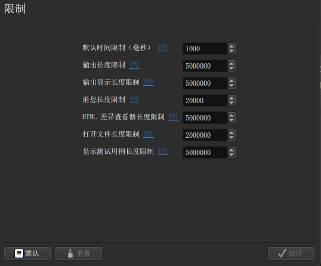
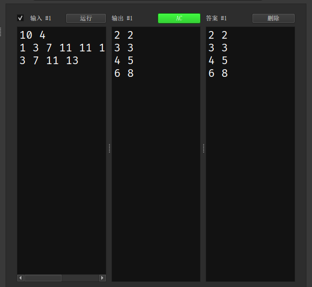
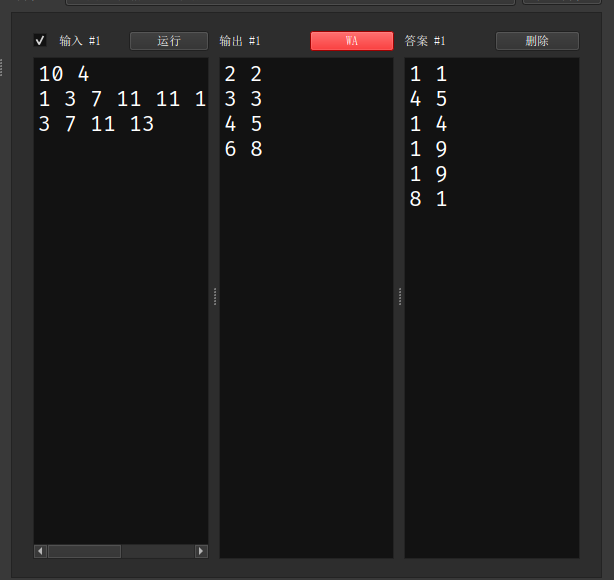
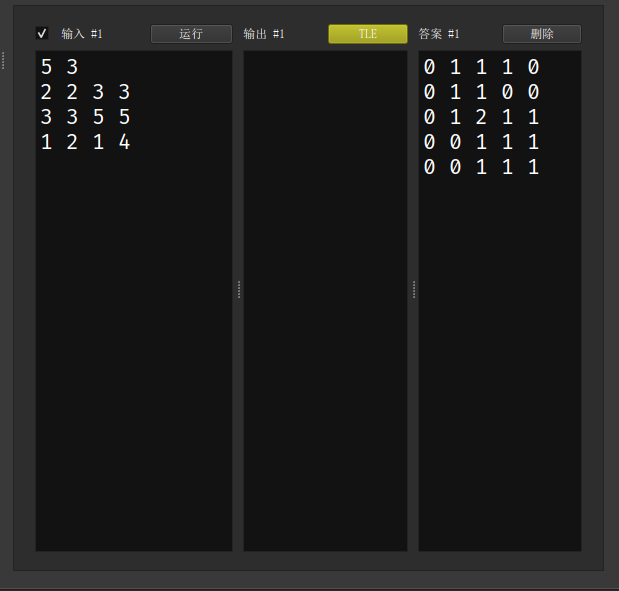
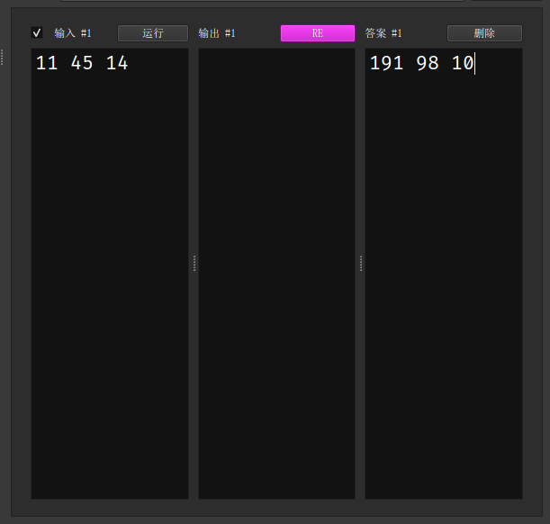

author: zarrtic, xk2013

## 简介

[CP Editor](https://github.com/cpeditor/cpeditor) 专为算法竞赛设计，不像其它 IDE 主要是为了开发设计的。它可以帮助你自动化编译、运行、测试，从而让你专注于算法设计。它甚至可以从各种算法竞赛网站上获取样例，将代码提交到 [Codeforces](https://codeforces.com/) 上！

## 下载与安装

参见 [安装 | CP Editor](https://cpeditor.org/zh/docs/installation/)。

## 基础配置

> CP Editor 内部没有集成编译器，需要自己安装配置编译器，如有需要请参考本站关于编译器安装相关的文章[^compiler]，当然，如果你在下载时选择了带有 `with-gcc-<GCC 版本号>-llvm-<LLVM 版本号>` 后缀的安装包，你就可以使用 CP Editor 自带的编译器，路径在 `{安装目录}/mingw64/bin/`。

-   设置默认语言

    编辑器默认的语言为 `C++`。

    

    

-   设置 `C++` 命令

    需要设置一些必要的编译命令，这个要根据编译器来设定。

    

-   设置模板

    新建文件的时候会自动初始化的模板，需要注意的是 CP Editor 需要的是一个 `xxx.cpp` 的文件作为模板文件。

    

> 完成了以上的基本操作你就可以使用最基本的功能了。

## 基本功能

-   快捷键

    |                       命令                      |    操作   |
    | :-------------------------------------------: | :-----: |
    | <kbd>Ctrl</kbd>+<kbd>Shift</kbd>+<kbd>C</kbd> |   编译。   |
    | <kbd>Ctrl</kbd>+<kbd>Shift</kbd>+<kbd>R</kbd> |  编译并运行。 |
    |          <kbd>Ctrl</kbd>+<kbd>R</kbd>         |   运行。   |
    |  <kbd>Ctrl</kbd>+<kbd>Alt</kbd>+<kbd>D</kbd>  | 在终端中运行。 |
    |          <kbd>Ctrl</kbd>+<kbd>K</kbd>         | 终止所有进程。 |
    | <kbd>Ctrl</kbd>+<kbd>Shift</kbd>+<kbd>I</kbd> |  格式化代码。 |

    具体可以查阅 [官方文档](https://cpeditor.org/zh/docs/preferences/key-bindings/)。

-   样例测试

    可以把题面的样例复制下来，由 CP Editor 自动评测，而且还可以设置时间限制！

    

    

    

    

    

## 参考资料

[^compiler]: [编译器 - OI Wiki](../compiler.md)
