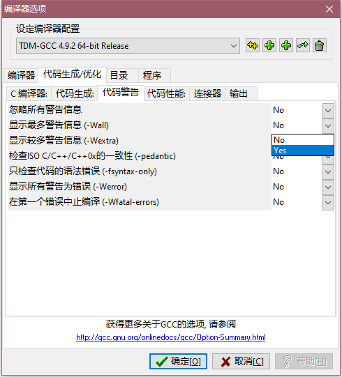
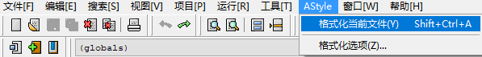

author: ksyx, ouuan, Doveqise, hsfzLZH1, wangqingshiyu, sshwy, NanoApe, DawnMagnet

## 介绍

> Dev-C++ 是一套用于开发 C/C++（C++11）的自由的集成开发环境（IDE），并以 GPL 作为散布许可。使用 MinGW 及 GDB 作为编译系统与调试系统。Dev-C++ 的 IDE 是利用 Delphi 开发的。
>
> Dev-C++ 是一个 SourceForge 的项目，是由 Colin Laplace 这位程序员及其公司 Bloodshed Software 所开始的。当前 Dev-C++ 一般用于撰写运行于 Microsoft Windows 的程序。Dev-C++ 一度有移植到 Linux 的项目但当前被暂停了。
>
> Bloodshed Dev-C++ 是一款全功能的 C 和 C++ 编程语言的集成开发环境（IDE）。它使用的 GCC MinGW 或 TDM-GCC 的 64 位版本作为它的编译器。Dev-C++ 也可以使用 Cygwin 或任何其他基于 GCC 编译器组合使用。
>
> 此外，Dev-C++ 较旧的版本无法在 win8 环境下编译。
>
> 该项目已不再明显活跃，从 2005 年 2 月 22 日开始至 2011 年 6 月，Dev-C++ 的官方网站一直没有再发出新消息或是释放新版本，说明 Dev-C++ 的开发已经进入了迟滞状态。2006 年，Dev-C++ 主要开发者 Colin Laplace 曾经对此作出了解释：“因忙于现实生活的事务，没有时间继续 Dev-C++ 的开发。”

以上摘自 Wikipedia[^1]。

不过，你在使用的版本是不是我说的这个版本呢？

没错，Dev-C++ 其实还有一个全新版本：

> Orwell Dev-C++ 是 Dev-C++ 的一个衍生版本。Orwell 鉴于 Dev-C++ 的长时间（从 2005 年 2 月 22 日起）不再更新，对 Dev-C++ 源代码进行错误修正，并更新编译器后发布的版本。

以上摘自 Wikipedia[^2]。

自 2011 年的 Dev-C++ 4.9.9.3 版本之后，你使用的版本均为 Orwell Dev-C++。

目前最新版本为 2015 年 4 月 27 日的 Dev-C++ 5.11 版本，可于 [SourceForge](https://sourceforge.net/projects/orwelldevcpp/files/latest/download) 下载。

该应用界面简洁友好，安装便捷，适合初学者使用。

2020 年，Embarcadero 赞助并接手了原有的 Bloodshed Dev-C++ 项目，继续开发。项目地址位于 [GitHub](https://github.com/Embarcadero/Dev-Cpp) 和 [SourceForge](https://sourceforge.net/projects/embarcadero-devcpp/).

在 2015 年停止更新后，因为教学需要，一位来自中国的个人开发者 [royqh1979](https://github.com/royqh1979) 决定继续开发他的 Dev-C++ 个人分支，命名为小熊猫 Dev-C++，集成了智能提示和高版本的 MINGW64，非常便于国内的个人使用和学习，项目官网位于 [小熊猫 Dev-C++](https://royqh.net/devcpp/download)，源码地址位于 [Github](https://github.com/royqh1979/Dev-Cpp).

## 使用教程

### 常用快捷键

#### 文件部分

- `Ctrl + N`: 创建源代码
- `Ctrl + O`: 打开文件
- `Ctrl + W`: 关闭文件
- `Ctrl + P`: 打印文件

#### 格式部分

- `Ctrl + /`：注释和取消注释
- `Tab`: 缩进
- `Shift + Tab`: 取消缩进

#### 行操作

- `Ctrl + E`: 复制行
- `Ctrl + D`: 删除行
- `Ctrl + Shift + Up`: 向上移动
- `Ctrl + Shift + Down`: 向下移动

#### 跳转部分

- `Ctrl + F`: 搜索
- `Ctrl + R`: 替换
- `F3`: 搜索下一个
- `Shift + F3`: 搜索上一个
- `Ctrl + G`: 到指定行号
- `Shift + Ctrl + G`: 到指定函数
- `Ctrl +[1 ~ 9]`: 设置书签
- `Alt +[1 ~ 9]`: 跳转书签

#### 显示部分

- `Ctrl + 滚轮`：字号放大或缩小
- `Ctrl + F11`: 全屏或恢复

#### 运行部分

- `F9`: 只编译
- `F10`: 只运行
- `F11`: 编译并运行
- `F12`: 全部重新编译

#### 调试部分

- `F2`: 转到断点
- `F4`: 设置断点或取消
- `F5`: 调试运行
- `F6`: 停止
- `F7`: 逐步调试

### 调试流程

1. 将编译器配置设定为 "TDM-GCC 4.9.2 64-bit Debug"
2. 按 `F4` 设置或取消调试断点
3. 将光标放置在变量上，按 `Alt + A` 向调试窗口添加监控变量
4. 按 `F5` 启动调试
5. 按 `F7` 或 `Alt + N` 逐步调试
6. 按 `Alt + S` 跳至下一个调试断点
7. 按 `F6` 停止调试

## 扩展

### 增加编译选项

点击工具 -> 编译选项，然后选择 "代码生成/优化" 选项卡，下面介绍我自己常用的几个编译选项。

#### 开启优化

优化代码运行时间或占用空间。

选择 "代码生成" 子选项卡中的 "优化级别（-Ox)" 选项标签。


#### 更换语言标准

使用新语言特性或试图让代码在旧标准中运行使用。

选择 "代码生成" 子选项卡中的 "语言标准（-std)" 选项标签。


#### 显示最多警告信息

查错小助手。

选择 "代码警告" 子选项卡中的 "显示最多警告信息（-Wall)" 选项标签。



#### 生成调试信息

当显示 "项目没有调试信息，您想打开项目调试选项并重新生成吗？" 点击后闪退或想使用调试功能时需开启此功能。

选择 "连接器" 子选项卡中的 "产生调试信息" 选项标签。


### 编译小 trick

点击工具 -> 编译选项，然后选择 "编译器" 选项卡，接下来介绍几个常用 trick。

#### 开大栈

防止 DFS 爆系统栈之类的情况出现。

在 "连接器命令行加入以下命令" 中加入 `-Wl,--stack=128000000` 命令。

此命令将栈开到了约 128MB 的大小，有需要可以自行增加。


#### 定义宏

方便本地评测使用文件输入输出或作其他用途。

在 "连接器命令行加入以下命令" 中加入 `-D[String]` 命令。

其中 `[String]` 改为你需要的宏名。

如图，当开启编译选项后便可将以下代码从 `test.in` 文件读入数据并在 `test.out` 文件中输出。


```cpp
#ifdef LOCAL
freopen("test.in", "r", stdin);
freopen("test.out", "w", stdout);
#endif
```

### 美化

#### 代码格式化

点击 Astyle-> 格式化当前文件 或 按 Ctrl+Shift+A 进行代码格式化。



#### 字体

点击工具 -> 编辑器选项，然后选择 "显示" 选项卡。


#### 主题

点击工具 -> 编辑器选项，然后选择 "语法" 选项卡，可以使用预设主题，也可以自行调整。


## 参考资料

[^1]: [Dev-C++ - 维基百科](https://zh.wikipedia.org/wiki/Dev-C%2B%2B)

[^2]: [Orwell Dev-C++ - 维基百科](https://zh.wikipedia.org/wiki/Orwell_Dev-C%2B%2B)
