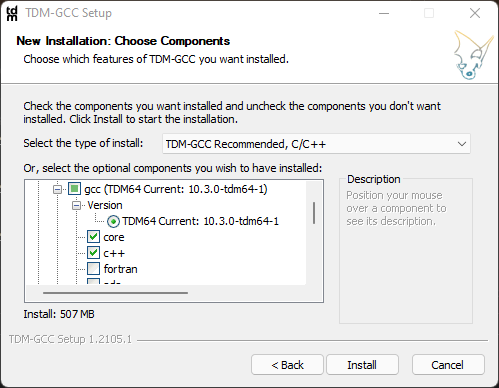
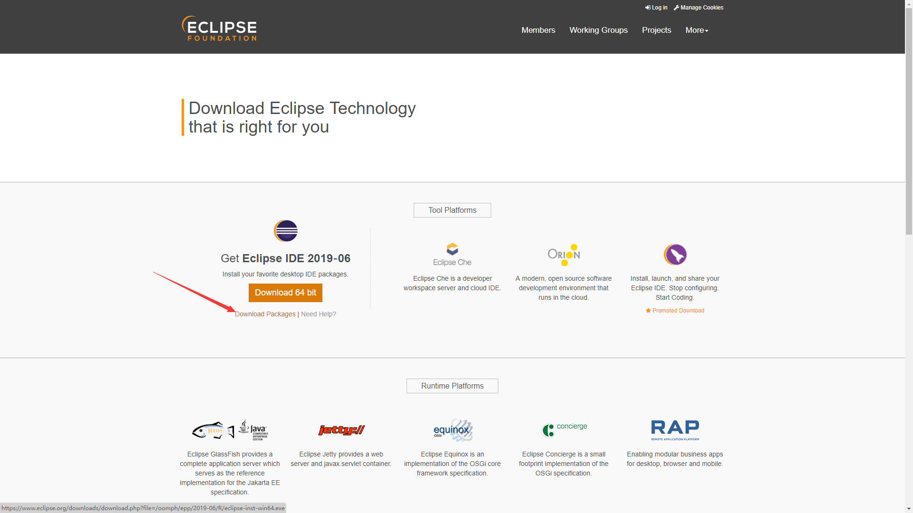
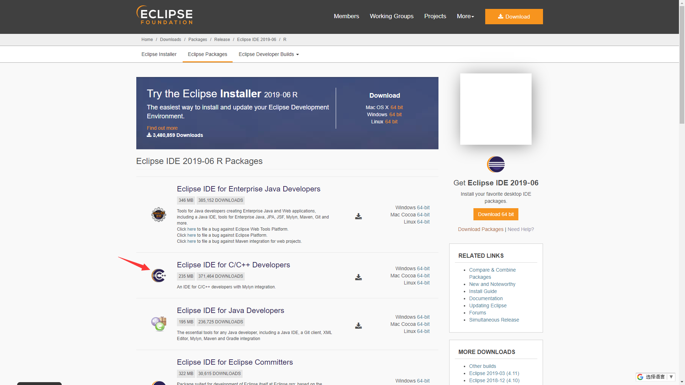

author: ouuan, Doveqise, partychicken, Xeonacid, StudyingFather

## 介绍

Eclipse 是著名的跨平台开源集成开发环境（IDE）。最初主要用来 Java 语言开发，当前亦有人通过插件使其作为 C++、Python、PHP 等其他语言的开发工具。

Eclipse 的本身只是一个框架平台，但是众多插件的支持，使得 Eclipse 拥有较佳的灵活性，所以许多软件开发商以 Eclipse 为框架开发自己的 IDE。

Eclipse 最初是由 IBM 公司开发的替代商业软件 Visual Age for Java 的下一代 IDE 开发环境，2001 年 11 月贡献给开源社区，现在它由非营利软件供应商联盟 Eclipse 基金会（Eclipse Foundation）管理。[^ref1]

缺点：

- 实测这个 IDE 打开速度比 Visual Studio 慢
- 更新速度玄学，插件更新速度跟不上 IDE 的更新速度，对于经常更新的同学很不友好。

优点：

- 使用体验较好
- 能够快速上手，所以比较推荐 OIer 用这个 IDE。

## 安装 & 配置指南

对于大部分主流 Linux 发行版，Eclipse 已经内置于其软件仓库中。这里介绍 Windows 下的安装和配置指南。

### 前置

您需要安装 Java 和 MinGW。

#### 关于 Java

截至 2021-08-18，最新版本的 Eclipse 安装包已经附带了一个 Java 运行时环境（JRE）。如果需要独立的 JRE，可以访问 [Java.com](https://www.java.com) 或 [Oracle JDK Download](https://www.oracle.com/java/technologies/javase-downloads.html) 以下载。

???+warning "注意"
    Eclipse 2020-09 及之后的版本需要 Java 11 及以后版本的运行时。然而，在 Java.com 获取到的 JRE 多为 Java 8。在下载时还请读者多加留意。

#### 下载并安装 MinGW/TDM

TDM-GCC 是一个 Microsoft Windows 下的一个编译器组合。其提供了最新的稳定版 GCC 编译器和包含了修补的 MinGW 运行时接口。在这里我们以安装 TDM-GCC 为例。

TDM-GCC 套件的安装包可以从 GitHub Release 获取，亦可从 SourceForge 获取。其分为完整版和带有 `webdl` 标识的网络安装版。出于 GitHub Release 于中国大陆的低可用性，国内的用户建议从网络上相对更加友好的 [SourceForge](https://sourceforge.net/projects/tdm-gcc/) 获取完整版安装包。这里以完整版安装包为例。

开始安装。

选择版本。

选择安装目录。默认为 `C:\TDM-GCC-64`。

选择需要安装的组件。这里按照默认设置进行。

完成安装。

### 安装主体

进入 Eclipse 官网的 [下载页面](https://www.eclipse.org/downloads/)，

点击右面相对应系统的下载链接以下载 C++ 版本，

安装，然后如图填写目录信息以建造项目。

## 拓展

这个软件的帮助手册很详细，建议刚接触的同学多看帮助手册，多百度，并且这个 IDE 的使用手感与 Visual Studio 相近。

和 [VS Code](./vscode.md) 类似，Eclipse 中也提供了很多插件，这些插件可以让 Eclipse 变得更加易用。[^ref2]

## 参考资料与注释

[^ref1]: [Eclipse - 维基百科](https://zh.wikipedia.org/wiki/Eclipse)

[^ref2]: [曾经的 Java IDE 王者 Eclipse 真的没落了？21 款插件让它强大起来！](https://blog.csdn.net/csdnnews/article/details/78495979)
