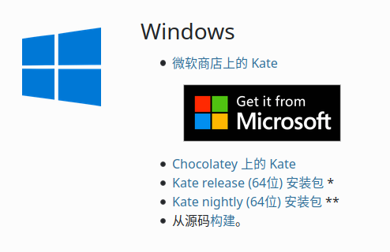
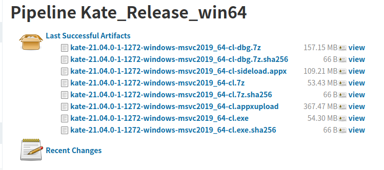
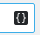

author: CoelacanthusHex

## 软件简介

Kate 是一个具有众多功能的跨平台文本编辑器。Kate 还附带了多种插件，包括一个嵌入式终端，可以让你直接从 Kate 中启动控制台命令，强大的搜索和替换插件，以及一个预览插件，可以渲染 MD、HTML 甚至 SVG 文件。支持通过交换文件在系统崩溃时恢复数据，带参数提示的自动补全，同时支持 [LSP (Language Server Protocol)](https://microsoft.github.io/language-server-protocol/) 以获得更为强大的补全。

## 下载与安装

可打开 [Kate 官网](https://kate-editor.org/)，然后进入 [获取页面](https://kate-editor.org/zh-cn/get-it/)。随后，根据你使用的系统和喜欢的安装方式进行安装。接下来以 Windows 为例讲解安装。



如图，从上到下依次为从 MS Store 安装，通过 Chocolatey 安装，下载 Kate 正式版安装包，下载 Kate 每夜构建版安装包和下载源码手动构建。从 MS Store 安装只需点击链接然后点击安装即可；通过 Chocolatey 安装则需要打开命令行输入 `choco install kate`；接下来两个则需首先点击链接，然后你将看到如下界面：



其中形如 `kate-21.04.0-1-1272-windows-msvc2019_64-cl-sideload.appx` 格式的是供手动安装的商店版本，`kate-21.04.0-1-1272-windows-msvc2019_64-cl.exe` 格式的则是安装包，下载双击即可。

## 用法与功能

### 交换文件防止数据丢失

与 Vim 类似，Kate 会将未保存的更改写入一个交换文件（一般是原文件名前面加点后面加 `.kate-swp`），如果遭遇断电或程序崩溃等意外，下次启动时不会丢失未保存的更改。

### 代码高亮

Kate 支持三百余种语言的语法高亮。一般来说，Kate 可以自动地选择对应的语言进行语法高亮，不过偶尔也有错误的时候，这时候可以点击最右下角的按钮，选择正确的语言。

#### 自己编写语法高亮文件

尽管 Kate 支持超过三百种语言的语法高亮，但是仍不免有语言未被覆盖到，此时可以自己动手编写语法高亮文件。
Kate 自身自带的文件位于 [Syntax Highlighting Powered By KSyntaxHighlighting Framework](https://kate-editor.org/syntax/)，语法可参照 [Working with Syntax Highlighting](https://docs.kde.org/trunk5/en/kate/katepart/highlight.html)，编写好的文件根据 [Syntax definition files](https://github.com/KDE/syntax-highlighting#syntax-definition-files) 放置。[CoelacanthusHex/dotfiles@80a913c/pam_env.xml](https://github.com/CoelacanthusHex/dotfiles/blob/80a913cc5b90d7878eb0ed77b8df2d9b97926272/kate/.local/share/katepart5/syntax/pam_env.xml) 有我编写的一个配置文件可供参考。

### 切换语言

点击上方工具栏里的 `设置`/`Setting`，然后点击 `配置语言`/`Configure Language`，随后选择语言即可，注意可以选择备选语言。

### 编码与行尾符

Kate 可以自动识别当前文件使用的是什么编码，如果识别错误，可以点击右下角倒数第二个按钮，选择正确的编码。

同时，Kate 也可以自动识别当前文件使用的行尾符，如果识别错误，可以点击 `工具`→`行尾`/`Tool`→`End of line` 选择正确的行尾符。

### 查找与替换

依次单击 `编辑`→`查找`（快捷键<kbd>Ctrl</kbd>+<kbd>F</kbd>）即可打开“查找”页面。依次单击 `编辑`→`替换`（快捷键<kbd>Ctrl</kbd>+<kbd>R</kbd>）即可打开“查找与替换”页面。同时，点击左下角 `搜索与替换` 也可打开“查找与替换”页面。

具体操作和其他编辑器并无太大差别，但是支持一些额外的特性，例如：

1. 是否区分大小写
2. 支持正则表达式（包括捕获组）
3. 从当前文件到多文件再到当前工程不等的范围
4. 对查找的结果进行选择替换

### Language Server Protocol

Kate 自 19.12 起支持 LSP Client，最初仅支持 C/C++、D、Fortran、Go、Latex/BibTeX、OCaml、Python、Rust，现如今支持如下表中的语言：

|     语言     |                                       LSP Server                                       |
| :--------: | :------------------------------------------------------------------------------------: |
|    Bash    |        [bash-language-server](https://github.com/bash-lsp/bash-language-server)        |
|    LaTeX   |                          [texlab](https://texlab.netlify.com/)                         |
|   BibTeX   |                          [texlab](https://texlab.netlify.com/)                         |
|      C     |                     [clangd](https://clang.llvm.org/extra/clangd/)                     |
|     C++    |                     [clangd](https://clang.llvm.org/extra/clangd/)                     |
|      D     |                      [serve-d](https://github.com/Pure-D/serve-d)                      |
|   Fortran  |               [fortls](https://github.com/hansec/fortran-language-server)              |
|     Go     |                        [gopls](https://golang.org/x/tools/gopls)                       |
|   Haskell  | [haskell-language-server-wrapper](https://github.com/haskell/haskell-language-server") |
| JavaScript |  [typescript-language-server](https://github.com/theia-ide/typescript-language-server) |
|    OCaml   |                     [ocamllsp](https://github.com/ocaml/ocaml-lsp)                     |
|    Perl    |        [Perl-LanguageServer](https://github.com/richterger/Perl-LanguageServer)        |
|   Python   |               [pyls](https://github.com/palantir/python-language-server)               |
|    Rust    |                         [rls](https://github.com/rust-lang/rls)                        |
| TypeScript |  [typescript-language-server](https://github.com/theia-ide/typescript-language-server) |
|      R     |           [RLanguageServer](https://github.com/REditorSupport/languageserver)          |
|     zig    |                         [zls](https://github.com/zigtools/zls)                         |

当打开对应语言的文件时，Kate 会自动拉起对应的 LSP Server。

#### 增加配置

此外，用户还可以手动编写配置，具体格式为：

```json
{
    "servers": {
        "bibtex": {
            "use": "latex",
            "highlightingModeRegex": "^BibTeX$"
        },
        "c": {
            "command": ["clangd", "-log=error", "--background-index"],
            "commandDebug": ["clangd", "-log=verbose", "--background-index"],
            "url": "https://clang.llvm.org/extra/clangd/",
            "highlightingModeRegex": "^(C|ANSI C89|Objective-C)$"
        },
        "cpp": {
            "use": "c",
            "highlightingModeRegex": "^(C\\+\\+|ISO C\\+\\+|Objective-C\\+\\+)$"
        },
        "haskell": {
            "command": ["haskell-language-server-wrapper", "--lsp"],
            "rootIndicationFileNames": ["*.cabal", "stack.yaml", "cabal.project", "package.yaml"],
            "url": "https://github.com/haskell/haskell-language-server",
            "highlightingModeRegex": "^Haskell$"
        },
        "latex": {
            "command": ["texlab"],
            "url": "https://texlab.netlify.com/",
            "highlightingModeRegex": "^LaTeX$"
        },
        "rust": {
            "command": ["rls"],
            "rootIndicationFileNames": ["Cargo.lock", "Cargo.toml"],
            "url": "https://github.com/rust-lang/rls",
            "highlightingModeRegex": "^Rust$"
        }
    }
}
```

其中 `server` 里的每一项代表一种语言，在这个语言里，`command` 代表启动 LSP Server 所使用的命令，`command` 是一个数组，是所需要执行的命令以空格分词的结果；`url` 是 LSP 的网址；`rootIndicationFileNames` 是用于确定项目根目录的文件；`highlightingModeRegex` 则匹配某种语法高亮的名字，以确定使用哪个 LSP；如果存在 `use` 项，则代表使用 `use` 项对应的语言的配置。

该配置项位于 `设置`→`配置 Kate`→`LSP 客户端`→`用户服务器设置`。

### 内置终端

按<kbd>F4</kbd>可打开或关闭内置终端，也可点击左下角 `终端` 按钮打开，内置终端的当前目录会自动与当前文件保持一致，并随着你选择的文件而改变。其余与一般终端并无太大不同。

### 外部工具

点击 `工具`→`外部工具` 可执行。

点击 `工具`→`外部工具`→`配置` 可以配置外部工具。

#### 添加外部工具

##### 从预置配置中添加

进入配置页面后，点击左下角 `添加`→`从默认工具添加`，然后点击对应工具即可。

##### 手写配置添加

进入配置页面后，点击左下角 `添加`→`添加工具`，然后按提示填写即可。注意可点击如下标志查看可使用的变量。



#### 常用的外部工具

##### 编译并执行单个 C++ 文件

打开任意 C++ 源文件，在外部工具里找到 `编译执行 cpp`，点击即可。

##### Git Blame

打开任意文件，在外部工具里找到 `git blame`，点击之后，会打开一个窗口，展示 git blame 的结果。

##### 格式化

打开任意源文件，在外部工具里找到 `用 xxx 格式化`，点击即可。

此处注意，`clang-format` 可格式化选中的文本。
