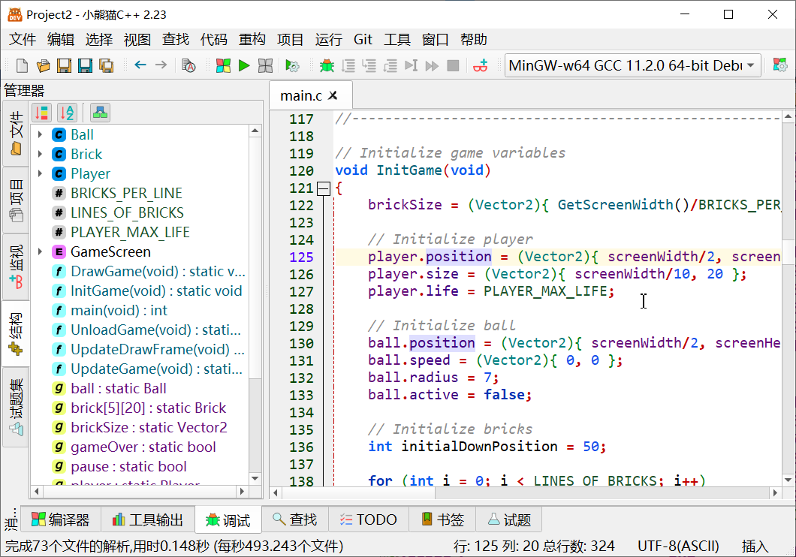
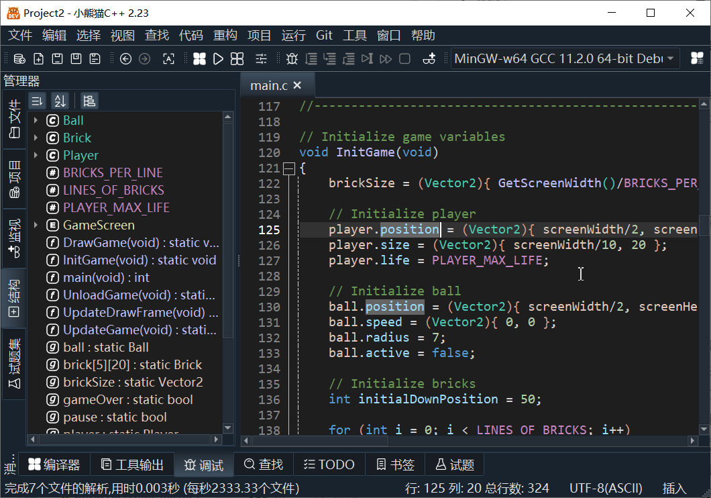
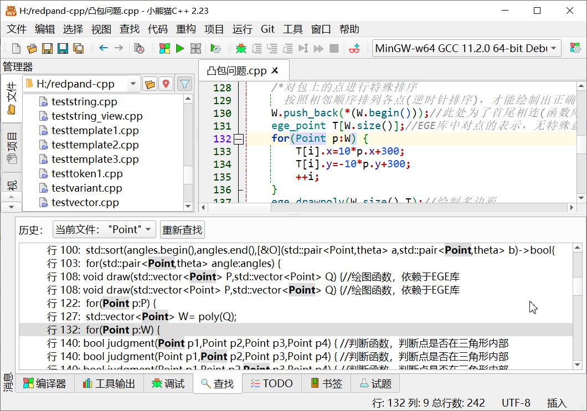

author: royqh1979

## 介绍

[小熊猫C++](https://royqh1979.gitee.io/redpandacpp/)是专门为**编程教学和算法竞赛**开发的开源、免费、跨平台的轻量级C/C++/GNU汇编集成开发环境，可运行于windows/linux/mac os等多种操作系统环境下。

小熊猫C++的界面与Dev-C++相似，除了提供和Dev-C++相似但更加完善的**单文件编译**、**调试**、**语法高亮**、**搜索/替换**等功能外，还提供了诸如**暗色主题**、**代码补全提示**、**变量/函数重命名**等现代IDE常见的基本功能。此外小熊猫C++还具备与CP Editor类似的**试题集功能**，可以自行编写或从常见的OJ竞赛网站上**下载试题样例**，**自动运行和测试程序**。

小熊猫C++的作者在中学时期曾经参加NOI竞赛。大学毕业后曾从事软件开发，后进入大学从事教学工作，有多年软件工程和C/Python语言程序设计教学经验。在使用Dev-C++教学的过程中，作者感觉
有颇多不便之处，因此在Orwell Dev-C++ 5.11的基础上继续开发了[小熊猫Dev-C++](https://github.com/royqh1979/Dev-CPP)，做了大量的改进。因为开发Dev-C++所使用的Delphi 7语言缺乏很多现代功能特性，很多改进的想法难以实现，所以作者在发布小熊猫Dev-C++ 6.7.5版本后选择使用qt5从头开始，重新开发了小熊猫C++。

## 基本功能

### 下载安装

从[小熊猫C++官方下载网址](https://royqh1979.gitee.io/redpandacpp/download/)即可下载最新版小熊猫C++。

#### windows版本选择

在windows下，小熊猫C++官方提供了8个不同的版本供用户选择，可直接通过文件名区分，主要区别在于：

- **32位**/**64位** 小熊猫C++主程序和自带的mingw-w64 gcc编译器是32位还是64位程序。64位版无法在32位windows下运行。
- **无编译器**/**自带编译器** 是否自带编译器。无编译器版本需要用户另行安装gcc编译器才能编译程序。
- **绿色版**/**安装版**  绿色版为7zip压缩文件，下载后直接解压，运行RedPanda-CPP文件夹中RedPandaIDE.exe即可打开小熊猫C++；安装版以setup.exe结尾，下载后需运行安装，完成后在桌面双击小熊猫C++图标运行。

#### Linux

小熊猫C++提供Debian 11、Ubuntu 20.04和深度操作系统20.6等三种Linux的deb包，下载后在终端里运行"sudo apt install ./deb包文件名"程序即可完成安装。

#### MacOS

因作者没有苹果电脑，暂时不提供官方的mac版本下载。有兴趣的用户可加入小熊猫C++的QQ群获取热心网友编译的版本。

注意，小熊猫C++只支持使用gdb调试。如需要使用调试功能，请使用homebrew安装gcc和gdb。

### 基本使用

小熊猫C++在界面和基本操作上模仿[Dev-C++](./devcpp)，这里仅介绍其独有的部分基本功能。

#### 代码补全提示

小熊猫C++在输入时会根据当前内容，自动在弹出窗口中显示补全提示。在补全提示窗口显示的状态下，可以进行如下操作：

 - 按Esc键关闭提示窗口
 - 按TAB键，使用当前选中的提示进行补全
 - 按ENTER键，使用当前选中的提示进行补全
 - 按&uarr;、&darr;键改变当前选中的提示
 - 按Page Up、Page Down键翻页
 - 按其他键继续正常输入
 
**补全提示窗口不会影响用户的正常输入**。
 
#### 实时语法检查

小熊猫C++在输入时，后台会自动检查当前文件中的语法错误，并实时显示错误提示。

#### 智能覆写

原Dev-C++有符号补全功能，例如，在输入'('时，会自动插入对应的')'。此功能导致用户无法按照一般的输入习惯，输入'('和相应内容后，输入')'。

小熊猫C++在输入时，会根据输入的内容，自动将输入模式临时改为覆写。例如，如果当前光标所在位置的字符为')'，同时输入')'，则会自动覆写原有的')'。
这样**无论是否开启了符号补全，用户都可以按照正常的输入习惯完成内容的输入**。
 
#### 文件字符编码

小熊猫C++在打开文件时，会自动判断文件使用UTF8编码，还是当前系统的默认字符编码（windows下默认为GBK）。在编译程序时，会自动添加编码转换参数，在大多数情况下不需要用户额外设置。

和大多数现代IDE类似，用户如果需要手动修改编码，可以点击小熊猫C++右下角状态栏中的字符编码名称，在弹出菜单中选择需要的编码。

#### 文件视图

在小熊猫C++左侧的文件视图中可以浏览、删除和打开当前文件夹中的程序文件。

#### 外观主题

小熊猫C++提供了深色（黑底白字）、浅色（白底黑字）和高对比度三种主题。用户可以在第一次运行时，或者通过“工具”&rarr;“选项”对话框中的“环境”&rarr;“外观”配置页，选择合适的主题。

#### 中文字体

在小熊猫C++中，英文和非英文可以使用不同的字体。用户可以在“工具”&rarr;“选项”对话框中的“编辑器”&rarr;“字体”配置页中，选择合适的非英文字体。

#### 

通过“帮助”菜单中的相关链接，用户可以快速打开OI Wiki、Cpp Refrence等C/C++编程/竞赛常用的参考手册网站。

## 试题和试题集

小熊猫C++使用“试题”（Problem）来实现对使用标准输入输出的程序的自动测试。

 - **试题集**是由**试题**组成的集合。
 - 每个**试题**就是一道竞赛或者练习题目，包括题目和试题内容，以及多个**试题案例**。
 - 每个**试题案例**对应一组测试数据，由**输入数据**和**期望输出数据**组成。
 - **运行当前案例**就是将当前案例的输入数据作为标准输入运行当前程序，并将程序的输出保存到输出框中。程序运行结束后，自动比较实际输出和案例的期望输出是否一致。
 - **运行所有案例**就是将当前**试题**的所有案例逐一作为**当前案例**执行“**运行当前案例**”
 
 通过小熊猫C++主窗口左侧的试题集视图可以管理当前试题集中的试题。通过西方的试题视图可以管理和运行当前试题的案例。
 
## 下载OJ网站题目
 
 小熊猫C++支持通过[Competitive Companion](https://github.com/jmerle/competitive-companion)浏览器插件下载OJ网站的题目，步骤如下：
 
 1. 在浏览器（chrome/firefox/edge）中安装、打开Competitive Companion插件。
 2. 运行小熊猫C++
 3. 在浏览器中打开想要的下载的OJ网站的题目网页
 4. 在Competitive Companion插件菜单中找到与目标OJ网站的类型对应的下载项，点击下载
 5. 稍等一下，在小熊猫C++主窗口左侧的试题集视图中可以看到新下载的试题。

## 其他中高级功能

### 查找符号的引用

在编辑文件时通过右键菜单“查找符号的引用”，用户可以在当前文件/项目中查找所有用到了当前光标位置处的变量/函数/类型等符号的地方，结果以树形列表的形式显示在主窗口下方的查找视图中。

### 查找引用/文件中查找

通过“查找”菜单&rarr;“在文件中查找...”，用户可以在当前文件/打开的文件或项目中查找特定的内容，查找结果以树形列表的形式显示在主窗口下方的查找视图中。

### 重命名

通过“重构”菜单&rarr;“重命名符号”，用户可以将当前符号改为新的名称。程序中所有用到该符号的地方都会相应进行修改。该功能可以帮助用户编写可读性良好的程序。

### 调试-局部变量

在调试时，主窗口下方调试面板的局部变量页会自动显示当前作用域中的所有局部变量（以及函数实际参数)

### 调试-内存视图

在调试时，可以在主窗口下方调试面板的内存页中输入地址表达式，查看内存中的内容。
