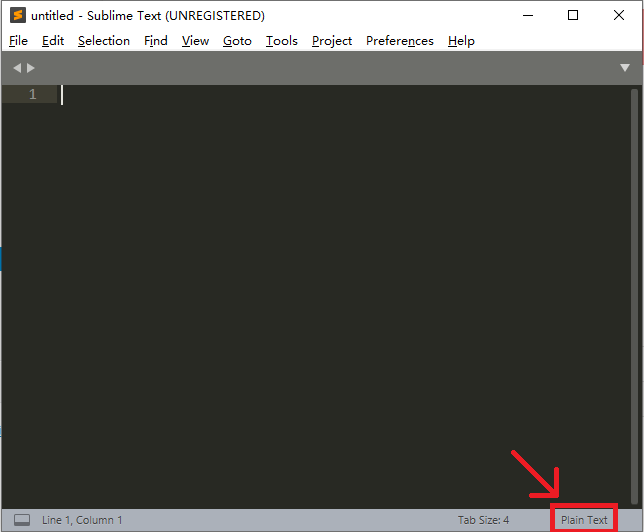

## 简介

Sublime Text 是一款轻量级的文本编辑器，支持多种语言的语法高亮及代码补全。具有高度的可拓展性以及 vim 模式，特别的热启动模式大幅避免了文件丢失的可能。

Sublime Text 4 正式版已经发布，但由于并未发布太久，许多插件仍未更新（比如汉化插件），故这里以 Sublime Text 3（以下简称 ST3 ） 为主。

ST4 与 ST3 的差别比较大，这里会少量涉及。

## 安装

直接前往 [官网](https://www.sublimetext.com/3) 下载即可，如果使用搜索引擎，可能会搜索到中文官网，提供的安装包与英文官网是同一个链接。

ST3 的安装包并不会创建桌面快捷方式，需要自己手动创建。

???+note "Sublime 提示激活"
    ST3 是收费软件，但有一个无限期的试用，试用并不会带来功能上的缺失，但会不时弹出弹窗提示你激活。

## 安装插件与自定义

### 汉化

ST3 并不支持中文，需要安装汉化插件。

#### 安装插件管理器

打开 ST3 后键入 <kbd>Crtl</kbd>+<kbd>Shift</kbd>+<kbd>P</kbd> 唤出命令框，输入 `Install` 后回车（完整命令是 `Install Package Control` ，不区分大小写），此时应该会看到左下角有一个 `=` 在不停的左右移动。等待 Package Control 安装完成，具体的加载时间取决于网络。

如果完成的弹窗显示安装失败（与网络有关），则需要手动下载 [Package Control](https://packagecontrol.io/Package%20Control.sublime-package) 并将下载好的文件放到 `C:\Users\用户名\AppData\Roaming\Sublime Text 3\Installed Packages` 中。稍作等待，ST3 会自动识别该插件。

#### 安装汉化插件

再次按下 <kbd>Crtl</kbd>+<kbd>Shift</kbd>+<kbd>P</kbd>  输入 `Install` 后回车（完整命令是 `Package Contrl:Install Package` ），等待加载完成，接下来应该是这个界面：


输入`Chinese` 选择 ChineseLocalizationgs 并回车，等待安装完毕，完成后界面会自动切换为中文（如是 ST4 ，因为汉化插件未更新，会丢失一些新增的菜单项）。

### 调整字体

从安装汉化插件后弹出来的提示文件中，可以看出 ST3 的默认字体对中文的支持很差。

进入 `首选项->设置` ，在右边的用户设置中的花括号中添加一行 `"font_face": "字体名",` ， ST3 的设置使用 json 储存，应该比较好理解。修改完成后保存，如果系统安装了对应字体会自动切换。

一般而言， Microsoft Yahei Consolas 和 Microsoft YaHei Mono 是比较好的选择。

???+warning
    注意任何设置（包括插件设置）不要在左边的的默认设置中修改，这是不被推荐的，如果软件（或插件）更新，默认设置会被重置。

### 安装插件与主题

安装插件与主题的方法与安装汉化插件一致。

输入 <kbd>Crtl</kbd>+<kbd>Shift</kbd>+<kbd>P</kbd>  输入 `Install` 后回车，然后搜索插件/主题/配色即可。

由于 ST3 主要面向网页开发，所以一般来说编辑 C++ 的情况下并没有太多很好的插件，不过一般来说自带的功能已经足够了。

插件推荐：

+ BracketHighlighter : 对原版的括号高亮进行了增强，必备。
+ C++ Snippets : ST3 自带有 C++ 代码补全，格式为大括号换行。如果不习惯大括号换行的码风可以安装这个插件，同时增加了少量补全。
+ C++ 11 : 支持 C++ 11 标准高亮。
+ SublimeAstyleFormatter : Astyle，用于格式化代码。
+ C++ Completions : 提供与 ST3 自带补全不同的补全方式，但对 C++ 头文件的支持并不完全。
+ Diffy : 按 <kbd>Crtl</kbd>+<kbd>k</kbd> & <kbd>Crtl</kbd>+<kbd>d</kbd> 即可快速比较第一视窗与第二视窗打开的文件的不同。
+ ConvertToUTF8 : 自动识别文件编码。
+ SideBarEnhancements : 侧边栏增强。
+ Transparency : 窗口透明化。

有其他需要可以自己尝试搜索。

一些主题：[^ref1]

3024 （单配色方案） 、 Grandson-of-Obsidian （单配色方案）、 Seti_UI （单主题，较为推荐）、 Material Theme 、 Predawn 、 Agila 、 Materialize 。

如果要编辑自己的配色方案，可以访问 [tmTheme Editor](http://tmtheme-editor.herokuapp.com/) 。

如是 ST4 则可以在 `Preferences->Customize Color Scheme` 中调整配色方案或 `Preferences->Customize Scheme` 中调整主题。

### 使用 vim ！

如果是希望使用 vim 但又需要快速提升效率，或许 ST3 可以作为一个中间过渡。

#### 开启方式

vim 作为一款编辑器，其效率高的特点可以说是众人皆知。

但 vim 的界面并不太友好，而且部分功能对于现代编辑器确实有些薄弱。

有没有什么现代编辑器可以支持 vim 的命令模式呢？

ST3 可以！

ST3 的 vim 模式由自带的插件 Vintage 提供，它默认是禁用的。可以通过 `首选项->设置` 在用户设置中，将 `"ignored_packages"` 一项中的 Vintage 删除并保存（不要整个删除，只删除 Vintage ）， ST3 的状态栏左边就会出现 `INSERT MODE` ，这时就可以愉快的打 vim 了。

或者按 <kbd>Crtl</kbd>+<kbd>Shift</kbd>+<kbd>P</kbd> ，然后输入 `Enable` 选择 `Package Control: Enable Package` 并回车，选择 Vintage 即可，该方法需要 Package Control 。

#### 更多东西

如果想让上下左右键失效，可以在快捷键设置中添加：

```json
	{ "keys": ["left"], "command": ""},
	{ "keys": ["right"], "command": ""},
	{ "keys": ["up"], "command": ""},
	{ "keys": ["down"], "command": ""},
```

也可以通过快捷键设置将进入命令模式设置成任意键（具体详见 [修改插件](#修改插件) ），但注意在 Windows 环境下不要使用 <kbd>Caps Lock</kbd> ，因为很难令大小写转换失效。

#### 与真正 vim 的不同

ST3 的 vim 模式与真正的 vim 略有区别，以下为找到的部分（欢迎补充）：

+ 在插入模式下用选中不会进入可视模式，这时输入不会被识别为命令而是直接替换文本。可视模式只有命令模式下才能进入。
+ `r` 、 `R` 、 `zA` 、 `za` 、 `zi` 、 `z=` 、 `@` 与使用 <kbd>[</kbd>  、 <kbd>]</kbd> 或 <kbd>"</kbd> 键的命令不存在。
+ 使用 <kbd>Ctrl</kbd> 、 <kbd>Shift</kbd> 和 <kbd>Alt</kbd> 键的快捷键会保留为 ST3 设置的快捷键，如 <kbd>Crtl</kbd>+<kbd>v</kbd> 不会进入可视模式而是正常粘贴。
+ 命令行模式只保留了 `:e` 、 `:0` 、 `:$` 、 `:s`  。
+ 使用 `\` 与 `?` 命令会自动唤出搜索框，而不是直接在命令中键入单词进行搜索。同时，数字将无法生效。
+ `q` 宏录制命令会启动 ST3 自带的宏录制，按 <kbd>q</kbd> 后需要再按一个键启动录制，但录制的宏不会与该键绑定，需要按 <kbd>Crtl</kbd>+<kbd>Shift</kbd>+<kbd>Q</kbd>  才能启动。如果需要保存，需要 `工具->保存宏` ，快捷键需要设置。
+ 无法使用 `数字+.`  的组合。

??? note "让 ST3 更加 vim" 
    从快捷键设置可以看出 ST3 的模式与 vim 很像，理论上只要至包含一个非控制字符的快捷键，可以大部分配置成 vim ，但显然需要相当的耐心。

### 设置

#### 设置 ST3

在`首选项->设置` 中设置，这里给出一个实用的设置：

```json
{
	"font_size": 11,  //字体大小
	"font_face": "",  //字体，可以不设置，默认为 Consolas
	"translate_tabs_to_spaces": true,  //Tab自动转换为空格
	"tab_size": 4,  //缩进宽度
	"highlight_line": true,  //行高亮
	"trim_trailing_white_space_on_save": true,  //保存时自动在文件尾增加换行
	"auto_find_in_selection": true,  //在选择时查找自动只查找选择范围
	"ignored_packages":  //禁用了OI中不太可能用到的插件，可以自己调整
	[
		"ActionScript",
		"AppleScript",
		"ASP",
		"Batch File",
		"C#",
		"Clojure",
		"CSS",
		"D",
		"Diff",
		"Erlang",
		"Git Formats",
		"Go",
		"Graphviz",
		"Groovy",
		"Haskell",
		"HTML",
		"Java",
		"LaTeX",
		"Lisp",
		"Lua",
		"Makefile",
		"Matlab",
		"Objective-C",
		"OCaml",
		"Perl",
		"PHP",
		"Python",
		"R",
		"Rails",
		"RestructuredText",
		"Ruby",
		"Rust",
		"Scala",
		"ShellScript",
		"SQL",
		"TCL",
		"Textile",
		"XML",
	],
}
```

#### 设置快捷键

在`首选项->快捷键设置` 中设置，在左边找到自己需要修改的功能，然后复制到右边并修改按键即可。注意 ST3 的功能极多，不要与其他功能重复了，或者把重复的功能的快捷键也改掉。

例如，如果要把 <kbd>Ctrl</kbd>+<kbd>B</kbd> 的编译改为 <kbd>F9</kbd> （如果不令原有的快捷键失效，实际是增加一个触发方式），则可以在 `首选项->快捷键设置` 中添加：

```json
	{ "keys": ["f9"], "command": "build" },  //将build命令改为f9
	{ "keys": ["shift+f9"], "command": "sort_lines", "args": {"case_sensitive": false} },  //将原有的行排序的快捷键改为shift+f9，由于大部分时候这个功能用不到，这一行也可以不添加
```

#### 设置插件

插件的设置可以在 `首选项->Package Setting->插件名` 中找到，做修改时请注意不要修改默认设置。

例如，这里给出 BracketHighlighter 的一种比较实用的设置，可以在 `首选项->Package Setting->BracketHighlighter->Bracket Setting` 中修改：

```json
{
	"content_highlight_bar": true,  //在匹配的括号之间行的行首显示一条线，可以快速找到括号的范围
	"show_in_minimap": true,  //在小地图中显示匹配的括号
	"ignore_threshold": true,  //忽略匹配范围
	"bracket_styles": {
		"default": {
			"icon": "dot",
			"color": "region.yellowish brackethighlighter.default",
			"style": "bold",  //匹配样式，bold为块高亮，underline为标准下划线，outline为外面一圈
		},
		"unmatched": {
			"icon": "question",  //在侧边栏
			"color": "region.redish", //可以配置颜色
			"style": "outline",
		},
		"curly": {
			"icon": "curly_bracket",
			"color": "region.purplish",
		},
		"round": {
			"icon": "round_bracket",
			"color": "region.yellowish",
		},
		"square": {
			"icon": "square_bracket",
			"color": "region.bluish",
		},
		"angle": {
			"icon": "angle_bracket",
			"color": "region.orangish",
		},
		"tag": {
			"icon": "tag",
			"color": "region.orangish",
		},
		"c_define": {
			"icon": "hash",
			"color": "region.yellowish",
		},
		"single_quote": {
			"icon": "single_quote",
			"color": "region.greenish",
		},
		"double_quote": {
			"icon": "double_quote",
			"color": "region.greenish",
		},
		"regex": {
			"icon": "star",
			"color": "region.greenish",
		}
	}
}
```

### 修改插件

有时候，插件的某些地方可能并不尽如人意，或我们想自己汉化插件，这时就需要对插件做一些修改。

一般而言，插件的目录是 `C:\Users\用户名\AppData\Roaming\Sublime Text 3\Installed Packages` （也可以通过 `首选项->浏览插件目录` 快速找到）。

里面的文件以 `.sublime-package` 为后缀，但实际上就是压缩包，可以使用 Winrar 等软件打开。

例如，如果要修改自动补全，可以打开安装目录下 `Package\C++` 插件中的 `.sublime-snippet` 文件修改，如要增添自动补全，可以安装 C++ Snippets 并在其中修改或添加文件。做任何修改时记得关闭 ST3 。

例如，一个文件模板的补全可以这么写：

```html
<snippet>
	<description>template_code</description> <!-- 这里的内容是补全内容的预览 -->
	<content><![CDATA[#include <cstdio>
using namespace std;

int main(){
	freopen("${1:file name}.in","r",stdin);
	freopen("$1.out","w",stdout);
	${0:/* code */}
	fclose(stdin);
	fclose(stdout);
	return(0);
}]]></content>
	<tabTrigger>code</tabTrigger> <!-- 这里的内容是补全的触发文本 -->
	<scope>source.c++</scope> <!-- 这里的内容是补全适用语言 -->
</snippet>
```

以下列出部分文件后缀以及其用途，具体的插件开发教程详见 [社区文档](https://docs.sublimetext.io/guide/extensibility/plugins/) 和 [官方文档](https://www.sublimetext.com/docs/3/) ：

| 后缀名               | 用途                                                    |
| -------------------- | ------------------------------------------------------- |
| .sublime-build       | 编译系统文件                                            |
| .sublime-completions | 文件名补全列表（一般为头文件）                          |
| .sublime-syntax      | 语法高亮文件                                            |
| .sublime-settings    | 设置文件                                                |
| .tmPreferences       | 首选项中的列表文件                                      |
| .sublime-keymap      | 快捷键设置文件                                          |
| .sublime-snippet     | 代码补全文件                                            |
| .py                  | Python 文件，一般用于编写命令                           |
| .sublime-commands    | 命令定义文件                                            |
| .sublime-menu        | ST3 UI文件，包括侧边栏以及顶部菜单栏 （汉化的主要对象） |

由于插件会时不时更新，所以建议备份自己更改的文件。

## 编辑

### 设置语法

按右下角的 `Plain Text` 然后修改为你需要的语言即可。



### 快捷键

注意 ST3 有复合快捷键，如 <kbd>Ctrl</kbd>+<kbd>K</kbd> & <kbd>Ctrl</kbd>+<kbd>Backspace</kbd> 表示先按 <kbd>Ctrl</kbd>+<kbd>K</kbd> 再按 <kbd>Ctrl</kbd>+<kbd>Backspace</kbd> ，不要认为是两者都可以。

以及，不要尝试用 vim 模式中的 `j` 、 `k` 命令代替上下来触发快捷键。

部分快捷键：[^ref2]

| 按键                                                         | 命令                                                         |
| ------------------------------------------------------------ | ------------------------------------------------------------ |
| <kbd>Ctrl</kbd>+<kbd>X</kbd>                                 | 剪切当前行                                                   |
| <kbd>Ctrl</kbd>+<kbd>Shift</kbd>+<kbd>K</kbd>                | 删除行                                                       |
| <kbd>Ctrl</kbd>+<kbd>Enter</kbd>                             | 在下方插入行                                                 |
| <kbd>Ctrl</kbd>+<kbd>Shift</kbd>+<kbd>Enter</kbd>            | 在上方插入行                                                 |
| <kbd>Ctrl</kbd>+<kbd>Shift</kbd>+<kbd>Up</kbd>               | 行上移                                                       |
| <kbd>Ctrl</kbd>+<kbd>Shift</kbd>+<kbd>Down</kbd>             | 行下移                                                       |
| <kbd>Ctrl</kbd>+<kbd>L</kbd>                                 | 选择行，重复以向下选择多行                                   |
| <kbd>Ctrl</kbd>+<kbd>D</kbd>                                 | 选择词，重复以选择多个相同词，并进入多点编辑（用于快速批量更改） |
| <kbd>Ctrl</kbd>+<kbd>M</kbd>                                 | 跳转到匹配的括号                                             |
| <kbd>Ctrl</kbd>+<kbd>Shift</kbd>+<kbd>M</kbd>                | 选择括号内的内容（不包括括号），重复以包括括号               |
| <kbd>Ctrl</kbd>+<kbd>K</kbd> & <kbd>Ctrl</kbd>+<kbd>K</kbd>  | 删至行尾（复合快捷键，建议使用 vim 模式代替）                |
| <kbd>Ctrl</kbd>+<kbd>K</kbd> & <kbd>Ctrl</kbd>+<kbd>Backspace</kbd> | 删至行首（复合快捷键，建议使用 vim 模式代替）                |
| <kbd>Ctrl</kbd>+<kbd>]</kbd>                                 | 缩进当前（选择的）行                                         |
| <kbd>Ctrl</kbd>+<kbd>[</kbd>                                 | 取消缩进当前（选择的）行                                     |
| <kbd>Ctrl</kbd>+<kbd>Shift</kbd>+<kbd>D</kbd>                | 复制当前行，并插入在下一行                                   |
| <kbd>Ctrl</kbd>+<kbd>J</kbd>                                 | 合并下一行与当前行                                           |
| <kbd>Ctrl</kbd>+<kbd>Shift</kbd>+<kbd>V</kbd>                | 粘贴并缩进（用于整段粘贴代码）                               |
| <kbd>Ctrl</kbd>+<kbd>K</kbd> & <kbd>Ctrl</kbd>+<kbd>Shift</kbd>+<kbd>V</kbd> | 从历史粘贴（复合快捷键，建议修改为 <kbd>Ctrl</kbd>+<kbd>Alt</kbd>+<kbd>V</kbd>） |
| <kbd>Ctrl</kbd>+<kbd>Alt</kbd>+<kbd>Down</kbd>               | 光标下移，并保留当前行光标（进入多点编辑模式）               |
| <kbd>Ctrl</kbd>+<kbd>Alt</kbd>+<kbd>Up</kbd>                 | 光标上移，并保留当前行光标（进入多点编辑模式）               |
| <kbd>~</kbd>                                                 | 转换选择内容的大小写                                         |

### 自动补全

ST3 有丰富的补全功能，可能的补全内容会在光标下方显示，按 <kbd>Tab</kbd> （或 <kbd>Enter</kbd> ，但在编辑块中跳转仍需要 <kbd>Tab</kbd> ，所以不建议使用）进行补全。

补全后一般会选择一块区域进行编辑，编辑完成后再次按 <kbd>Tab</kbd> 进行下一个编辑块的编辑（ for 循环等复杂代码可能有多个编辑块，需要按多次 <kbd>Tab</kbd> ）。

如果没有自动补全，请如下修复：

1. 检查是否切换了语言， ST3 默认新建文件为 Plain Text。

2. 进入 `首选项->设置` 然后添上两行：

```json
    "auto_complete": true,
    "auto_match_enabled": true,
```


### 多点编辑

按 <kbd>Ctrl</kbd> 并用鼠标单击即可在屏幕上增加光标，任何操作会同时应用至所有光标，<kbd>Ctrl</kbd>+<kbd>Alt</kbd>+<kbd>Up</kbd> 或 <kbd>Ctrl</kbd>+<kbd>Alt</kbd>+<kbd>Down</kbd> 可以在相邻两行直接增加光标。

### 查找与替换

<kbd>Ctrl</kbd>+<kbd>F</kbd> 为查找， <kbd>F3</kbd> 为查找下一个 <kbd>Shift</kbd>+<kbd>F3</kbd> 为查找上一个，<kbd>Ctrl</kbd>+<kbd>H</kbd> 为替换。

五个查找选项分别为、正则表达式（开启后可以直接输入正则表达式）、大小写敏感、全字匹配、循环查找、在选段中查找。

建议在首选项中将 `"auto_find_in_selection"` 设置为 `true` 这样在选择超过一个词时使用查找会自动只在选段中查找。

## 演示

以下假定读者已经开启了 vim 插件。

### 热启动

尝试在 ST3 中键入一些内容，并直接把整个 ST3 关闭，你会发现 ST3 不会有任何提示就直接关闭了。这时再打开 ST3 ，不会丢失任何内容，即使重启电脑也不会。

### 多点编辑

如果要把以下代码中的所有  `bok` 改为 `book` ，只需将光标放置在任意一个 `bok` 中，按五次 <kbd>Ctrl</kbd>+<kbd>D</kbd> 即可快速选中。

```c++
int check() {
  book[1] = 1, book[2] = 1, book[3] = 1, bok[1] = 1, bok[2] = 1, bok[3] = 1,
  bok[4] = 1, bok[5] = 1;
}
```

如果要将下列文件中的所有等号后面改成 `"good"` ，只需在将光标放置于第一行的 `aaa` 前，并按六次  <kbd>Ctrl</kbd>+<kbd>Alt</kbd>+<kbd>Down</kbd> ，再然后按下 <kbd>Ctrl</kbd>+<kbd>D</kbd> 并键入 `good` 即可。

或选中 `"a` ，然后按住 <kbd>Ctrl</kbd>+<kbd>D</kbd> 然后按 <kbd>Right</kbd> 、 <kbd>Ctrl</kbd>+<kbd>D</kbd> ，之后键入即可。

```c++
s[1] = "aaa";
s[2] = "aab";
s[3] = "aac";
s[4] = "good"
s[5] = "aae";
s[6] = "aaf";
```

如要为下列所有 `a + b` 加上括号，只需选择一个 `a + b` ，按住 <kbd>Ctrl</kbd>+<kbd>D</kbd> 并键入 <kbd>(</kbd> 即可（如选择一定区域，则 <kbd>(</kbd> 会为该区域两边添加括号）。

```c++
a + b * a + b * a + b
```

### 查找与替换

如果要将下列文件中的所有等号后面改成 `"good"` ，也可以用 <kbd>Crtl</kbd>+<kbd>H</kbd> 使用替换，打开正则，输入 `".*"` ，并替换成 `"good"` 即可。

```c++
s[1] = "aaa";
s[2] = "aab";
s[3] = "aac";
s[4] = "good"
s[5] = "aae";
s[6] = "aaf";
```

如要为以下代码添加分号，只需使用替换，打开正则，输入 `\n` ，并替换成 `;\n` 即可。

```c++
int a, b
cin >> a >> b
cout << a + b
return 0

```

### 宏录制

如要为以下代码添加分号，可以按 <kbd>Ctrl</kbd>+<kbd>q</kbd> 启动宏录制接下来依次按 <kbd>End</kbd> 、 <kbd>;</kbd>  、 <kbd>Down</kbd> 再按 <kbd>Ctrl</kbd>+<kbd>q</kbd> 结束宏录制（中途左下角不会全程显示正在录制，但确实在录制），接下来按 <kbd>Ctrl</kbd>+<kbd>Shift</kbd>+<kbd>q</kbd> 执行一次，  <kbd>Esc</kbd> 进入命令模式，输入 `..` 即可（ `.` 命令可以重复 ST3 命令）

```c++
int a, bcin >> a >> bcout << a + breturn 0
```

关于宏的保存与绑定按键详见 [社区文档](https://docs.sublimetext.io/guide/extensibility/macros.html) 。

## 编译与运行

ST3 的编译环境已经配置好了，可以直接使用。

Windows 环境下需要将 g++ 所在目录添加到环境变量中，并重启 ST3 。

### 编译

直接按 <kbd>Ctrl</kbd>+<kbd>B</kbd> 编译，第一次使用会让你选择编译方式，选择 `C++ Single File ` （编译）或 `C++ Single File - Run` （编译并运行）。


#### 修改编译选项

虽然 ST3 自带编译环境，但不幸的是，编译选项无法修改。

如果需要修改编译选项，则需要自己新建一个编译系统。

进入 `系统->编译系统->新建编译系统…` 然后在大括号中间输入：

```json
"cmd": ["cmd","/c","g++","-Wall","${file}","-o","${file_path}/${file_base_name}","&&","cmd","/c","${file_path}/${file_base_name}"],    //编译选项可以自己调整"file_regex": "^(..[^:]*):([0-9]+):?([0-9]+)?:? (.*)$",    //这一行可以让ST3图形化显示报错，如果习惯了看g++返回的信息可以去掉
```

保存后按 <kbd>Ctrl</kbd>+<kbd>Shift</kbd>+<kbd>B</kbd> 把编译系统切换到你自己写的这个，就可以使用了，这里的配置是编译并在外部 CMD 运行。

保存的文件为 `C:\Users\用户名\AppData\Roaming\Sublime Text 3\Packages\User\编译系统名.sublime-build` 可以反复修改。

??? note "其他配置方法"
    以下为满足各位的各种需要而写，可能需要掌握一些命令行的知识。
    

    只编译 ```json"cmd": [“g++","-Wall","${file}","-o","${file_path}/${file_base_name}"],```在内部 CMD 运行```json"shell_cmd": [g++","-Wall","${file}","-o","${file_path}/${file_base_name}","&&","${file_path}/${file_base_name}& pause"],```还可以利用一些方法把编译和运行拆开并分别配置快捷键，由于并不必要，请自行搜索。


### 运行

如果编译时选择 `C++ Single File - Run` （或者自己配置了自动运行） ，那么在下方弹出的编译信息窗口可能不会有任何显示，因为 ST3 的编译信息窗口兼职 CMD ，此时它在等你给正在运行的程序输入数据。

运行结束后会提示程序的运行时间。

??? note "为什么感觉时间多了？"
    注意这个时间是从按下 <kbd>Ctrl</kbd>+<kbd>B</kbd> 到程序结束的时间，也就是说包括编译的时间和输入的时间，以及如果在外部 CMD 运行还包括 CMD 开启关闭的时间，总之确实不太准。

???+warning
    这个窗口无法输入 <kbd>F6</kbd> 或 <kbd>Ctrl</kbd>+<kbd>Z</kbd> ，如果运行读入到文件末尾的程序请使用文件输入，或使用上面「其他配置方法」中写的方法在外部 CMD 运行。


### 调试

可以安装插件使 ST3 支持 gdb 调试，但不建议依赖插件进行 gdb 调试。

更好的做法是在配置编译系统时加上相关命令启动 gdb ，在外部进行命令行调试。

## 杂项

+ 把文件夹拖进 ST3 中并开启侧边栏，从而快速切换文件。
+ 善用跳转功能，尤其是 <kbd>Ctrl</kbd>+<kbd>P</kbd> 进行文件跳转与 <kbd>Ctrl</kbd>+<kbd>R</kbd> 进行函数跳转。


+ ST3 支持 git [^ref3]。

## 外部链接

+ [使用命令行调试](./cmd)
+ [Sublime Text 4](https://www.sublimetext.com/blog/articles/sublime-text-4)
+ [Sublime Text 3 官方文档](https://www.sublimetext.com/docs/3/)


## 参考资料与注释

[^ref1]: [便捷清新的文本编辑器 sublime](https://www.luogu.com.cn/blog/acking/sublime)

[^ref2]: [Sublime Text社区文档](https://docs.sublimetext.io/)

[^ref3]: [Sublime Text 3 Git集成](https://www.sublimetext.com/docs/3/git_integration.html)

