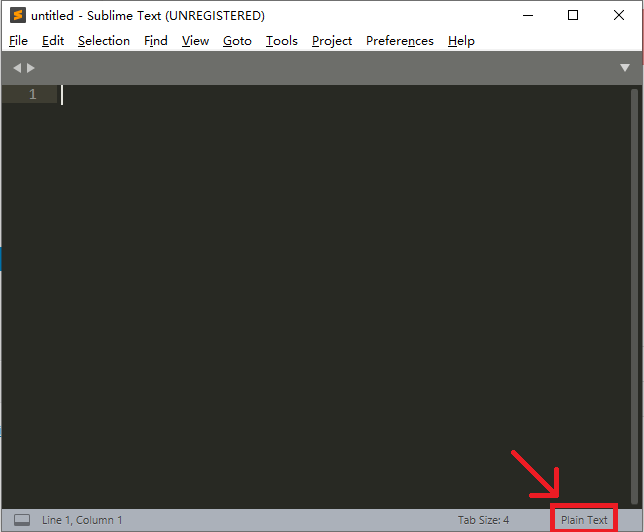

## 简介

Sublime Text 3（以下简称 ST3）是一款轻量级的文本编辑器，支持多种语言的语法高亮及代码补全。具有高度的可拓展性以及 vim 模式。

ST3 相比于 ST2，性能大幅提升，安装插件也简单了许多。

## 安装

直接前往 [官网](https://www.sublimetext.com/3) 下载即可，如果使用搜索引擎，可能会搜索到中文官网，提供的安装包与英文官网是同一个链接。

ST3 的安装包并不会创建桌面快捷方式，需要自己手动创建。

???+note "Sublime 提示激活"
    ST3 是收费软件，但有一个无限期的试用，试用并不会带来功能上的缺失，但会不时弹出弹窗提示你激活。

## 安装插件与自定义

### 汉化

ST3 并不支持中文，需要安装汉化插件。

#### 安装插件管理器

打开 ST3 后键入<kbd>Ctrl</kbd>+<kbd>Shift</kbd>+<kbd>P</kbd>唤出命令框，输入 `Install` 后回车（完整命令是 `Install Package Control`，不区分大小写），此时应该会看到左下角有一个 `=` 在不停的左右移动。等待 Package Control 安装完成，具体的加载时间取决于网络。

如果完成的弹窗显示安装失败（与网络有关），则需要手动下载 [Package Control](https://packagecontrol.io/Package%20Control.sublime-package) 并将下载好的文件放到 `C:\Users\用户名\AppData\Roaming\Sublime Text 3\Installed Packages` 中。稍作等待，ST3 会自动识别该插件。

#### 安装汉化插件

再次按下<kbd>Ctrl</kbd>+<kbd>Shift</kbd>+<kbd>P</kbd>输入 `Install` 后回车（完整命令是 `Package Contrl:Install Package`），等待加载完成，接下来应该是这个界面：


输入 `Chinese` 选择 ChineseLocalizationgs 并回车，等待安装完毕，完成后界面会自动切换为中文。

### 调整字体

从安装汉化插件后弹出来的提示文件中，可以看出 ST3 的默认字体对中文的支持很差。

进入 `首选项->设置`，在右边的用户设置中的花括号中添加一行 `"font_face": "字体名",`，ST3 的设置使用 json 储存，应该比较好理解。修改完成后保存，如果系统安装了对应字体会自动切换。

???+warning
    注意不要在左边的的默认设置中修改，这是不被推荐的，如果软件更新，默认设置会被重置。

### 安装插件与主题

安装插件与主题的方法与安装汉化插件一致。

输入<kbd>Ctrl</kbd>+<kbd>Shift</kbd>+<kbd>P</kbd>输入 `Install` 后回车，然后搜索插件/主题/配色即可。

由于 ST3 主要面向网页前端开发，所以一般来说编辑 C++ 的情况下并没有太多很好的插件，不过一般来说自带的功能已经足够了。

插件推荐：

- BracketHighlighter：对原版的括号高亮进行了增强。

- C++ Snippets：ST3 自带有 C++ 代码补全，格式为大括号换行。如果不习惯大括号换行的码风可以安装这个插件，同时增加了少量补全。

- C++ 11：支持 C++ 11 标准高亮。

- SublimeAstyleFormatter：Astyle，用于格式化代码。


- C++ Completions：提供与 ST3 自带补全不同的补全方式，但对 C++ 头文件的支持并不完全。

有其他需要可以自己尝试搜索。

一些主题：[^ref1]

3024（单配色方案）、Grandson-of-Obsidian（单配色方案）、Seti_UI（单主题）、Material Theme、Predawn、Agila、Materialize。

如果要编辑自己的配色方案，可以访问 [tmTheme Editor](http://tmtheme-editor.herokuapp.com/)。

### 使用 vim！

#### 开启方式

vim 作为一款编辑器，其效率高的特点可以说是众人皆知。

但 vim 的界面并不太友好，而且部分功能对于现代编辑器确实有些薄弱。

有没有什么现代编辑器可以支持 vim 的命令模式呢？

ST3 可以！

ST3 的 vim 模式由自带的插件 Vintage 提供，它默认是禁用的。可以通过 `首选项->设置` 在用户设置中，将 `"ignored_packages"` 一项中的 Vintage 删除并保存，ST3 的状态栏左边就会出现 `INSERT MODE`，这时就可以愉快的打 vim 了。

#### 与真正 vim 的不同

ST3 的 vim 模式与真正的 vim 略有区别，以下为找到的部分（欢迎补充）：

- 在插入模式下用选中不会进入可视模式，这时输入不会被识别为命令而是直接替换文本。可视模式只有命令模式下才能进入。
- `r`、`R`、`zA`、`za`、`zi`、`z=`、`@` 与使用<kbd>[</kbd>、<kbd>]</kbd>或<kbd>"</kbd>键的命令不存在。
- 使用<kbd>Ctrl</kbd>、<kbd>Shift</kbd>和<kbd>Alt</kbd>键的快捷键会保留为 ST3 设置的快捷键，如 `Ctrl+V` 不会进入可视模式而是正常粘贴。
- 命令行模式只保留了 `:e`、`:0`、`:$`、`:s`。
- 使用 `\` 与 `?` 命令会自动唤出搜索框，而不是直接在命令中键入单词进行搜索。同时，数字将无法生效。
- `q` 宏录制命令会启动 ST3 自带的宏录制，按<kbd>q</kbd>后需要再按一个键启动录制，但录制的宏不会与该键绑定，需要按<kbd>Ctrl</kbd>+<kbd>Shift</kbd>+<kbd>Q</kbd>才能启动。如果需要保存，需要 `工具->保存宏`，快捷键需要设置。
- 该插件的实现方式是通过修改快捷键，由于已经打包，所以如果是包含多个字符的命令无法进行设置。

??? note "让 ST3 更加 vim" 
    从快捷键设置可以看出 ST3 的模式与 vim 很像，理论上只要至包含一个非控制字符的快捷键，可以大部分配置成 vim，但显然需要相当的耐心。

### 设置快捷键

在 `首选项->快捷键设置` 中设置，在左边找到自己需要修改的功能，然后复制到右边并修改按键即可。注意 ST3 的功能极多，不要与其他功能重复了，或者把重复的功能的快捷键也改掉。

## 编辑

### 设置语法

按右下角的 `Plain Text` 然后修改为你需要的语言即可。



### 快捷键

注意 ST3 有复合快捷键，如<kbd>Ctrl</kbd>+<kbd>K</kbd>&<kbd>Ctrl</kbd>+<kbd>Backspace</kbd>表示先按<kbd>Ctrl</kbd>+<kbd>K</kbd>再按<kbd>Ctrl</kbd>+<kbd>Backspace</kbd>，不要认为是两者都可以。

以及不要尝试用 vim 模式中的 `j`、`k` 命令代替上下来触发快捷键。

部分快捷键：[^ref2]

| 按键                                                                         | 命令                                                            |
| -------------------------------------------------------------------------- | ------------------------------------------------------------- |
| <kbd>Ctrl</kbd>+<kbd>X</kbd>                                               | 剪切当前行                                                         |
| <kbd>Ctrl</kbd>+<kbd>Shift</kbd>+<kbd>K</kbd>                              | 删除行                                                           |
| <kbd>Ctrl</kbd>+<kbd>Enter</kbd>                                           | 在下方插入行                                                        |
| <kbd>Ctrl</kbd>+<kbd>Shift</kbd>+<kbd>Enter</kbd>                          | 在上方插入行                                                        |
| <kbd>Ctrl</kbd>+<kbd>Shift</kbd>+<kbd>Up</kbd>                             | 行上移                                                           |
| <kbd>Ctrl</kbd>+<kbd>Shift</kbd>+<kbd>Down</kbd>                           | 行下移                                                           |
| <kbd>Ctrl</kbd>+<kbd>L</kbd>                                               | 选择行，重复以向下选择多行                                                 |
| <kbd>Ctrl</kbd>+<kbd>D</kbd>                                               | 选择词，重复以选择多个相同词，并进入多点编辑（用于快速批量更改）                              |
| <kbd>Ctrl</kbd>+<kbd>M</kbd>                                               | 跳转到匹配的括号                                                      |
| <kbd>Ctrl</kbd>+<kbd>Shift</kbd>+<kbd>M</kbd>                              | 选择括号内的内容，重复以包括括号                                              |
| <kbd>Ctrl</kbd>+<kbd>K</kbd>&<kbd>Ctrl</kbd>+<kbd>K</kbd>                  | 删至行尾（复合快捷键，建议使用 vim 模式代替）                                     |
| <kbd>Ctrl</kbd>+<kbd>K</kbd>&<kbd>Ctrl</kbd>+<kbd>Backspace</kbd>          | 删至行首（复合快捷键，建议使用 vim 模式代替）                                     |
| <kbd>Ctrl</kbd>+<kbd>]</kbd>                                               | 缩进当前（选择的）行                                                    |
| <kbd>Ctrl</kbd>+<kbd>\[</kbd>                                              | 取消缩进当前（选择的）行                                                  |
| <kbd>Ctrl</kbd>+<kbd>Shift</kbd>+<kbd>D</kbd>                              | 复制当前行，并插入在下一行                                                 |
| <kbd>Ctrl</kbd>+<kbd>J</kbd>                                               | 合并下一行与当前行                                                     |
| <kbd>Ctrl</kbd>+<kbd>Shift</kbd>+<kbd>V</kbd>                              | 粘贴并缩进（用于整段粘贴代码）                                               |
| <kbd>Ctrl</kbd>+<kbd>K</kbd>&<kbd>Ctrl</kbd>+<kbd>Shift</kbd>+<kbd>V</kbd> | 从历史粘贴（复合快捷键，建议修改为<kbd>Ctrl</kbd>+<kbd>Alt</kbd>+<kbd>V</kbd>） |
| <kbd>Ctrl</kbd>+<kbd>Space</kbd>                                           | 选择下一个自动补全建议（与<kbd>Down</kbd>等价，注意是空格）                         |
| <kbd>Ctrl</kbd>+<kbd>Alt</kbd>+<kbd>Down</kbd>                             | 光标下移，并保留当前行光标（进入多点编辑模式）                                       |
| <kbd>Ctrl</kbd>+<kbd>Alt</kbd>+<kbd>Up</kbd>                               | 光标上移，并保留当前行光标（进入多点编辑模式）                                       |
| <kbd>~</kbd>                                                               | 转换选择内容的大小写                                                    |

### 自动补全

ST3 有丰富的补全功能，可能的补全内容会在光标下方显示，按<kbd>Tab</kbd>（或<kbd>Enter</kbd>，但在编辑块中跳转仍需要<kbd>Tab</kbd>，所以不建议使用）进行补全。

补全后一般会选择一块区域进行编辑，编辑完成后再次按<kbd>Tab</kbd>进行下一个编辑块的编辑（for 循环等复杂代码可能有多个编辑块，需要按多次<kbd>Tab</kbd>）。

自动补全的风格无法调整，除非使用插件。

如果没有自动补全，请如下修复：

1. 检查是否切换了语言，ST3 默认新建文件为 Plain Text。

2.  进入 `首选项->设置` 然后添上两行：

    ```json
        "auto_complete": true,
        "auto_match_enabled": true,
    ```

## 编译与运行

ST3 的编译环境已经配置好了，可以直接使用。

Windows 环境下需要将 g++ 所在目录添加到环境变量中，并重启 ST3。

### 编译

直接按<kbd>Ctrl</kbd>+<kbd>B</kbd>编译，第一次使用会让你选择编译方式，选择 `C++ Single File`（编译）或 `C++ Single File - Run`（编译并运行）。

#### 修改编译选项

虽然 ST3 自带编译环境，但不幸的是，编译选项无法修改。

如果需要修改编译选项，则需要自己新建一个编译系统。

进入 `系统->编译系统->新建编译系统…` 然后在大括号中间输入：

```json
"cmd": ["cmd","/c","g++","-Wall","${file}","-o","${file_path}/${file_base_name}","&&","cmd","/c","${file_path}/${file_base_name}"],    //编译选项可以自己调整

"file_regex": "^(..[^:]*):([0-9]+):?([0-9]+)?:? (.*)$",    //这一行可以让ST3图形化显示报错，如果习惯了看g++返回的信息可以去掉
```

保存后把编译系统切换到你自己写的这个，就可以使用了，这里的配置是在 ST3 窗口内编译并运行。

保存的文件为 `C:\Users\用户名\AppData\Roaming\Sublime Text 3\Packages\User\编译系统名.sublime-build` 可以反复修改。

??? note "其他配置方法"
    以下为满足各位的各种需要而写，可能需要掌握一些命令行的知识。
    
    只编译
    
    ```json
    "cmd": [“g++","-Wall","${file}","-o","${file_path}/${file_base_name}"],
    ```
    
    在外部 CMD 运行
    
    ```json
    "cmd": ["cmd","/c","g++","-Wall","${file}","-o","${file_path}/${file_base_name}","&&","start","cmd","/c","${file_path}/${file_base_name}& pause"],
    ```
    
    还可以利用一些方法把编译和运行拆开并分别配置快捷键，由于并不必要，请自行搜索。

### 运行

如果编译时选择 `C++ Single File - Run`（或者自己配置了自动运行），那么在下方弹出的编译信息窗口可能不会有任何显示，因为 ST3 的编译信息窗口兼职 CMD，此时它在等你给正在运行的程序输入数据。

运行结束后会提示程序的运行时间。

??? note "为什么感觉时间多了？"
    注意这个时间是从按下<kbd>Ctrl</kbd>+<kbd>B</kbd>到程序结束的时间，也就是说包括编译的时间和输入的时间，以及如果在外部 CMD 运行还包括 CMD 开启关闭的时间，总之确实不太准。

???+warning
    这个窗口无法输入<kbd>F6</kbd>或<kbd>Ctrl</kbd>+<kbd>Z</kbd>，如果运行读入到文件末尾的程序请使用文件输入，或使用上面「其他配置方法」中写的方法在外部 CMD 运行。

### 调试

可以安装插件使 ST3 支持 gdb 调试，但不建议依赖插件进行 gdb 调试。

更好的做法是在配置编译系统时加上相关命令启动 gdb，在外部进行命令行调试。

## 杂项

- 把文件夹拖进 ST3 中并开启侧边栏，从而快速切换文件。

- 善用跳转功能，尤其是<kbd>Ctrl</kbd>+<kbd>P</kbd>进行文件跳转与<kbd>Ctrl</kbd>+<kbd>R</kbd>进行函数跳转。


- ST3 支持 git。

## 外部链接

- [使用命令行调试](./cmd)

## 参考资料与注释

[^ref1]: [便捷清新的文本编辑器 sublime](https://www.luogu.com.cn/blog/acking/sublime)

[^ref2]: [Sublime Text 社区文档](https://docs.sublimetext.io/)
