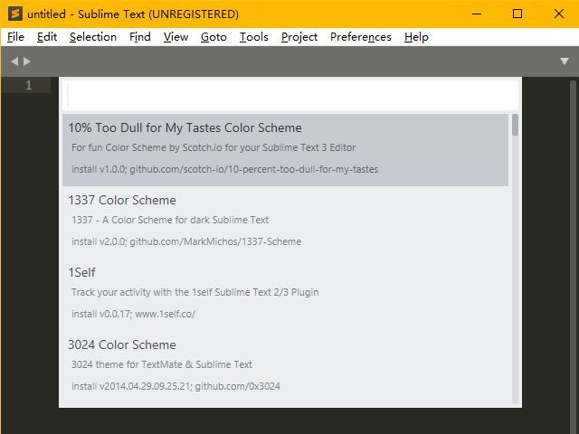

## 简介

Sublime Text 3 （以下简称ST3）是一款轻量级的文本编辑器，支持多种语言的语法高亮及代码补全。具有高度的可拓展性以及vim模式。

ST3 相比于 ST2，性能大幅提升，安装插件也简单了许多。

## 安装

直接前往 [官网](https://www.sublimetext.com/3) 下载即可，如果使用搜索引擎，可能会搜索到中文官网，提供的安装包与英文官网是同一个链接。

ST3 的安装包并不会创建桌面快捷方式，需要自己手动创建。

??? note "Sublime 提示激活"

​    ST3 是收费软件，但有一个无限期的试用，试用并不会带来功能上的缺失，但会不时弹出弹窗提示你激活。

## 安装插件与自定义

### 汉化

ST3 并不支持中文，需要安装汉化插件。

#### 安装插件管理器

打开 ST3 后键入 <kbd>Crtl</kbd>+<kbd>Shift</kbd>+<kbd>P</kbd> 唤出命令框，输入`Install` 后回车（完整命令是 `Install Package Control` ，不区分大小写），此时应该会看到左下角有一个 `=` 在不停的左右移动。等待 Package Control 安装完成，具体的加载时间取决于网络。

如果完成的弹窗显示安装失败（与网络有关），则需要手动下载 [Package Control](https://packagecontrol.io/Package%20Control.sublime-package) 并将下载好的文件放到 `C:\Users\用户名\AppData\Roaming\Sublime Text 3\Installed Packages` 中。稍作等待，ST3 会自动识别该插件。

#### 安装汉化插件

再次按下 <kbd>Crtl</kbd>+<kbd>Shift</kbd>+<kbd>P</kbd> 输入 `Install` 后回车（完整命令是 `Package Contrl:Install Package`），等待加载完成，接下来应该是这个界面：



输入`Chinese` 选择 ChineseLocalizationgs 并回车，等待安装完毕，完成后界面会自动切换为中文。

### 调整字体

从安装汉化插件后弹出来的提示文件中，可以看出ST3的默认字体对中文的支持很差。

进入 `首选项->设置` ，在右边的用户设置中的花括号中添加一行 `"font_face": "字体名",` ，ST3的设置使用JSON格式储存，应该比较好理解。修改完成后保存，如果系统安装了对应字体会自动切换。

???+warning
​    注意不要在左边的的默认设置中修改，这是不被推荐的，如果软件更新，默认设置会被重置。

### 安装插件与主题

安装插件与主题的方法与安装汉化插件一致。

输入 <kbd>Crtl</kbd>+<kbd>Shift</kbd>+<kbd>P</kbd> 输入 `Install` 后回车，然后搜索插件/主题/配色即可。

本人目前使用如下插件：

+ BracketHighlighter ：对原版的括号高亮进行了增强。
+ C++ Snippets ：ST3 自带有 C++ 代码补全，格式为大括号换行。如果不习惯大括号换行的码风可以安装这个插件，同时增加了少量补全。

主题（管理编辑区以外的UI部分）：Seti_UI

配色方案（管理编辑区颜色）：Grandson-of-Obsidian

### 使用vim！

#### 开启方式

会用vim的同学估计在用其他编辑器（尤其是Dev-C++）时会有这样的想法：要是这东西可以 <kbd>Esc<\kbd> 再……就好了。

ST3 可以！

ST3 的 vim 模式是一个安装时自带的插件，叫 Vintage ，它默认是禁用的。可以通过 `首选项->设置` 在用户设置中，将 `"ignored_packages"` 一栏中的 Vintage 删除并保存，ST3的状态栏左边就会出现 INSERT MODE ，这时就可以愉快的打 vim了。

#### 不同

ST3的vim与真正的vim略有区别，以下为找到的部分（欢迎补充）：

+ 在插入模式下用选中不会进入可视模式，这时输入不会被识别为命令而是直接替换文本。可视模式只有命令模式下才能进入。
+ `r` 、 `R` 、`zA` 、`za`、`zi` 、 `z=` 与使用 `[` 、 `]`和 `"` 键的命令不存在。
+ 使用<kbd>Ctrl</kbd>、<kbd>Shift</kbd> 和 <kbd>Alt</kbd> 键的快捷键会保留为 ST3 设置的快捷键，如 <kbd>Ctrl</kbd>+<kbd>V</kbd> 不会进入可视模式而是正常粘贴。
+ 命令行模式只保留了 `:e` 、 `:0` 、 `:$` 、`:s` 。
+ 使用`\` 与 `?` 命令会自动唤出搜索框，而不是直接在命令中键入单词进行搜索。

### 设置快捷键

在`首选项->快捷键设置` 中设置，在左边找到自己需要修改的功能，然后复制到右边并修改按键即可。注意ST3的功能极多，不要与其他功能重复了（但默认设置其实也有许多重复），或者把重复的功能的快捷键也改掉。

??? note "让ST3更加 vim" 
​    从快捷键设置可以看出 ST3 的模式与 vim 很像，理论上可以大部分配置成 vim ，但显然需要相当的耐心。

## 编译与运行

ST3 的编译环境已经配置好了，可以直接使用。

### 编译

直接按 `Ctrl+B` 编译，第一次使用会让你选择编译方式，选择 `C++ Single File ` 或 `C++ Single File - Run`。

#### 修改编译选项

虽然 ST3 自带编译环境，但不幸的是，这个环境的编译选项无法修改。

如果需要修改编译选项，则需要自己新建一个编译系统（不要看名字很高大上，实际只是几行JSON代码）。

进入`系统->编译系统->新建编译系统…` 然后在大括号中间输入：

```json
 	"cmd": ["cmd","/c","g++","-Wall","-lm","${file}","-o","${file_path}/${file_base_name}","&&","cmd","/c","${file_path}/${file_base_name}"],
	"file_regex": "^(..[^:]*):([0-9]+):?([0-9]+)?:? (.*)$", //这一行可以让ST3图形化显示报错，如果习惯了看g++返回的信息或者考场上背不下来可以去掉
```

保存后把编译系统切换到你自己写的这个，就可以使用了，这里的配置是在ST3窗口内编译并运行。

??? note "其他配置方法"
    以下为满足各位的各种需要而写，可能需要掌握一些命令行的知识。

    只编译 
    
    ```json
        "cmd": [“g++","-Wall","-lm","${file}","-o","${file_path}/${file_base_name}"],
    ```
    在外部 CMD 运行
    ```json
 	    "cmd": ["cmd","/c","g++","-Wall","-lm","${file}","-o","${file_path}/${file_base_name}","&&","start","cmd","/c","${file_path}/${file_base_name}&pause"],
    ```

    还可以利用一些方法把编译和运行拆开并分别配置快捷键，由于考场上应该用不到，请自行搜索。

### 运行

如果编译时选择 `C++ Single File - Run` ，那么在下方弹出的编译信息窗口可能不会有任何显示，因为 ST3 的编译信息窗口兼职CMD，此时它在等你给正在运行的程序输入数据。

运行结束后会提示程序的运行时间。

??? note "为什么感觉时间多了？"
    注意这个时间包括编译的时间。

???+warning
​    这个窗口无法输入`F6`或`Crtl+Z` ，如果运行读入到文件末尾的程序请使用文件输入，或使用上面「其他配置方法」中写的方法在外部 CMD 运行。
