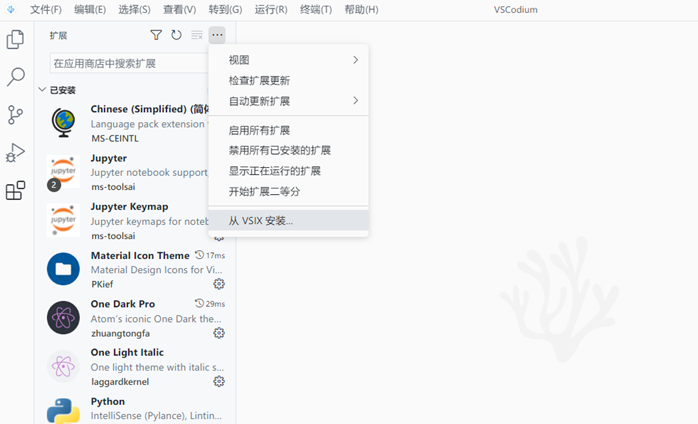
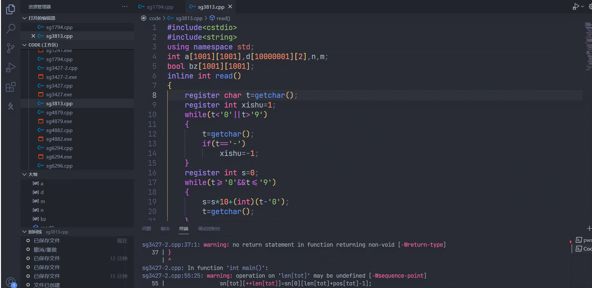

author: NachtgeistW, Ir1d, ouuan, Enter-tainer, Xeonacid, ChungZH, keepthethink, abc1763613206, partychicken, Chrogeek, xkww3n, HeliumOI, Pinghigh, xiaofu-15191

## 简介

Visual Studio Code（以下简称 VS Code）是一个由微软开发，同时支持 Windows、Linux 和 macOS 等操作系统且开放源代码的代码编辑器。它是用 TypeScript 编写的，并且采用 Electron 架构。它带有对 JavaScript、TypeScript 和 Node.js 的内置支持，并为其他语言（如 C、C++、Java、Python、PHP、Go）提供了丰富的扩展生态系统。

官网：[Visual Studio Code - Code Editing. Redefined](https://code.visualstudio.com/)

## 使用 Code Runner 扩展运行代码

VS Code 安装并配置扩展后可实现对 C/C++ 的支持，但配置过程比较复杂。一个简单的编译与运行 C++ 程序的方案是安装 Code Runner 扩展。

Code Runner 是一个可以一键运行代码的扩展，在工程上一般用来验证代码片段，支持 Node.js、Python、C、C++、Java、PHP、Perl、Ruby、Go 等 40 多种语言。

安装的方式是在扩展商店搜索 Code Runner 并点击 Install；或者前往 [Marketplace](https://marketplace.visualstudio.com/items?itemName=formulahendry.code-runner) 并点击 Install，浏览器会自动打开 VS Code 并进行安装。

安装完成后，打开需要运行的文件，点击右上角的小三角图标即可运行代码；按下快捷键<kbd>Ctrl</kbd>+<kbd>Alt</kbd>+<kbd>N</kbd>（在 macOS 下是<kbd>Control</kbd>+<kbd>Option</kbd>+<kbd>N</kbd>）也可以得到同样的效果。

???+ warning
    如果安装了 VS Code 与 Code Runner 后，代码仍然无法运行，很有可能是因为系统尚未安装 C/C++ 的运行环境，参考 [Hello, World! 页面](../../lang/helloworld.md) 以安装。
    
    记得勾选设置中的 Run In Terminal 选项，如图：

## 使用 C/C++ 扩展编译并调试/智能补全代码

### 安装扩展

在 VS Code 中打开扩展商店，在搜索栏中输入 `C++` 或者 `@category:"programming languages"`，然后找到 C/C++，点击 Install 安装扩展。

???+ warning
    在配置前，请确保系统已经安装了 G++ 或 Clang，并已添加到了 `PATH` 中。请使用 CMD 或者 PowerShell，而不是 Git Bash 作为集成终端。

### 配置 GDB/LLDB 调试器

#### GDB

在 VS Code 中新建一份 C++ 代码文件，按照 C++ 语法写入一些内容（如 `int main(){}`），保存并按下<kbd>F5</kbd>，进入调试模式。
如果出现了「选择调试器」的提示，选择 `C++ (GDB/LLDB)`。在「选择配置」中，G++ 用户选择 `g++.exe - 生成和调试活动文件`；Clang 用户选择 `clang++ - 生成和调试活动文件`。

???+ warning
    配置名称并非固定，而是可以自定义的。不同的操作系统可能具有不同的配置名称。

完成后，VS Code 将自动完成初始化操作在下方的集成终端中启动调试。至此，GDB 所有的配置流程已经完毕。

#### LLDB

如果需要采用 LLDB，需要安装另外一款扩展[^ref1]——[CodeLLDB](https://github.com/vadimcn/vscode-lldb/)。从该项目的 Release 页面下载 .vsix 文件后[^ref2]，从 VS Code 的扩展页面安装。

先按照上文 GDB 的配置过程操作一遍，然后删除 `.vscode/launch.json`，按下<kbd>F5</kbd>，选择 `LLDB`，再把 `launch.json` 中的 `${workspaceFolder}/<executable file>` 更改为 `${fileDirname}/${fileBasenameNoExtension}.exe` 即可。

至此，LLDB 配置完成。再次按下<kbd>F5</kbd>即可看到软件下方的调试信息。

若要在以后使用 VS Code 编译并调试代码，所有的源代码都需要保存至这个文件夹内。若要编译并调试其他文件夹中存放的代码，需要重新执行上述步骤（或将旧文件夹内的 `.vscode` 子文件夹复制到新文件夹内）。

### 开始调试代码

使用 VS Code 打开一份代码，将鼠标悬停在行数左侧的空白区域，并单击出现的红点即可为该行代码设置断点。再次单击可取消设置断点。

按下<kbd>F5</kbd>进入调试模式，编辑器上方会出现一个调试工具栏，四个蓝色按钮从左至右分别代表 GDB 中的 `continue`,`next`,`step` 和 `until`：

如果编辑器未自动跳转，点击左侧工具栏中的「调试」图标进入调试窗口，即可在左侧看到变量的值。

在调试模式中，编辑器将以黄色底色显示下一步将要执行的代码。

### 配置 IntelliSense

用于调整 VS Code 的智能补全。

如果你使用 Clang 编译器，在「IntelliSense 模式」中选择 `clang-x64` 而非默认的 `msvc-x64`；如果你使用 G++ 编译器，选择 `gcc-x64` 以使用自动补全等功能。否则会得到「IntelliSense 模式 msvc-x64 与编译器路径不兼容。」的错误。

## 配置 clangd

???+ warning
    由于功能冲突，安装 clangd 扩展后 C/C++ 扩展的 IntelliSense 功能将被禁用（调试等功能仍然使用 C/C++ 扩展）。如果 clangd 扩展的功能出现问题，可以查看是否禁用了 C/C++ 扩展的 IntelliSense 功能。

### clangd 简介

LLVM 官网上对 clangd 的介绍是这样的：

> Clangd is an implementation of the Language Server Protocol leveraging Clang. Clangd’s goal is to provide language "smartness" features like code completion, find references, etc. for clients such as C/C++ Editors.

简单来说，clangd 是 Clang 对语言服务器协定（Language Server Protocol）的实现，提供了一些智能的特性，例如全项目索引、代码跳转、变量重命名、更快的代码补全、提示信息、格式化代码等，并且能利用 LSP 与 Vim、Emacs、VSCode 等编辑器协作。虽然官方给出的定义是 LSP 的实现，但 clangd 的功能更接近语言服务器（Language Server）而不仅仅只是协议本身。

VS Code 的 C/C++ 扩展也有自动补全等功能，但在提示信息的易读程度的准确度等方面与 clangd 相比稍逊一筹，所以我们有时会使用 clangd 代替 C/C++ 扩展来实现代码自动补全等功能。

### 安装

参见 [Getting started](https://clangd.llvm.org/installation)。

### VS Code 扩展

打开 VS Code 扩展商店，在搜索栏中输入 `clangd` 找到 clangd 扩展并安装

如果下方弹出 clangd 要求关闭 Intellisense 的对话框，点击 "Disable Intellisense"，重新加载工作区，就可以享受 clangd 的自动补全等功能了。

## 编辑

### 语法设置

在新打开的编辑器中点击「选择语言」，即可打开对应的语法高亮，如图：

### 快捷键

部分快捷键：

| 按键                                                            | 操作                        |
| ------------------------------------------------------------- | ------------------------- |
| <kbd>Ctrl</kbd>+<kbd>C</kbd>/<kbd>X</kbd>                     | 复制/剪切当前行（当没有选择内容时）        |
| <kbd>Ctrl</kbd>+<kbd>Shift</kbd>+<kbd>K</kbd>                 | 删除当前行                     |
| <kbd>Alt</kbd>+<kbd>Up</kbd>/<kbd>Down</kbd>                  | 行上移/下移                    |
| <kbd>Alt</kbd>+<kbd>Shift</kbd>+<kbd>Up</kbd>/<kbd>Down</kbd> | 行向上/向下复制                  |
| <kbd>Ctrl</kbd>+<kbd>/</kbd>                                  | 切换行注释                     |
| <kbd>Ctrl</kbd>+<kbd>\[</kbd>/<kbd>]</kbd>                    | 行向左/右缩进                   |
| <kbd>Ctrl</kbd>+<kbd>Shift</kbd>+<kbd>\[</kbd>/<kbd>]</kbd>   | 行折叠/展开                    |
| <kbd>Ctrl</kbd>+<kbd>P</kbd>                                  | 打开最近打开的文件                 |
| <kbd>Alt</kbd>+<kbd>Z</kbd>                                   | 切换自动折行                    |
| <kbd>Alt</kbd>+<kbd>F12</kbd>                                 | 速览定义（如函数的定义）              |
| <kbd>Ctrl</kbd>+<kbd>Shift</kbd>+<kbd>\\</kbd>                | 跳转到匹配括号                   |
| <kbd>Ctrl</kbd>+<kbd>T</kbd>                                  | 在工作区中查找符号（在文件夹中查找指定名称函数等） |

### 多光标

按住<kbd>Alt</kbd>并单击即可在编辑器中添加光标，多数编辑操作都可同时进行；按住鼠标中键并在编辑器中移动也可添加多行光标，如图：

按<kbd>Ctrl</kbd>+<kbd>F2</kbd>可在编辑器中同时更改所有匹配项，如图：

注意此时在右上角会有一个工具栏，可在其中开启查找匹配项时是否开启大小写匹配、全字匹配等。

## 参考资料与注释

[^ref1]: VS Code 的 C/C++ 扩展如果选择 lldb 作调试器，则会默认采用 lldb-mi 程序，而它已经被 LLVM 开发团队从项目中分离出来，需要自己编译该程序。而它本身就有一些 bug，使用体验和方便程度都不如 CodeLLDB 扩展。

[^ref2]: 从扩展商店安装 CodeLLDB 后它会再从 GitHub 下载本体，下载速度奇慢，有时下载出错，所以最好直接下载本体然后安装。更新也可直接按照以上步骤下载安装。
