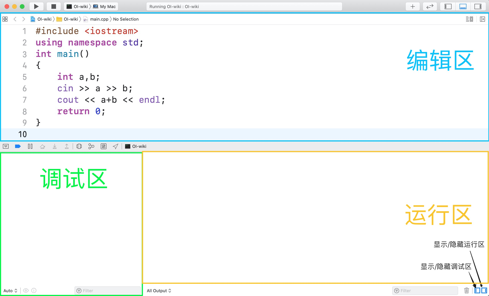

author: shenyouran, Xeonacid, StudyingFather, CoelacanthusHex

## 简介

Xcode 是一个运行在 macOS 上的集成开发工具（IDE），由 Apple Inc. 开发。

## 安装

### 方法一

打开苹果电脑自带的 App Store（或者尝试 [快捷链接](https://apps.apple.com/cn/app/xcode/id497799835?mt=12)）下载 Xcode。点击获取，然后输入苹果账号密码开始下载安装。


### 方法二

访问 [苹果开发者下载页面](https://developer.apple.com/download/more/)，用苹果账号登录，然后找到 Xcode 最新的稳定版本安装包（即不含 Beta 的最新版本，此处为 11.6）：


点击弹出框内蓝色的文件名即可下载。得到压缩包之后，用系统自带的工具进行解压，然后得到文件 Xcode.app。把这个文件移动到【应用程序】文件夹后即可使用。

## 基础配置

首次打开 Xcode 时，可能会遇到下列弹出窗口：


这个窗口是 Xcode 元件的安装引导。点击 `Install` 并输入当前用户密码即可。

安装完毕后，界面左侧显示：


点击 `Create a new Xcode project`（创建一个新的 Xcode 项目），然后选择上方 `macOS` 中的 `Command Line Tool`（命令行工具），并点击右下角的 `Next`。


接下来，我们可以给项目命名，但最重要的是选择项目的语言。我们可以根据自己的需求，在最下方 `Language` 处选择 C 或者 C++：


项目的目录可以根据需要选择。创建完毕后，Xcode 会自动打开这个项目，并自动创建一个 `main` 文件（C 语言的后缀为 `.c`，C++ 语言的后缀为 `.cpp`）。

点击这个文件，就可以打开编辑区域：


编写代码后，可以按⌘B 编译（Build），⌘R 运行（Run）。运行后拖动，得到三个部分：



一般来说我们只使用【编辑区】和【运行区】。若程序有输入，那么在【运行区】中进行输入之后，就可以得到输出。界面呈现效果：


仿照这种方式，我们就可以运行任何的单个 C/C++ 程序。

## 万能头文件的使用

在编写代码过程中，我们可能会使用到很多头文件。常用的解决方法是使用万能头文件。

我们在源代码第一行引入万能头文件，然而编译过程中却提示：`'bits/stdc++.h' file not found`。即该头文件未找到。


这是因为在 macOS 上默认使用 [libc++](https://libcxx.llvm.org/) 作为 C++ 标准库实现，而万能头 `bits/stdc++.h` 是 [GNU libstdc++](https://gcc.gnu.org/onlinedocs/libstdc++/) 所独有的。

不过，我们可以手动编写一个万能头文件来使用。

### 步骤 1

打开终端（Terminal.app），前往 Xcode 存储头文件的文件夹，即：

```bash
cd /Applications/Xcode.app/Contents/Developer/Toolchains/XcodeDefault.xctoolchain/usr/include/c++/v1
```

如果 Xcode 版本大于等于 12.5，那么

```bash
cd /Applications/Xcode.app/Contents/Developer/Platforms/MacOSX.platform/Developer/SDKs/MacOSX.sdk/usr/include/c++/v1/
```

### 步骤 2

创建 `bits` 文件夹并进入：

```bash
mkdir bits
cd bits
```

用 vim 创建 stdc++.h 文件：

```bash
vim stdc++.h
```

界面如下：


接着，我们需要通过 vim 编辑文件。敲击 i（insert）键盘即可进入插入/编辑模式（下方出现 `-- INSERT --`）：


将下面这段代码块复制并粘贴到终端中：

??? note "万能头文件代码块"
    ```cpp
    // C++ includes used for precompiling -*- C++ -*-
    
    // Copyright (C) 2003-2020 Free Software Foundation, Inc.
    //
    // This file is part of the GNU ISO C++ Library.  This library is free
    // software; you can redistribute it and/or modify it under the
    // terms of the GNU General Public License as published by the
    // Free Software Foundation; either version 3, or (at your option)
    // any later version.
    
    // This library is distributed in the hope that it will be useful,
    // but WITHOUT ANY WARRANTY; without even the implied warranty of
    // MERCHANTABILITY or FITNESS FOR A PARTICULAR PURPOSE.  See the
    // GNU General Public License for more details.
    
    // Under Section 7 of GPL version 3, you are granted additional
    // permissions described in the GCC Runtime Library Exception, version
    // 3.1, as published by the Free Software Foundation.
    
    // You should have received a copy of the GNU General Public License and
    // a copy of the GCC Runtime Library Exception along with this program;
    // see the files COPYING3 and COPYING.RUNTIME respectively.  If not, see
    // <http://www.gnu.org/licenses/>.
    
    /** @file stdc++.h
     *  This is an implementation file for a precompiled header.
     */
    
    // 17.4.1.2 Headers
    
    // C
    #ifndef _GLIBCXX_NO_ASSERT
    #include <cassert>
    #endif
    #include <cctype>
    #include <cerrno>
    #include <cfloat>
    #include <ciso646>
    #include <climits>
    #include <clocale>
    #include <cmath>
    #include <csetjmp>
    #include <csignal>
    #include <cstdarg>
    #include <cstddef>
    #include <cstdio>
    #include <cstdlib>
    #include <cstring>
    #include <ctime>
    #include <cwchar>
    #include <cwctype>
    
    #if __cplusplus >= 201103L
    #include <ccomplex>
    #include <cfenv>
    #include <cinttypes>
    #include <cstdbool>
    #include <cstdint>
    #include <ctgmath>
    /* https://stackoverflow.com/a/25892335/15125422 */
    #if defined(__GLIBCXX__) || defined(__GLIBCPP__)
    #include <cstdalign>
    #include <cuchar>
    #endif
    #endif
    
    // C++
    #include <algorithm>
    #include <bitset>
    #include <complex>
    #include <deque>
    #include <exception>
    #include <fstream>
    #include <functional>
    #include <iomanip>
    #include <ios>
    #include <iosfwd>
    #include <iostream>
    #include <istream>
    #include <iterator>
    #include <limits>
    #include <list>
    #include <locale>
    #include <map>
    #include <memory>
    #include <new>
    #include <numeric>
    #include <ostream>
    #include <queue>
    #include <set>
    #include <sstream>
    #include <stack>
    #include <stdexcept>
    #include <streambuf>
    #include <string>
    #include <typeinfo>
    #include <utility>
    #include <valarray>
    #include <vector>
    
    #if __cplusplus >= 201103L
    #include <array>
    #include <atomic>
    #include <chrono>
    #include <codecvt>
    #include <condition_variable>
    #include <forward_list>
    #include <future>
    #include <initializer_list>
    #include <mutex>
    #include <random>
    #include <ratio>
    #include <regex>
    #include <scoped_allocator>
    #include <system_error>
    #include <thread>
    #include <tuple>
    #include <type_traits>
    #include <typeindex>
    #include <unordered_map>
    #include <unordered_set>
    #endif
    
    #if __cplusplus >= 201402L
    #include <shared_mutex>
    #endif
    
    #if __cplusplus >= 201703L
    #include <any>
    #include <charconv>
    // #include <execution>
    #include <filesystem>
    #include <memory_resource>
    #include <optional>
    #include <string_view>
    #include <variant>
    #endif
    
    #if __cplusplus > 201703L
    #include <bit>
    #include <compare>
    #include <concepts>
    #include <numbers>
    #include <ranges>
    #include <span>
    #include <stop_token>
    // #include <syncstream>
    #include <version>
    #endif
    ```

该文件来源于 [10.2.0 版本的 libstdc++](https://github.com/gcc-mirror/gcc/blob/ee5c3db6c5b2c3332912fb4c9cfa2864569ebd9a/libstdc++-v3/include/precompiled/stdc++.h) 并经少许修改以兼容 libc++。

按键盘左上角的<kbd>Esc</kbd>退出编辑模式，然后直接输入 `:wq` 并换行即可保存文件。

### 步骤 3

关闭终端，回到 Xcode。重新按下 ⌘B/⌘R 进行编译，发现编译成功：


## 优缺点

优点：由苹果开发，适合 Mac 用户，界面齐全、美观。

缺点：Xcode 主要用来苹果程序的开发，对于竞赛来说功能冗余，安装包大小较大，而且仅能在 Mac 端上使用。
