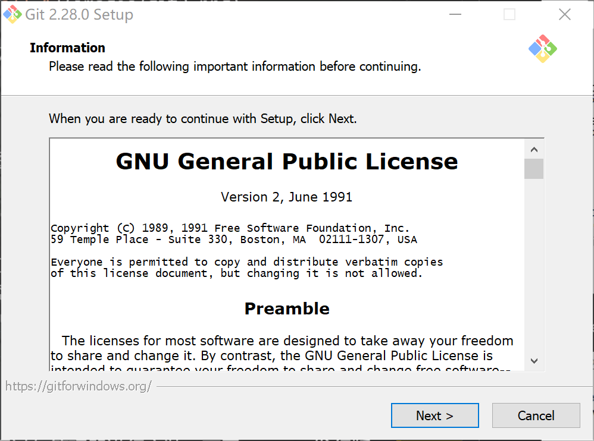
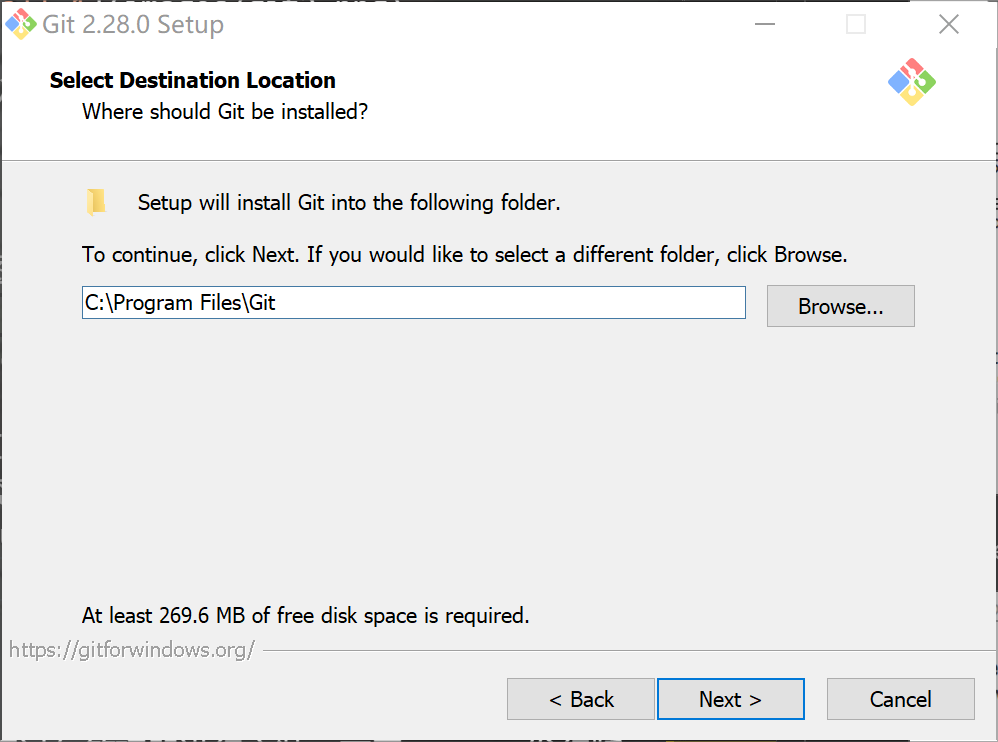
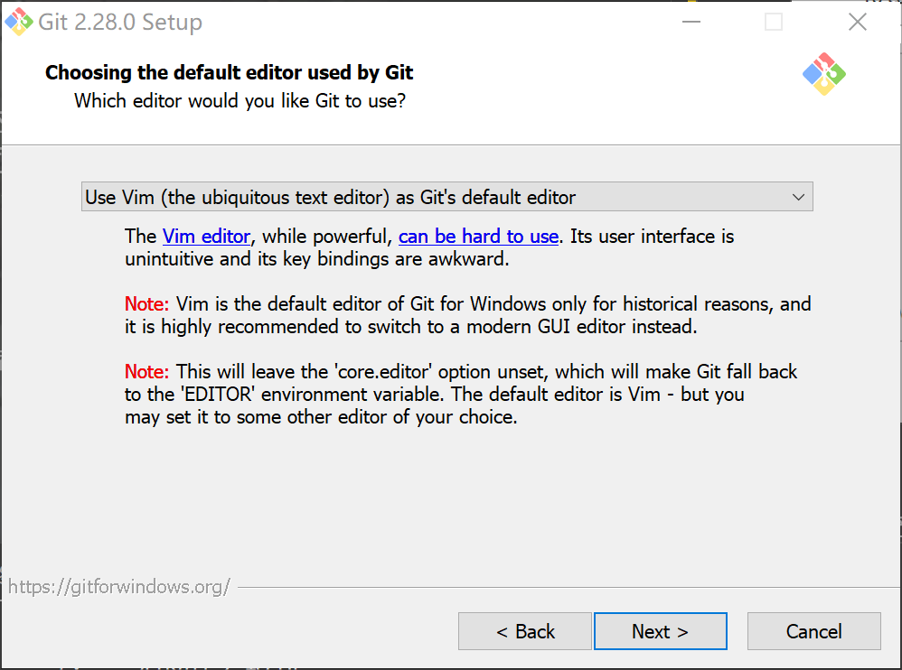
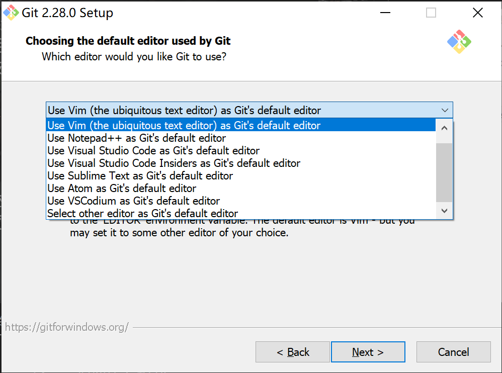

???+note
    本页面将着重介绍 Git 这一版本控制系统，与 GitHub 相关的内容，请参考 [GitHub 帮助](https://docs.github.com/cn) 和 [如何参与 - OI Wiki](../intro/htc.md)。

Git 是目前使用最广泛的版本控制系统之一。**OI Wiki** 也使用了 Git 作为版本控制系统。

## 安装

### Windows

???+warning
    本节以 Git for Windows 2.28.0（2020-07-27 更新）为例。安装页面的选项可能会随着时间而变动。

Windows 系统可以在 [Git 官网](https://git-scm.com/downloads) 获取到 Git for Windows（下文简称 Git）的安装包。

下载完成后，运行 Git 的安装程序。弹出的页面如下图所示。



点击 `Next >`，选择安装路径。



点击 `Next >`，选择安装可选项。


默认的选项如上图所示，均不建议取消勾选。其他未勾选的选项可以依照需求勾选。

??? note "各选项功能详解"
    默认勾选的选项：
    
    -   `Windows Explorer integration`：资源管理器集成（右键菜单）。
        - `Git Bash Here`：在当前目录运行 Git 命令行。
        - `Git GUI Here`：在当前目录运行 Git 图形化页面。
    - `Git LFS`：安装 Git Large File Support（大文件支持）。[^note1]
    - `Associate .git* configuration files with the default text editor`：将所有 `.git` 配置文件与默认文本编辑器关联，并用其打开。默认文本编辑器会在后面配置。
    - `Associate .sh files to be run with Bash`：将所有扩展名为 `.sh` 的文件与 Git Bash 关联，并用其执行。
    
    * * *
    
    默认不勾选的选项：
    
    -   `Additional icons`
        - `On the Desktop`：让 Git 在桌面创建快捷方式。
    - `Use a TrueType font in all console windows`：让 Git 在所有命令行（包括 cmd 命令行窗口）中都使用 TrueType 字体。
    - `Check daily for Git for Windows updates`：让 Git 每天检查更新。

点击 `Next >`，选择存放 Git 快捷方式的开始菜单文件夹。若勾选 `Don't create a Start Menu folder`，则 Git 不会在开始菜单创建快捷方式。


点击 `Next >`，选择默认的编辑器。



在下拉菜单栏中，Git 提供了 nano、[Vim](editor/vim.md)、[Notepad++](editor/npp.md)、[Visual Studio Code](editor/vscode.md)、Visual Studio Code Insiders（VS Code 预览版）、Sublime Text、[Atom](editor/atom.md) 和 VSCodium 作为默认编辑器的预设方案。如果系统已经安装了上述的一种或多种编辑器，可以直接选择其中一种并进入下一步。另外，还可通过 `Select other editor as Git's default editor` 项手动指定默认编辑器。



除了 Vim 外，如果选择了尚未安装的编辑器，安装程序会阻止使用者进入下一步。[^note2]用户可以通过给出的官网链接跳转到下载页面，完成编辑器的安装后继续安装 Git。


选好默认编辑器后，点击 `Next >` 进入下一步。

接下来的每一步都直接点击 `Next >`。当 `Next >` 变为 `Install` 时，按下 `Install` 进行安装。

最后，该页面出现，Git 安装完成。此时可以取消勾选 `View Release Notes`，然后按下 `Next >` 直接退出；也可以直接按下 `Next >` 查看版本更新信息；亦可以勾选 `Launch Git Bash` 运行 Git 命令行。


### Linux

Linux 系统可以通过包管理器进行安装。不同 Linux 发行版的安装方式可能不同，[Git 官网](https://git-scm.com/download/linux) 给出了不同系统下的安装方式。

### macOS

macOS 系统只需在终端执行 `brew install git` 命令即可安装。（需安装 [Homebrew](https://brew.sh/)）

## 配置

Git 根据配置文件的应用范围，将配置文件分为不同的等级，其中较常用的有两个级别[^note3]：

1. 适用于当前用户的全局配置文件，该用户操作本系统上的所有仓库时都会查询该配置文件。
2. 适用于当前仓库的配置文件。

当多个配置文件对同一个选项作出设置的时候，局部设置会自动覆盖全局设置。因此如果需要在某个仓库应用特定的设置的话，只需更改该仓库下的特定设置即可，不会对全局设置造成影响。

修改配置文件需要用到 `git config` 命令。

### 设置用户信息

安装 Git 后，第一件事情就是设置你的用户名和邮箱。这些信息在每次提交时都会用到。

```bash
$ git config --global user.name "OI Wiki"
$ git config --global user.email oi-wiki@example.com
```

???+note
    这里给出的用户名和邮箱仅供演示。您在根据本页面的内容配置时，请记得将这里的用户名和邮箱改成自己的信息。

这里的 `--global` 表示修改的是全局配置，即该设置对当前用户下的所有仓库均有效。如果不添加 `--global` 选项，则会默认修改当前仓库下的配置文件。

如果想要修改某个仓库的特定设置，只需在该仓库下执行不带 `--global` 的命令即可。

### 配置编辑器

```bash
$ git config --global core.editor emacs
```

执行如上命令可以将编辑器更改为 [Emacs](./editor/emacs.md)。

在 Windows 下，Git 的默认编辑器可以在安装 Git 时选择（见前文）。之后若要修改，在 Git Bash 里输入如上命令，将编辑器名换成编辑器的绝对路径，运行命令即可。

### 显示配置

可以通过 `git config -l` 列出当前已经设置的所有配置参数。使用 `git config --global -l` 可以列出所有全局配置。

## 仓库操作基础

### 新建 Git 仓库

新建一个 Git 仓库非常简单，只需在想要建立仓库的文件夹输入如下命令：

```bash
$ git init
```

Git 将在当前文件夹新建一个 `.git` 文件夹，一个仓库就这样建好了。

如果想把一个仓库克隆到自己的电脑上（比如将 **OI Wiki** 的代码拷贝到本地上进行编辑），采用 `git clone` 命令即可。

```bash
$ git clone https://github.com/OI-wiki/OI-wiki
```

???+note "远程仓库的链接"
    这里给出的仓库链接是 HTTP(S) 链接，也即我们采用了 HTTP(S) 方式连接到远程仓库。
    
    事实上，连接到远程仓库的方式还有多种。其中使用 ssh 连接到远程仓库的方法更为方便和安全，在「远程仓库的管理」部分我们会简单介绍使用 ssh 连接到远程仓库的方法。

这样，被克隆的仓库的内容就会被储存到当前文件夹下一个与仓库同名的新文件夹。在本例中，当前文件夹下会出现一个名为 `OI-wiki` 的新文件夹。

### 跟踪文件

在对仓库的文件做出了一些更改后，这些更改需要被纳入到版本管理当中去。

使用 `git status` 命令可以查看当前仓库文件的状态。

举个例子，在一个空仓库中新增了一个 `README.md` 文件后，执行 `git status` 命令的效果如下：

```bash
$ git status
On branch master

No commits yet

Untracked files:
  (use "git add <file>..." to include in what will be committed)

        README.md

nothing added to commit but untracked files present (use "git add" to track)
```

这里的 Untracked files 指的是 Git 之前没有纳入版本跟踪的文件。如果文件没有纳入版本跟踪，对该文件的更改不会被 Git 记录。

执行 `git add <文件>` 命令可以将指定的文件纳入到版本跟踪中。

```bash
$ git add README.md # 将这个文件纳入到版本跟踪中
$ git status
On branch master

No commits yet

Changes to be committed:
  (use "git rm --cached <file>..." to unstage)

        new file:   README.md
```

这时 `README.md` 已经纳入了版本跟踪，放入了暂存区。接下来只需执行 `git commit` 命令就可以提交这次更改了。

但在进行这一工作之前，让我们先对 `README.md` 做点小更改。

```bash
$ vim README.md # 随便更改点东西
$ git status
On branch master

No commits yet

Changes to be committed:
  (use "git rm --cached <file>..." to unstage)

        new file:   README.md

Changes not staged for commit:
  (use "git add <file>..." to update what will be committed)
  (use "git restore -- <file>..." to discard changes in working directory)

        modified:   README.md
```

你会发现 `README.md` 同时处于暂存区和非暂存区。实际上，是否处于暂存区是对于更改而言的，而不是对于文件而言的，所以对 `README.md` 的前一次更改已被纳入暂存区，而后一次更改还没有。如果这时候执行 `git commit` 命令，只有处于暂存区的更改会被提交，而非暂存区的更改，则不会被提交。

Git 给了一条提示，执行 `git add README.md` 就可以将非暂存区的更改放入暂存区了。

???+note "一次性将所有更改放入暂存区"
    `git add` 命令会将对指定的文件的更改放入暂存区中。
    
    在多数情况下，用户更期望一次性将所有更改都放入暂存区中，这时候可以应用 `git add -A` 命令。该命令会将所有更改（包括未被纳入版本跟踪的文件，不包括被忽略的文件）放入暂存区。
    
    如果只需更新已被纳入版本跟踪的文件，而不将未纳入版本跟踪的文件加入暂存区，可以使用 `git add -u`。

???+note "忽略文件"
    有些时候我们并不希望将一些文件（如可执行文件等）纳入到版本跟踪中。这时候可以在仓库根目录下创建 `.gitignore` 文件，在该文件里写下想要忽略的文件。Git 将不会将这些文件纳入到版本跟踪中。
    
    例如，`*.exe` 将自动忽略仓库里的所有扩展名为 `.exe` 的文件。

现在将非暂存区的文件加入暂存区，将所有更改一并提交（commit）。

```bash
$ git add README.md
$ git commit # 接下来会弹出编辑器页面，你需要写下 commit 信息
[master (root-commit) f992763] initial commit
 1 file changed, 2 insertions(+)
 create mode 100644 README.md
```

现在重点观察一下这一次 commit 的信息。

`master` 表示当前位于 `master` 分支（关于分支的问题，下文将会详细介绍），`b13c84e` 表示本次提交的 SHA-1 校验和的前几位，后面则是本次提交的信息。

需要特别关注的是这里的 SHA-1 校验码，每个校验码都与某个时刻仓库的一个快照相对应。利用这一特性我们可以访问历史某个时刻的仓库快照，并在该快照上进行更改。

接下来两行则详细说明了本次更新涉及的文件更改。

另外，commit 过程中可以利用几个参数来简化提交过程：

- `-a`：在提交前将所有已跟踪的文件的更改放入暂存区。需要注意的是未被跟踪的文件（新创建的文件）不会被自动加入暂存区，需要用 `git add` 命令手动添加。
- `-m`：该参数后跟提交信息，表示以该提交信息提交本次更改。例如 `git commit -m "fix: typo"` 会创建一条标题为 `fix: typo` 的 commit。

### 查看提交记录

使用 `git log` 命令可以查看仓库的提交历史记录。

可以看到，提交历史里记录了每次提交时的 SHA-1 校验和，提交的作者，提交时间和 commit 信息。

```bash
$ git log
commit ae9dd3768a405b348bc6170c7acb8b6cb5fe333e (HEAD -> master)
Author: OI Wiki <oi-wiki@example.com>
Date:   Sun Sep 13 00:30:18 2020 +0800

    feat: update README.md

commit f99276362a3c260d439364c505a7a06859f34bf9
Author: OI Wiki <oi-wiki@example.com>
Date:   Sun Sep 13 00:06:07 2020 +0800

    initial commit
```

## 分支管理

为什么版本管理中需要分支管理呢？答案主要有两点：

1. 直接更改主分支不仅会使历史记录混乱，也可能会造成一些危险的后果。
2. 通过分支，我们可以专注于当前的工作。如果我们需要完成两个不同的工作，只需开两个分支即可，两个分支间的工作互不干扰。

在 Git 中，简单来说，分支就是指向某个快照的指针。每次提交时，Git 都会为这次提交创建一个快照，并将当前分支的指针移动到该快照。

另外还有一个 HEAD 指针，它指向当前所在的分支。

切换分支的过程，简单来说就是将 HEAD 指针，从指向当前所在的分支，改为指向另外一个分支。在这一过程中，Git 会自动完成文件的更新，使得切换分支后仓库的状态与目标分支指向的快照一致。

### 分支的创建

利用 `git branch` 命令可以创建分支，`git switch` 命令可以切换分支，`git switch -c` 命令可以创建分支并切换到这个新分支。

```bash
$ git switch -c dev # 创建一个叫做 dev 的新分支并切换当前分支到 dev
Switched to branch 'dev'
$ git branch # 查看分支列表
  master
* dev
```

`dev` 前面的星号代表该仓库的当前分支为 `dev`，接下来对这个仓库的更改都将记录在这个分支上。

试着创建一个新文件 `aplusb.cpp`。

```bash
$ vim aplusb.cpp
$ git add aplusb.cpp
$ git commit -m "feat: add A+B Problem code"
[dev 5da093b] feat: add A+B Problem code
 1 file changed, 7 insertions(+)
 create mode 100644 aplusb.cpp
```

现在切换回 `master` 分支，这时候文件夹中没有了 `aplusb.cpp`，一切都回到了刚刚创建 `dev` 分支时的状态。这时候可以在 `master` 分支上继续完成其他的工作。

```bash
$ git switch master
Switched to branch 'master'
$ vim README.md # 对 README 做些小改动
$ git commit -a -m "feat: update README.md"
[master 5ca15f0] feat: update README.md
 1 file changed, 1 insertion(+), 1 deletion(-)
```

下面用一张图来解释刚才的操作过程。


`master` 分支被标红，表明在这几次操作后，它是当前分支（即 HEAD 指向的位置）。

- 最开始时 `master` 指向 `ae9dd37` 这一快照。
- 接下来在 `master` 所在的位置创建了一个新的 dev 分支，该分支一开始和 master 指向相同位置。
- 在 `dev` 分支上作了一些更改（创建了 `aplusb.cpp`），进行了一次提交，本次提交后，`dev` 分支指向 `5da093b` 这一快照。
- 切换回 `master` 分支后，因为 `master` 分支还指向 `ae9dd37`，还没有创建 `aplusb.cpp`，因此仓库中没有这一文件。
- 接下来在 `master` 分支上进行更改（更新了 `README.md`），进行了一次提交，`master` 分支指向了 `5ca15f0` 这一快照。

### 分支的合并

当一个分支上的工作已经完成，就可以将这些工作合并到另外一个分支上去。

还是接着上面这个例子，`dev` 分支的工作已经完成，通过 `git merge` 命令可以将该分支合并到当前分支（`master`）上：

```bash
$ git merge dev
Merge made by the 'recursive' strategy.
 aplusb.cpp | 7 +++++++
 1 file changed, 7 insertions(+)
 create mode 100644 aplusb.cpp
```


这次合并具体是怎么执行的呢？

在合并之前，`master` 指向 `5ca15f0`，而 `dev` 指向 `5da093b`，这两个状态并不在一条链上。

Git 会找到这两个状态的最近公共祖先（在上图中是 `ae9dd37`），并对这三个快照进行一次合并。三个快照合并的结果作为一个新的快照，并将当前分支指向这一快照。

合并过程本身也是一次提交，不过与常规提交不同的是，合并提交有不止一个前驱提交，它是多个提交状态合并后的结果。

在合并完成后，`dev` 分支就完成了它的使命，这时候可以利用下面的命令删除 `dev` 分支：

```bash
$ git branch -d dev # 对于未合并的分支，可以使用 -D 参数强制删除
```

不过合并过程并非总是这么顺利，在某些情况下，合并过程可能会出现冲突，这个问题接下来会讲到。

### 解决合并冲突

如果在两个分支中，对同一个文件的同一部分进行了不同的更改，Git 就无法自动合并这两个分支，也就是发生了合并冲突。

接着上面的例子，假如你在合并后的 `master` 分支的基础上，新开了一个 `readme-refactor` 分支，准备重写一份自述文件。但因为一些疏忽，你同时更改了 `readme-refactor` 和 `master` 分支的自述文件。

刚开始自述文件是这样的：

```markdown
# This is a test repo.

This repo includes some c++ codes.
```

在 `readme-refactor` 分支下的自述文件是这样的：

```markdown
# Code Library

This repo includes some c++ codes.
```

在 `master` 分支下的自述文件是这样的：

```markdown
# This is a code library.

This repo includes some c++ codes.
```

这时候运行 `git merge readme-refactor` 命令，Git 提示出现了合并冲突。

执行一下 `git status` 命令，可以查看是哪些文件引发了冲突。

```bash
$ git status
On branch master
You have unmerged paths.
  (fix conflicts and run "git commit")

Unmerged paths:
  (use "git add <file>..." to mark resolution)

    both modified:      README.md

no changes added to commit (use "git add" and/or "git commit -a")
```

如何解决冲突？对于每个发生了合并冲突的文件，Git 都会在这些文件中加入标准的冲突解决标记。比如这个例子中的 `README.md` 文件，打开后它长这个样子：

```markdown
<<<<<< HEAD
# This is a code library.
======
# Code Library
>>>>>> readme-refactor

This repo includes some c++ codes.
```

`======` 作为分界线将两个分支的内容隔开，`<<<<<< HEAD` 标记和 `======` 之间的部分是 HEAD 指针（`master` 分支）的内容，而 `======` 和 `>>>>>> readme-refactor` 标记之间的部分是 `readme-refactor` 分支的内容。

通过编辑文本来处理冲突，删除这些冲突标记，保存文件，将这些文件纳入暂存区后提交，就可以解决合并冲突了。

```bash
$ git add README.md # 将发生冲突的文件纳入暂存区
$ git commit
[master fe92c6b] Merge branch readme-refactor into master
```

### 其他合并方式

默认情况下，Git 采用 Merge（合并）的方式合并两个分支。使用该方法将分支 B 并入分支 A 时，会将 B 分支的所有 commit 并入 A 分支的提交历史中。

除此以外，Git 还提供了两种合并分支的方式：Squash（压缩）和 Rebase（变基）。

#### Squash（压缩）

使用 Squash 方式将分支 B 并入分支 A 时，在 B 分支上的所有更改会被合并为一次 commit 提交到 A 分支。

在 `git merge` 中加入 `--squash` 参数即可使用 Squash 方式进行分支合并。

```bash
git merge <branch> --squash
```

需要注意的是，在执行上述命令后，Git 只会将 B 分支的所有更改存入 A 分支的缓冲区内，接下来还需要执行一次 `git commit` 命令完成合并工作。

使用 Squash 方式合并可以简化 commit 记录，但是会丢失具体到每一次 commit 的信息（每次 commit 的提交者，每次 commit 的更改等等），只留下合并为一个整体的信息（每次 commit 的提交者会以 "Co-authored-by" 的形式在提交信息中列出）。但如果是在 GitHub 上进行 Squash and Merge，原有的信息都可以在 Pull Request 中查看。

#### Rebase（变基）

使用 Rebase 方式将分支 B 并入分支 A 时，在 B 分支上的每一次 commit 都会单独添加到 A 分支，而不再像 Merge 方式那样创建一个合并 commit 来合并两个分支的内容[^note4]。

首先，切换到 B 分支，接下来将 B 分支变基到 A 分支：

```bash
git checkout B
git rebase A
```

现在切回到 A 分支，再执行一次 `git merge` 命令，即可完成将 B 分支的内容合并到 A 分支的工作。

```bash
git checkout A
git merge B
```

使用 Rebase 完成合并可以让提交历史线性化，在适当的场景下正确地使用 Rebase 可以达到比 Merge 更好的效果。但是这样做会改变提交历史，在进行 Rebase 时和 Rebase 后再进行相关合并操作时都会增加出现冲突的可能，如果操作不当可能反而会使提交历史变得杂乱。因此，如果对 Rebase 操作没有充分的了解，不建议使用。

## 管理远程仓库

在本地完成更改后，你可能会需要将这些更改推送到 GitHub 等 Git 仓库托管平台上。托管在这些平台上的仓库就归属于远程仓库的范畴——你可以从这些仓库中获取信息，也可以将你作出的更改推送到远程仓库上。与其他人的协作往往离不开远程仓库，因此学会管理远程仓库很有必要。

### 远程仓库的查看

使用 `git remote` 命令可以查看当前仓库的远程仓库列表。

如果当前仓库是克隆来的，那么应该会有一个叫做 origin 的远程仓库，它的链接就是克隆时用的链接。

```bash
$ git remote
origin
```

如果要查看某个远程仓库的详细信息的话，可以这样操作：

```bash
$ git remote show origin
* remote origin
  Fetch URL: git@github.com:OI-wiki/OI-wiki.git
  Push  URL: git@github.com:OI-wiki/OI-wiki.git
  HEAD branch: master
  Remote branches:
    git             tracked
    master          tracked
  ...
 
```

### 远程仓库的配置

执行 `git remote add <name> <url>` 命令可以添加一个名字为 `name`，链接为 `url` 的远程仓库。

执行 `git remote rename <oldname> <newname>` 可以将名字为 `oldname` 的远程仓库改名为 `newname`。

执行 `git remote rm <name>` 可以删除名字为 `name` 的远程仓库。

执行 `git remote get-url <name>` 可以查看名字为 `name` 的远程仓库的链接。

执行 `git remote set-url <name> <newurl>` 可以将名字为 `name` 的远程仓库的链接更改为 `newurl`。

### 从远程仓库获取更改

在远程仓库中，其他人可能会推送一些更改，执行 `git fetch` 命令可以将这些更改获取到本地。

```bash
$ git fetch <remote-name> # 获取 <remote-name> 的更改
```

需要注意的是，`git fetch` 命令只会获取远程仓库的更改，而不会将这些更改合并到本地仓库中。如果需要将这些更改进行合并，可以使用 `git pull` 命令。在默认情况下，`git pull` 相当于 `git fetch` 后 `git merge FETCH_HEAD`。

```bash
$ git pull <remote-name> <branch> # 获取 <remote-name> 的更改，然后将这些更改合并到 HEAD
```

### 将更改推送到远程仓库

当你完成了一些更改之后，使用 `git push` 命令可以将这些更改推送到远程仓库。

```bash
$ git push <remote> <from>:<to> # 将本地 <from> 分支的更改推送至 <remote> 的 <to> 分支
```

根据远程仓库的要求，可能会要求你输入远程仓库账户的用户名和密码。

需要注意的是，你的更改能成功推送，需要满足两个条件：你拥有向这个仓库（分支）的写入权限，且你的这个分支比远程仓库的相应分支新（可以理解为没有人在你进行更改的这段时间进行了推送）。当远程分支有当前分支没有的新更改时，可以执行 `git pull` 命令完成合并再提交。

如果你需要强制将本地分支的更改推送到远程仓库的话，可以加入 `-f` 参数。此时 **远程仓库的提交历史会被本地的提交历史覆盖**，因此该命令应谨慎使用。更好的选择是使用 `--force-with-lease` 参数，该参数仅在远程仓库没有更新时才会进行覆盖。需要注意的是，此处“更新”是相对于上一次 fetch 而言的，如果使用了 VS Code 提供的 Auto Fetch 功能，可能会没有注意到更新而使 `--force-with-lease` 和 `-f` 一样危险。

### 追踪远程分支

通过将一个本地分支设定为追踪远程分支，可以方便地查看本地分支与远程分支的差别，并能简化与远程分支交互时的操作。

在开始追踪前，你需要先执行 `git fetch <remote-name>` 将远程仓库的信息抓取到本地。

接下来执行 `git switch <remote-branch>`，会在本地自动创建名字为 `<remote-branch>` 的新分支，并设定该分支自动追踪相应的远程分支。

???+note
    需要注意，只有当本地不存在该分支，且恰好只有一个远程分支的名字与该分支匹配时，Git 才会自动创建该分支且设定其追踪相应的远程分支。

这时候执行 `git status` 命令，会提示当前分支与远程分支之间的差别。

因为设定了本地分支追踪的远程分支，向远程分支推送的命令也被简化了。只需要执行 `git push` 命令，在本地分支上作出的更改就能被推送至其追踪的远程分支。

对于本地已有的分支，设定其对应的远程追踪分支也很容易。只需在当前分支下执行 `git branch -u <remote-name>/<remote-branch>`，就可以设定当前的本地分支追踪 `<remote-name>/<remote-branch>` 这一远程分支。

### 使用 ssh 连接

与 HTTP(S) 相比，使用 ssh 连接到远程仓库更为方便安全。

在使用 ssh 连接到远程仓库之前，需要先在本地添加 ssh 密钥。接下来需要将本地添加的 ssh 密钥的 **公钥** 上传到远程仓库账户。

考虑到本文主要是给 **OI Wiki** 的贡献者提供一个使用 Git 的教程，这里直接给出 [GitHub Docs 提供的教程](https://docs.github.com/cn/github/authenticating-to-github/connecting-to-github-with-ssh)，供各位读者参考。

完成以上步骤后，你就可以通过 ssh 连接到远程仓库了。下面就是一条通过 ssh 连接 clone **OI Wiki** 仓库的命令：

```bash
$ git clone git@github.com:OI-wiki/OI-wiki.git
```

将更改推送至远程仓库的过程与使用 HTTP(S) 连接类似。但使用 ssh 连接可以免去验证远程仓库帐号密码的过程。

## 外部链接

- [Git Reference](https://git-scm.com/docs)
- [Pro Git Book](https://git-scm.com/book/zh/v2)
- [Learn Git Branching](https://learngitbranching.js.org/)

## 参考资料与注释

[^note1]: 在某些地方（比如 [LFS 官网](https://git-lfs.github.com/)）又被称作 Git Large File Storage（大文件存储）。它在将项目托管到平台上时，用文本指针代替音频、视频、图像、数据集等大文件的原始文件，从而加快传输速度。对移动应用程序开发人员、游戏工程师以及任何需要大文件构建软件的人，该功能都极为实用。若想进一步了解该功能，可以参考 [Atlassian 官方介绍 Git LFS 的译文](https://www.cnblogs.com/cangqinglang/p/13097777.html)。

[^note2]: 但是，Git for Windows 对 Vim 的描述是“虽然强大，但是可能会难以使用。用户界面反人类，键位映射卡手。Git 使用 Vim 作为默认编辑器只是出于历史原因，强烈推荐换用一个 UI 设计现代化的编辑器。”，并给“难以使用”加上了 [Stack Overflow 每年帮助一百万名开发者退出 Vim](https://stackoverflow.blog/2017/05/23/stack-overflow-helping-one-million-developers-exit-vim/) 的页面链接。

[^note3]: 事实上 Git 还有一个针对系统上每一个用户及系统上所有仓库的通用配置文件，该配置文件覆盖范围最广，等级在用户配置文件之上。因为该配置实践中较少使用，这里不再展开。

[^note4]: [Pro Git Book](https://git-scm.com/book/zh/v2/Git-%E5%88%86%E6%94%AF-%E5%8F%98%E5%9F%BA) 中提供了可视化的 Rebase 过程图，借助图片读者可以更好地理解 Rebase 的机制。
