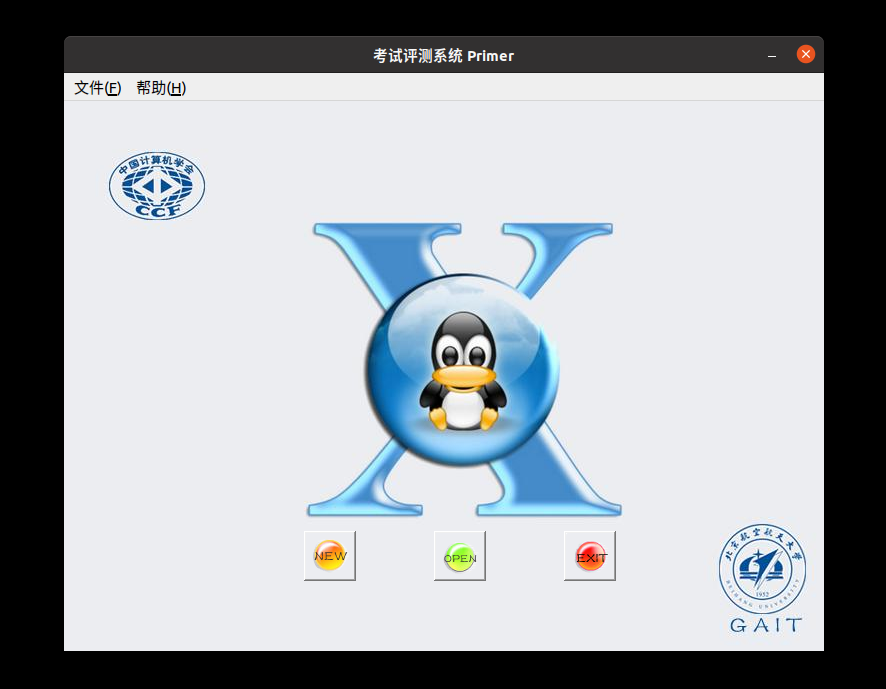
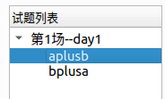
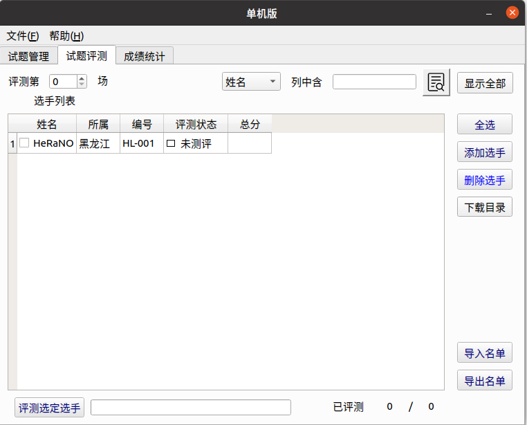

author: Ir1d, HeRaNO, NachtgeistW, i-Yirannn, bear-good, ranwen, CoelacanthusHex, billchenchina, Tiger3018, Xeonacid

## Arbiter

**Arbiter** 为北京航空航天大学为 NOI Linux 开发的评测工具，现已用于各大 NOI 系列程序设计竞赛的评测。据吕凯风在 2016 年冬令营上的讲稿《下一代测评系统》，Arbiter 是由北京航空航天大学的团队（GAIT）在尹宝林老师的带领下开发完成的。

在 NOI Linux 更新到 2.0 版本后，Arbiter 也用 Qt 5.12.8 重新编译，并发布为 Arbiter 2.0。因为之后的测评环境均使用 NOI Linux 2.0，因此以下介绍使用的 Arbiter 版本均为 NOI Linux 2.0 中自带的 Arbiter 2.0。

此测评软件仅能在 NOI Linux 下找到。二进制文件位置为 `/usr/local/arbiter/local/arbiter_local`。

### 使用方法

#### 配置程序

配置选手源程序文件夹和选手名单。选手文件夹如 NOIP 格式创建：

```text
players/
| -- day1
|    | -- <contestant_1's ID>
|    |     | -- <problem_1>
|    |     |   `-- <problem_1>.c/cpp/pas
|    |     | -- <problem_2>
|    |     |   `-- <problem_2>.c/cpp/pas
|    |     | ...
|    |     | -- <problem_x>
|    |        `-- <problem_x>.c/cpp/pas
|    | -- <contestant_2's ID>
|    |     | -- <problem_1>
|    |     ...
|    ...
| -- day2
|    | -- <contestant_1's ID>
|    |     | -- <problem_1>
|    |     |   `-- <problem_1>.c/cpp/pas
|    |     | -- <problem_2>
|    |     |   `-- <problem_2>.c/cpp/pas
|    |     | ...
|    |     | -- <problem_x>
|    |        `-- <problem_x>.c/cpp/pas
|    | -- <contestant_2's ID>
|    |     | -- <problem_1>
|    |     ...
|    ...
...
```

其中，`day<x>` 中的 `<x>` 是场次编号，`<contestant_x's ID>` 指的是选手编号，形如 `<省份>-<编号>`，例如 HL-001，JL-125 等等；`<problem_x>` 指的是题目名称。在自测时可以使用字母、短线（即 `-`）和数字的组合作为选手编号。

选手名单格式如下：

```text
<contestant_1's ID>,<contestant_1's name>
<contestant_2's ID>,<contestant_2's name>
...
```

其中，`<contestant_x's name>` 表示选手姓名。保存这个文件为纯文本文件或 csv 文件，可以使用 `UTF-8` 编码。

选手名单也可以在启动 Arbiter 后手动添加。

接下来配置测试数据。每组数据的命名格式如下：

```text
<problem_x><y>.in <problem_x><y>.ans
```

其中，`<y>` 是数据编号，编号从 1 开始。默认测试数据后缀名是 `.ans`，选手输出的后缀名是 `.out`，不能混淆。

不用将每题的测试数据放置在各题的文件夹里，只需要放在一起即可。

然后开始测评文件夹的配置。

左下角「显示应用程序」-「全部」-「Arbiter\_local」，启动 Arbiter。



点击 OPEN 可以打开已经建立的比赛，之后需选择对应比赛文件夹下的 `setup.cfg` 文件；点击 NEW 可以新建一个竞赛，并设置名称和比赛目录。注意，需要在用户 **主目录下** 新建一个文件夹，然后选择其为比赛目录，如果在桌面上建立比赛目录的话无法测评。出现这种问题很有可能是因为比赛文件夹路径中不能包含中文。


在左边试题概要里「右键」-「添加考试」，再在考试标签上「右键」-「添加试题」，新建出试题即可。

单击考试左边的向下箭头即可全部显示，单击试题标签对试题名称进行修改，改为题目的英文名称，同时修改题目时间与空间限制和比较方式。比较方式十分不推荐用「全文完全直接比较」，对于 Windows 下制作的数据十分不友好。可以根据题目自主选择比较器，但是需要注意必须选择一个比较器，否则测评结果将是 `No Score.`。



点击「文件」-「保存」。该操作不可省略，否则程序将不会生成题目配置文件。注意每一次对题目配置的修改都要保存。

此时，打开考试文件夹，会发现有如下内容。

```text
<name>/
| -- data
| -- evaldata
| -- filter
| -- final
| -- players
| -- result
| -- tmp
`-- day1.info
`-- player.info
`-- setup.cfg
`-- task1_1.info
`-- task1_2.info
`-- team.info
```

`filter` 文件夹放置了一些比较器；`result` 文件夹存放选手的测评结果；`tmp` 文件夹是测评时的缓存文件夹。其中 `day<x>.info` 为场次配置文件，`<x>` 为场次编号；`task<x>_<y>.info` 文件为题目配置文件，`<x>` 为场次编号，`<y>` 为题目序号。

把已经建好的选手程序文件夹放在 `players/` 目录下，注意最外层应按照考试日建立相应的 `day<x>` 文件夹。将所有测试数据（不放在文件夹里）放在 `evaldata` 中。

#### 正式测评

点开「试题评测」标签，会出现如下页面：


如果选手名单已经建立了，直接选择右边的「导入名单」进行导入。如果人数较少，可以选择右边的「添加选手」进行导入。

导入后的页面如图。



示例中的编号是 `HL-001`，程序会自动识别出「所属」一栏。如果不是 NOIP 规范的编号是识别不出来的。

把测评第 0 场变为测评第 1 场（或者其他场次）。然后选择右边的全选（或选择指定的选手），再选择下面的评测选定选手，选择要测评的题目（或全部试题），最后等待测评结束即可。

测试点详细信息需要在 `result` 文件夹下查看，文件夹下会有选手的结果文件夹，结果文件的后缀名为 `.result`，用纯文本方式查看即可。如果出现 `No score file.` 的错误，可以检查测评时是否生成了 `/tmp/_eval.score` 文件。

### 自定义校验器的编写

反编译其他校验器，可以知道运行自定义校验器的命令是 `<problem>_e <in> <out> <ans>`。后三个参数分别代表输入，选手输出和答案文件。最终的评分结果需写入 `/tmp/_eval.score` 文件中，第一行是测评信息，第二行是分数，10 分为满分。

编译后自定义校验器的名称必须为 `<problem>_e`，其中 `<problem>` 为题目名称。在配置题目时选择自定义校验器，然后选择需要的自定义校验器即可。

在试题管理中题目配置的地方将提交方式由源代码改为答案文件，然后选择自定义校验器，可以测试提交答案题。

### 注意事项

-   据说很容易死机，如大量测评时移动鼠标会导致死机。
-   据说不定时闪退，需要注意及时保存比赛。可能有些闪退原因是没有保存比赛。
-   据说配置时需要注意权限问题（但是笔者并未遇到）。
-   由于 Linux 运行时栈限制，如果要开无限栈，应在终端先输入 `ulimit -s unlimited` 后执行 `arbiter_local` 打开测评器，否则可能出现 `Exceeding memory limit` 的问题。
  - 对于正式测评，在题目准备时需要让所有题目空间限制一致。测评时将命令中的 `unlimited` 换为题目空间限制的千字节数（KiB），如：题目空间限制为 512 MiB，则命令为 `ulimit -s 524288`。
  - 导致这一问题的主要原因是直接启动 Arbiter，其父进程为 GNOME，子进程继承了父进程的栈空间限制。

### 漏洞

由于长期缺乏维护，系统存在一些漏洞，如可以使用 `#pragma G++ optimize("O2")` 和 `__attribute__((__optimize__("-O2")))` 等。可以使用 [gcc-plugins-for-oi](https://github.com/xdu-icpc/gcc-plugins-for-oi) 在编译期实现对这些命令的检测。

### 评价

Arbiter 1.0.2 在开发完成后就一直没有实质性更新，导致测评体验极差，UI 脱离现代审美。在 NOI Linux 1.4.1 中，它和 NOI Linux 自带的 GUIDE 一样沦为选手与教练疯狂吐槽的对象。在 NOI Linux 2.0 中，除了比较器移除了源代码和软件整体使用 Qt 5 重新编译外，并没有很大的变化，一些稳定性问题仍未得到解决。
