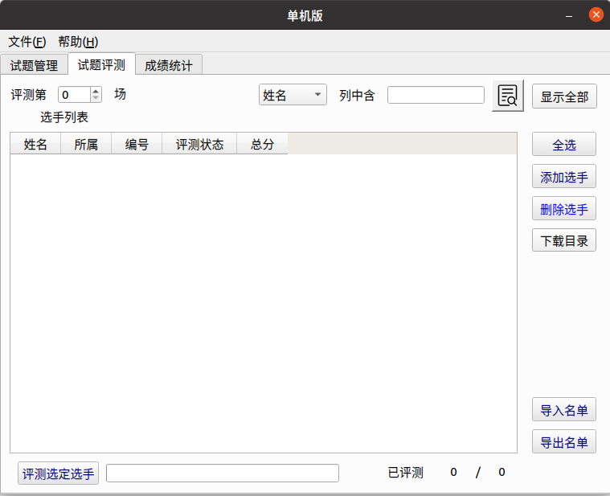

author: Ir1d, HeRaNO, NachtgeistW, i-Yirannn, bear-good, ranwen, CoelacanthusHex, billchenchina, Tiger3018, Xeonacid, Cryflmind

## Arbiter

**Arbiter** 为北京航空航天大学为 NOI Linux 开发的评测工具，现已用于各大 NOI 系列程序设计竞赛的评测。据吕凯风在 2016 年冬令营上的讲稿《下一代测评系统》，Arbiter 是由北京航空航天大学的团队（GAIT）在尹宝林老师的带领下开发完成的。

在 NOI Linux 更新到 2.0 版本后，Arbiter 也用 Qt 5.12.8 重新编译，并发布为 Arbiter 2.0。因为之后的测评环境均使用 NOI Linux 2.0，因此以下介绍使用的 Arbiter 版本均为 NOI Linux 2.0 中自带的 Arbiter 2.0。

此测评软件仅能在 NOI Linux 下找到。二进制文件位置为 `/usr/local/arbiter/local/arbiter_local`。

### 使用方法

#### 配置程序

配置选手源程序文件夹和选手名单。选手文件夹如 NOIP 格式创建：

```text
players/
| -- day1
|    | -- <contestant_1's ID>
|    |     | -- <problem_1>
|    |     |   `-- <problem_1>.c/cpp/pas
|    |     | -- <problem_2>
|    |     |   `-- <problem_2>.c/cpp/pas
|    |     | ...
|    |     | -- <problem_x>
|    |        `-- <problem_x>.c/cpp/pas
|    | -- <contestant_2's ID>
|    |     | -- <problem_1>
|    |     ...
|    ...
| -- day2
|    | -- <contestant_1's ID>
|    |     | -- <problem_1>
|    |     |   `-- <problem_1>.c/cpp/pas
|    |     | -- <problem_2>
|    |     |   `-- <problem_2>.c/cpp/pas
|    |     | ...
|    |     | -- <problem_x>
|    |        `-- <problem_x>.c/cpp/pas
|    | -- <contestant_2's ID>
|    |     | -- <problem_1>
|    |     ...
|    ...
...
```

其中，`day<x>` 中的 `<x>` 是场次编号，`<contestant_x's ID>` 指的是选手编号，形如 `<省份>-<编号>`，例如 HL-001，JL-125 等等；`<problem_x>` 指的是题目名称。在自测时可以使用字母、短线（即 `-`）和数字的组合作为选手编号。

选手名单格式如下：

```text
<contestant_1's ID>,<contestant_1's name>
<contestant_2's ID>,<contestant_2's name>
...
```

其中，`<contestant_x's name>` 表示选手姓名。保存这个文件为纯文本文件或 csv 文件，可以使用 `UTF-8` 编码。

选手名单也可以在启动 Arbiter 后手动添加。

接下来配置测试数据。每组数据的命名格式如下：

```text
<problem_x><y>.in <problem_x><y>.ans
```

其中，`<y>` 是数据编号，编号从 1 开始。默认测试数据后缀名是 `.ans`，选手输出的后缀名是 `.out`，不能混淆。

如果需要将之前生成的 out 格式修改为 ans 格式，在 NOI Linux 2.0 中可以使用 `rename` 命令批量修改，而在 Windows 中可以使用 `ren` 命令批量修改。我们将在后面介绍这些命令的用法。

不用将每题的测试数据放置在各题的文件夹里，只需要放在一起即可。

然后开始测评文件夹的配置。

左下角「显示应用程序」-「全部」-「Arbiter\_local」，启动 Arbiter。


点击 OPEN 可以打开已经建立的比赛，之后需选择对应比赛文件夹下的 `setup.cfg` 文件；点击 NEW 可以新建一个竞赛，并设置名称和比赛目录。注意，需要在用户 **主目录下** 新建一个文件夹，然后选择其为比赛目录，如果在桌面上建立比赛目录的话无法测评。出现这种问题很有可能是因为比赛文件夹路径中不能包含中文。


在左边试题概要里「右键」-「添加考试」，再在考试标签上「右键」-「添加试题」，新建出试题即可。

单击考试左边的向下箭头即可全部显示，单击试题标签对试题名称进行修改，改为题目的英文名称，同时修改题目时间与空间限制和比较方式。比较方式十分不推荐用「全文完全直接比较」，对于 Windows 下制作的数据十分不友好。可以根据题目自主选择比较器，但是需要注意必须选择一个比较器，否则测评结果将是 `No Score.`。


点击「文件」-「保存」。该操作不可省略，否则程序将不会生成题目配置文件。注意每一次对题目配置的修改都要保存。

此时，打开考试文件夹，会发现有如下内容。

```text
<name>/
| -- data
| -- evaldata
| -- filter
| -- final
| -- players
| -- result
| -- tmp
`-- day1.info
`-- player.info
`-- setup.cfg
`-- task1_1.info
`-- task1_2.info
`-- team.info
```

`filter` 文件夹放置了一些比较器；`result` 文件夹存放选手的测评结果；`tmp` 文件夹是测评时的缓存文件夹。其中 `day<x>.info` 为场次配置文件，`<x>` 为场次编号；`task<x>_<y>.info` 文件为题目配置文件，`<x>` 为场次编号，`<y>` 为题目序号。

把已经建好的选手程序文件夹放在 `players/` 目录下，注意最外层应按照考试日建立相应的 `day<x>` 文件夹。将所有测试数据（不放在文件夹里）放在 `evaldata` 中。如果使用了自定义校验器，则需要将自定义校验器放在 `filter` 中。

#### 正式测评

点开「试题评测」标签，会出现如下页面：



如果选手名单已经建立了，直接选择右边的「导入名单」进行导入。如果人数较少，可以选择右边的「添加选手」进行导入。

导入后的页面如图。


示例中的编号是 `HL-001`，程序会自动识别出「所属」一栏。如果不是 NOIP 规范的编号是识别不出来的。

把测评第 0 场变为测评第 1 场（或者其他场次）。然后选择右边的全选（或选择指定的选手），再选择下面的评测选定选手，选择要测评的题目（或全部试题），最后等待测评结束即可。

测试点详细信息需要在 `result` 文件夹下查看，文件夹下会有选手的结果文件夹，结果文件的后缀名为 `.result`，用纯文本方式查看即可。如果出现 `No score file.` 的错误，可以检查测评时是否生成了 `/tmp/_eval.score` 文件。

### 自定义校验器的编写

反编译其他校验器，可以知道运行自定义校验器的命令是 `<problem>_e <in> <out> <ans>`。后三个参数分别代表输入，选手输出和答案文件。最终的评分结果需写入 `/tmp/_eval.score` 文件中，第一行是测评信息，第二行是分数，10 分为满分。

编译后自定义校验器的名称必须为 `<problem>_e`，其中 `<problem>` 为题目名称。在配置题目时选择自定义校验器，然后选择需要的自定义校验器即可。

在试题管理中题目配置的地方将提交方式由源代码改为答案文件，然后选择自定义校验器，可以测试提交答案题。

### 注意事项

已确认需要注意的内容：

-   需要注意及时保存比赛，否则操作时可能闪退。为了确保不会闪退可以尝试多次保存比赛，或进行一次修改时就保存比赛。
-   没有进行过评测时不要点击上面的成绩统计，否则将会导致 Arbiter 直接闪退。
-   由于 Linux 运行时栈限制，如果要开无限栈，应在终端先输入 `ulimit -s unlimited` 后执行 `arbiter_local` 打开测评器，否则可能出现 `Exceeding memory limit` 的问题。
-   对于正式测评，在题目准备时需要让所有题目空间限制一致。测评时将命令中的 `unlimited` 换为题目空间限制的千字节数（KiB），如：题目空间限制为 512 MiB，则命令为 `ulimit -s $((512 * 1024))`。导致这一问题的主要原因是直接启动 Arbiter，其父进程为 GNOME，子进程继承了父进程的栈空间限制。
-   软件的工作目录不建议包含空格，若包含空格的话很可能会导致创建比赛时所有的默认校验器都无法拷贝进 filter 目录中（即 filter 目录为空）。此时进行评测会出现全部爆 0 的情况，同时生成的 result 文件中可以看到 `Compile Failed.` 的提示。
-   查看代码时提示「未找到答案文件」指的是没有找到选手的源代码。

存疑的内容：

-   很容易死机，如大量测评时移动鼠标会导致死机。
-   不定时闪退（一部分原因是没有及时保存比赛）。
-   修改比较方式后有概率会出现修改失败的情况，即比较方式修改后未被应用。
-   配置时需要注意权限问题，但确保使用同一用户建立比赛，拷贝数据和进行测评的情况下不会出现权限问题。

### 漏洞

由于长期缺乏维护，系统存在一些漏洞，如可以使用 `#pragma G++ optimize("O2")` 和 `__attribute__((__optimize__("-O2")))` 等。可以使用 [gcc-plugins-for-oi](https://github.com/xdu-icpc/gcc-plugins-for-oi) 在编译期实现对这些命令的检测。

### 评价

Arbiter 1.0.2 在开发完成后就一直没有实质性更新，导致测评体验极差，UI 脱离现代审美。在 NOI Linux 1.4.1 中，它和 NOI Linux 自带的 GUIDE 一样沦为选手与教练疯狂吐槽的对象。在 NOI Linux 2.0 中，除了比较器移除了源代码和软件整体使用 Qt 5 重新编译外，并没有很大的变化，一些稳定性问题仍未得到解决。

??? note "附：ren 和 rename 命令的使用方法"
    在 Windows 操作系统中自带了一个修改文件名称的命令：`ren`。
    
    命令语法如下：
    
    ```shell
    ren [<drive>:][<path>]<filename1> <filename2>
    ```
    
    如果我们需要对当前工作目录下的所有的文件进行修改，比如将所有的 out 文件修改为 ans 文件，可以执行如下命令：
    
    ```shell
    ren *.out *.ans
    ```
    
    如果是在 NOI Linux 2.0 环境中进行此类修改，似乎目前比较好用的是 `rename` 命令，但它不是 NOI Linux 2.0 环境内自带的命令，所以你要先进行安装：
    
    ```shell
    sudo apt install rename
    ```
    
    注：如果执行后提示 `E: Unable to locate package package_name`，你需要先执行这个命令：`sudo apt-get update`
    
    安装完成后，就可以正常使用 `rename` 命令了。`rename` 命令的使用类似于直接的文本替换，其在 NOI Linux 2.0 环境下的命令语法如下：
    
    ```shell
    rename 's/<修改前的文本>/<修改后的文本>/' <filename>
    ```
    
    其中 `<filename>` 可以使用通配符 `*`，也可以指定其中一类文件（比如 `*.out`)。
    
    请注意在引号内末尾还有一个 `/`，如果少写了一个 `/`，`rename` 命令将会报错：`Substitution replacement not terminated at (user-supplied code)`。
    
    此时如果我们需要对当前工作目录下的所有的文件进行修改，比如将所有的 out 文件修改为 ans 文件，可以这么写：
    
    ```shell
    rename 's/\.out/\.ans/' *
    ```
    
    其中 `\.` 表示对 `.` 进行转义。
    
    （温馨提示：如果少写了 `\.`，假如你的文件里有个 `outtest.out`，这条命令执行过后文件将会被修改成 `anstest.out`)
    
    类似的，如果你需要对所有名为 `atmost<x>.ans` 的文件进行统一修改（其中 `<x>` 代表测试点编号），将它们都修改为 `test<x>.ans`，不妨这么写：
    
    ```shell
    rename 's/atmost/test/' *.ans
    ```
