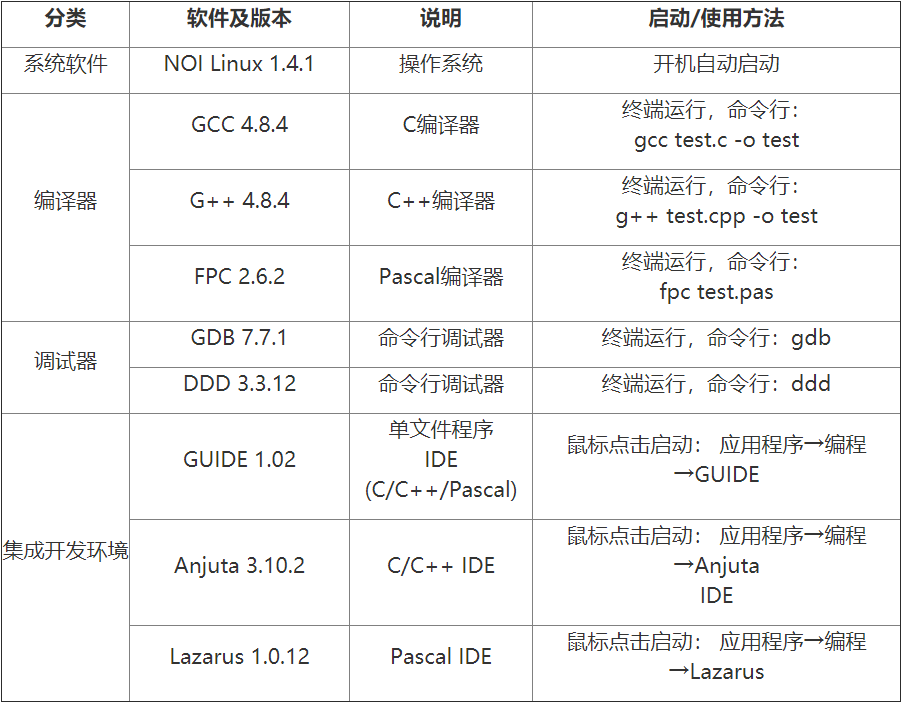
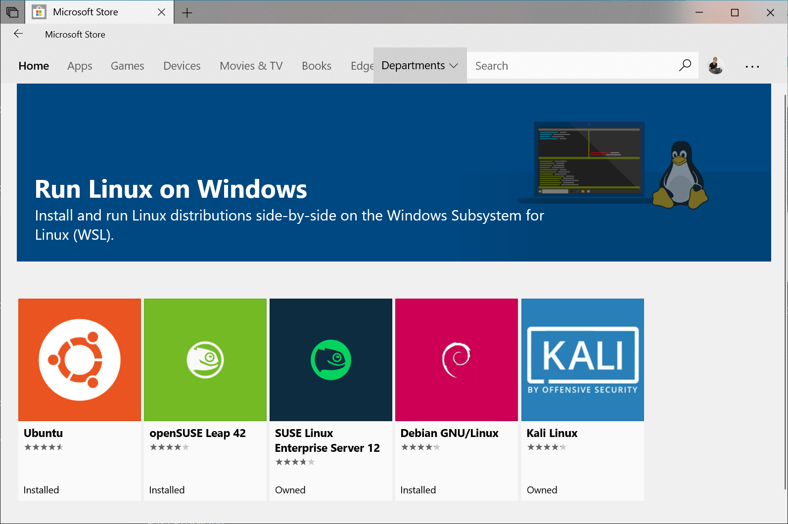
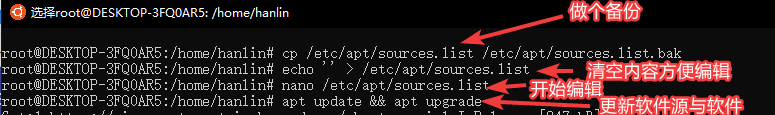
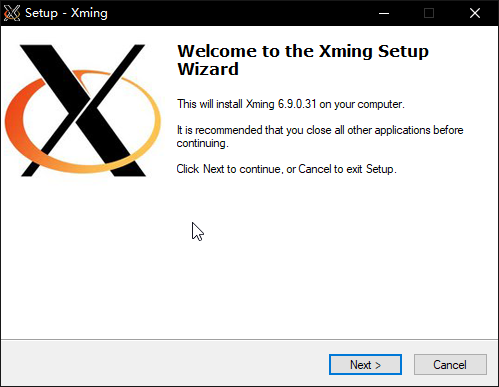
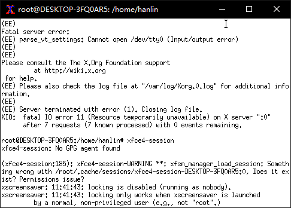

author: Ir1d, H-J-Granger, NachtgeistW, StudyingFather, Enter-tainer, abc1763613206, Anti-Li, shenyouran, Chrogeek, SukkaW, Henry-ZHR, Early0v0, andylizf, tootal, Marcythm, CoelacanthusHex, indevn


本章主要介绍了在 Windows 系统下运行 Linux 系统的方法。

由于截至 2020 年 6 月，大部分系统尚未安装 Windows 10 2020 年 5 月更新（内部版本 19041），本章仅介绍 WSL。

* * *

## 引言[^ref1]

众所周知，尽管现在大部分学校的竞赛练习环境都是构建 XP 等 Windows 系操作系统，但是在 NOI 系列赛中，早已用上了 NOI Linux 这个 Ubuntu 操作系统的阉割版。

> 
>
> NOI 竞赛的环境要求[^ref2]
>
> 或许大家对自己 Windows 环境下的 Dev-C++ 等都已熟识，但是当场景突然切换到 Linux 的时候，你会不会不知所措？
>
> 「想用<kbd>Ctrl</kbd>+<kbd>C</kbd>复制，结果退出了程序」  
> 「平时 AC 的程序模板到了 Linux 上就 WA」……
>
> 为了防止考场上出现此类尴尬情况，我们必须要提前熟悉下 Linux 系统的操作方法。


平台差异（转自百度文库“NOIP 标准评测系统及相关问题”）[^ref3]

虽然 NOI 的官网已经放出了 NOI Linux 的 ISO 镜像，但是如果跑虚拟机的话，配置也相当麻烦，包括激活 VMware，用 VMware 装系统开虚拟机等步骤，且 NOI Linux 默认自带图形界面，无法保证在低配系统上流畅运行。

Windows 10 在一周年更新时推出了 Linux 子系统（WSL），在 2020 年 5 月更新中升级到了 WSL 2。截至 2020 年 6 月 1 日，WSL 已支持安装 Ubuntu、openSUSE Leap、Kali、Debian……等主流 Linux 分发版。但 WSL 并不支持 NOI 评测用的 Arbiter。

???+ note "[什么是 Linux 子系统（WSL）](https://zh.wikipedia.org/zh-cn/%E9%80%82%E7%94%A8%E4%BA%8E_Linux_%E7%9A%84_Windows_%E5%AD%90%E7%B3%BB%E7%BB%9F) "
    适用于 Linux 的 Windows 子系统（英语：Windows Subsystem for Linux，简称 WSL）是一个为在 Windows 10 和 Windows Server 2019 上能够原生运行 Linux 二进制可执行文件（ELF 格式）的兼容层。
    
    WSL 可让开发人员按原样运行 GNU/Linux 环境 - 包括大多数命令行工具、实用工具和应用程序 - 且不会产生虚拟机开销。
    
    WSL 仅在版本 1607 之后的 64 位版本的 Windows 10 中可用。它也可在 Windows Server 2019 中使用。

* * *

## WSL 还是 WSL 2

参见：[比较 WSL 2 和 WSL 1](https://docs.microsoft.com/zh-cn/windows/wsl/compare-versions)

如果系统已经安装了 2020 年 5 月更新（内部版本 19041）或更高版本，则可以考虑开启 WSL 2。建议权衡自己的需求选择适合的版本。

WSL 1 的机制，总体上是在运行时将 Linux 系统调用翻译为 NT API 调用，从而在 NT 内核基础之上模拟实现 Linux 内核。

无论是在 ABI 还是 API 层模拟，Linux/UNIX 与 Windows NT 毕竟是两类内核，设计理念、设计标准等多方面差异甚大，无法实现完全对等模仿，WSL 1 无法兼容所有 Linux 系统调用，程序无法在 WSL 中运行的情况时有发生。

也许是因为 WSL 1 靠翻译系统调用来模拟 Linux 内核的方法存在诸多问题，这种黑科技思路在 WSL 2 中被微软完全抛弃。WSL 2 基于长期支持版内核 Linux 4.19，并在此基础上加以修改而成。新的内核经过了微软悉心改造，以便与 Windows 相配合，获得更好的用户体验。WSL 2 同时采用了虚拟机的技术，将 Linux 内核塞到一个轻量级的虚拟机（英文：Virtual Machine，简称：VM）中运行，使用体验基本与 WSL 保持一致。

使用虚拟机的方式带来了运行效率和兼容性两方面的提升。根据微软自己的测试，与 WSL 1 相较，在 WSL 2 中解压 zip 文档的速度提升了 20 倍，使用 git clone、npm install、cmake 的速度提升了大约 2~5 倍。由于使用了真正的 Linux 内核，WSL 2 全面兼容了 Linux 系统调用，理论上能在 GNU/Linux 上运行的程序也都能在 WSL 2 中不经修改直接运行。

性能方面，WSL 和 WSL 2 各有优势。**如果不和本机系统交互，WSL 2 的性能非常不错，但如果访问 Windows 文件系统下的文件，IO 性能会下降很多。**

微软给出的建议是，如果经常使用 WSL 来访问 Windows 文件系统上的项目文件，或者需要对相同的文件使用 Windows 和 Linux 工具进行交叉编译，那么建议这些用户使用 WSL 1，因为目前 WSL 1 能跨 OS 文件系统实现更高的性能。

???+ note
    目前 WSL 1 完全不支持 systemd（这意味着一些需要 systemd 的功能无法实现或需要别的 hack），WSL 2 可以使用 [genie](https://github.com/arkane-systems/genie)。
    此外，[yuk7/arch-systemctl-alt](https://github.com/yuk7/arch-systemctl-alt) 项目提供了一个在 WSL 1 与 2 都可用的 alternative script，但是它只具有部分兼容且只在 ArchWSL 进行了测试。

## 启用 WSL[^ref4]

???+ warning
    本部分适用于 Windows 10 秋季创意者更新（内部版本 16215）和更高版本。

在安装适用于 WSL 的任何 Linux 分发版之前，必须在下述两种方法中选择一种，以确保启用“适用于 Linux 的 Windows 子系统”可选功能：

### 使用 Powershell

1.  以管理员身份打开 PowerShell 并运行：

    ```powershell
    Enable-WindowsOptionalFeature -Online -FeatureName Microsoft-Windows-Subsystem-Linux
    ```

2. 出现提示时，重启计算机。

### 使用 GUI


1. 打开“控制面板”

2. 访问“程序和功能”子菜单“打开或关闭 Windows 功能”

3. 选择“适用于 Linux 的 Windows 子系统”

4. 点击确定

5. 重启

## 安装与使用 Ubuntu[^ref5]

本章以 Ubuntu 长期更新版为例。

### 安装



进入 Microsoft Store，搜索“Ubuntu”，然后选择“Ubuntu”，点击“安装”进行安装。也可打开 [Ubuntu 的商店页面](https://www.microsoft.com/zh-cn/p/ubuntu/9nblggh4msv6)。

???+ warning
    Microsoft Store 的 Ubuntu 随着 Ubuntu 的更新而更新，因此内容可能会有所改变。如果想获取稳定的 Ubuntu 长期支持版，可以在 Microsoft Store 安装 Ubuntu 的 LTS 版本。

### 运行 Ubuntu

打开“开始”菜单找到 Ubuntu 并启动，或使用 `wsl` 命令从 Windows 命令行启动。

可以为 Ubuntu 创建应用程序磁贴或固定至任务栏，以在下次方便地打开。

### 初始化

第一次运行 Ubuntu，需要完成初始化。

等待一两分钟时间，系统会提示创建新的用户帐户及其密码，请确保选择一个容易记住的密码。


## 基础配置

初次安装好的系统不附带任何 C/C++ 编译器，需要手动配置环境。


### 更换为国内软件源

Ubuntu 默认的软件源在国外。可以换成国内的软件源以加快速度，如 [清华 TUNA 的软件源](https://mirrors.tuna.tsinghua.edu.cn/help/ubuntu/)。

???+ warning  "使用与自己系统版本匹配的软件源"
    请在页面中寻找与自己系统版本相配的源（可使用 `sudo lsb_release -a` 查看 Ubuntu 版本）。
    
    除非你知道你在做什么，否则不要使用与自己的系统版本不匹配的源！

使用以下命令更新软件和软件源：

```bash
sudo cp /etc/apt/sources.list /etc/apt/sources.list.bak
sudo vim /etc/apt/sources.list
# （按 i 之后将上文的源右键粘贴进去，编辑完后按 Esc，再输入 :wq 和回车）
sudo apt update
sudo apt upgrade -y
```



### 安装中文环境

```bash
sudo apt install  language-pack-zh-han* -y
sudo locale-gen zh_CN.GB18030 && sudo locale-gen zh_CN.UTF-8
# 中文字体，别忘了同意 EULA
sudo apt install fontconfig -y
sudo apt install ttf-mscorefonts-installer -y
# 下面的再执行一遍以防万一
sudo apt install -y --force-yes --no-install-recommends fonts-wqy-microhei
sudo apt install -y --force-yes --no-install-recommends ttf-wqy-zenhei
sudo dpkg-reconfigure locales
```

使用 `sudo dpkg-reconfigure locales` 进入菜单，按空格选择带 `zh_CN` 的选项（推荐 `zh_CN, UTF-8 UTF-8`），选完后回车，


下一个菜单中选择 `zh_CN.UTF-8` 回车。


之后关闭 Ubuntu 并重启，系统就会变成中文。

再依次输入下列命令，把 `man` 帮助页替换为中文。[^ref6]

```bash
sudo apt install manpages-zh
sudo sed -i 's|/usr/share/man|/usr/share/man/zh_CN|g' /etc/manpath.config
```

可以用 `man help` 测试。

### 安装编译环境[^ref7]

```bash
sudo apt install -y build-essential vim ddd gdb fpc emacs gedit anjuta lazarus
```

GUIDE 的安装请参考 [Debian 或 Ubuntu 下 GUIDE 的安装](./editor/guide.md#debian-ubuntu)

这是基础的 + NOI 官方要求环境，如有需要可以用 `apt install 程序名` 来安装别的。
若想安装其他版本可以参考 Debian 官方的 [包管理手册](https://www.debian.org/doc/manuals/debian-reference/ch02.zh-cn.html)。

以下为一个示例程序：

```bash
$ vim cpuid.cpp
$ g++ -Wall cpuid.cpp -o cpuid
$ ./cpuid
AMD Ryzen 5 1400 Quad-Core Processor
```

???+ note
    Linux 环境下可执行文件可不带扩展名，实现方式看上方命令。

## 进阶操作

### 安装图形环境，并使用远程桌面连接

推荐图形环境用 xfce4，不臃肿。

```bash
sudo apt install xfce4 tightvncserver -y
# 或使用
sudo apt install xubuntu-desktop -y
# xubuntu 安装的软件多，基础环境可用第一种
```

图形环境文件较大，下载解包需要一定时间。

配置 xrdp：

```bash
sudo apt install xrdp -y
echo "xfce4-session" >~/.xsession
sudo service xrdp restart
```

为了防止和计算机本来带的远程桌面冲突，最好换一下端口。


运行命令 `sudo sed 's/port=[0-9]{1,5}/port=qwq/' /etc/xrdp/xrdp.ini`，其中 `qwq` 为其他端口（如 `3390`）。


运行 `sudo service xrdp restart`，然后去开始菜单，用 `localhost: 配置的端口` 来访问。


### 使用 Xming 连接

进入 Ubuntu 环境，安装 xterm：

```bash
sudo apt install xterm -y
```

退出 Ubuntu。

从 [Xming X Server 下载地址](https://sourceforge.net/projects/xming/) 下载最新的 Xming Server，然后安装：



如果安装完后忘记勾选 Launch Xming，需在开始菜单里打开 Xming：


之后再回到 Ubuntu，键入如下指令：

```bash
DISPLAY=:0 xterm
```


貌似只支持命令行。

如果使用了 xfce4，可以在弹出的窗口中使用如下命令激活 xfce4：

```bash
xfce4-session
```



运行结果如图。（在 Xming 中使用<kbd>Ctrl</kbd>+<kbd>C</kbd>就可以退出该界面。）


### 与 Windows 内原硬盘分区交互

硬盘分区作为文件夹在 `/mnt/` 里存放，因此可以直接交互，如直接编译二进制文件，或者往 Ubuntu 里传文件。


### 配合 Visual Sudio Code 进行编辑

如果习惯在 Windows 环境下使用 Visual Studio Code 进行代码编辑，可以安装 VSC 中的 `Remote - WSL` 插件，更方便地对 WSL 系统中的文件进行编辑。

通过 `Remote - WSL`，可以在 Windows 下的 VS Code 界面中直接对 WSL 子系统进行操作，更加方便地编辑子系统目录下的文件、更方便地使用终端进行调试。

通过在 WSL 中直接键入 `code .`，可以在该目录下直接唤出 Visual Studio Code，对于该目录下的文件进行编辑。

同时，可以通过类似 `code readme.md` 的命令，对于目录下的指定文件（这里是 `readme.md`）进行编辑。

在插件 `Remote - WSL` 的 Getting Started 页面，包含对于编辑操作的详细简介。

同时，也可以参考 Visual Studio Code 的官方文档中关于 WSL 的内容（[Remote development in WSL](https://code.visualstudio.com/docs/remote/wsl-tutorial)），这篇文章包含从 WSL 安装到配合插件使用的全流程的更详细的介绍。

## FAQ

参见：[常见问题](https://docs.microsoft.com/zh-cn/windows/wsl/faq)，[WSL 2 常见问题解答](https://docs.microsoft.com/zh-cn/windows/wsl/wsl2-faq)

-   如何在子系统下进行 xxx？

    可以用自带命令行，或者使用图形界面。
    比如说 vim，在命令行中键入 `man vim`，会给出一份详尽的使用方法。
    亦可使用 `vim --help`。

    关于命令行，可阅读 [命令行](./cmd.md)

-   占用量大？

    这个系统和 Windows 10 共用 Host，所以理论上是比虚拟机占用小的。而且只要别装太多应用，应该还是可以带动的。

-   汉语化时提示不存在？

    玄学问题，可以忽略。修了个疏忽导致的错误，可以重上一下试试。

-   如何从文件管理器访问 WSL 目录？

    只需在资源管理器的路径或运行（Win+R）中输入 `\\wsl$`，即可进入访问 WSL 的目录。

    这个变量直接指向 WSL 目录，故也可以直接使用诸如 `\\wsl$\Ubuntu\home\` 的路径访问其子文件夹。

## 外部链接

- [关于适用于 Linux 的 Windows 子系统](https://docs.microsoft.com/zh-cn/windows/wsl/about)
- [Ubuntu 镜像使用帮助，清华 TUNA](https://mirrors.tuna.tsinghua.edu.cn/help/ubuntu/)
- [Dev on Windows with WSL（在 Windows 上用 WSL 优雅开发）](https://dowww.spencerwoo.com)
- [GitHub 上的 Awesome-WSL](https://github.com/sirredbeard/Awesome-WSL)

## 参考资料与注释

[^ref1]: [洛谷日报 #6](https://www.luogu.com.cn/blog/asfr/Run-Ubuntu-On-Windows10)

[^ref2]: [NOI 系列活动标准竞赛环境（2016 年 11 月 08 日更新）](http://www.noi.cn/gynoi/jsgz/2018-08-13/710465.shtml)

[^ref3]: [NOIP 标准评测系统及相关问题，smart0326, 2014-05-19, 百度文库](https://wenku.baidu.com/view/8246d96cdd36a32d72758143.html)

[^ref4]: [适用于 Linux 的 Windows 子系统安装指南 (Windows 10), Microsoft Docs](https://docs.microsoft.com/zh-cn/windows/wsl/install-win10)

[^ref5]: [WSL-Ubuntu 维基，ubuntu wiki](https://wiki.ubuntu.com/WSL)

[^ref6]: [Ubuntu 的 man 命令帮助如何设置中文版，Frank 看庐山，2017-06-09](https://blog.csdn.net/qq_14989227/article/details/72954523)

[^ref7]: [Run Bash on Ubuntu on Windows, Mike Harsh, 2016-05-30, Windows Blog](https://blogs.windows.com/buildingapps/2016/03/30/run-bash-on-ubuntu-on-windows/#cie8WdR3uSjgR5Ru.97)
