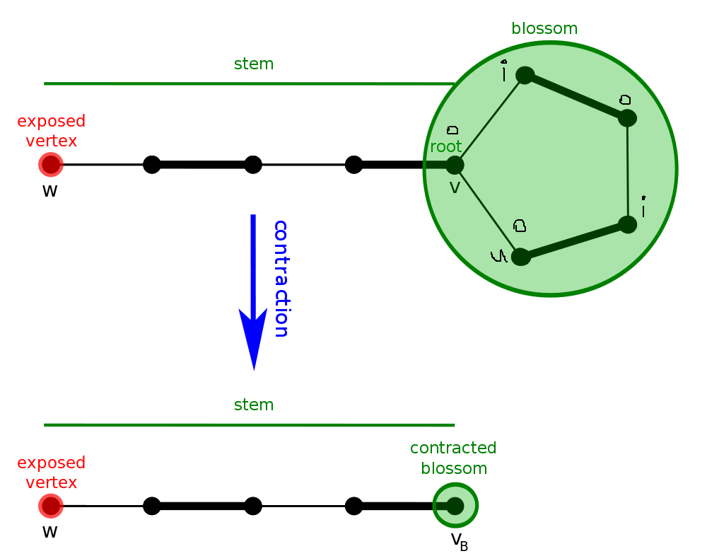

author: accelsao

开花算法(Blossom Algorithm，也被称做带花树)可以解决一般图最大匹配问题(maximum cardinality matchings)。此算法由 Jack Edmonds 在1961年提出。
经过一些修改后也可以解决一般图最大权匹配问题。
此算法是第一个给出证明说最大匹配有多项式复杂度。

## 前提
在图论中，假设图 $G=(V,E)$ ，其中 $V$ 是点集，$E$ 是边集。
一组两两没有公共点的边集 $(M(M\in E))$ 称为这张图的**匹配**。
边在 $M$ 中的称为**匹配边**，除此以外的称为**未匹配边**。
定义匹配的大小为其中边的数量 $|M|$ ，边数最大的 $M$ 为**最大匹配**。
当图中带权的时候，边权和最大的为**最大权匹配**。
一个点如果属于 $M$ 且为至多一条边的端点，称为**匹配点**。
反之，称为**未匹配点**。

### 增广路 Augmenting paths
设 $P$ 为图中的一条简单路径且满足:
	1. $P$的起点和终点都是未匹配点。
	2. $P$经过的边匹配边和未匹配边交错出现。

则称$P$为增广路。
并将满足条件2的路径称为**交错路(alternating path)**。

增广路(augmenting path)上非匹配边比匹配边数量多一，如果将匹配边改为未匹配边，反之亦然，则匹配大小会增加一且依然是交错路。


!!! 核心思路
	枚举所有未匹配点，找增广路径，直到找不到增广路径

### 定理1
一个匹配$M$是图$G$的最大匹配，如果$G$不存在增广路。

### 证明1
待补。

## 一般图最大匹配

一般图匹配和二分图匹配(bipartite matching)不同的是，图可能存在奇环。


以此图为例，若直接取反(匹配边和未匹配边对调)，会使得取反后的 $M$ 不合法，而问题就出在奇环。

下面考虑一般图的增广算法，每次枚举一个未匹配点，设出发点为根，标记为**"o"**，接下来交错标记**"o"** 和 **"i"**，不难发现**"i"**到**"o"**这段边是匹配边。

假设当前点是 $v$，相邻点为$u$。

case 1: $u$ 未拜访过，当 $u$ 是未匹配点，则找到增广路径，否则从 $u$ 的配偶找增广路。

case 2: $u$已拜访过，遇到标记"o"代表需要**缩花**，否则代表遇到偶环，跳过。

### 缩花 Blossoms and contractions


设非树边(形成环的那条边)为(u, v)，定义花根(root)为LCA(u, v)，(u, v)两点皆是标记为"o"的点。
这时候花上往外延伸的点都是未匹配边。


有顺时针或逆时针两种情况。

实作上找到**花**以后我们不需要真的**缩花**，可以用数组纪录每个点在以哪个点为根的那朵花中。


#### 复杂度分析 Complexity Analysis
每次找增广路，遍历所有边，遇到**花**会维护**花**上的点，$O(|E|^2)$
枚举所有未匹配点做增广路，总共$O(|V||E|^2)$

### 代码

```cpp
// graph
template<typename T>
class graph {
public:
  struct edge {
    int from;
    int to;
    T cost;
  };
  vector<edge> edges;
  vector< vector<int> > g;
  int n;
  graph(int _n) : n(_n) {
    g.resize(n);
  }
  virtual int add(int from, int to, T cost) = 0;
};

// undirectedgraph
template <typename T>
class undirectedgraph : public graph<T> {
public:
  using graph<T>::edges;
  using graph<T>::g;
  using graph<T>::n;

  undirectedgraph(int _n) : graph<T>(_n) {
  }
  int add(int from, int to, T cost = 1) {
    assert(0 <= from && from < n && 0 <= to && to < n);
    int id = (int) edges.size();
    g[from].push_back(id);
    g[to].push_back(id);
    edges.push_back({from, to, cost});
    return id;
  }
};

// blossom / find_max_unweighted_matching
template <typename T>
vector<int> find_max_unweighted_matching(const undirectedgraph<T>& g) {
  std::mt19937 rng(chrono::steady_clock::now().time_since_epoch().count());
  vector<int> match(g.n, -1); // 匹配
  vector<int> aux(g.n, -1);   // 时间戳记
  vector<int> label(g.n);     // "o" or "i"
  vector<int> orig(g.n);      // 花根
  vector<int> parent(g.n, -1);// 父节点
  queue<int> q;
  int aux_time = -1;

  auto lca = [&](int v, int u) {
    aux_time++;
    while(true) {
      if(v != -1) {
        if (aux[v] == aux_time) { //找到拜访过的点 也就是LCA
          return v;
        }
        aux[v] = aux_time;
        if(match[v] == -1) {
          v = -1;
        } else {
          v = orig[parent[match[v]]]; //以匹配点的父节点继续寻找
        }
      }
      swap(v, u);
    }
  }; // lca

  auto blossom = [&](int v, int u, int a) {
    while(orig[v] != a) {
      parent[v] = u;
      u = match[v];
      if(label[u] == 1) {     // 初始点设为"o" 找增广路
        label[u] = 0;
        q.push(u);
      }
      orig[v] = orig[u] = a;  // 缩花
      v = parent[u];
    }
  }; //blossom

  auto augment = [&](int v) {
    while(v != -1) {
      int pv = parent[v];
      int next_v = match[pv];
      match[v] = pv;
      match[pv] = v;
      v = next_v;
    }
  }; //augment

  auto bfs = [&](int root) {
    fill(label.begin(), label.end(), -1);
    iota(orig.begin(), orig.end(), 0);
    while(!q.empty()) {
      q.pop();
    }
    q.push(root);
    // 初始点设为 "o", 这里以"0"代替"o", "1"代替"i"
    label[root] = 0;
    while(!q.empty()) {
      int v = q.front();
      q.pop();
      for(int id : g.g[v]) {
        auto &e = g.edges[id];
        int u = e.from ^ e.to ^ v;
        if(label[u] == -1) { //找到未拜访点
          label[u] = 1; // 标记 "i"
          parent[u] = v;
          if(match[u] == -1) { //找到未匹配点
            augment(u); // 寻找增广路径
            return true;
          }
          // 找到已匹配点 将与她匹配的点丢入queue 延伸交错树
          label[match[u]] = 0;
          q.push(match[u]);
          continue;
        } else if(label[u] == 0 && orig[v] != orig[u]){ //找到已拜访点 且标记同为"o" 代表找到"花"
            int a = lca(orig[v], orig[u]);
            // 找LCA 然后缩花
            blossom(u, v, a);
            blossom(v, u, a);
        }
      }
    }
    return false;
  }; //bfs

  auto greedy = [&]() {
    vector<int> order(g.n);
    // 随机打乱 order
    iota(order.begin(), order.end(), 0);
    shuffle(order.begin(), order.end(), rng);

    // 将可以匹配的点匹配
    for(int i : order) {
      if(match[i] == -1) {
        for(auto id : g.g[i]) {
          auto &e = g.edges[id];
          int to = e.from ^ e.to ^ i;
          if(match[to] == -1) {
            match[i] = to;
            match[to] = i;
            break;
          }
        }
      }
    }
  }; // greedy

  // 一开始先随机匹配
  greedy();
  // 对未匹配点找增广路
  for (int i = 0; i < g.n; i++) {
    if (match[i] == -1) {
      bfs(i);
    }
  }
  return match;
}
```

### 习题
* [UOJ #79. 一般图最大匹配](http://uoj.ac/problem/79)

## 一般图最大權匹配


### 习题
* [UOJ #81. 一般图最大权匹配](http://uoj.ac/problem/81)


## 参考资料

- [1][Wiki-English](https://www.wikiwand.com/en/Blossom_algorithm)
- [2]2015年《浅谈图的匹配算法及其应用》 - 陈胤伯
- [3][演算法笔记 - Matching](http://www.csie.ntnu.edu.tw/~u91029/Matching.html)
- [4][the-tourist/algo](https://github.com/the-tourist/algo/blob/master/flows/blossom.cpp)
- [5][Bill Yang's Blog - 带花树学习笔记](https://blog.bill.moe/blossom-algorithm-notes/)
