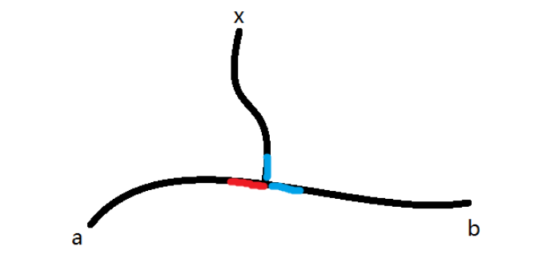

author: accelsao

# 增广路定理 Berge's lemma

这是最大匹配的一个重要理论。

-   交错路（alternating path) 始于非匹配点且由匹配边与非匹配边交错而成。
-   增广路（augmenting path）是始于非匹配点且终于非匹配点的交错路。

增广路上非匹配边比匹配边数量多一，如果将匹配边改为未匹配边，反之亦然，则匹配大小会增加一且依然是交错路。

如图 匹配数从 2 增加为 3，我们称此过程为 **增广** 。

根据 Berge's lemma 当找不到增广路的时候，得到最大匹配。

由此定理可知我们求最大匹配的核心思路。

!!! 核心思路

    枚举所有未匹配点，找增广路径，直到找不到增广路径。

事实上，对于每个点只要枚举一次就好。

假设某一轮沿着增广路 $a - b$ 增广后，出现了以 $x$ 为起点的增广路 $P_x$ ，则 $P_x$ 必相交 $a - b$ 。
假设 $P_x$ 第一次碰上 $a - b$ ，由于 $a - b$ 是交错路，意味着相交点是不同类型的（图中以红和蓝表示），那增广前 $x$ 就能走到 $a - b$ 中的某个未匹配点，说明早已存在从 $x$ 出发的增广路。
