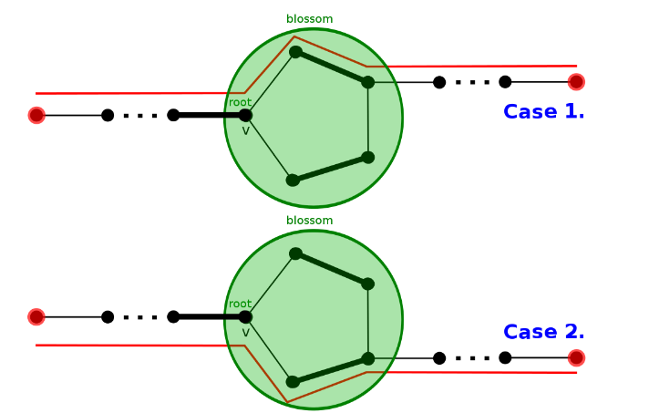

author: accelsao

# 一般图最大匹配

## 带花树算法（Blossom Algorithm)

开花算法（Blossom Algorithm，也被称做带花树）可以解决一般图最大匹配问题（maximum cardinality matchings)。此算法由 Jack Edmonds 在 1961 年提出。
经过一些修改后也可以解决一般图最大权匹配问题。
此算法是第一个给出证明说最大匹配有多项式复杂度。

一般图匹配和二分图匹配（bipartite matching）不同的是，图可能存在奇环。

以此图为例，若直接取反（匹配边和未匹配边对调），会使得取反后的 $M$ 不合法，某些点会出现在两条匹配上，而问题就出在奇环。

下面考虑一般图的增广算法。
从二分图的角度出发，每次枚举一个未匹配点，设出发点为根，标记为 **"o"** ，接下来交错标记 **"o"** 和 **"i"** ，不难发现 **"i"** 到 **"o"** 这段边是匹配边。

假设当前点是 $v$ ，相邻点为 $u$ 。

case 1: $u$ 未拜访过，当 $u$ 是未匹配点，则找到增广路径，否则从 $u$ 的配偶找增广路。

case 2: $u$ 已拜访过，遇到标记 "o" 代表需要 **缩花** ，否则代表遇到偶环，跳过。

遇到偶环的情况，将他视为二分图解决，故可忽略。 **缩花** 后，再新图中继续找增广路。


设原图为 $G$ ， **缩花** 后的图为 $G'$ ，我们只需要证明：

1.  若 $G$ 存在增广路， $G'$ 也存在。
2.  若 $G'$ 存在增广路， $G$ 也存在。


设非树边（形成环的那条边）为（u, v)，定义花根 $h=LCA(u,v)$ 。
奇环是交替的，有且仅有 $h$ 的两条邻边类型相同，都是非匹配边。
那么进入 $h$ 的树边肯定是匹配边，环上除了 $h$ 以外其他点往环外的边都是非匹配边。

观察可知，从环外的边出去有两种情况，顺时针或逆时针。



于是 **缩花** 与 **不缩花** 都不影响正确性。

实作上找到 **花** 以后我们不需要真的 **缩花** ，可以用数组纪录每个点在以哪个点为根的那朵花中。

### 复杂度分析 Complexity Analysis

每次找增广路，遍历所有边，遇到 **花** 会维护 **花** 上的点， $O(|E|^2)$ 。
枚举所有未匹配点做增广路，总共 $O(|V||E|^2)$ 。

### 代码

```cpp
// graph
template <typename T>
class graph {
 public:
  struct edge {
    int from;
    int to;
    T cost;
  };
  vector<edge> edges;
  vector<vector<int> > g;
  int n;
  graph(int _n) : n(_n) { g.resize(n); }
  virtual int add(int from, int to, T cost) = 0;
};

// undirectedgraph
template <typename T>
class undirectedgraph : public graph<T> {
 public:
  using graph<T>::edges;
  using graph<T>::g;
  using graph<T>::n;

  undirectedgraph(int _n) : graph<T>(_n) {}
  int add(int from, int to, T cost = 1) {
    assert(0 <= from && from < n && 0 <= to && to < n);
    int id = (int)edges.size();
    g[from].push_back(id);
    g[to].push_back(id);
    edges.push_back({from, to, cost});
    return id;
  }
};

// blossom / find_max_unweighted_matching
template <typename T>
vector<int> find_max_unweighted_matching(const undirectedgraph<T> &g) {
  std::mt19937 rng(chrono::steady_clock::now().time_since_epoch().count());
  vector<int> match(g.n, -1);   // 匹配
  vector<int> aux(g.n, -1);     // 时间戳记
  vector<int> label(g.n);       // "o" or "i"
  vector<int> orig(g.n);        // 花根
  vector<int> parent(g.n, -1);  // 父节点
  queue<int> q;
  int aux_time = -1;

  auto lca = [&](int v, int u) {
    aux_time++;
    while (true) {
      if (v != -1) {
        if (aux[v] == aux_time) {  //找到拜访过的点 也就是LCA
          return v;
        }
        aux[v] = aux_time;
        if (match[v] == -1) {
          v = -1;
        } else {
          v = orig[parent[match[v]]];  //以匹配点的父节点继续寻找
        }
      }
      swap(v, u);
    }
  };  // lca

  auto blossom = [&](int v, int u, int a) {
    while (orig[v] != a) {
      parent[v] = u;
      u = match[v];
      if (label[u] == 1) {  // 初始点设为"o" 找增广路
        label[u] = 0;
        q.push(u);
      }
      orig[v] = orig[u] = a;  // 缩花
      v = parent[u];
    }
  };  // blossom

  auto augment = [&](int v) {
    while (v != -1) {
      int pv = parent[v];
      int next_v = match[pv];
      match[v] = pv;
      match[pv] = v;
      v = next_v;
    }
  };  // augment

  auto bfs = [&](int root) {
    fill(label.begin(), label.end(), -1);
    iota(orig.begin(), orig.end(), 0);
    while (!q.empty()) {
      q.pop();
    }
    q.push(root);
    // 初始点设为 "o", 这里以"0"代替"o", "1"代替"i"
    label[root] = 0;
    while (!q.empty()) {
      int v = q.front();
      q.pop();
      for (int id : g.g[v]) {
        auto &e = g.edges[id];
        int u = e.from ^ e.to ^ v;
        if (label[u] == -1) {  //找到未拜访点
          label[u] = 1;        // 标记 "i"
          parent[u] = v;
          if (match[u] == -1) {  //找到未匹配点
            augment(u);          // 寻找增广路径
            return true;
          }
          // 找到已匹配点 将与她匹配的点丢入queue 延伸交错树
          label[match[u]] = 0;
          q.push(match[u]);
          continue;
        } else if (label[u] == 0 &&
                   orig[v] !=
                       orig[u]) {  //找到已拜访点 且标记同为"o" 代表找到"花"
          int a = lca(orig[v], orig[u]);
          // 找LCA 然后缩花
          blossom(u, v, a);
          blossom(v, u, a);
        }
      }
    }
    return false;
  };  // bfs

  auto greedy = [&]() {
    vector<int> order(g.n);
    // 随机打乱 order
    iota(order.begin(), order.end(), 0);
    shuffle(order.begin(), order.end(), rng);

    // 将可以匹配的点匹配
    for (int i : order) {
      if (match[i] == -1) {
        for (auto id : g.g[i]) {
          auto &e = g.edges[id];
          int to = e.from ^ e.to ^ i;
          if (match[to] == -1) {
            match[i] = to;
            match[to] = i;
            break;
          }
        }
      }
    }
  };  // greedy

  // 一开始先随机匹配
  greedy();
  // 对未匹配点找增广路
  for (int i = 0; i < g.n; i++) {
    if (match[i] == -1) {
      bfs(i);
    }
  }
  return match;
}
```

## 习题

??? note "[UOJ #79. 一般图最大匹配](http://uoj.ac/problem/79) "

    ```cpp
    #include <bits/stdc++.h>
    using namespace std;

    // graph
    template <typename T>
    class graph {
     public:
      struct edge {
    	int from;
    	int to;
    	T cost;
      };
      vector<edge> edges;
      vector<vector<int> > g;
      int n;
      graph(int _n) : n(_n) { g.resize(n); }
      virtual int add(int from, int to, T cost) = 0;
    };

    // undirectedgraph
    template <typename T>
    class undirectedgraph : public graph<T> {
     public:
      using graph<T>::edges;
      using graph<T>::g;
      using graph<T>::n;

      undirectedgraph(int _n) : graph<T>(_n) {}
      int add(int from, int to, T cost = 1) {
    	assert(0 <= from && from < n && 0 <= to && to < n);
    	int id = (int)edges.size();
    	g[from].push_back(id);
    	g[to].push_back(id);
    	edges.push_back({from, to, cost});
    	return id;
      }
    };

    // blossom / find_max_unweighted_matching
    template <typename T>
    vector<int> find_max_unweighted_matching(const undirectedgraph<T> &g) {
      std::mt19937 rng(chrono::steady_clock::now().time_since_epoch().count());
      vector<int> match(g.n, -1);   // 匹配
      vector<int> aux(g.n, -1);     // 时间戳记
      vector<int> label(g.n);       // "o" or "i"
      vector<int> orig(g.n);        // 花根
      vector<int> parent(g.n, -1);  // 父节点
      queue<int> q;
      int aux_time = -1;

      auto lca = [&](int v, int u) {
    	aux_time++;
    	while (true) {
    	  if (v != -1) {
    		if (aux[v] == aux_time) {  //找到拜访过的点 也就是LCA
    		  return v;
    		}
    		aux[v] = aux_time;
    		if (match[v] == -1) {
    		  v = -1;
    		} else {
    		  v = orig[parent[match[v]]];  //以匹配点的父节点继续寻找
    		}
    	  }
    	  swap(v, u);
    	}
      };  // lca

      auto blossom = [&](int v, int u, int a) {
    	while (orig[v] != a) {
    	  parent[v] = u;
    	  u = match[v];
    	  if (label[u] == 1) {  // 初始点设为"o" 找增广路
    		label[u] = 0;
    		q.push(u);
    	  }
    	  orig[v] = orig[u] = a;  // 缩花
    	  v = parent[u];
    	}
      };  // blossom

      auto augment = [&](int v) {
    	while (v != -1) {
    	  int pv = parent[v];
    	  int next_v = match[pv];
    	  match[v] = pv;
    	  match[pv] = v;
    	  v = next_v;
    	}
      };  // augment

      auto bfs = [&](int root) {
    	fill(label.begin(), label.end(), -1);
    	iota(orig.begin(), orig.end(), 0);
    	while (!q.empty()) {
    	  q.pop();
    	}
    	q.push(root);
    	// 初始点设为 "o", 这里以"0"代替"o", "1"代替"i"
    	label[root] = 0;
    	while (!q.empty()) {
    	  int v = q.front();
    	  q.pop();
    	  for (int id : g.g[v]) {
    		auto &e = g.edges[id];
    		int u = e.from ^ e.to ^ v;
    		if (label[u] == -1) {  //找到未拜访点
    		  label[u] = 1;        // 标记 "i"
    		  parent[u] = v;
    		  if (match[u] == -1) {  //找到未匹配点
    			augment(u);          // 寻找增广路径
    			return true;
    		  }
    		  // 找到已匹配点 将与她匹配的点丢入queue 延伸交错树
    		  label[match[u]] = 0;
    		  q.push(match[u]);
    		  continue;
    		} else if (label[u] == 0 &&
    				   orig[v] !=
    					   orig[u]) {  //找到已拜访点 且标记同为"o" 代表找到"花"
    		  int a = lca(orig[v], orig[u]);
    		  // 找LCA 然后缩花
    		  blossom(u, v, a);
    		  blossom(v, u, a);
    		}
    	  }
    	}
    	return false;
      };  // bfs

      auto greedy = [&]() {
    	vector<int> order(g.n);
    	// 随机打乱 order
    	iota(order.begin(), order.end(), 0);
    	shuffle(order.begin(), order.end(), rng);

    	// 将可以匹配的点匹配
    	for (int i : order) {
    	  if (match[i] == -1) {
    		for (auto id : g.g[i]) {
    		  auto &e = g.edges[id];
    		  int to = e.from ^ e.to ^ i;
    		  if (match[to] == -1) {
    			match[i] = to;
    			match[to] = i;
    			break;
    		  }
    		}
    	  }
    	}
      };  // greedy

      // 一开始先随机匹配
      greedy();
      // 对未匹配点找增广路
      for (int i = 0; i < g.n; i++) {
    	if (match[i] == -1) {
    	  bfs(i);
    	}
      }
      return match;
    }
    int main(){
      ios::sync_with_stdio(0), cin.tie(0);
      int n, m;
      cin >> n >> m;
      undirectedgraph<int> g(n);
      int u, v;
      for(int i = 0; i < m; i++) {
    	cin >> u >> v;
    	u--;
    	v--;
    	g.add(u, v, 1);
      }
      auto blossom_match = find_max_unweighted_matching(g);
      vector<int> ans;
      int tot = 0;
      for(int i = 0; i < blossom_match.size(); i++) {
    	ans.push_back(blossom_match[i]);
    	if(blossom_match[i] != -1) {
    	  tot++;
    	}
      }
      cout << (tot >> 1) << "\n";
      for(auto x : ans) {
    	cout << x + 1 << " ";
      }
    }

    ```
