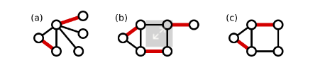

author: accelsao

**匹配**或是**獨立邊集**是一張圖中沒有公共邊的集合。
在二分圖中求匹配等價於網路流問題。

图匹配算法是信息学竞赛中常用的算法，总体分为最大匹配以及最大权匹配，先从二分图开始介绍，在进一步提出一般图的作法。

# 匹配

在图论中，假设图 $G=(V,E)$ ，其中 $V$ 是点集， $E$ 是边集。
一组两两没有公共点的边集 $(M(M\in E))$ 称为这张图的 **匹配** 。
定义匹配的大小为其中边的数量 $|M|$ ，边数最大的 $M$ 为 **最大匹配** 。
当图中带权的时候，边权和最大的为 **最大权匹配** 。
匹配中的边称为 **匹配边** ，反之称为 **未匹配边** 。
一个点如果属于 $M$ 且为至多一条边的端点，称为 **匹配点** ，反之称为 **未匹配点** 。

> maximal matching: 無法再增加匹配邊的匹配。不見得是最大匹配。
> 最大匹配(maximum matching): 匹配數最多的匹配。
> 完美匹配(perfect matching): 所有點都屬於匹配，同時也符合最大匹配。
> 近完美匹配(near-perfect matching): 發生在圖的點數為奇數，剛好只有一個點不在匹配中，扣掉此點以後的圖稱為 factor-critical graph。

**maximal matching**

**最大匹配**

# 二分圖匹配

一張二分圖上的匹配稱作二分匹配。

设 $G$ 为二分图，若在 $G$ 的子图 $M$ 中，任意两条边都没有公共节点，那么称 $M$ 为二分图 $G$ 的一个匹配，且 $M$ 的边数为匹配数。

## 完备匹配

设 $G=<V_1, V_2, E>$ 为二分图， $|V_1| \leq |V_2|$ ， $M$ 为 $G$ 中一个最大匹配，且 $|M|=2|V_1|$ ，则称 $M$ 为 $V_1$ 到 $V_2$ 的完备匹配。

## 霍尔定理

设二分图 $G=<V_1, V_2, E>, |V_1| \leq |V_2|$ ，则 $G$ 中存在 $V_1$ 到 $V_2$ 的完备匹配当且仅当对于任意的 $S \subset V_1$ ，均有 $|S|\leq|N(S)|$ ，其中 $N(S)=\Cup_{v_i \in S}{N(V_i)}$ ，是 $S$ 的邻域。

## 最大匹配

寻找二分图边数最大的匹配称为最大匹配问题。

# 算法

組合優化中的一個基本問題是求 *最大匹配(maximum matching)*。

## 二分圖最大匹配
在無權二分圖中，Hopcroft-Karp 算法可在 $O(\sqrt{V}E)$ 解決。

## 二分圖最大權匹配

在帶權二分圖中，可用 Hungarian 算法解決。
如果在最短路搜尋中用 Bellman–Ford 算法，時間複雜度為$O(V^2E)$，
如果用  Dijkstra 算法或 Fibonacci heap，可用 $O(V^{2}\log {V}+VE)$ 解決。

## 一般圖最大匹配
無權一般圖中， Edmonds' blossom 算法可在 $O(V^2E)$ 解決。

## 一般圖最大權匹配
帶權一般圖中， Edmonds' blossom 算法可在 $O(V^2E)$ 解決。

# 参考资料
-   [1][Wikiwand - Matching (graph theory)]( <https://www.wikiwand.com/en/Matching_(graph_theory)> )
-   [2][Wikiwand - Blossom algorithm]( <https://www.wikiwand.com/en/Blossom_algorithm> )
-   [3]2015 年《浅谈图的匹配算法及其应用》- 陈胤伯
-   [4][演算法笔记 - Matching]( <http://www.csie.ntnu.edu.tw/~u91029/Matching.html> )
-   [5][the-tourist/algo](https://github.com/the-tourist/algo)
-   [6][Bill Yang's Blog - 带花树学习笔记]( <https://blog.bill.moe/blossom-algorithm-notes/> )
-   [7][二分图的最大匹配、完美匹配和匈牙利算法](https://www.renfei.org/blog/bipartite-matching.html)
-   [8][Wikiwand - Hopcroft–Karp algorithm](https://www.wikiwand.com/en/Hopcroft%E2%80%93Karp_algorithm)
